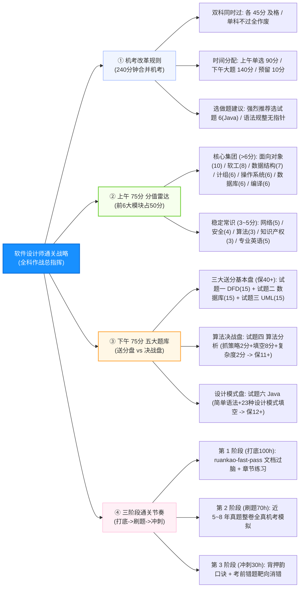

# 软件设计师通关速记文档：考试大纲与全景作战战略篇

> **所属模块**：软考中级《软件设计师》—— 考试介绍、分值分析与通关战略（文老师教育第 1 章核心提炼）  
> **提炼规范**：`ruankao-fast-pass` 体系化通关标准（从左到右思维导图 + 全科作战雷达 + 机考时间分配）

---

## 维度 1：【全科分值宏观沙盘与战力分配】

| 考试科目 | 考核形式 | 考试时间与分值 | 合格标准与通过规则 | 核心特征与战略地位 |
| :--- | :--- | :--- | :--- | :--- |
| **科目一： 计算机与软件工程综合知识** | 75 道单选题 （每题 1 分） | 满分 75 分 建议用时：**90 ~ 100 分钟** | **45 分及以上及格** | **范围极广但考点死**。以面向对象（10分）、软工（8分）、数据结构（7分）、计组/系统/数据库/编译（各6分）为主力盘。 |
| **科目二： 软件设计与应用技术** | 5 道问答与代码大题 （每题 15 分） | 满分 75 分 建议用时：**130 ~ 140 分钟** | **45 分及以上及格** | **拉开差距的决战盘！** 题型 100% 固化：试题 1(DFD) + 试题 2(数据库) + 试题 3(UML) + 试题 4(算法) + 试题 5/6(Java/C++ 选做)。 |
| **机考改革规则** | **合并机考，总时长 240 分钟** | 上下午连考，可提前交卷并切换至下一科 | **两门必须【同时通过】！** 单科及格成绩不予保留 | 机考题库多批次随机抽题，拒绝死记硬背偏题，抓牢高频核心。 |

---

## 维度 2：【知识脉络全景脑图（从左至右思维导图）】

---

## 维度 3：【全科分值分布与下午大题得分目标大表】

### 1. 上午 75 分科目一全章节分值沙盘表（按分值由高到低排序）

| 章节模块名称 | 预计分值 | 核心题型与命题靶点 | 复习战略建议 |
| :--- | :---: | :--- | :--- |
| **面向对象技术** | **10 分** | 多态分类、SOLID 五大原则、UML 9种图动静态、23种设计模式 | ★★★★★ 绝对大户，重中之重 |
| **软件工程基础知识** | **8 分** | 过程模型选型（瀑布/螺旋/敏捷）、CMMI 5级、白盒测试、四类维护 | ★★★★★ 考点极多但均为客观对比 |
| **数据结构** | **7 分** | 二叉树性质（$n_0=n_2+1$）、矩阵压缩特值法、排序时空复杂度稳定性大表 | ★★★★★ 公式化秒杀，必拿满分 |
| **计算机组成与结构** | **6 分** | CPU 寄存器归属、数据表示范围、流水线三套车、Cache 映射、海明码 | ★★★★★ 卷首开门红，全是套路题 |
| **操作系统知识** | **6 分** | 进程前趋图（入P出V）、死锁临界资源数、页式地址变换拼接、位示图 | ★★★★★ 纯套路计算，绝不丢分 |
| **数据库技术基础** | **6 分** | 三级模式两级映像、候选键出入度求解、范式判定阶梯、三级封锁 | ★★★★★ 衔接下午大题，性价比极高 |
| **程序设计语言（编译）** | **6 分** | 编译 6 阶段错误定位、传值与传引用计算、加括号求后缀式、自动机识别 | ★★★★☆ 考点固定，送分专区 |
| **计算机网络** | **5 分** | OSI 七层模型设备对应、熟知端口号、CIDR 可用主机数（减2）、RAID | ★★★☆☆ 背熟端口与七层即可 |
| **专业英语** | **5 分** | 计算机英文阅读理解（最后 5 题，考主谓宾与技术常识） | ★★☆☆☆ 结合题干技术名词选常识 |
| **信息安全知识** | **4 分** | 对称 vs 非对称算法大归类、公私钥 16 字真言、安全协议分层 | ★★★★☆ 16字真言秒杀所有题 |
| **算法分析与设计** | **3 分** | 渐进符号、$O(n \log n)$ 常见算法、主定理递推展开 | ★★★★★ 战略重心在下午试题四 |
| **知识产权与标准化** | **3 分** | 保护期限大表、职务/委托作品归属、侵权判定、标准代号（GB/T） | ★★★★☆ 花 20 分钟背口诀全拿 |
| **项目管理基础** | **3 分** | 关键路径总浮动时间速算、配置三库与版本号、团队沟通路径 | ★★★★☆ 纯数字代入与概念排除 |

---

### 2. 下午 75 分科目二五大题决战目标矩阵（稳过 55+ 的战术排布）

| 试题序号 | 对应知识领域 | 考核核心内容 | 目标分值 | 破题战术秘诀 |
| :---: | :--- | :--- | :---: | :--- |
| **试题一 (必做)** | **数据流图 (DFD)** | 补充外部实体、补充数据存储、补充缺失数据流、平衡原则 | **13 ~ 15 分** (保底送分) | **图文消消乐**：拿题干主谓宾对图；父子图平衡查漏；外部实体与存储绝不直连。 |
| **试题二 (必做)** | **数据库设计 (E-R)** | 补充 E-R 图实体、联系类型（1:1/1:N/M:N）、转换关系模式主外键 | **13 ~ 15 分** (保底送分) | **三条死规则**：1对多归N端；多对多独立建表且必须联合主键。 |
| **试题三 (必做)** | **UML 建模技术** | 用例图关系（包含/扩展）、类图填空（类名/属性/方法/重数）、状态图 | **12 ~ 14 分** (核心高分) | **找对应词**：实心菱形组合共存亡；空心菱形聚合聚散自如；包含必执行，扩展选执行。 |
| **试题四 (必做)** | **C 语言算法设计** | 判断算法设计策略（分治/动规/贪心/回溯）、伪代码核心填空、复杂度分析 | **10 ~ 12 分** (决战分水岭) | **只拿确定分**：第 1 问策略 2~3 分必拿；复杂度 2~3 分必拿；代码只填递归出口与转移更新。 |
| **试题五/六 (二选一)** | **面向对象程序设计 (Java / C++)** | **100% 考察 23 种设计模式的代码实现填空**（通常挖空 5 处，每空 3 分） | **12 ~ 15 分** (拉分王牌) | **强烈推荐选 Java**：语法严格规范无指针干扰；利用“父类引用指向子类对象多态”万能模板套入。 |

> **🔥 战术总结**：前三题是**“送分铁三角”（15+15+15=45分）**，只要前三题拿到 38~40 分，后面算法与 Java 各拿 10 分，总分即可轻松突破 **58~60 分**高分通关！

---

## 维度 4：【机考考场时间分配与保命三法则】

### 1. 240 分钟机考黄金时间分配表
2023年11月改革后，软考实行**两科连考（总计 240 分钟）**，考场时间管理至关重要：
* **阶段 1：科目一（上午单选题，75 题）** $\implies$ **建议用时 90 ~ 100 分钟**
  * 遇到纠结的题目（如英语阅读或冷门概念），先选一个第一直觉答案并**勾选“标记”**，绝不在单题停留超 2 分钟；
  * 全部做完后花 10 分钟快速复查标记题，果断提交并进入科目二。
* **阶段 2：科目二（下午案例题，5 道大题）** $\implies$ **建议用时 130 ~ 140 分钟**
  * **做题顺序策略**：先做 **试题一(DFD) $\to$ 试题二(数据库) $\to$ 试题三(UML)**（用时 60 分钟，先锁定 40 分及格基石）；
  * 接着做 **试题六(Java 设计模式)**（用时 30 分钟，逻辑清晰好写）；
  * 最后攻克 **试题四(算法题)**（用时 40 分钟，从容分析递推与状态转移）；
  * 预留 10 分钟检查漏填与变量拼写。

---

### 2. 考场保命 3 戒律
1. **单科及格不保留，切勿偏科**：上午刷题再高（如 65 分），下午差 1 分（44 分）也全军覆没！精力必须均衡分配。
2. **下午大题看清选做标记**：做试题五（C++）或试题六（Java）时，机考系统需要明确选择答题通道，**必须选做且只选做一门**，千万不要两门各写一半！
3. **专业英语（71~75题）绝不乱蒙**：最后 5 道英语题其实是全卷最简单的常识题！哪怕英语不好，只要看懂选项里的技术单词（如 `Deadlock` 死锁、`Inheritance` 继承、`Router` 路由器），直接选符合中文常识的那项，通常能稳拿 3~4 分！

---

## 维度 5：【机考防冷箭盲盒与即时测验】

### 1. 🛡️ 机考防冷箭盲盒清单（Edge Cases）
* **机考系统操作防呆**：机考界面支持全屏模式、标记功能与计算器工具，做计算题（如主存容量、流水线、McCabe）可直接调出系统自带计算器辅助核验。
* **输入法与全半角陷阱**：下午题输入代码和标点时，**务必切换至英文半角输入法**（特别是分号 `;`、逗号 `,`、括号 `()`），全角标点会导致判卷系统识别为错误字符！
* **证书永久有效性**：软考证书已取消定期登记与继续教育要求，**全国通用、终身有效**，且等同于中级工程师职称资格。

---

### 2. 📇 Anki 闪卡库（可直接复制导入）

| 正面（Front: 核心考点提问） | 反面（Back: 核心答案与记忆桩） | 标签（Tags） |
| :--- | :--- | :--- |
| 软件设计师考试两门科目的满分与合格线分别是多少？单科及格能否保留？ | **满分各 75 分，合格线均为 45 分**。 **两门必须同时达到 45 分**才算通过，单科及格成绩**不予保留**。 | 软考::软件设计师::考试大纲 |
| 软考机考改革后，两门科目的合并总考试时间是多少分钟？ | **240 分钟（4 小时）**。 建议上午单选分配 90~100 分钟，下午大题分配 130~140 分钟。 | 软考::软件设计师::考试大纲 |
| 下午试题五（C++）和试题六（Java）在考场上的选做规则是？ | **二选一必答**（每题 15 分）。 推荐选择 Java（语法规整、无底层指针、设计模式套路强）。 | 软考::软件设计师::考试大纲 |
| 下午案例大题中，被称为“送分铁三角”、必须保底拿 38~40 分的前三道大题是？ | **试题一（数据流图 DFD）**、**试题二（数据库设计）**、**试题三（UML 建模）**。 | 软考::软件设计师::考试大纲 |
| 软件设计师证书对应我国专业技术职务（职称）的哪个层级？ | **中级专业技术职务（工程师职称）**，实行以考代评。 | 软考::软件设计师::考试大纲 |

---

### 3. 🎯 现场即时随堂互动测验（检验吸收闭环）

请你在考试战略思维下，直接秒答这道关于下午卷战术分配的核心题目：

> **【随堂测验】**  
> 备考软件设计师下午科目二（软件设计）时，为了确保在 240 分钟机考环境下以最高概率突破 45 分及格线并冲击 60 分高分，最科学合理的考场攻关策略是（ ）。  
> A. 优先花 60 分钟死磕试题四（算法设计）写出完整递归代码，剩余时间平分其他题  
> B. 优先锁定前三题“送分铁三角”（DFD、数据库、UML）确保拿满 38~40 分，再做 Java 设计模式，最后从容攻克算法题的必拿分空项  
> C. 试题五（C++）与试题六（Java）两道选做题全部都做，系统会自动挑分数最高的一门计分  
> D. 下午题阅读材料长，直接放弃阅读题干，凭直觉直接看空填代码  
>
> 💡 **请直接在对话框回复你的选项：`A`、`B`、`C` 或 `D`！**
