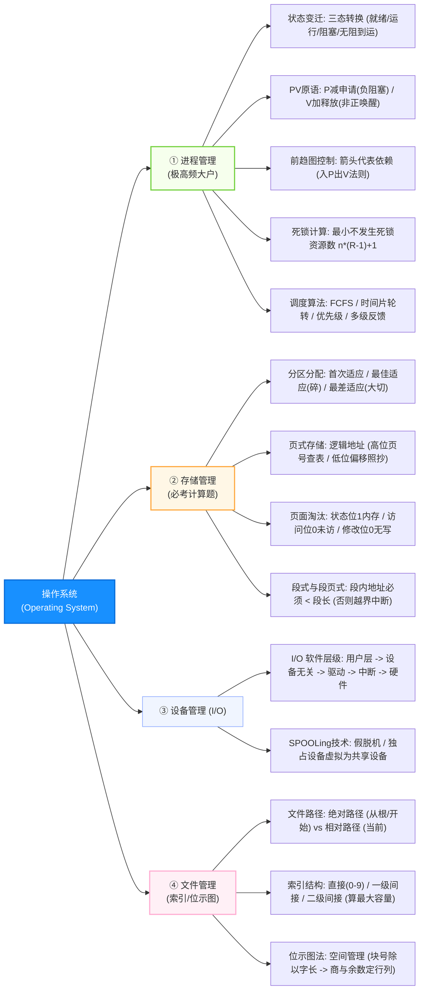
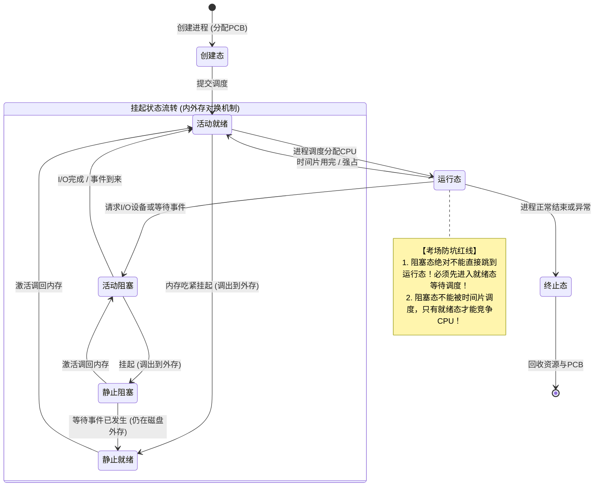
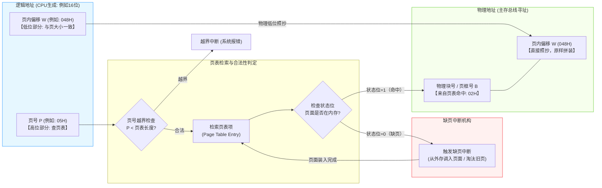
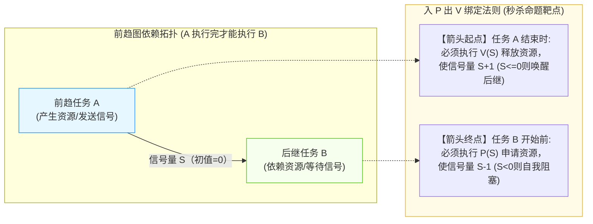

# 软件设计师通关速记文档：操作系统篇

> **所属模块**：软考中级《软件设计师》—— 操作系统知识（文老师教育讲义核心提炼）  
> **提炼规范**：`ruankao-fast-pass` 体系化通关标准（从左到右思维导图 + 80/20 剪枝 + 5大计算秒杀法）

---

## 维度 1：【分值画像与战略定级】

| 考核维度 | 分值权重 | 考点分布与题型特点 |
| :--- | :--- | :--- |
| **上午场（综合知识）** | **6 ~ 8 分** | **与体系结构并列上午第 2 大题库**（通常位于第 20~28 题）。核心考点极度聚焦：**前趋图与PV操作、死锁临界资源数计算、页式地址变换拼接、索引文件容量计算、位示图行列推算、SPOOLing 假脱机**。 |
| **下午场（应用技术）** | **0 分** | 下午大题不直接考操作系统（但进程与并发是软件工程的基础概念）。 |
| **性价比评星** | **★★★★★（五星纯计算送分区）** | **题型套路化程度高达 95%**。几乎全是公式与固定画图法，掌握“特值法”与“入P出V”口诀，6~8 分必须全拿。 |

> **通关战略建议**：  
> **坚决不背长篇文字描述！** 操作系统 80% 的失分发生在“计算差了 1”或“地址拼接混淆”。牢记死锁防坑公式、页表低位照抄法和位示图整除法则。

---

## 维度 2：【知识脉络脑图、核心微观原理图解与辨析矩阵】

### 1. 本章知识脉络全景 Mermaid 脑图（从左至右思维导图）

---

### 2. 核心硬核考点专属微观机制图解（3 大底层机制图）

#### ① 进程五态模型与活动/静止挂起转换机制图

#### ② 页式存储地址变换与缺页中断全流程机制图

#### ③ 前趋图与 PV 操作信号量绑定机制图（入P出V法则）

---

### 3. 核心辨析矩阵（上午单选排除法宝）

#### 矩阵 1：进程状态与关键变迁因果表（必考 1 题）

| 当前状态 | 目标状态 | 触发原因 | 考场辨析题眼 |
| :--- | :--- | :--- | :--- |
| **运行态** | **就绪态** | **时间片用完**，或被更高优先级进程抢占 | CPU 被剥夺，进程一切就绪 |
| **运行态** | **阻塞态** | **等待某事件发生**（如发起 I/O 请求、申请互斥资源） | 进程主动放弃 CPU |
| **阻塞态** | **就绪态** | **所等待的事件已完成**（如 I/O 结束、获得资源） | **只能进入就绪态，绝不能直接跳到运行态！** |
| **就绪态** | **运行态** | **被进程调度程序选中**（分派到 CPU 时间片） | 获得 CPU 执行权 |

---

#### 矩阵 2：PV 原语核心逻辑与物理意义对照

| 原语操作 | 信号量变化 | 条件判定与动作 | 信号量 $S$ 的物理意义 |
| :--- | :--- | :--- | :--- |
| **$P(S)$（申请资源）** | $S = S - 1$ | 若 **$S < 0$**：无资源可用，进程**进入阻塞队列**； 若 $S \ge 0$：继续执行。 | **$S \ge 0$ 时**：表示系统中当前**可用资源数量**。 |
| **$V(S)$（释放资源）** | $S = S + 1$ | 若 **$S \le 0$**：表明队列中仍有等资源的进程，**唤醒一个阻塞进程**； 若 $S > 0$：直接继续。 | **$S < 0$ 时**：$|S|$ 表示在等待队列中**被阻塞的进程个数**！ |

---

#### 矩阵 3：常见动态分区分配算法优缺点矩阵

| 分配算法 | 空闲区排列顺序 | 分配策略 | 优缺点 / 考场题眼 |
| :--- | :--- | :--- | :--- |
| **首次适应法 (FF)** | 按**起始地址递增**排列 | 从头遍历，找到第一个大于等于需求的空闲块切分 | 最好、最快，低地址产生很多小碎片 |
| **最佳适应法 (BF)** | 按**容量从小到大**排列 | 找容量最接近需求的最小空闲块切分 | 容易留下**大量无法利用的微小外部碎片** |
| **最差适应法 (WF)** | 按**容量从大到小**排列 | 每次挑最大的空闲块切分 | 剩下的碎片相对较大，但大作业到达时无大块可用 |
| **循环首次适应 (NF)** | 按地址排列，从上次结束处找 | 减少低地址查找时间，空闲块分布均匀 | 缺乏大空闲块 |

---

## 维度 3：【五大必考计算公式与特值秒杀靶点】

### 1. 前趋图与 PV 操作填空（秒杀绝技：“入 P 出 V 法则”）
* **考法模型**：给出进程 $P_1, P_2, P_3 \dots$ 构成的有向无环图，每条有向边代表一个同步信号量。
* **解题三步法**：
  1. 给图上的**每一条有向箭头线**从上到下标上信号量 $S_1, S_2, S_3 \dots$；
  2. **进程开始执行前（入边）**：有几条箭头**指向**该进程，该进程开头就必须执行对应信号量的 **$P$ 操作**；
  3. **进程执行完毕后（出边）**：有几条箭头**从**该进程出发，该进程末尾就必须执行对应信号量的 **$V$ 操作**。
  > **口诀**：**“箭头指向入做 P，箭头出发末做 V；有几条线配几个原语！”**

---

### 2. 死锁临界资源数计算公式（防死锁保底法则）
* **定理**：系统有 $n$ 个并发进程，每个进程最大需要 $R$ 个同类互斥资源。
* **系统必然发生死锁的最大资源数**：
  $$\text{死锁最大值} = n \times (R - 1)$$
  *(即所有进程都被卡在“差 1 个资源”的最坏状态)*
* **系统【绝不发生死锁】的最小资源数**：
  $$m_{\min} = n \times (R - 1) + 1$$
  * *秒杀例题：某系统有 3 个并发进程，每个进程需要 5 个资源 $R$，为保证系统不发生死锁，至少需要多少个资源？*
  * *代公式：$m = 3 \times (5 - 1) + 1 = 3 \times 4 + 1 = \mathbf{13}$ 个，秒选！*

---

### 3. 页式存储管理：逻辑地址转物理地址（高位查表，低位照抄）
* **真题模型**：页面大小为 $4\text{KB}$，逻辑地址为十六进制 `1D16H`。求转换后的物理地址。
* **解题秘诀**：
  1. **看页面大小定拆分位数**：
     * 页面大小 $4\text{KB} = 2^{12}\text{B} \implies$ 占用 **12 位二进制**（对应十六进制**后 3 位**）；
  2. **拆分逻辑地址**：
     * `1D16H` 拆分为：**页号 = `1`**，**页内偏移量 = `D16H`**；
  3. **查页表换块号**：
     * 到给定的页表中查找页号为 `1` 对应的**物理块号**（假设为 `3`）；
  4. **原样拼接**：
     * 物理地址 = 物理块号 `3` 拼接后 3 位偏移量 `D16H` $\implies \mathbf{3D16H}$！
  > **口诀**：**“4K页面看后三，高位查表换块号，后三不动原样抄！”**

---

### 4. 索引文件结构：最大文件长度与逻辑块号跨度计算
设一个索引节点包含 13 个地址项（编号 0~12），磁盘块大小为 $4\text{KB}$，每个地址项占 $4\text{B}$：
* **每个间接索引块包含的地址项数**：$\frac{4\text{KB}}{4\text{B}} = 1024$ 项。
* **逻辑块号归属**：
  * **0 ~ 9 项（直接索引）**：直接指向 10 个数据物理块，对应逻辑块号 **0 ~ 9**（共 $10 \times 4\text{KB} = 40\text{KB}$）；
  * **10 项（一级间接索引）**：指向 1 个索引块，包含 1024 个地址，对应逻辑块号 **10 ~ 1033**（共 $1024 \times 4\text{KB} = 4\text{MB}$）；
  * **11 项（二级间接索引）**：包含 $1024 \times 1024$ 个地址，对应逻辑块号 **1034 以后**（共 $1024^2 \times 4\text{KB} = 4\text{GB}$）。
* *做题技巧：若题目问逻辑块号 518 采用什么索引？直接对比区间：$518 \in [10, 1033]$，必然是**一级间接地址索引**！*

---

### 5. 位示图法（Bitmap）空间分配计算
* **字长 32 位系统**（每个字管理 32 个磁盘块）：
  * **若编号从 0 开始**（字号 $0, 1, 2 \dots$，位号 $0, 1 \dots 31$）：
    $$\text{字号} = \lfloor \text{物理块号} / 32 \rfloor, \quad \text{位号} = \text{物理块号} \pmod{32}$$
  * **若编号从 1 开始**：
    $$\text{字号} = \lfloor (\text{物理块号} - 1) / 32 \rfloor + 1, \quad \text{位号} = (\text{物理块号} - 1) \pmod{32} + 1$$
* *避坑提醒：考场第一眼先看题干是“第 0 字、第 0 位”还是“第 1 字、第 1 位”！*

---

## 维度 4：【极速小抄与记忆桩（Memory Pegs）】

### 1. 通关押韵口诀（考场条件反射）

> **【前趋图 PV 口诀】**  
> **“入 P 出 V 莫记乱，箭头指向先 P 算；任务办妥发 V 走，信号一一配红线！”**  

> **【死锁防范口诀】**  
> **“每个进程卡差一，临界死锁全窒息；要想不死添一个，安全运行稳稳地！”**  
> *（公式：$n(R-1) + 1$）*

> **【SPOOLing 假脱机口诀】**  
> **“输入输出两个井，内存预备两进程；独占设备虚拟化，共享打印不卡顿！”**  

---

### 2. 考前避坑 3 戒律
1. **状态变迁单向陷阱**：阻塞态进程被唤醒后，**绝对不能直接进入运行态抢占 CPU**，必须进入“就绪态”排队等调度。
2. **段式存储越界中断**：段式管理中，若逻辑地址的段内位移量 $\ge$ 该段的段长，**硬件会立即产生越界中断（非法访问）**。
3. **页面淘汰的修改位代价**：若某个页面未被修改（修改位=0），淘汰时**直接覆盖即可，无需写回磁盘**；若修改位=1，必须执行一次昂贵的写盘操作。

---

## 维度 5：【机考防冷箭盲盒与即时测验】

### 1. 🛡️ 机考防冷箭盲盒清单（Edge Cases，只记中文混眼熟）
* **管程（Monitor）**：一种高级同步机制，由编译程序在编译时自动插入 P、V 互斥操作，将共享变量及操作封装在管程内部，**同一时刻只允许一个进程进入管程**。
* **微内核架构（Microkernel）**：只把最基本的机制（如进程间通信 IPC、低级硬件操作）保留在内核态运行，其他服务（文件系统、设备驱动）全部作为**用户态进程**运行。优点是高可靠、易扩展，缺点是**多次用户态/内核态上下文切换开销大**。
* **Belady 抖动异常**：在**先进先出（FIFO）**页面置换算法中，出现“**分配的物理块数增加，缺页率不减反增**”的异常反常现象（LRU 算法绝不会出现 Belady 现象）。
* **工作集模型**：基于程序局部性原理，进程在某段时间间隔内实际访问的页面集合。

---

### 2. 📇 Anki 闪卡库（可直接复制导入）

| 正面（Front: 核心考点提问） | 反面（Back: 核心答案与记忆桩） | 标签（Tags） |
| :--- | :--- | :--- |
| 进程三态模型中，阻塞态能否直接变迁到运行态？ | **不能**！只能从阻塞态变迁到**就绪态**（等待事件发生后排队等调度）。 | 软考::软件设计师::操作系统 |
| 前趋图中，用 PV 原语控制同步的核心规则是什么？ | **入 P 出 V 法则**。 指向节点的入边对应 P 操作；从节点出发的出边对应 V 操作。 | 软考::软件设计师::操作系统 |
| 5 个进程竞争某资源，每个进程需 4 个，保证系统不死锁的最小资源数是？ | **16 个**。 公式：$5 \times (4 - 1) + 1 = 15 + 1 = 16$。 | 软考::软件设计师::操作系统 |
| 页面大小为 4KB，逻辑地址 `2E50H` 对应的页号和页内偏移分别是多少？ | **页号为 `2`，页内偏移为 `E50H`**。 （4KB 占用低 12 位即后 3 位十六进制） | 软考::软件设计师::操作系统 |
| SPOOLing（假脱机）技术的最核心作用是什么？ | 将物理上的**独占设备（如打印机）虚拟化为共享设备**。 | 软考::软件设计师::操作系统 |
| 哪种页面置换算法会出现分配物理块增多反而缺页率上升的 Belady 现象？ | **FIFO（先进先出算法）**。 （LRU 和 OPT 绝不会出现 Belady 异常） | 软考::软件设计师::操作系统 |
| 动态分区分配中，最容易在内存中产生大量无用微小外部碎片的是？ | **最佳适应算法（Best Fit）**。 （因为每次都挑最小合适的空闲块切分） | 软考::软件设计师::操作系统 |

---

### 3. 🎯 现场即时随堂互动测验（检验吸收闭环）

请你在考场思维下，直接秒答这道历年极具迷惑性的典型高频真题：

> **【随堂测验】**  
> 某操作系统采用页式存储管理，页面大小为 $4\text{KB}$。若进程访问的逻辑地址为十六进制 `2A48H`，且该进程的页表中页号 `2` 对应的物理块号为 `5`，则该逻辑地址对应的物理地址为（ ）。  
> A. `5A48H` &emsp;&emsp; B. `2A48H`  
> C. `7A48H` &emsp;&emsp; D. `5000H`  
>
> 💡 **请直接在对话框回复你的选项：`A`、`B`、`C` 或 `D`！**
