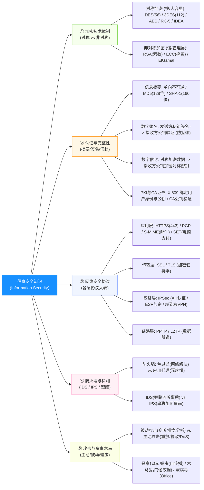
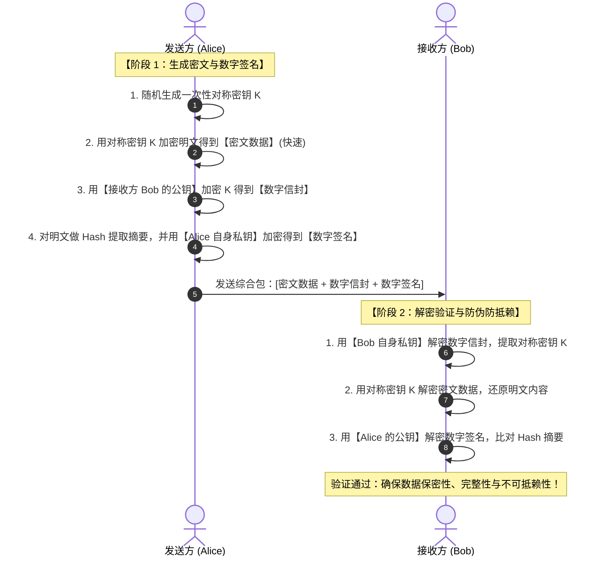
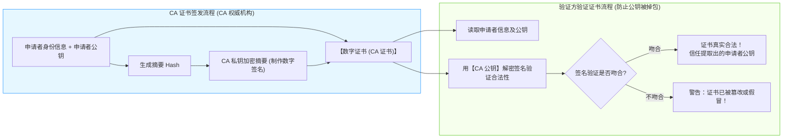
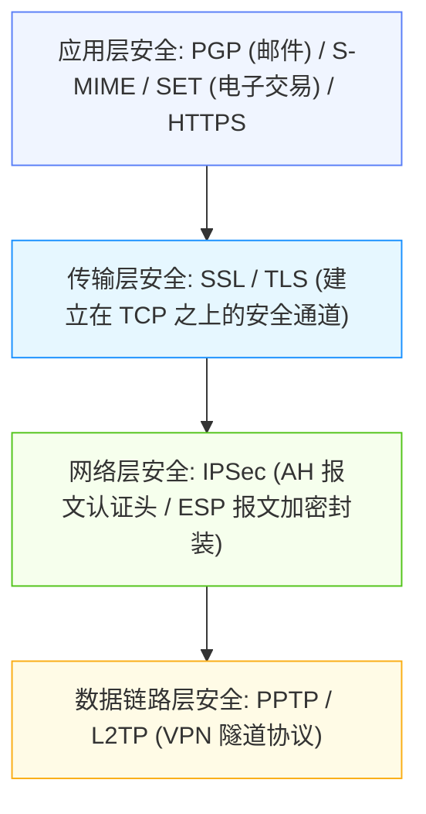

# 软件设计师通关速记文档：信息与网络安全篇

> **所属模块**：软考中级《软件设计师》—— 信息安全与网络安全（文老师教育讲义核心提炼）  
> **提炼规范**：`ruankao-fast-pass` 体系化通关标准（从左到右思维导图 + 80/20 剪枝 + 16字真言秒杀法）

---

## 维度 1：【分值画像与战略定级】

| 考核维度 | 分值权重 | 考点分布与题型特点 |
| :--- | :--- | :--- |
| **上午场（综合知识）** | **3 ~ 5 分** | 通常分布在第 15~18 题或网络题后第 70~72 题。核心考查：**对称 vs 非对称算法归属、数字签名与摘要的公私钥选择、数字信封流程、网络安全协议分层（IPSec/SSL/PGP）、主动攻击 vs 被动攻击、木马病毒辨析**。 |
| **下午场（应用技术）** | **0 分** | 下午大题不直接考安全配置或密码学推导。 |
| **性价比评星** | **★★★★★（五星纯送分送礼区）** | **概念极度死板、几乎无数学计算**。只要牢记“公钥加密私钥解密，私钥签名公钥验证”16字真言，配合 3 张分类大表，3~5 分 100% 收入囊中。 |

> **通关战略建议**：  
> **绝不去算 RSA 大素数乘法和椭圆曲线方程！** 软考只考“谁用谁的什么钥匙干什么事”。掌握角色公私钥互换套路，读完题干 5 秒选出答案。

---

## 维度 2：【知识脉络脑图、核心微观原理图解与辨析矩阵】

### 1. 本章知识脉络全景 Mermaid 脑图（从左至右思维导图）



---

### 2. 核心硬核考点专属微观机制图解（3 大底层机制图）

#### ① 混合加密与数字信封工作机制全景时序图


#### ② 数字证书（CA 证书）防篡改与真伪验证机制图


#### ③ 安全协议分层防御拓扑图（网络层/传输层/应用层）


---

### 3. 核心辨析矩阵（上午单选直接秒杀大表）

#### 矩阵 1：对称加密算法 vs 非对称加密算法终极大比拼（必考 1 题）

| 比较维度 | 对称加密技术（私钥密码体制） | 非对称加密技术（公钥密码体制） |
| :--- | :--- | :--- |
| **加解密密钥** | **加密密钥与解密密钥相同**（单密钥） | **密钥成对出现**：公钥（公开）与私钥（保密） |
| **加解密速度** | **极快**，硬件易于实现 | **极慢**（通常是对称加密的百倍到千倍以上） |
| **适用场景** | **加密海量明文数据**（文件传输、信道通信） | **加密小数据**（密钥交换）、**身份认证、数字签名** |
| **密钥管理量** | $n$ 个用户间需管理 **$\frac{n(n-1)}{2}$** 个密钥（随人数激增） | $n$ 个用户只需维护 **$2n$** 个密钥（每个人一对） |
| **典型算法归属（必背！）** | **DES**（56位密钥/64位块）、**3DES**（112位）、**AES**、**RC-5**、**IDEA**（128位） | **RSA**（基于大整数质因数分解）、**ECC**（椭圆曲线）、**ElGamal**、**DSA** |

---

#### 矩阵 2：信息安全 16 字核心真言（身份认证与机密性辨析）

| 业务场景 | 使用谁的钥匙？ | 具体动作 | 达成的核心安全目标 |
| :--- | :--- | :--- | :--- |
| **保密通信（防偷看）** | **【接收方】的公钥加密** | 接收方用**自己的私钥**解密 | 保证**机密性**（只有接收方私钥能解密，中途被窃听也看不懂） |
| **数字签名（防抵赖/防伪造）** | **【发送方】的私钥加密** | 接收方用**发送方的公钥**解密验证 | 保证**真实性、完整性与不可抵赖性**（全天下只有发送方有此私钥） |
| **数字信封（混合加密）** | **接收方的公钥** | 加密用于传输海量数据的**对称密钥** | 完美融合：**对称的高速度 + 非对称的密钥分发安全** |

> **🔥 黄金法则**：  
> *“公钥加密、私钥解密 $\implies$ **为了保密**；  
> 私钥签名、公钥验证 $\implies$ **为了认人（防赖账）**。”*

---

#### 矩阵 3：网络安全协议分层归属大表（上午必考 1 题）

| OSI 对应层次 | 安全协议名称 | 典型应用与特点 | 熟知端口/技术特征 |
| :--- | :--- | :--- | :--- |
| **应用层** | **HTTPS** | Web 加密浏览（HTTP + SSL/TLS） | **端口 443** |
| | **PGP / S-MIME** | **安全电子邮件协议** | 综合使用 RSA + IDEA/AES + MD5 |
| | **SET** | **安全电子交易协议**（B2C 网上信用卡支付） | 涉及消费者、商家、银行三方，安全性高 |
| | **Kerberos** | 集中式第三方网络身份认证协议 | 依赖密钥分发中心（KDC），对称加密 |
| **传输层** | **SSL / TLS** | 安全套接字层 / 传输层安全 | 介于 TCP 与应用层之间，保护 HTTP、FTP |
| **网络层** | **IPSec** | **IP 层安全协议**（透明保护所有网络流量） | 核心组件：**AH（认证头）** + **ESP（封装安全载荷）** |
| **数据链路层**| **PPTP / L2TP** | 点对点隧道协议 / 第二层隧道协议 | 搭建企业远程接入 VPN 隧道 |

---

#### 矩阵 4：网络攻击分类（主动攻击 vs 被动攻击）

| 攻击类型 | 核心特征 | 典型攻击手段（考题选项） | 防范策略 |
| :--- | :--- | :--- | :--- |
| **被动攻击** | **不破坏数据，不改变网络状态**，只窃取敏感信息 | **窃听（网络监听抓包）、业务流量分析、非法登录** | **重点靠数据强加密** |
| **主动攻击** | **主动修改破坏数据，干扰网络正常运行** | **伪造身份、重放攻击、消息篡改、拒绝服务（DoS/DDoS）** | 重点靠认证、数字签名、防火墙 |

---

## 维度 3：【核心加密流程图解与攻防靶点】

### 1. 数字签名与验证完整工作流（考场填空/选项对应）
```
【发送方 A】                              【接收方 B】
原始明文 M ──(Hash算法)──► 摘要 H         原始明文 M ──(同Hash算法)──► 计算摘要 H1
                           │                                          │
                           ▼                                          │ (两者完全相等?)
                     A的【私钥】加密                                  ▼
                           │                                      比对验证!
                           ▼                                          ▲
                     【数字签名 S】 ──(通过网络发送)──► A的【公钥】解密 ──┘
```
* **核心理解**：数字签名是对**消息摘要**进行加密，不是对整篇大文件加密（节约计算时间）；如果传输中哪怕改动了一个标点符号，接收方算出的摘要 $H_1$ 与解出来的 $H$ 就会不匹配！

---

### 2. 数字信封机制（解决对称密钥安全传输的绝妙方案）
1. 发送方产生一个随机的**会话密钥（对称密钥 $K$）**；
2. 发送方用会话密钥 $K$ 加密明文海量数据，得到密文；
3. 发送方用**接收方 B 的【公钥】**加密会话密钥 $K$，生成**【数字信封】**；
4. 发送方将“密文数据 + 数字信封”一起发给 B；
5. 接收方 B 收到后，先用**自己的【私钥】**拆开数字信封取出 $K$，再用 $K$ 解密出明文。

---

### 3. IDS vs IPS 本质区别
* **IDS（入侵检测系统）**：**旁路部署**在交换机镜像端口，“像监控摄像头”，检测到攻击后**只能告警和记录日志**，无法中途切断通信！
* **IPS（入侵防御系统）**：**串联部署**在主干线路上，“像带防爆门的保安”，检测到恶意流量**直接实时丢包阻断**。

---

## 维度 4：【极速小抄与记忆桩（Memory Pegs）】

### 1. 通关押韵口诀（考场条件反射）

> **【公私钥十六字真言】**  
> **“公钥加密、私钥解密，安全保密谁也看不见；私钥签名、公钥验证，确凿无误谁也赖不掉！”**  

> **【算法分类口诀】**  
> **“DES、AES 都是对，RC、IDEA 对称排；RSA、ECC 非对称，椭圆大数速度慢；签名邮件找 PGP，电子商务刷 SET！”**  

> **【网络攻击口诀】**  
> **“窃听流量是被动，篡改重放是主动；DoS 瘫痪服务器，也是主动大恶行！”**  

---

### 2. 考前避坑 3 戒律
1. **数字签名不保密**：数字签名**只防赖账和篡改，绝对不保密**！因为验证签名用的是公开的公钥，任何人都可以拿发送方的公钥解开看明文。要想保密，必须再用接收方公钥加密一层！
2. **CA 证书验证谁的签名？**：拿到张三的数字证书，要验证证书真伪，必须用 **CA（认证中心）的公钥** 去验证 CA 的签名，而不是用张三的公钥！
3. **重放攻击是主动攻击**：黑客抓包后原封不动地把登录请求重发一次（哪怕抓到的报文是加密的），这种叫**重放攻击（Replay Attack）**，属于**主动攻击**。

---

## 维度 5：【机考防冷箭盲盒与即时测验】

### 1. 🛡️ 机考防冷箭盲盒清单（Edge Cases，只记中文混眼熟）
* **Kerberos 认证两件套**：**AS（认证服务器）**负责核实身份，**TGS（票据授予服务器）**负责发放访问特定服务器的 Ticket 票据。
* **X.509 标准证书包含要素**：版本号、序列号、签名算法标识符、**认证机构 CA 名称**、**有效起止期**、**使用者名称**、**使用者公钥信息**、**CA 的数字签名**。
* **蜜罐技术（Honeypot）**：诱捕黑客的伪造系统，**无任何真实业务**，任何发往蜜罐的流量默认都是攻击行为。
* **同态加密（Homomorphic Encryption）**：无需解密密文，直接在密文上进行计算，解密后的结果等同于在明文上计算的结果（隐私计算前沿）。

---

### 2. 📇 Anki 闪卡库（可直接复制导入）

| 正面（Front: 核心考点提问） | 反面（Back: 核心答案与记忆桩） | 标签（Tags） |
| :--- | :--- | :--- |
| 甲向乙发送商业机密数据，为了保证数据机密性，甲应该使用谁的什么密钥进行加密？ | 使用**乙（接收方）的公钥**加密。<br>（口诀：公钥加密保密送，只有乙的私钥能解开） | 软考::软件设计师::信息安全 |
| 乙收到甲发送的带有数字签名的合同，乙应使用谁的什么密钥来验证签名的真伪？ | 使用**甲（发送方）的公钥**验证。<br>（口诀：私钥签名防赖账，公钥验证验身份） | 软考::软件设计师::信息安全 |
| 在数字信封技术中，用于加密真正明文数据的是对称密钥还是非对称密钥？ | **对称密钥**（利用对称加密的高效率）；<br>非对称公钥仅用于加密该对称密钥。 | 软考::软件设计师::信息安全 |
| 安全电子邮件协议 PGP 和 S/MIME 工作在 OSI 参考模型的哪一层？ | **应用层**。 | 软考::软件设计师::信息安全 |
| 网络安全协议 IPSec 运行在 OSI 参考模型的哪一层？ | **网络层（第 3 层）**。<br>（核心包含 AH 和 ESP 协议） | 软考::软件设计师::信息安全 |
| 窃听网络数据通信和分析通信流量属于主动攻击还是被动攻击？ | **被动攻击**（不篡改数据，不影响网络正常运行）。 | 软考::软件设计师::信息安全 |
| 能够自我复制并在网络中主动寻找漏洞传播的恶意代码是病毒、木马还是蠕虫？ | **蠕虫病毒（Worm）**。<br>（木马不自我复制，普通病毒依附宿主文件） | 软考::软件设计师::信息安全 |
| 验证数字证书中公钥合法性的核心步骤是什么？ | 使用**签发该证书的 CA（认证机构）的公钥**，解密并验证其数字签名。 | 软考::软件设计师::信息安全 |

---

### 3. 🎯 现场即时随堂互动测验（检验吸收闭环）

请你在考场思维下，直接秒答这道极具迷惑性的典型高频真题：

> **【随堂测验】**  
> 甲公司与乙公司进行商务合作，甲公司向乙公司发送一份带有数字签名的商业计划书。为同时确保**该计划书的保密性（防窃听）**以及**甲公司签名的真实不可抵赖性**，甲公司发送前应采取的加密策略是（ ）。  
> A. 用甲的公钥加密数据，用乙的私钥进行签名  
> B. 用甲的私钥加密数据，用乙的公钥进行签名  
> C. 用乙的公钥加密数据，用甲的私钥进行签名  
> D. 用乙的私钥加密数据，用甲的公钥进行签名  
>
> 💡 **请直接在对话框回复你的选项：`A`、`B`、`C` 或 `D`！**
