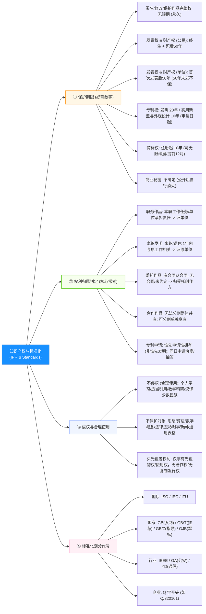

# 软件设计师通关速记文档：知识产权与标准化篇

> **所属模块**：软考中级《软件设计师》—— 知识产权与标准化（文老师教育讲义核心提炼）  
> **提炼规范**：`ruankao-fast-pass` 体系化通关标准（从左到右思维导图 + 80/20 剪枝）

---

## 维度 1：【分值画像与战略定级】

| 考核维度 | 分值权重 | 考点分布与题型特点 |
| :--- | :--- | :--- |
| **上午场（综合知识）** | **2 ~ 3 分** | 必考单选（通常位于第 15~18 题或卷尾第 73~75 题前）。题型高度固化：**著作权/专利保护期限、职务/委托作品归属、侵权判定（合理使用）、标准代号**。 |
| **下午场（应用技术）** | **0 分** | 下午大题完全不考。 |
| **性价比评星** | **★★★★☆（四星纯送分模块）** | **投入产出比极高**。总共只有 5 个法律判定常识，花 20 分钟背熟这套表格与口诀，2~3 分直接装进口袋。 |

> **通关战略建议**：  
> **绝对不翻看厚重的《著作权法》法条！** 软考只考“生活情景判断题”（如：买了光盘有什么权？下班写的代码归谁？两个人同一天申请专利怎么办？）。记住判别公式直接秒选。

---

## 维度 2：【知识脉络脑图与核心辨析矩阵】

### 1. 本章知识脉络全景 Mermaid 脑图（从左至右思维导图）

---

### 2. 核心辨析矩阵（上午题秒杀利器）

#### 矩阵 1：知识产权客体与保护期限全景表（必考！）

| 客体类型 | 权利细分 | 保护期限 | 起算点与关键限制 |
| :--- | :--- | :--- | :--- |
| **公民作品 / 软件** | **署名权、修改权、保护作品完整权** | **无限期（永久保护）** | 人死了依然受保护，不可剥夺 |
| | **发表权、使用权与获得报酬权** | **作者终生 + 死后 50 年** | 截至作者死后第 50 年的 12 月 31 日；合作作品以最后死亡者为准 |
| **单位作品 / 软件** | 发表权、使用权与财产权 | **50 年** | 首次发表后的第 50 年 12 月 31 日；**若创作后 50 年内未发表，不再保护** |
| **注册商标** | 商标专用权 | **10 年** | **自核准注册之日起算**；期满前可申请续展，**续展次数无限制（变相永久）** |
| **发明专利** | 专利独占权 | **20 年** | **自申请日起算**（不可续展） |
| **实用新型 / 外观设计** | 专利独占权 | **10 年** | **自申请日起算**（不可续展） |
| **商业秘密** | 秘密专有权 | **不确定** | 只要保密措施有效就一直保护，一旦公开即失效 |

---

#### 矩阵 2：知识产权归属三方判定矩阵（真题年年必出）

| 场景分类 | 判定条件 | 著作权 / 专利权最终归属 | 考生避坑点 |
| :--- | :--- | :--- | :--- |
| **职务作品** | 1. 执行本单位工作任务开发 2. 属于主要利用单位物质技术条件并由单位担责 | **归单位享有**（作者享有署名权） | 单位承担责任是核心条件 |
| **离职员工发明** | 离职、退休或调动工作后 **1 年内** 作出的与原工作相关的发明 | **归原单位所有** | **1年期限**是法宝，超过 1 年才归自己 |
| **委托创作** | 甲方出钱委托乙方开发软件： 1. 合同有明确约定 $\to$ **从合同** 2. **合同未约定 或 没有合同** | **归乙方（受托人/创作方）所有**！ | 谁开发归谁，出钱的甲方只能用，无版权 |
| **合作创作** | 两人或多人共同开发： 1. 无法分割 $\to$ **共同共有**（一人反对不可转让） 2. 可以分割使用 $\to$ **各自分别享有** | 共同或分别享有 | 署名按贡献大小排列 |
| **专利抢注** | 甲、乙分别独立研发出同样的发明并申请专利 | **谁先申请（先到专利局盖章）谁获得** | **先发明没用，谁先申请归谁**！若同日申请则自行协商或抽签 |

---

#### 矩阵 3：标准化代号等级速查

| 标准级别 | 机构 / 代号 | 举例 | 考场辨析题眼 |
| :--- | :--- | :--- | :--- |
| **国际标准** | ISO（国际标准化组织）、IEC（国际电工委员会）、ITU（国际电信联盟） | ISO 9000 | 国际通行 |
| **国家标准** | **GB**（强制性国标）、**GB/T**（推荐性国标）、**GB/Z**（指导性技术文件）、**GJB**（国家军用标准） | GB 18030 | **带 `/T` 是推荐（T=推）** |
| **国外先进** | **ANSI**（美国国家标准）、**IEEE**（美国电气电子工程师学会） | IEEE 802.11 | 常见常识 |
| **行业标准** | **GA**（公共安全公安）、**YD**（通信邮电）、**SJ**（电子电子工业） | GA/T 72 | 行业字母简称 |
| **地方标准** | **DB** + 地方行政区划代码 | DB32/T | 地方代码 |
| **企业标准** | **Q** + 企业代号 | Q/320101 | **Q 开头即企业标准** |

---

## 维度 3：【命题情景与法律陷阱靶点】

### 1. 软件使用与买受人权利陷阱（真题极高频）
* **情景题**：“某人花钱购买了正版 Windows 操作系统或游戏光盘”。
  * 他获得了什么？$\implies$ **获得了光盘介质的所有权** 以及 **合法的许可使用权**；
  * 他**没有**获得什么？$\implies$ **绝对没有获得软件的著作权**，不能出租、反编译、修改或复制并出售！
  * 他享有复制权吗？$\implies$ **仅享有“备份权”（制作备份盘）**，且备份盘不得提供给他人使用，软件许可终止时备份盘必须销毁。

### 2. 著作权“不予保护”的红线
软考考题中经常问“下列不受著作权法保护的是”：
1. **思想、概念、发现、原理、算法、数学处理过程**（算法不受著作权保护！算法只能通过申请发明专利保护）；
2. **法律、法规、国家机关决议、决定、命令**；
3. **时事新闻**；
4. **历法、通用数表、通用表格和公式**。

### 3. 合理使用（合法使用，不侵权，无需授权不付酬）
* 为**个人学习、研究或者欣赏**使用他人作品；
* 为介绍、评论某一作品或者说明某一问题，在作品中**适当引用**；
* 学校为课堂教学或者科学研究少量复制；
* 将中国公民用汉语创作的作品**翻译成少数民族语言出版**（反之译成外文不属于合理使用！）。

---

## 维度 4：【极速小抄与记忆桩（Memory Pegs）】

### 1. 通关押韵口诀（考场条件反射）

> **【保护期限速记口诀】**  
> **“署名修改保完整，生生世世不受限；发表财产五十年，公民死后单位发；发明二十造十年，商标续展万万年！”**  
> *解析：署名权修改权完整权永久；发表与财产权50年（个人死后50年，单位发后50年）；发明专利20年，实用新型/外观设计10年；商标10年可无限续展。*

> **【权利归属速记口诀】**  
> **“单位担责归单位，离职一年原厂摘；委托合同没约定，版权谁写谁拥有；专利竞争不看早，专利局里谁先跑！”**  
> *解析：职务作品归单位；离职一年内相关发明归原单位；委托没约定归受托人；专利以先申请为主。*

---

### 2. 考前避坑 3 戒律
1. **买光盘不买产权**：买正版软件光盘的人，获得的只是物理介质所有权，不是软件著作权。
2. **算法不属于著作权客体**：写出软件代码受著作权法保护，但代码背后的“数学公式与算法思想”不保护。
3. **专利权保护期从申请日算起**：商标权是从“核准注册日”起算 10 年；专利权是从“申请日”起算 20 年或 10 年，切勿混淆！

---

## 维度 5：【经典真题闭环自测与 Anki 闪卡库】

### 1. 经典真题速杀演练

* **【真题 1（买受人权利）】** 李某购买了一张有注册商标的应用软件正版光盘，则李某享有该光盘的（ ）。  
  A. 注册商标专用权 &emsp; B. 光盘的所有权 &emsp; C. 软件著作权 &emsp; D. 软件复制发行权  
  * **10秒破题**：买光盘只买到了塑料盘子的物权，选 **B**。

* **【真题 2（专利归属判定）】** 甲、乙两人分别独立开发出相同主题的智能阀门。甲于 2023 年 3 月完成，乙于 2023 年 5 月完成。甲于 6 月 1 日向专利局申请专利，乙于 5 月 20 日先向专利局申请了专利。依据专利法，（ ）。  
  A. 甲享有专利申请权 &emsp; B. 乙享有专利申请权 &emsp; C. 甲乙都享有专利申请权 &emsp; D. 甲乙都不享有  
  * **10秒破题**：中国专利法遵循**“先申请原则”**，不管谁先做出来，乙先递交申请，但申请权本身两人都有；最终获得专利权的是乙。本题若问谁享有专利申请权则**两人均享有**（选项 C）；若问最终谁被授予专利权则为**乙**。

---

### 2. 📇 Anki 闪卡库（可直接复制导入）

| 正面（Front: 核心考点提问） | 反面（Back: 核心答案与记忆桩） | 标签（Tags） |
| :--- | :--- | :--- |
| 著作权中，哪三项人身权利的保护期是永久不受限制的？ | **署名权、修改权、保护作品完整权**。 （口诀：署名修改保完整，生生世世不受限） | 软考::知识产权::保护期限 |
| 我国发明专利与实用新型专利的保护期分别是多少年？从何时起算？ | **发明专利 20 年；实用新型 10 年**。 **自申请日起计算**（不可续展）。 | 软考::知识产权::专利权 |
| 商标权的保护期限是几年？是否可以续展？ | **10 年**（自核准注册日起算）。 **可以无限期续展**（每次续展 10 年）。 | 软考::知识产权::商标权 |
| 甲公司出资委托乙软件公司开发系统，合同未约定版权归属，则著作权归谁？ | **归乙方（软件开发方/受托方）所有**。 （甲方仅享有合法使用权） | 软考::知识产权::权利归属 |
| 员工离职后多久内作出的与原单位本职工作相关的发明属于原单位？ | **离职后 1 年之内**（属于原单位职务发明）。 | 软考::知识产权::权利归属 |
| 软件背后的思想、算法、操作方法是否受《著作权法》保护？ | **不受保护**！著作权只保护表达（代码），不保护思想与算法。 | 软考::知识产权::保护客体 |
| 推荐性国家标准与指导性技术文件的代号分别是什么？ | 推荐性国标：**GB/T**（T=推）； 指导性技术文件：**GB/Z**（Z=指）。 | 软考::知识产权::标准化 |
| 购买正版软件光盘后，用户对软件享有什么权利？ | 享有**光盘介质所有权**、**合法使用权**和**制作备份盘权**；不享有著作权与分发权。 | 软考::知识产权::侵权判定 |
