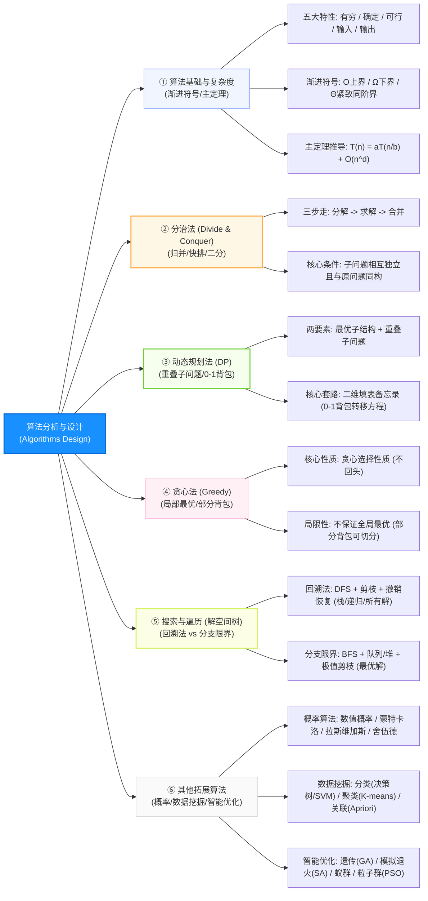

# 软件设计师通关速记文档：算法分析与设计篇

> **所属模块**：软考中级《软件设计师》—— 算法分析与设计（文老师教育讲义核心提炼）  
> **提炼规范**：`ruankao-fast-pass` 体系化通关标准（从左到右思维导图 + 80/20 剪枝 + 下午大题15分必杀套路）

---

## 维度 1：【分值画像与战略定级】

| 考核维度 | 分值权重 | 考点分布与题型特点 |
| :--- | :--- | :--- |
| **上午场（综合知识）** | **2 ~ 4 分** | 通常集中在第 60~64 题。考查：**算法 5 大特性、渐进符号（$O, \Omega, \Theta$）、常见复杂度大小排序、主定理与递归递推方程展开、概率/智能算法常识**。 |
| **下午场（应用技术）** | **整整 15 分（试题四）** | **全卷最大的拉分决战点！** 考查： 1. 判断算法策略类型（分治/动规/贪心/回溯，2~3分）； 2. 伪代码/C语言代码核心逻辑填空（6~8分）； 3. 时间/空间复杂度分析与策略问答（3~4分）。 |
| **性价比评星** | **★★★★★（五星核武级：决定能否及格的分水岭）** | 只要拿下算法 15 分中的 11~13 分，下午卷及格（45分）就成功了 80%！命题套路极度固化，题干中往往已经给出了填空变量。 |

> **通关战略建议**：  
> **绝不盲目刷 LeetCode 难题！** 软考算法 80% 的大题锁定在“分治法（归并/快排）”、“动态规划（0-1背包/LCS）”、“贪心法（部分背包/覆盖）”和“回溯法（N皇后）”。必须亲手默写 0-1 背包状态转移方程。

---

## 维度 2：【知识脉络脑图与核心辨析矩阵】

### 1. 本章知识脉络全景 Mermaid 脑图（从左至右思维导图）

---

### 2. 五大经典算法策略终极大比拼表（下午第 1 问必考）

| 算法策略 | 题干核心眼 / 特征词 | 子问题特征 | 是否必得最优解 | 底层数据结构 / 机制 | 典型软考真题场景 |
| :--- | :--- | :--- | :--- | :--- | :--- |
| **分治法** | **分解、子问题同构、递归合并** | **相互独立** | **必得最优解** | 递归调用（系统栈） | 归并排序、快速排序、二分查找、大整数乘法 |
| **动态规划法 (DP)** | **最优子结构、重叠子问题、填表备忘** | **相互重叠**（不独立） | **必得最优解** | 二维数组 / 表格（备忘录） | **0-1 背包**、最长公共子序列（LCS）、矩阵连乘 |
| **贪心法** | **局部最优、贪心选择性质、步步为营** | 步步取当下最好，不反悔 | **通常不保证**（除非数学证明） | 优先队列 / 贪心比较排序 | 部分背包（可切分）、区间覆盖/消防栓、霍夫曼树、Prim/Dijkstra |
| **回溯法** | **深度优先搜索（DFS）、试探回退、剪枝** | 遍历解空间树 | **可得所有解或任一可行解** | 系统递归栈（Stack） | **N 皇后问题**、迷宫寻路、图的 m 着色、数独 |
| **分支限界法** | **广度优先搜索（BFS）、展开所有儿子、限界** | 活结点一次性生成全部子代 | **专用于求极值/单最优解** | **FIFO 队列** 或 **优先队列（大/小顶堆）** | 0-1 背包分支限界、单源最短路、旅行商问题（TSP） |

---

### 3. 常见时间复杂度量级阶梯（上午单选必背）

$$O(1) < O(\log n) < O(n) < O(n \log n) < O(n^2) < O(n^3) < O(2^n) < O(n!)$$

* **常数级 $O(1)$**：数组寻址、哈希查找（理想）；
* **对数级 $O(\log n)$**：二分查找（折半查找）、二叉平衡树查找；
* **线性对数级 $O(n \log n)$**：归并排序、堆排序、快速排序（平均）；
* **多项式级 $O(n^2)$**：直接插入排序、冒泡排序、简单选择排序；
* **指数级 $O(2^n)$**：未经记忆化优化的斐波那契暴力递归、穷举子集。

---

## 维度 3：【核心计算公式与下午试题四挖空靶点】

### 1. 0-1 背包状态转移方程（必须能亲手默写！）
$$
\text{dp}[i][w] = \begin{cases} 
\text{dp}[i-1][w], & w < w_i \\
\max(\text{dp}[i-1][w], \; \text{dp}[i-1][w - w_i] + v_i), & w \ge w_i
\end{cases}
$$

* **分支 1（$w < w_i$，超重装不下）**：直接继承上一行不放该物品的最优值 $\text{dp}[i-1][w]$；
* **分支 2（$w \ge w_i$，装得下）**：在 **方案A（不选该物品：$\text{dp}[i-1][w]$）** 与 **方案B（选入该物品：$\text{dp}[i-1][w - w_i] + v_i$）** 中取最大值！
* **时空复杂度**：时间复杂度为 **$O(n \cdot W)$**，空间复杂度为 **$O(n \cdot W)$**（$W$ 为背包容量）。
* **代码填空必杀套路**：挖空 90% 都在 `max` 括号内部，或者在判断容量的 `if (w < w[i])` 处！

---

### 2. 分治法主定理（Master Theorem）与递归展开法
* **标准递推方程**：$T(n) = a T(n/b) + O(n^d)$
  * 若 $a > b^d \implies T(n) = O(n^{\log_b a})$
  * 若 $a = b^d \implies T(n) = O(n^d \log n)$
  * 若 $a < b^d \implies T(n) = O(n^d)$
* **秒杀速记模型**：
  * 归并排序：$T(n) = 2T(n/2) + O(n) \implies a=2, b=2, d=1 \implies a = b^d \implies \mathbf{O(n \log n)}$。
  * 二分查找：$T(n) = T(n/2) + O(1) \implies a=1, b=2, d=0 \implies a = b^d \implies \mathbf{O(\log n)}$。
  * 展开累加法：$T(n) = T(n-1) + n = 1 + 2 + \dots + n = \frac{n(n+1)}{2} \implies \mathbf{O(n^2)}$。

---

### 3. 下午试题四（15分）代码填空 4 大通用靶点
1. **递归出口（Base Case）**：
   * 分治或递归函数开头第一句：`if (low >= high)` 或 `if (n == 0)`，直接返回。
2. **中间切分与步长**：
   * 二分切分：`int mid = (low + high) / 2;`
   * 分治递归传参：`divide_conquer(arr, low, mid);` 和 `divide_conquer(arr, mid + 1, high);`。
3. **状态转移更新（DP）**：
   * 二维数组赋值：`dp[i][j] = max(...)` 或 `c[i][w] = c[i-1][w-w[i]] + v[i];`。
4. **回溯现场恢复（Undo State）**：
   * DFS 递归调用之后，紧跟着一行重置标记的语句：`visited[i] = 0;` 或 `board[row][col] = 0;`。

---

## 维度 4：【极速小抄与记忆桩（Memory Pegs）】

### 1. 通关押韵口诀（考场条件反射）

> **【五大策略判别口诀】**  
> **“独立用分治，重叠做动规；贪心顾眼前，深搜去回溯，广搜做限界！”**  

> **【背包问题选择口诀】**  
> **“物品可切片，贪心单价排第一；物品不可拆（0-1），贪心必扑街，动规算到底！”**  

> **【下午做题保命三原则】**  
> **“题干藏答案，上下借变量；策略写官名，边界看加一！”**  
> *（第 1 问必须标准写“动态规划法”、“分治法”，严禁写“DP”或“递推法”；填空变量名 90% 在前后 5 行出现过）*

---

### 2. 考前避坑 3 戒律
1. **动态规划的时间复杂度不是 $O(n^2)$**：0-1 背包的时间复杂度是 **$O(n \cdot W)$**（$W$ 为背包最大容量），不是 $n^2$！
2. **回溯法必须有“撤销操作”**：在解空间树中探索一条路走不通退回时，若不恢复现场变量，会导致后续其他分支的搜索全部错乱。
3. **快速排序最坏复杂度**：快速排序平均是 $O(n \log n)$，但在**序列基本有序（正序或逆序）**的最坏情况下会退化为 **$O(n^2)$**。

---

## 维度 5：【机考防冷箭盲盒与即时测验】

### 1. 🛡️ 机考防冷箭盲盒清单（Edge Cases，只记中文混眼熟）
* **4 类概率算法类型辨析**：
  * **数值概率算法**：求数学数值的**近似解**（如蒙特卡洛投点法计算 $\pi$）；
  * **蒙特卡洛算法（Monte Carlo）**：求问题的解，**允许极小概率出错**，但运行时间确定；
  * **拉斯维加斯算法（Las Vegas）**：**绝不出错**，要么找到正确解，要么找不到，但运行时间不确定；
  * **舍伍德算法（Sherwood）**：总能求得精确解，用于**平摊最坏情况的运行时间**（如随机化快速排序选基准）。
* **数据挖掘三大核心任务**：
  * **分类（监督学习）**：决策树（C4.5/ID3）、朴素贝叶斯、支持向量机（SVM）、BP 神经网络；
  * **聚类（无监督学习）**：K-Means（物以类聚，无预设标签）；
  * **关联规则**：Apriori 算法、FP-growth（沃尔玛啤酒与尿布的故事）。
* **四大智能优化算法**：遗传算法（GA，模拟进化适者生存）、模拟退火算法（SA，物理退火淬火）、蚁群算法（ACO，信息素正反馈寻路）、粒子群优化（PSO，鸟群觅食极值跟踪）。

---

### 2. 📇 Anki 闪卡库（可直接复制导入）

| 正面（Front: 核心考点提问） | 反面（Back: 核心答案与记忆桩） | 标签（Tags） |
| :--- | :--- | :--- |
| 分治法与动态规划在处理“子问题”上的核心区别是什么？ | 分治法的子问题**相互独立**； 动态规划的子问题**相互重叠**（需建表备忘记录）。 | 软考::软件设计师::算法设计 |
| 0-1背包问题为什么必须使用动态规划而不能使用贪心算法？ | 物品**不可切分**，若按单位价值贪心选择可能导致背包空间浪费，无法保证获得全局最优解。 | 软考::软件设计师::算法设计 |
| 0-1背包问题中，动态规划求解的时间复杂度与空间复杂度分别是？ | 时间复杂度：**$O(n \cdot W)$**； 空间复杂度：**$O(n \cdot W)$**（$W$ 为背包容量）。 | 软考::软件设计师::算法设计 |
| 回溯法在遍历解空间树时，采用的搜索策略是什么？依赖什么数据结构？ | 采用**深度优先搜索（DFS）**；依赖**栈（Stack / 系统递归调用）**。 | 软考::软件设计师::算法设计 |
| 分支限界法与回溯法在搜索方式上的本质区别是什么？ | 回溯法是**深度优先（DFS）**；分支限界法是**广度优先（BFS）或最小耗费优先**。 | 软考::软件设计师::算法设计 |
| 绝不出错、必定返回正确解但运行时间具有随机性的概率算法是哪一种？ | **拉斯维加斯算法（Las Vegas）**。 | 软考::软件设计师::算法设计 |
| 数据挖掘中，用于发现“啤酒与尿布”关联销售规律的经典算法是？ | **Apriori 算法**（或 FP-growth 算法）。 | 软考::软件设计师::算法设计 |
| 归并排序算法的标准递推关系式及其求解后的时间复杂度是？ | $T(n) = 2T(n/2) + O(n)$，复杂度为 **$O(n \log n)$**。 | 软考::软件设计师::算法设计 |

---

### 3. 🎯 现场即时随堂互动测验（检验吸收闭环）

请你在考场思维下，直接秒答这道经典算法真题：

> **【随堂测验】**  
> 在一条直线上有许多房子，现要安装消防栓，每个消防栓能覆盖半径为 $m$ 米内的所有房子。算法设计思路为：从最左端的房子开始，在其右侧 $m$ 米处安装一个消防栓，去掉被覆盖的房子后，对剩下的房子重复该过程，直至所有房子被覆盖。  
> 问：该算法所采用的算法设计策略是（ ）。  
> A. 分治法 &emsp;&emsp; B. 动态规划法 &emsp;&emsp; C. 贪心法 &emsp;&emsp; D. 回溯法  
>
> 💡 **请直接在对话框回复你的选项：`A`、`B`、`C` 或 `D`！**
