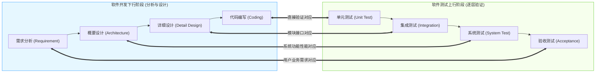
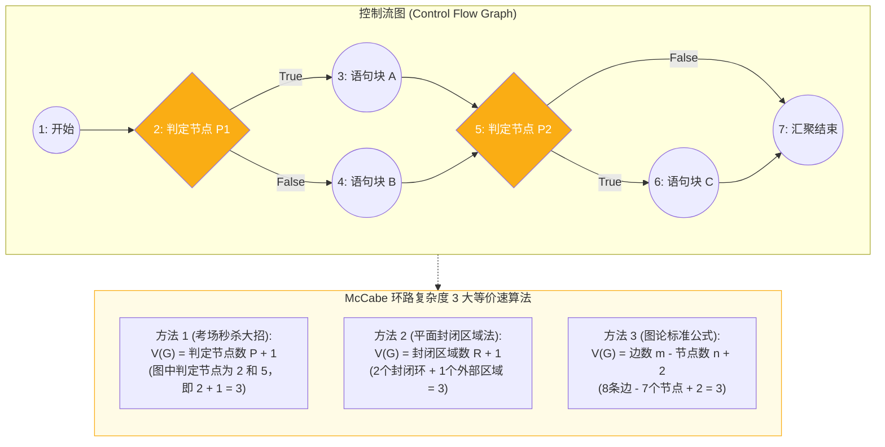
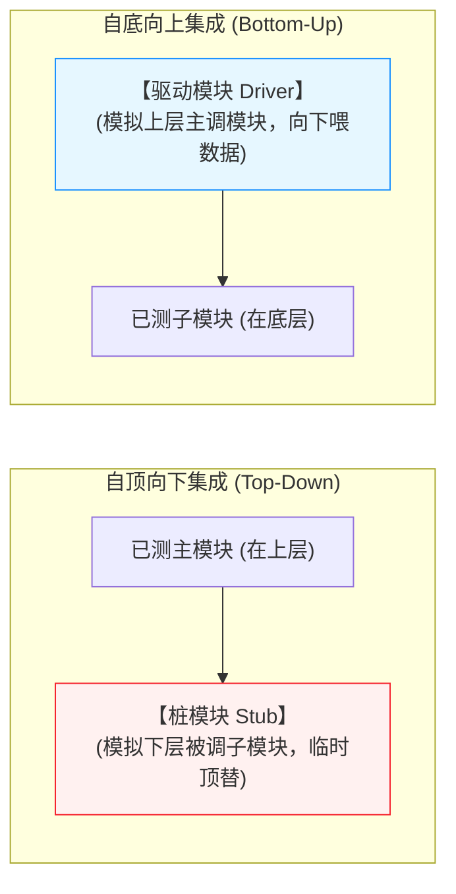

# 软件设计师通关速记文档：软件工程篇（39页完整全景版）

> **所属模块**：软考中级《软件设计师》—— 软件工程基础知识（文老师教育 39 页完整讲义地毯式提炼）  
> **提炼规范**：`ruankao-fast-pass` 体系化通关标准（从左到右思维导图 + 知识点零遗漏 + 80/20 剪枝）

---

## 维度 1：【分值画像与战略定级】

| 考核维度 | 分值权重 | 考点分布与题型特点 |
| :--- | :--- | :--- |
| **上午场（综合知识）** | **6 ~ 10 分** | **全卷软件工程方法论的母体总纲**（题号多在第 30~45 题）。题型极度丰富：**开发模型选型、敏捷开发（XP/Scrum）、CMMI 5级过程域、需求分类与QFD、需求获取技术（JRP/抽样）、需求分析三模型、流程设计工具（PAD/N-S）、BPR业务流程重组、白盒测试覆盖、McCabe环路计算、测试驱动/桩模块、4类软件维护、遗留系统处理四象限**。 |
| **下午场（应用技术）** | **全局方法论支撑** | 1. 结构化分析方法 $\longrightarrow$ 直接对应**试题一（数据流图 DFD，15分）**； 2. 面向对象方法 $\longrightarrow$ 直接对应**试题三（UML建模，15分）**与**试题五/六（设计模式代码，15分）**； 3. 白盒测试用例与路径覆盖偶在下午大题中直接考查。 |
| **性价比评星** | **★★★★★（五星必杀基石盘）** | **上午高分定海神针**。只要把本章 6 个维度的矩阵表与特征词混个眼熟，上午 8 分以上稳稳入账。 |

> **通关战略建议**：  
> 本章信息量虽然极大（39页PPT），但绝无复杂的底层算法编码。**全部考查“特征词匹配”与“标准分类归属”**。通过下述六大模块的矩阵表对比，快速建立条件反射。

---

## 维度 2：【知识脉络脑图与核心微观原理图解】

```mermaid
flowchart LR
    SE["软件工程全景总纲<br>(39页完整体系)"]

    %% 一级分支
    SE --> Cycle["① 生命周期与CMMI<br>(五阶段 / 5级成熟度)"]
    SE --> Method["② 开发方法大阵营<br>(结构化 / OO / 原型 / 敏捷 / RUP)"]
    SE --> Models["③ 过程模型全家福<br>(瀑布/螺旋/喷泉/CBSD)"]
    SE --> Require["④ 需求工程六阶段<br>(层次/获取/分析/跟踪)"]
    SE --> Design["⑤ 处理流程与系统设计<br>(PAD/NS盒图/BPR/界面)"]
    SE --> Test["⑥ 测试技术与系统维护<br>(黑白盒/McCabe/四类维护)"]

    %% 周期子项
    Cycle --> C1["五阶段: 规划(可行性) -> 分析(逻辑/做什么) -> 设计(物理/怎么做) -> 实施 -> 运维"]
    Cycle --> C2["CMMI 5级: 1初始(无序) -> 2已管理(项目级) -> 3已定义(组织标准) -> 4已量化 -> 5优化(持续改进)"]

    %% 开发方法子项
    Method --> M1["结构化 (SA/SD/SP): 面向数据流 / 自顶向下分解 / 阶段缝隙大 / 产物 DFD"]
    Method --> M2["面向对象 (OO): 面向实体 / 分析设计无缝平滑过渡 / 易复用 / 产物 UML"]
    Method --> M3["原型方法: 水平原型(界面导航) vs 垂直原型(功能切片) / 抛弃型 vs 演化型"]
    Method --> M4["敏捷开发体系: 极限编程 XP(12实践) / Scrum(30天Sprint) / 水晶 / FDD"]
    Method --> M5["统一过程 RUP: 用例驱动/架构中心 (初始->细化->构造->交付)"]

    %% 过程模型子项
    Models --> MD1["瀑布模型: 需求明确严格 / 线性顺序 / 晚期见产品"]
    Models --> MD2["V 模型: 测试阶段与开发阶段一一对称对照"]
    Models --> MD3["螺旋模型: 瀑布+原型 / 核心引入风险分析 / 大型高风险系统"]
    Models --> MD4["增量模型: 分批交付可用构件 / 优先级最高先交付"]
    Models --> MD5["喷泉模型: 面向对象 / 迭代无间隙 / 阶段界限模糊"]
    Models --> MD6["基于构件开发 (CBSD): 商业构件复用 / 降本提速"]

    %% 需求工程子项
    Require --> R1["需求层次: 业务需求(组织高层) -> 用户需求 -> 系统需求(功能/非功能/约束)"]
    Require --> R2["QFD 质量功能部署: 常规需求(基本) / 期望需求 / 意外兴奋需求"]
    Require --> R3["需求获取技术: 访谈 / 问卷 / 抽样(公式) / 联合需求计划 JRP / 用户故事 Volere"]
    Require --> R4["需求分析三模型: 功能(DFD) + 行为(STD状态图) + 数据(ER图) -> 核心数据字典 DD"]
    Require --> R5["需求跟踪: 正向跟踪(防需求遗漏) vs 反向跟踪(防多余镀金)"]

    %% 处理流程子项
    Design --> D1["流程工具: 程序流程图 PFD / IPO 图 / N-S 盒图(嵌套) / PAD 问题分析图"]
    Design --> D2["BPR 业务流程重组: 根本性再思考 / 彻底性再设计 / 以流程为中心"]
    Design --> D3["人机界面三大原则: 置于用户控制下 / 减少记忆负担 / 保持一致性"]

    %% 测试维护子项
    Test --> T1["白盒逻辑覆盖: 语句 < 判定 < 条件 < 判定条件 < 条件组合 < 路径覆盖"]
    Test --> T2["测试阶段与依据: 单元(详设) -> 集成(概设) -> 确认(SRS) -> 系统(合同)"]
    Test --> T3["集成测试桩与驱动: 自顶向下用桩模块 Stub / 自底向上用驱动模块 Driver"]
    Test --> T4["McCabe 度量: 环路复杂度 V(G) = 判定节点数 + 1"]
    Test --> T5["四类维护: 正确性(改Bug) / 适应性(换环境) / 完善性(新需求>50%) / 预防性"]
    Test --> T6["遗留系统四象限: 改造(双高) / 继承(低技高值) / 集成(高技低值) / 淘汰"]

    %% 样式美化
    style SE fill:#1890ff,stroke:#096dd9,stroke-width:2px,color:#fff
    style Cycle fill:#f0f5ff,stroke:#85a5ff
    style Method fill:#f6ffed,stroke:#73d13d,stroke-width:2px
    style Models fill:#fff7e6,stroke:#ffa940,stroke-width:2px
    style Require fill:#fcffe6,stroke:#d3f261,stroke-width:2px
    style Design fill:#fff0f6,stroke:#ffadd2
    style Test fill:#e6fffb,stroke:#87e8de,stroke-width:2px
```

---

### 2. 核心硬核考点专属微观机制图解（3 大底层机制图）

#### ① 软件测试 V 模型双向阶段对应关系拓扑图

#### ② 白盒测试控制流图（CFG）与 McCabe 环路复杂度速算图

#### ③ 集成测试策略对比：驱动模块（Driver）vs 桩模块（Stub）

---

## 维度 3：【六大模块核心辨析矩阵大表（全考点覆盖）】

### 模块一：开发方法大阵营终极对比（结构化 vs 面向对象 vs 原型 vs 敏捷）

| 开发方法 | 核心思想与指导原则 | 阶段过渡特征 | 典型产物 / 工具 | 适用场景 / 局限 |
| :--- | :--- | :--- | :--- | :--- |
| **结构化方法 (SA/SD/SP)** | **面向数据流**，自顶向下、逐步求精、模块独立 | **阶段间存在语义鸿沟（缝隙大）**，分析到设计需要生硬映射 | 数据流图 DFD、数据字典 DD、模块结构图 | 需求明确、数据密集型系统；不适于大型多变系统 |
| **面向对象方法 (OO)** | **面向实体/对象**，现实世界由对象与类继承构成 | **分析到设计各阶段界限模糊，平滑无缝过渡** | 用例模型、领域类、UML 图示体系 | 复杂大型系统，复用性极高；前期建模要求高 |
| **原型方法 (Prototyping)** | 快速构建简易系统模型，与用户频繁交互确认 | 循环迭代，需求逐步清晰 | **水平原型**（界面导航） **垂直原型**（部分核心功能实现） | **需求不明确、经常变动**的项目；分为抛弃型与演化型 |
| **敏捷开发 (Agile)** | 以人为核心、适应性驱动、轻量级、响应变化胜过计划 | 迭代增量开发，极短周期频繁交付可用版本 | 可工作的软件、自动化测试脚本、用户故事 | 需求极易变化的中小型项目；文档较少 |
| **统一过程 (RUP)** | **用例驱动、以架构为中心、迭代和增量** | 4 个阶段：初始、细化（核心架构）、构造、交付 | 架构基线、部署构件 | 大中型面向对象项目的标准化通用工程框架 |

---

### 模块二：敏捷开发全家福特性对比表

| 敏捷流派 | 核心机制与特征 | 关键实践 / 标志性术语（考题题眼） |
| :--- | :--- | :--- |
| **极限编程 (XP)** | 强调低开销、高质量、快速反馈，适应频繁变动的需求 | **4 大价值观**：沟通、简单、反馈、勇气。 **12 个最佳实践**：**结对编程**、**测试先行（TDD）**、持续集成、小型发布、代码集体所有制、每周 40 小时工作制。 |
| **并列争球法 (Scrum)** | 强调自组织团队、以增量迭代为核心敏捷框架 | **Sprint（30 天冲刺）**、每日站立会议（15分钟）、Product Backlog（产品待办清单）、Scrum Master（敏捷教练）。 |
| **自适应软件开发 (ASD)** | 核心是适应性而非预测性，拥抱不确定性 | 核心三阶段：**猜测（Speculate） $\to$ 协作（Collaborate） $\to$ 学习（Learn）**。 |
| **特性驱动开发 (FDD)** | 以功能特性的短周期迭代开发为驱动 | 建立整体模型、编制特性清单、按特性规划、按特性设计、按特性构建。 |
| **水晶方法 (Crystal)** | 认为不同规模和关键度的项目需要不同策略 | 提倡机动性与轻量化，以人为核心，注重政策和协议约定的调整。 |

---

### 模块三：软件过程模型选型指南

| 过程模型 | 核心驱动机制 | 典型适用场景（考题题眼） | 核心局限 / 缺陷 |
| :--- | :--- | :--- | :--- |
| **瀑布模型** | 严格的线性顺序阶段推进 | **需求明确、功能定义极其清晰、很少变更** | 无法响应需求变化，项目晚期才见产品 |
| **V 模型** | 将测试阶段与分析设计阶段**一一对称结合** | 需求明确、对系统质量与验收测试要求高 | 延承了瀑布模型的后延风险缺陷 |
| **螺旋模型** | 瀑布 + 原型结合，**专门引入“风险分析”** | **庞大、复杂、高风险**的大型关键系统 | 对风险评估专家依赖极大，成本较高 |
| **增量模型** | 先开发核心构件并交付，分批提供操作增量 | 市场急需快速上线，优先级最高的功能先交付 | 难以从整体上进行清晰的模块划分 |
| **喷泉模型** | 面向对象生命周期，**迭代性与无间隙性** | **面向对象（Object-Oriented）**系统开发 | 各开发阶段界限模糊，管理控制难度大 |
| **CBSD（构件开发）**| 利用预先包装好的标准化软件构件组装系统 | 具有成熟构件库的业务领域（**突出高复用性**） | 构件质量与第三方依赖风险 |

---

### 模块四：软件需求工程全生命周期大表

| 需求阶段 | 核心任务与核心方法 | 关键输出 / 考场题眼 |
| :--- | :--- | :--- |
| **1. 需求分类** | 划分需求层次与属性 | **业务需求**（组织高层宏观目标）、**用户需求**（用户的业务任务）、**系统需求**（功能需求、非功能需求、设计约束）。 |
| **QFD 质量功能部署** | 将用户要求转化为技术需求的技术 | **常规需求**（基本要求，有则满意无则不爽）、**期望需求**（明言的需求，满足越好）、**意外/兴奋需求**（超出预期，用户惊喜）。 |
| **2. 需求获取** | 发现、挖掘和收集干系人的需求 | **用户访谈**（最常用）、**问卷调查**（样本量大）、**抽样调查**（公式：$n = 0.25 \times (\text{可信度}/\text{错误率})^2$）、**联合需求计划（JRP）**（各方开会研讨）、**用户故事 / Volere 白卡**。 |
| **3. 需求分析** | 梳理杂乱需求，建立分析模型 | **结构化三模型**：功能模型（DFD）、行为模型（状态转换图 STD）、数据模型（E-R 图）；**三大模型的核心均为数据字典（DD）**！ |
| **4. 需求定义** | 将需求书面化、规范化固定下来 | 编制 **SRS（软件需求规格说明书）**。方法：严格定义法（假定全能预先定义） vs 原型方法。 |
| **5. 需求验证** | 确认需求真实反映了用户意图 | **需求评审**与**设计概念测试用例**。通过后正式批准为**【需求基线（Baseline）】**。 |
| **6. 需求管理** | 处理需求变更与跟踪 | **CCB 审批变更**；**双向需求跟踪矩阵**：**正向跟踪**（防遗漏需求），**反向跟踪**（防多余镀金功能）。 |

---

### 模块五：处理流程设计工具与 BPR 辨析大表

| 流程工具 / 技术 | 结构特征与表现形式 | 核心优点 | 考场辨析题眼 |
| :--- | :--- | :--- | :--- |
| **程序流程图 (PFD)** | 箭头连线连接方框与菱形判断框 | 直观清晰，易于掌握 | 箭头随意流动，容易破坏结构化程序结构 |
| **IPO 图** | 划分输入（Input）、处理（Process）、输出（Output） | 清晰展示模块内数据变换 | 用于描述单一模块的内部加工逻辑 |
| **N-S 盒图** | 矩形框内嵌套顺序、选择、循环三种基本结构 | **绝对无法随意跳转（天然结构化）** | 嵌套层次深时图形不易画出 |
| **问题分析图 (PAD)** | 二维树形树状结构，由左向右展开 | 结构清晰，引导编写高质量结构化代码 | 极易直接翻译成结构化程序代码 |
| **BPR 业务流程重组** | 对企业业务流程进行**根本性**反思和**彻底性**再设计 | 带来性能、成本、质量的**显著性**飞跃 | **以“流程”为中心**（而非以组织或部门为中心） |

---

### 模块六：白盒测试逻辑覆盖强度大天梯（由弱到强绝对顺序）

$$\text{语句覆盖} < \text{判定覆盖} < \text{条件覆盖} < \text{判定/条件覆盖} < \text{条件组合覆盖} < \text{路径覆盖}$$

| 覆盖级别 | 英文缩写 | 核心考核要求（测试用例必须做到） | 覆盖强度 |
| :---: | :---: | :--- | :---: |
| 1 | **语句覆盖 (SC)** | 程序中**每条可执行语句至少执行一次** | **最弱** |
| 2 | **判定覆盖 (DC)** | 每个判定表达式的**真值分支（Y）与假值分支（N）至少各经历一次** | 弱（又称分支覆盖） |
| 3 | **条件覆盖 (CC)** | 每个判定中的**每个独立子条件的真/假至少各测试一次** | 较弱 |
| 4 | **判定/条件覆盖 (CDC)**| 同时满足判定覆盖与条件覆盖（**每个判定真假各一次，每个子条件真假各一次**）| 中等 |
| 5 | **条件组合覆盖** | 每个判定中所有可能条件的**各种组合至少出现一次** | 强 |
| 6 | **路径覆盖** | 覆盖程序中**所有可能的线性可执行路径** | **最强（最高级别）** |

---

## 维度 4：【六大必背口诀与计算秒杀靶点】

### 1. McCabe 环路复杂度计算三套车（考场 5 秒秒杀！）
* **秒杀大招 1（直接数判定节点）**：
  $$V(G) = \text{判定节点数} + 1$$
  *（控制流图中数一共有几个产生分支的菱形/条件节点，**直接加 1 就是答案**！）*
* **秒杀大招 2（图论标准边点公式）**：
  $$V(G) = m - n + 2 \quad (m \text{ 为有向边数}, \; n \text{ 为节点总数})$$
* **秒杀大招 3（闭合平面数）**：
  $$V(G) = \text{闭合面数} + 1$$

---

### 2. 集成测试驱动模块 vs 桩模块口诀
* **驱动模块（Driver）**：用于模拟被测模块的**上级调用模块**（自底向上测试时需要）；
* **桩模块（Stub）**：用于模拟被测模块调用的**下级被调模块**（自顶向下测试时需要）。
> **口诀**：**“向上找驱动（上级开车 Driver），向下插木桩（下级假根 Stub）！”**  
> *（自底向上需驱动模块，自顶向下需桩模块）*

---

### 3. 软件维护四类型判别口诀
> **“改 Bug 叫正确，换环境叫适应；用户加功能叫完善（超五成），预备未来防患叫预防！”**  
* 完善性维护工作量**占比超过 50%（历史之最）**，考题问工作量最大必选完善性维护。

---

### 4. 遗留系统处理四象限口诀
* 高技术水平 + 高业务价值 $\implies$ **改造**
* 高技术水平 + 低业务价值 $\implies$ **集成**
* 低技术水平 + 高业务价值 $\implies$ **继承（小心维护）**
* 低技术水平 + 低业务价值 $\implies$ **淘汰（彻底报废）**

---

## 维度 5：【机考防冷箭盲盒与即时测验】

### 1. 🛡️ 机考防冷箭盲盒清单（Edge Cases，只记中文混眼熟）
* **逆向工程 4 级抽象层次**：
  * **实现级**（最低抽象/完备性最高）：抽象语法树、符号表；
  * **结构级**：反映模块调用关系、程序结构图；
  * **功能级**：反映程序段功能、数据流图 DFD；
  * **领域级**（最高抽象/完备性最低）：E-R 模型、领域实体业务概念。
* **重构 vs 再工程**：
  * **重构（Restructuring）**：在**同一抽象级别**上改善内部结构（不改外部行为）；
  * **再工程（Re-engineering）**：包含逆向工程、重构和正向工程的完整大循环。
* **软件产品线建立方式**：
  * 基于现有产品架构演化方式（低风险逐步演进）；
  * 全新产品线革命方式（直接开发全新核心资源库）。
* **人机界面设计三大黄金原则**：
  1. 置于用户控制之下；2. 减少用户的记忆负担；3. 保持界面的一致性。

---

### 2. 📇 Anki 闪卡库（可直接复制导入）

| 正面（Front: 核心考点提问） | 反面（Back: 核心答案与记忆桩） | 标签（Tags） |
| :--- | :--- | :--- |
| 结构化开发方法与面向对象开发方法在阶段过渡上的最大差异是什么？ | 结构化开发**阶段间存在语义鸿沟/缝隙大**； 面向对象方法**从分析到设计界限模糊，平滑无缝过渡**。 | 软考::软件设计师::软件工程 |
| 引入了专门的“风险分析”环节、适合大型高风险项目的过程模型是？ | **螺旋模型（Spiral Model）**。 | 软考::软件设计师::软件工程 |
| 极限编程（XP）的 4 大核心价值观是什么？ | **沟通、简单、反馈、勇气**。 | 软考::软件设计师::软件工程 |
| 软件需求工程中，通过正向需求跟踪和反向需求跟踪分别能发现什么问题？ | **正向跟踪发现【需求遗漏】**； **反向跟踪发现【多余镀金功能】**。 | 软考::软件设计师::软件工程 |
| 某程序控制流图中共有 5 个判定节点（条件分支），其 McCabe 环路复杂度是多少？ | **6**。 （秒杀公式：$V(G) = \text{判定节点数} + 1 = 5 + 1 = 6$） | 软考::软件设计师::软件工程 |
| 单元测试、集成测试、确认测试的核心测试依据分别是什么？ | 单元测试：**详细设计说明书**； 集成测试：**概要设计说明书**； 确认测试：**软件需求规格说明书（SRS）**。 | 软考::软件设计师::软件工程 |
| 自顶向下集成测试策略中，用来模拟被测模块下级子模块的代码被称为？ | **桩模块（Stub）**。 （自底向上测试模拟上级调用才用驱动模块 Driver） | 软考::软件设计师::软件工程 |
| 软件维护活动中，在所有维护类别中工作量占比最高（超50%）的是哪一种？ | **完善性维护**（为了满足用户新提出的功能扩展或性能优化要求）。 | 软考::软件设计师::软件工程 |
| 业务流程重组（BPR）的核心指导思想是以什么为中心进行根本性再设计？ | **以“流程”为中心**（彻底破除传统部门壁垒）。 | 软考::软件设计师::软件工程 |

---

### 3. 🎯 现场即时随堂互动测验（检验吸收闭环）

请你在考场思维下，直接秒答这道覆盖本章高频陷阱的经典真题：

> **【随堂测验】**  
> 某软件在交付运行半年后，因用户所在行业的增值税税率进行了国家法定下调，项目组对计税模块的代码进行了修改与重新部署；同时，为了响应财务部门的新要求，项目组顺便为该系统增加了一个“支持导出带电子印章PDF发票”的新功能。  
> 问：上述两次维护活动分别属于（ ）。  
> A. 正确性维护、完善性维护 &emsp;&emsp; B. 适应性维护、完善性维护  
> C. 适应性维护、预防性维护 &emsp;&emsp; D. 正确性维护、适应性维护  
>
> 💡 **请直接在对话框回复你的选项：`A`、`B`、`C` 或 `D`！**
