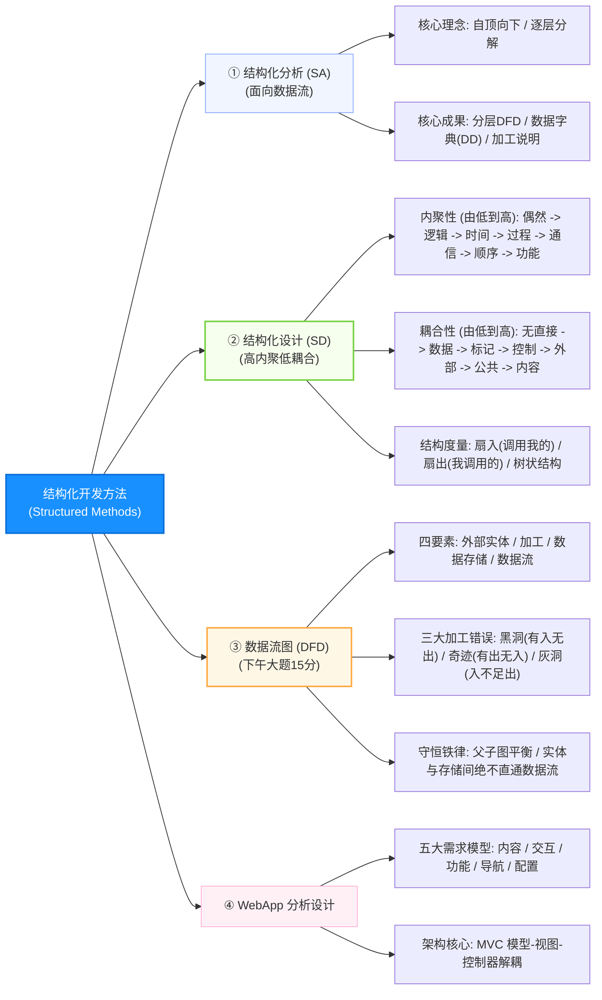
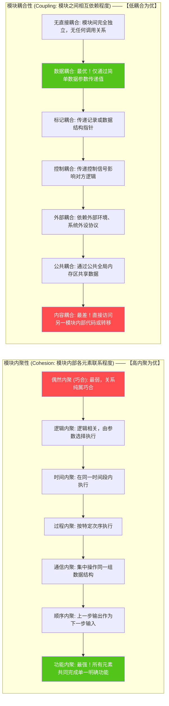
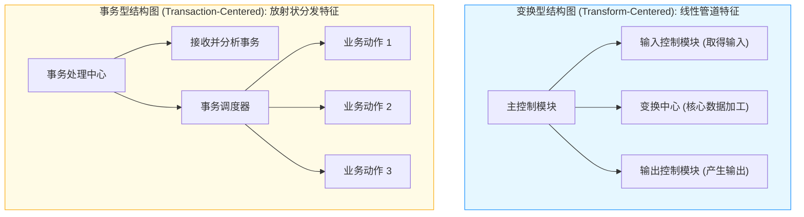

# 软件设计师通关速记文档：结构化开发与数据流图篇

> **所属模块**：软考中级《软件设计师》—— 结构化分析与设计（文老师教育讲义核心提炼）  
> **提炼规范**：`ruankao-fast-pass` 体系化通关标准（从左到右思维导图 + 80/20 剪枝 + 下午试题一 15 分必杀技）

---

## 维度 1：【分值画像与战略定级】

| 考核维度 | 分值权重 | 考点分布与题型特点 |
| :--- | :--- | :--- |
| **上午场（综合知识）** | **2 ~ 4 分** | 通常位于第 32~36 题。考查：**内聚性 7 级排序、耦合性 7 级排序、模块结构度量（扇入/扇出）、DFD 语法错误判断、数据字典符号**。 |
| **下午场（应用技术）** | **整整 15 分（试题一）** | **下午卷的“第一送分门神”！** 题型高度模式化： 1. 补充外部实体（3~4分）； 2. 补充数据存储（3~4分）； 3. 找缺失的数据流并写出起点和终点（4~6分）； 4. DFD 规范性原则问答（2~3分）。 |
| **性价比评星** | **★★★★★（五星核武级：保底 17~19 分大户！）** | 下午试题一 15 分必须以 **13~15 分为目标（全卷最易拿满分大题）**！只要掌握“父子图平衡检查法”和“加工黑洞/奇迹识别”，零基础也能轻松拿满。 |

> **通关战略建议**：  
> 下午第一题是整场考试信心的基石！做题时拿着笔采用**“找主谓宾双向消消乐”**比对题干与图面。上午题死磕“内聚/耦合两张大表”，直接秒杀。

---

## 维度 2：【知识脉络脑图、核心微观原理图解与辨析矩阵】

### 1. 本章知识脉络全景 Mermaid 脑图（从左至右思维导图）

---

### 2. 核心硬核考点专属微观机制图解（2 大底层机制图）

#### ① 模块独立性：内聚与耦合 7 级强度阶梯图

#### ② 结构化设计：变换型分析 vs 事务型分析结构图 (SC) 映射拓扑

---

### 3. 核心辨析矩阵（上午单选必考两张大表）

#### 矩阵 1：模块内聚性大辨析（由低到高 7 个级别，内聚越高越好）

| 内聚级别 | 内聚类型 | 本质特征 | 考题辨析题眼 / 实例 | 级别评价 |
| :---: | :--- | :--- | :--- | :---: |
| 1 | **偶然内聚（巧合）** | 模块内各元素毫无联系，偶然拼凑在一起 | 几个不相干的函数被随手塞进一个工具文件 | 最差 |
| 2 | **逻辑内聚** | 逻辑上相关，由**传入的开关参数**决定执行哪一个功能 | 传入 `type=1` 打印，传入 `type=2` 存盘 | 较差 |
| 3 | **时间内聚** | 必须在**同一时间内执行**的操作组合在一起 | 系统初始化模块、系统关闭前清理模块 | 中下 |
| 4 | **过程内聚** | 必须按照**特定的过程次序**执行一系列任务 | 先读输入，再做校验，再记录日志（指定顺序） | 中等 |
| 5 | **通信内聚** | 各处理元素**集中操作在同一个数据结构**上 | 都针对“学生成绩表”进行统计和生成报表 | 较好 |
| 6 | **顺序内聚** | 一个处理元素的**输出，必须是下一个处理元素的输入** | 先根据公式算得分数（输出），紧接着拿该分数定等级 | 很好 |
| 7 | **功能内聚** | 模块内所有元素**只共同完成一个单一、确定的功能** | 求圆的面积、矩阵乘法算法（单一功能，缺一不可） | **最佳** |

---

#### 矩阵 2：模块耦合性大辨析（由低到高 7 个级别，耦合越低越好）

| 耦合级别 | 耦合类型 | 传递内容与关联方式 | 考题辨析题眼 / 实例 | 级别评价 |
| :---: | :--- | :--- | :--- | :---: |
| 1 | **无直接耦合** | 两个模块彼此之间无任何直接调用或联系 | 完全独立的两个模块 | **最佳** |
| 2 | **数据耦合** | 仅通过参数传递**简单的数值型变量（值传递）** | `calculate(int x, int y)` 传数值计算 | **最好（实践推荐）** |
| 3 | **标记耦合** | 传递的是**复合数据结构 / 记录指针** | 传递一整个 `Student` 结构体或数组指针 | 较好 |
| 4 | **控制耦合** | 传递的是**控制变量**（由调用方决定被调用方的执行分支） | 传递标志位 `flag = true` 控制走哪个分支 | 中下 |
| 5 | **外部耦合** | 模块均依赖于**相同的软件外部环境（如特定 I/O 设备协议）** | 两个模块都基于特定的串口协议通讯 | 差 |
| 6 | **公共耦合** | 通过**公共数据区 / 全局变量**相互作用 | 模块 A、B 共同读写同一个全局共享变量 | 很差 |
| 7 | **内容耦合** | 一个模块**直接访问另一个模块的内部代码或内部私有数据** | 通过非正常入口直接 `goto` 跳转进入对方内部 | **最差（坚决杜绝）** |

---

## 维度 3：【下午试题一（15分）四大题型机械化秒杀靶点】

试题一题干通常长达 1 页，包含项目背景说明、顶层数据流图（Context 图）和 0 层数据流图。解题核心是：**“图文映射消消乐”**！

### 靶点 1：补充外部实体（E1, E2...）—— 找主谓语
* **实体本质**：系统边界之外的**人、外部部门、外部硬件设备、第三方软件系统**。
* **解法**：
  1. 题干中寻找：*“【XXX】向系统提交【申请表】”*、*“系统将【结果单】发送给【YYY】”*；
  2. 观察顶层图：哪个圆圈外面连着箭头进出？对比图上的空方框，把对应的名字填入。

### 靶点 2：补充数据存储（D1, D2...）—— 找名词表/台账
* **存储本质**：系统内部保存数据的**文件、数据库表、台账、记录清单**。
* **解法**：
  1. 题干中寻找：*“将信息保存在【XXX表】”*、*“查询【YYY台账】”*、*“生成【ZZZ文件】”*；
  2. 数据存储一般用平行双线表示，箭头**指向存储表示写入/更新**，箭头**从存储指出来表示查询/读取**。

### 靶点 3：补齐缺失的数据流（核心拉分题，通常 2~3 条，4~6分）
* **三大检查铁律（必能查出漏掉的流）**：
  1. **父子图平衡铁律**：顶层图中进入系统的流和流出系统的流，在 0 层图中**必须一模一样、完整对应**！若顶层图有“缴费单”进系统，0 层图里找不到，必然漏了！
  2. **加工有进必有出铁律**：检查 0 层图里的每一个圆形/圆角加工方框：
     * **绝不能只有输入没有输出（黑洞）**！
     * **绝不能只有输出没有输入（奇迹）**！
     * **绝不能输入的数据根本无法加工出该输出（灰洞）**！
  3. **实体与存储隔离铁律（考场画线红线）**：
     * **外部实体与外部实体之间，绝对不能直接画数据流连线！**
     * **数据存储与数据存储之间，绝对不能直接画数据流连线！**
     * **外部实体与数据存储之间，也绝对不能直接画连线！**  
     * （所有数据流动必须经过**加工**进行中转变换！）

### 靶点 4：数据字典（DD）符号定义（上午单选题常考）
* `=`：被定义为；
* `+`：与 / 连接（如 $x = a + b$ 表示由 $a$ 和 $b$ 组成）；
* `[...]`：或 / 选一（如 $[a | b]$ 表示选 $a$ 或选 $b$）；
* `{...}`：重复（如 $\{a\}$ 表示 $a$ 出现 0 次或多次）；
* `(...)`：可选（表示该字段可有可无）。

---

## 维度 4：【极速小抄与记忆桩（Memory Pegs）】

### 1. 通关押韵口诀（考场条件反射）

> **【内聚口诀（由低到高）】**  
> **“偶然逻辑时间过，通信顺序功能好；单一功能最优秀，高内聚来没得跑！”**  

> **【耦合口诀（由低到高）】**  
> **“无直接来数据好，标记结构控制跑；公共全局内容糟，低耦合是最高招！”**  

> **【DFD 做题口诀】**  
> **“父子平衡查出入，黑洞奇迹抓漏洞；实体存储不连线，中转必须靠加工！”**  

---

### 2. 考前避坑 3 戒律
1. **标记耦合传递的是数据结构**：如果函数参数传递的是简单基础变量（如 `int a`），属于**数据耦合**；如果传递的是结构体、数组名、指针等复合结构（如 `struct Node`），属于**标记耦合**！
2. **加工必须有动词**：下午题补写加工名称时，必须采用“动词+宾语”格式（如“审核申请”、“计算总分”），绝不能写成纯名词！
3. **扇入与扇出的物理含义**：**扇入（Fan-in）** 指有多少个上级模块调用我（高扇入代表模块复用性好）；**扇出（Fan-out）** 指我直接调用了多少个下级模块（过大说明模块控制太复杂）。

---

## 维度 5：【机考防冷箭盲盒与即时测验】

### 1. 🛡️ 机考防冷箭盲盒清单（Edge Cases，只记中文混眼熟）
* **WebApp 五大需求模型**：
  * **内容模型**：结构元素，展示文本、图形、多媒体；
  * **交互模型**：用例图、时序图、界面原型；
  * **功能模型**：计算和操作功能说明；
  * **导航模型**：用户如何从一个页面导航到另一个页面；
  * **配置模型**：运行的环境与底层基础设施。
* **IPO 图（Input-Process-Output）**：输入、处理、输出图，用于描述一个模块内部的具体加工逻辑算法。
* **变换型数据流 vs 事务型数据流**：变换型呈线性（输入 $\to$ 变换中心 $\to$ 输出）；事务型根据输入的不同事务类型触发多个平行分支动作。

---

### 2. 📇 Anki 闪卡库（可直接复制导入）

| 正面（Front: 核心考点提问） | 反面（Back: 核心答案与记忆桩） | 标签（Tags） |
| :--- | :--- | :--- |
| 模块内各处理元素执行同一个单一明确的功能，属于什么内聚？ | **功能内聚**（内聚程度最高、最理想的内聚）。 | 软考::软件设计师::结构化开发 |
| 模块 A 调用模块 B 时，传递的参数是一个学生记录结构体，属于什么耦合？ | **标记耦合**（传递复合数据结构而非单值）。 | 软考::软件设计师::结构化开发 |
| 数据流图中，某个加工只有输入流而没有任何输出流，这种错误被称为？ | **黑洞（Black Hole）**。 | 软考::软件设计师::结构化开发 |
| 在分层 DFD 中，父图与子图之间必须保持什么一致性原则？ | **平衡原则**（父图中某加工的输入/输出流必须与对应子图的输入/输出流完全一致）。 | 软考::软件设计师::结构化开发 |
| 数据流图中，外部实体与数据存储之间是否可以直接连线传递数据流？ | **绝对不能**！数据存储与实体之间必须通过**加工**进行中转。 | 软考::软件设计师::结构化开发 |
| 一个模块直接访问另一个模块的内部私有数据或内部代码跳转，属于什么耦合？ | **内容耦合**（耦合程度最高、最糟糕的耦合）。 | 软考::软件设计师::结构化开发 |
| 数据字典中，符号 `[...]` 和 `{...}` 分别代表什么逻辑含义？ | **`[...]` 代表【或/二选一】**； **`{...}` 代表【重复/循环】**。 | 软考::软件设计师::结构化开发 |
| 模块结构图中，指“直接调用该模块的上级模块个数”的指标被称为？ | **扇入（Fan-in）**（扇入高代表模块复用性好）。 | 软考::软件设计师::结构化开发 |

---

### 3. 🎯 现场即时随堂互动测验（检验吸收闭环）

请你在考场思维下，直接秒答这道经典高频真题：

> **【随堂测验】**  
> 某软件模块内的各个处理元素都密切相关于同一个功能，并且必须按照严格的先后次序执行，前一个处理元素的输出正是下一个处理元素的输入。该模块的内聚类型属于（ ）。  
> A. 过程内聚 &emsp;&emsp; B. 顺序内聚 &emsp;&emsp; C. 通信内聚 &emsp;&emsp; D. 功能内聚  
>
> 💡 **请直接在对话框回复你的选项：`A`、`B`、`C` 或 `D`！**
