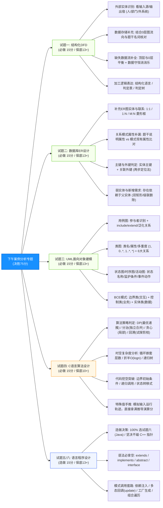
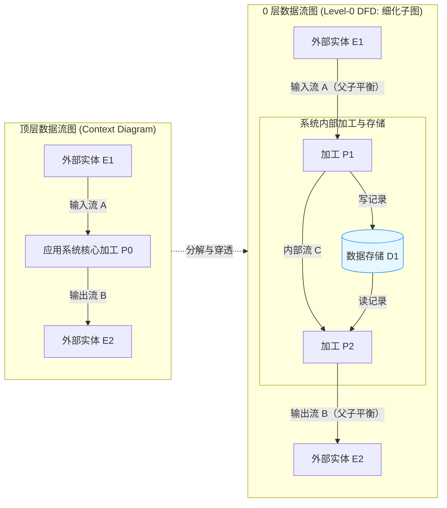
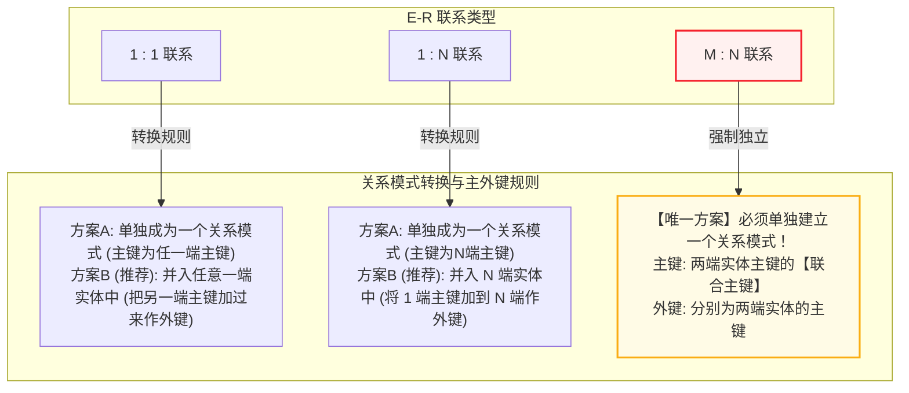
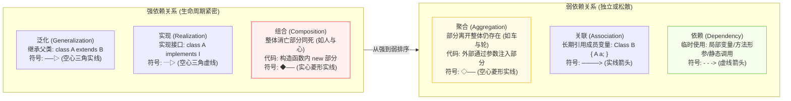
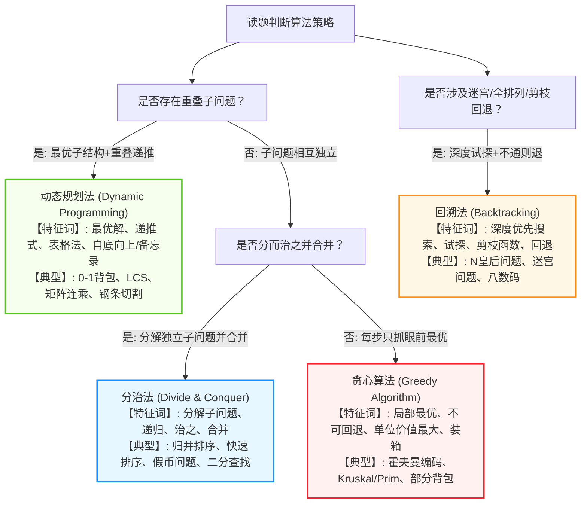

# 软件设计师通关速记文档：下午案例分析专题篇

> **所属模块**：软考中级《软件设计师》—— 科目二：软件设计与应用技术（文老师教育第 15 章 51 页完整讲义提炼）  
> **提炼规范**：`ruankao-fast-pass` v1.3 体系化标准（双层视觉图解系统：全景战术导图 + 4 大核心微观机制图解 + 挖空靶点模板 + Anki 闪卡库）  
> **核心地位**：**决定能否拿证的“生死决战盘”！** 满分 75 分，必须与上午题同时冲过 45 分及格红线。

---

## 维度 1：【分值画像与战略定级】

* **考核形式**：5 道综合问答与设计大题（前 4 题必做，第 5/6 题二选一，每题 15 分，满分 75 分）。
* **考试时间**：机考合并 240 分钟，**建议为下午卷预留 130 ~ 140 分钟**（平均每题 25~28 分钟）。
* **性价比评星**：★★★★★（**最高战略优先级，一票否决权**；上午考 70 分下午 44 分同样全盘作废）。
* **通关作战战术定位**：
  * **三大送分铁三角（试题一 DFD + 试题二 数据库 + 试题三 UML）**：题型固定死板，解题完全依赖“材料与图的消消乐比对”，**保底目标 38 ~ 42 分**！
  * **面向对象编程盘（试题六 Java 二选一）**：强烈放弃 C++ 指针深渊，专攻 Java！考点只有“面向对象语法填空 + 23 种设计模式套路调用”，**保底目标 12 ~ 14 分**！
  * **算法分析攻坚盘（试题四）**：代码写不出绝不死磕，保底拿满“算法策略判断（2分） + 复杂度分析（2分） + 特值/输出推导（3~4分）”，**保底目标 9 ~ 11 分**！
  * **全卷总分目标**：$40 + 13 + 10 = 63$ 分，轻松甩开 45 分合格线！

---

## 维度 2：【知识脉络脑图、核心微观原理图解与辨析矩阵】

### 1. 全景作战脉络图（从左至右思维导图）



---

### 2. 核心硬核考点专属微观机制图解（4 大大题底层机制图解）

#### 2.1 试题一 DFD：顶层图与 0 层图平衡穿透机制拓扑图

> **【机制造型法则】**：
> 1. **父子平衡**：顶层图有输入流 A、输出流 B，则 0 层图中对外部实体必须严格保留输入流 A 和输出流 B，不得平白无故增减。
> 2. **数据守恒（防黑洞/灰洞/奇迹）**：加工必须“有进有出”，加工输出数据项必须能由输入数据项直接提供或计算得出。
> 3. **非法直连红线**：外部实体与外部实体之间、数据存储与数据存储之间、外部实体与数据存储之间**严禁直接连线**，必须经过加工！

---

#### 2.2 试题二 数据库：E-R 实体联系转关系模式映射机制图


---

#### 2.3 试题三 UML：类间 6 大关系符号与代码映射机制图


---

#### 2.4 试题四 算法：四大家族特征判定决策树


---

### 3. 下午 5 道大题核心辨析与考场打分矩阵

| 试题序号 | 核心考查模型 | 命题人固定套路 | 考场快速破局技法（秒杀大招） | 保底与冲刺目标 |
| :--- | :--- | :--- | :--- | :--- |
| **试题一** | **结构化 DFD** | 1. 外部实体补齐<br>2. 数据存储补齐<br>3. 缺失数据流补全<br>4. 加工逻辑/改错 | **材料消消乐法**：题干说明中的名词对应实体/存储；画缺失数据流严格核对父子图平衡与加工数据守恒。 | **保底 13 分**<br>（冲刺 15 满分） |
| **试题二** | **数据库设计** | 1. 补全 E-R 联系及类型<br>2. 关系模式主外键补缺<br>3. 增加需求（弱实体/新联系） | **两步比对法**：先拿题干说明中的属性划掉关系模式中已有的，剩下的按 1:N 或 M:N 规则归入对应关系模式。 | **保底 13 分**<br>（冲刺 15 满分） |
| **试题三** | **UML 建模** | 1. 用例/参与者填空<br>2. 类图/多重度填空<br>3. 状态图/BCE 模式划分 | **特征词锚定法**：`extends` 找泛化，`include` 找公共必做，多重度盯紧 `1..*` 还是 `0..*`，状态图抓事件与动作。 | **保底 12 分**<br>（冲刺 14 分） |
| **试题四** | **C 语言算法** | 1. 代码挖空填核心逻辑<br>2. 算法策略与性质辨析<br>3. 时间/空间复杂度计算<br>4. 特殊输入手算推导 | **外围包抄保底法**：先拿策略题（2分）与复杂度题（2~3分），再代入特值手算推导题（3~4分），代码挖空先抓边界 `i==0`。 | **保底 9 分**<br>（冲刺 12 分） |
| **试题六** | **Java 面向对象** | 1. 类/接口声明与继承实现<br>2. 23 种设计模式对象创建<br>3. 多态方法调用与参数传递 | **语法骨架+模式填空法**：看类图连线找类名，看接口方法名找调用，牢记 `new`、`extends`、`implements`、`this`。 | **保底 13 分**<br>（冲刺 15 满分） |

---

## 维度 3：【下午 5 道大题必考公式、解题模板与挖空靶点】

### 1. 试题一（DFD 数据流图）命题靶点与解题模板

#### 1.1 数据字典 6 大符号定义（上午常考，下午备用）
* `=`：被定义为
* `+`：与（顺序连接，如 `x = a + b`）
* `[ | ]`：或（选择，如 `x = [a | b]`）
* `{ }`：重复（0次或多次，如 `x = {a}`，上标下界 `m{a}n`）
* `( )`：可选（可有可无，如 `x = (a)`）
* `..`：连接符（数值范围，如 `1..9`）

#### 1.2 常见 3 大加工错误（简答题必背靶点）
1. **黑洞（Black Hole）**：加工只有输入数据流，没有任何输出数据流。
2. **奇迹 / 白洞（Miracle / White Hole）**：加工没有任何输入数据流，凭空产生输出数据流。
3. **灰洞（Gray Hole）**：加工的输入数据流不足以产生其输出数据流（输入与输出缺少必要联系）。

#### 1.3 缺失数据流书写标准答题模板
* **答题格式规范**：必须写明 **数据流名称**、**起点**、**终点**（三者缺一不可）。
  * 示例：`起点：P4（交易管理），终点：E2（经纪人），数据流名称：交易反馈`。
  * 命名技巧：若题干没有明文给出名称，可参考加工与数据存储的名称，组合为“XX信息”、“XX记录”。

---

### 2. 试题二（数据库设计）两步定位法与答题模板

#### 2.1 关系模式补漏“两步定位法”
* **第 1 步（挖出遗漏属性）**：阅读题干的需求描述段落，将题干中提到的所有实体属性逐一比对关系模式。若题干有 `身份证号`、`手机号`、`地址`，而关系模式括号里漏了，立即抄入。
* **第 2 步（注入联系外键）**：
  * **1 : 1 联系**：若两实体必须关联，将任意一方的主键填入另一方作为**外键**；
  * **1 : N 联系**：**必须将 1 端实体的主键，添加到 N 端实体的关系模式中作为外键**！
  * **M : N 联系**：单独生成联系关系模式，**联合主键为两个实体的主键组合**。

#### 2.2 主键与外键规范表达模板
* **主键**：能唯一标识当前元组的最小属性组（如：`项目编号` 或 `(工号, 项目编号)`）。
* **外键**：本关系模式中引用自其他关系模式主键的属性（如：`员工编号 参照 员工(工号)`）。

---

### 3. 试题三（UML 建模）核心挖空靶点与 BCE 分类法

#### 3.1 BCE 三层类划分标准（下午题最爱考分类）
* **接口类 / 边界类（Boundary / Interface）**：负责系统与外部角色（用户/外部系统）的交互。
  * 命名特征：包含 `Form`、`Page`、`Window`、`UI`、`Dialog`、`Menu`，如 `OrderForm`、`PaymentUI`。
* **控制类（Control）**：负责业务逻辑的流转、协调和计算，充当用例处理的核心纽带。
  * 命名特征：包含 `Controller`、`Manager`、`Handler`、`Process`，如 `OrderController`、`PaymentManager`。
* **实体类（Entity）**：负责存储系统持久化业务数据（往往对应数据库表）。
  * 命名特征：具体业务名词，如 `Member`、`Order`、`Product`、`Invoice`。

#### 3.2 状态图答题模板
* 状态图转换三要素：`事件 [监护条件] / 动作`。
  * 触发事件（Trigger）：引起状态改变的外界动作（如 `turnOn`、`点击支付`）；
  * 监护条件（Guard）：布尔表达式，满足才流转（如 `[有水]`、`[支付超时30分钟]`）；
  * 动作（Action）：流转瞬间执行的简短操作（如 `/烧水`、`/自动取消订单`）。

---

### 4. 试题四（算法设计与分析）通关保底三板斧

#### 4.1 时间复杂度肉眼秒判公式
* 单层单步循环：`for(i=0; i<n; i++)` $\to O(n)$
* 双层嵌套循环：`for(i...) for(j...)` $\to O(n^2)$
* 三层嵌套循环：动态规划三重循环 $\to O(n^3)$
* 步长倍增/折半：`i = i * 2` 或 `j = j / 2` $\to O(\log n)$
* 分治折半合并：归并/快排/主定理第一类 $\to O(n \log n)$

#### 4.2 动态规划（DP）伪代码 3 大固定挖空点
1. **边界初始条件（Base Case）**：`c[0][j] = 0` 或 `c[i][0] = 0`。
2. **状态转移判定分支**：判断当前背包容量能否装下物品：`if (j >= w[i])`。
3. **转移方程计算空**：
   $$\text{c}[i][j] = \max(\text{c}[i-1][j], \text{c}[i-1][j-w[i]] + v[i])$$

#### 4.3 特殊值代入推导法（送分小题必杀技）
* 题干往往会给出一组小规模测试数据（如 $n=4, T=11, v=[0,1,6,18,22,28], w=[0,1,2,5,6,7]$）。
* **不要管复杂代码逻辑**，在草稿纸上直接用纯数学手工推导（如 $18+22=40$），即可稳稳拿到这 3~4 分！

---

### 5. 试题六（Java 语言程序设计）代码填空 5 大金刚

#### 5.1 语法填空通配公式
1. **接口定义**：`interface Observer`
2. **抽象类定义**：`abstract class PizzaBuilder`
3. **抽象方法**：`public abstract void buildParts();`（注意**末尾必带分号 `;`**，无方法体！）
4. **类继承父类**：`class SubClass extends SuperClass`
5. **类实现接口**：`class SubClass implements InterfaceA, InterfaceB`
6. **泛型容器**：`List<Observer> observers = new ArrayList<Observer>();`
7. **持有自身/当前引用**：`this.builder = builder;` 或 `subject.attach(this);`

#### 5.2 典型设计模式调用模板（观察者模式为例）
```java
// 1. 观察者接口
interface Observer {
    public void update(); // 靶点 1：方法声明
}

// 2. 目标对象通知所有观察者
class Subject {
    private List<Observer> observers = new ArrayList<Observer>(); // 靶点 2：泛型
    public void notifyObservers() {
        for (Observer obs : observers) {
            obs.update(); // 靶点 3：循环遍历触发多态更新
        }
    }
}

// 3. 观察者注册到目标
class ConcreteObserver implements Observer {
    public ConcreteObserver(Subject sub) {
        sub.attach(this); // 靶点 4：将自身 this 注册进去
    }
}
```

---

## 维度 4：【极速小抄与考场保命口诀（Memory Pegs）】

### 1. 5 句通关押韵必背口诀
* **试题一 DFD**：
  > 实体存储看说明，父子平衡消消乐；黑洞奇迹和灰洞，必经加工不单联。
* **试题二 数据库**：
  > 一对一加任一边，一对多在多端填；多对多必立新表，两端主键凑联合。
* **试题三 UML**：
  > 泛化空心实线延，实心菱形生死连；空心菱形聚合见，BCE层类好辨。
* **试题四 算法**：
  > 状态重叠走动规，独立分治递归追；眼前最优贪心定，走投无路回溯退。
* **试题六 Java**：
  > 接口声明用分号，单继承来多实现；设计模式顺瓜摸，this指针把身联。

---

### 2. 考场避坑 3 戒律（Blood Lessons）
1. **输入法半角戒律（机器判卷死穴）**：
   * 在代码填空和标点输入时，**必须切换为纯英文半角输入法**！全角的分号 `；`、括号 `（）`、引号 `“”` 会被机器判定为乱码直接判 0 分！
2. **选做题标记戒律（一票否决死穴）**：
   * 机考系统在试题五（C++）和试题六（Java）处必须点击选做确认，**只选试题六（Java）**，千万不要两题都做，更不要在 C++ 答题区域写 Java 代码！
3. **算法题时间止损戒律**：
   * 试题四如果代码挖空看不懂，**最多停留 15 分钟**！把策略名称（2分）、复杂度（2分）、特值算结果（3分）写上后立刻撤退，把时间留给送分铁三角与 Java 题检查，确保 40+13 拿满！

---

## 维度 5：【机考防冷箭盲盒与即时测验】

### 1. 🛡️ 机考防冷箭盲盒清单（Edge Cases）
* **DFD 加工编号层级规范**：顶层图加工为 $0$；0 层图加工为 $1, 2, 3, \dots$；1 层图对加工 1 细化，编号为 $1.1, 1.2, 1.3, \dots$。
* **弱实体（Weak Entity）表示法**：在 E-R 图中用**双线矩形**表示，与弱实体的联系用**双线菱形**表示。若父实体被删除，弱实体必须级联删除（Cascade Delete）。
* **UML 通信图（协作图）数字序号规则**：消息前面带数字表示调用次序，如 `1: create()`、`2.1: setValues()`（小数表示嵌套或并发分支消息）。
* **Java `abstract` 语法细节**：抽象类中**可以没有**抽象方法；但只要有一个抽象方法，该类**必须声明为 `abstract`**；抽象方法绝对不能有 `{}` 大括号主体！

---

### 2. 📇 Anki 闪卡库（可直接复制导入）

| 正面（Front: 考点提问） | 反面（Back: 核心答案与速记桩） | 标签（Tags） |
| :--- | :--- | :--- |
| DFD 数据流图中，什么是加工的“黑洞”、“白洞/奇迹”和“灰洞”？ | **黑洞**：只有入没有出。<br>**白洞/奇迹**：只有出没有入。<br>**灰洞**：输入数据不足以产生输出数据。 | 软考::软件设计师::案例分析 |
| 实体联系图（E-R）中，M:N（多对多）联系转换为关系模式的规则是什么？ | **必须单独建立一个关系模式**！<br>主键为两端实体主键构成的**联合主键**，且两端主键分别作为外键。 | 软考::软件设计师::案例分析 |
| E-R 图中，1:N（一对多）联系转换为关系模式的最佳规则是什么？ | 将联系并入 **N 端（多端）实体**对应的关系模式中，即将 **1 端实体的主键加入 N 端作为外键**。 | 软考::软件设计师::案例分析 |
| 面向对象分析中，BCE 架构模式的三类对象分别是什么？各自职责是什么？ | **边界类（Boundary）**：负责系统与外部交互（UI/窗口）。<br>**控制类（Control）**：负责业务逻辑流转与协调。<br>**实体类（Entity）**：负责持久化业务数据存储。 | 软考::软件设计师::案例分析 |
| 动态规划算法与分治算法最根本的区别是什么？题干出现什么词直接选动态规划？ | **子问题的重叠性**。分治法各子问题独立；动态规划子问题重叠。<br>题干出现“**最优子结构、递推式/状态转移方程、表格法**”直接选动态规划。 | 软考::软件设计师::案例分析 |
| 下午科目二第 5 题（C++）和第 6 题（Java）选做题的最优应试策略是什么？ | **坚定选做第 6 题 Java**！<br>语法规范无指针坑，考点高度固定在 23 种设计模式的代码声明与对象调用填空。 | 软考::软件设计师::案例分析 |

---

### 3. 🎯 现场即时随堂互动测验（检验下午案例破局直觉）

请在考场实战情境下，直接秒答这道关于下午大题命题陷阱的核心题目：

> **【随堂测验】**  
> 在进行下午【试题一：数据流图（DFD）】的答题与改错时，某考生在草稿纸上画出了以下 4 种数据流连接方式。根据 DFD 的设计基本原则，其中**完全合法**、不违反数据流规则的是（ ）。  
> **A.** 从外部实体 $E_1$ 直接引出一条数据流到外部实体 $E_2$（表示用户间直接通信）  
> **B.** 从数据存储 $D_1$（订单表）直接引出一条数据流到数据存储 $D_2$（归档表）（表示数据备份）  
> **C.** 从外部实体 $E_1$（顾客）直接引出一条数据流到数据存储 $D_1$（用户地址库）（表示顾客自行录入地址）  
> **D.** 从加工 $P_1$（订单结算）引出一条数据流到数据存储 $D_1$（订单表），再由数据存储 $D_1$ 引出一条数据流到加工 $P_2$（发货处理）  
>
> 💡 **请直接在对话框回复你的选项：`A`、`B`、`C` 或 `D`！**
