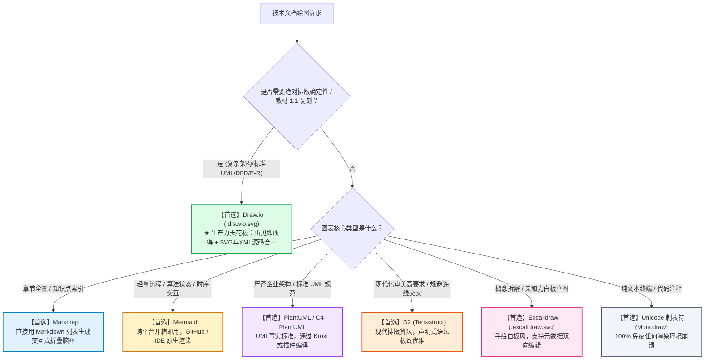

# Markdown 技术文档绘图全景方案调研与工程最佳实践报告

> **调研组织**：软件设计师通关速记指南 & 核心原理图库建设专题  
> **报告版本**：v1.0 (2026 技术栈前沿调研)  
> **适用场景**：技术知识库、系统架构白皮书、教材考点复刻、Docs-as-Code 知识沉淀  
> **核心目标**：突破单一 Mermaid 的表现局限，为不同复杂度和视觉要求的技术图表匹配最优工程方案。

---

## 🧭 报告核心结论与决策大图



---

## 一、 宏观技术视野：Markdown 绘图的 4 大技术流派

在现代技术文档与 Docs-as-Code（文档即代码）实践中，Markdown 绘图方案按底层哲学分为 4 大流派：

| 流派 | 核心哲学 | 代表方案 | 核心优势 | 主要局限 |
| :--- | :--- | :--- | :--- | :--- |
| **流派 1：声明式代码即图表**<br>*(Diagrams-as-Code DSL)* | 像编写源代码一样编写图表文本，依靠渲染引擎计算坐标和连线 | **Mermaid**<br>**PlantUML**<br>**D2**<br>**Graphviz (DOT)**<br>**Markmap** | 纯文本、极易通过 Git 做 Diff 审查、自动化友好 | 布局不可控（由引擎算法决定）、多节点易连线交错、样式定制受限 |
| **流派 2：双向可编辑混合矢量**<br>*(Hybrid Editable SVG)* | 采用矢量图片呈现，但将可编辑元数据嵌入图片源码内部 | **Draw.io (`.drawio.svg`)**<br>**Excalidraw (`.excalidraw.svg`)**<br>**手绘/高定 SVG** | **所见即所得**、排版 100% 确定、全平台 100% 渲染无需插件、源码图片合一 | 无法直接在 Markdown 源码中直读文本节点内容 |
| **流派 3：多引擎聚合渲染网关**<br>*(Docs-as-Code Gateway)* | 统一 RESTful API，服务端聚合 20+ 种绘图引擎并输出矢量图 | **Kroki.io**<br>静态站编译插件 (VitePress/MkDocs) | 本地免装 Java/Graphviz 等笨重依赖，一站式支持全语法 | 依赖网络服务或内部私有化部署的 Docker 容器 |
| **流派 4：零依赖纯文本字符艺术**<br>*(ASCII & Unicode Art)* | 利用等宽字体和 Unicode 制表符号构建框图 | **Unicode 制表框图 (Monodraw)**<br>**Svgbob (ASCII 转 SVG)** | 彻底免疫渲染引擎、全终端无差别显示、搜索直接命中文字 | 表现力受限于字符网格，不适合复杂曲线和渐变 |

---

## 二、 9 大主流方案深度画像与特性解构

### 1. Mermaid —— 现代技术文档的“通用英语”
* **定位**：轻量级、嵌入式、开箱即用的声明式图表工具。
* **支持平台**：GitHub、GitLab、Notion、Obsidian、VS Code、Typora 均原生内置。
* **支持图类**：Flowchart（流程图）、Sequence（时序图）、Class（类图）、State（状态机）、ER（实体关系）、Gantt（甘特图）、GitGraph（Git分支图）。
* **核心优势**：
  - 零配置：只要渲染器支持 Markdown，基本都能直接解析 ` ```mermaid ` 代码块；
  - 学习门槛极低，类 Markdown 语法易读易写。
* **致命痛点**：
  - **布局不可控**：底层使用 Dagre 算法，当节点增多或出现复杂环路时，连线交叉严重、箭头乱飞；
  - **词法解析脆弱**：在某些图类型（如 `classDiagram`）中，节点或标签中出现中文冒号 `：`、括号 `()` 容易直接导致全图报 Parse Error；
  - **专业 UML 支持有限**：无法精细调控多对多分组排版与微观端点对齐。

---

### 2. PlantUML —— 严谨 UML 与企业架构的事实标准
* **定位**：诞生近 20 年的工业级代码绘图基石，尤其是复杂 UML 和企业级架构设计。
* **核心优势**：
  - **UML 表现力无出其右**：9 大 UML 图支持度极其完备，继承、聚合、组合、依赖、实现的端点和多重度（如 `1..*`）标注无懈可击；
  - **布局控制力强**：支持通过 `-[hidden]-` 隐藏约束线、`-down->` / `-right->` 手动引导排版流向；
  - **C4-PlantUML 架构体系**：专为 C4 架构模型（Context, Container, Component, Code）设计的标准库，是国内外大厂架构评审的经典选择；
  - **图标生态浩瀚**：内置 AWS、Azure、GCP、Kubernetes、阿里云等全套官方高精图标。
* **主要痛点**：
  - 本地运行依赖 Java Runtime (JRE) 与 Graphviz 动态库；
  - GitHub 网页端无法原生渲染（必须在 CI/CD 中编译生成图片，或借助外部渲染服务器）。

---

### 3. D2 (Terrastruct) —— 为现代美学与排版而生的新一代 DSL
* **定位**：2022 年后在海外开源界与大厂快速崛起的现代化声明式绘图语言。
* **核心优势**：
  - **排版质感极高**：内置自研的 **TALA**（专为软件架构图优化的布局算法）与 **ELK** 引擎，大幅减少甚至彻底杜绝连线交叉；
  - **原生支持 Markdown 嵌入**：容器节点内部可直接使用 Markdown 语法（支持标题、粗体、代码高亮、表格）；
  - **语法逻辑清晰优雅**：采用现代类似 JSON/HCL 的层级化语法，定义嵌套子系统如丝般顺滑：
    ```d2
    server: Web Server {
      api: REST API
      auth: OAuth2
    }
    server.api -> database: Query
    ```
* **主要痛点**：
  - 诞生时间相对较短，各大云端平台（如 GitHub/Notion）尚未原生支持，目前多用于本地编写或经 CLI 导出为 SVG。

---

### 4. ★ Draw.io (`.drawio.svg`) —— 生产级 Docs-as-Code 的最佳实践
* **定位**：兼具“所见即所得拖拽编辑”与“Git 文本代码化版本控制”的终极混合方案。
* **工作机制**：
  1. 在 VS Code 中安装官方 `Draw.io Integration`（作者 Henning Dieterichs）插件；
  2. 在工程中新建一个文件，命名为 `xxx.drawio.svg`；
  3. **在 VS Code 中双击该文件**：自动唤起全功能 Draw.io 可视化画布，支持像素级拖拽、对齐、配色、连接线微调；
  4. **保存时**：它既是一个符合 W3C 标准的纯 SVG 矢量图，又在内部 XML 注释层完整封存了 Draw.io 画布的原始工程数据；
  5. **在 Markdown 中使用**：直接通过标准 Markdown 图片语法引用：
     ```markdown
     
     ```
* **为什么被一线大厂工程师奉为“神器”**：
  - **零环境依赖、全平台秒开**：GitHub、GitLab、VS Code 预览、Typora、浏览器全部原生秒级渲染显示，永无跨端兼容问题；
  - **像素级绝对掌控**：彻底告别算法自动布线的混乱，排版 100% 确定，非常适合教材级 1:1 精确复刻；
  - **源码与图片合一**：不用再保存一份 `xxx.drawio` 和一份导出的 `xxx.png`，单一文件即是图又是源工程，极大降低维护心智负担；
  - **Git Diff 友好**：底层本质仍是文本 XML，提交与版本对比清晰可溯。

---

### 5. Excalidraw (`.excalidraw.svg`) —— 生动手绘风与白板思考
* **定位**：具有极高视觉亲和力的手绘风格矢量白板工具。
* **核心优势**：
  - **手绘质感**：粗糙而灵动的手绘线条，天然传达“正在探讨、非最终定稿”的设计感，非常适合方案初期的头脑风暴与概念科普；
  - **生态集成优异**：与 Obsidian、VS Code 深度打通，同样支持将图形元数据内嵌于 `.svg` 文件中，实现双向可视化编辑。
* **适用场景**：
  - 计算机底层原理解构（如：操作系统页表置换、网络三次握手生动图示）。

---

### 6. Markmap —— 知识点骨架一键转交互式思维导图
* **定位**：专门将 Markdown 文本大纲极速转换为可视化、可折叠缩放思维导图的引擎。
* **工作机制**：
  - 直接提取 Markdown 的 `# 一级标题`、`## 二级标题` 与 `- 列表项`；
  - 自动渲染为支持鼠标拖拽平移、滚轮缩放、分支折叠的矢量动态脑图。
* **在知识库中的绝佳应用**：
  - 每一章开篇的“考点宏观脉络导图”，读者只需点击节点即可逐级展开背诵，比一张静态大图更加直观高效。

---

### 7. Kroki.io —— 聚合 20+ 绘图引擎的 Docs-as-Code 统一网关
* **定位**：解决“绘图工具碎片化”的统一服务端渲染网关。
* **核心优势**：
  - 统一 API 支持：Mermaid、PlantUML、D2、Graphviz、C4、BPMN、BlockDiag、Svgbob、WaveDrom 等 20 余种图表 DSL；
  - 免本地依赖：开发者只需在 Markdown 中声明图片 URL，如：
    `https://kroki.io/d2/svg/eNpNTsEKwjAMvecrwh47eBF04EG8iIdt6hbc2qSjguLfrTtB8PBynvfl5c3U04...`
  - 支持企业内网私有化 Docker 一键部署，确保技术文档内网安全编译。

---

### 8. Unicode 制表符字符画 (Box-Drawing) —— 永不失效的纯文本艺术
* **定位**：基于 ASCII / Unicode 等宽字符网格的结构化文本框图。
* **经典示例**：
  ```text
  ┌──────────────┐          ┌──────────────┐
  │   客户端 A   │─────────▶│   服务端 B   │
  ├──────────────┤          ├──────────────┤
  │ IP: 10.0.0.1 │ (TCP连接)│ Port: 8080   │
  └──────────────┘          └──────────────┘
  ```
* **核心优势**：
  - **绝对零依赖**：只要能显示文字的地方（终端、Git Commit Log、代码注释、手机便签、打印纸），100% 还原；
  - **搜索穿透**：文档全文搜索可以直接定位到图解中的类名、字段名；
  - **工具赋能**：配合 macOS 下的 **Monodraw** 工具，可以像在画图软件中一样通过鼠标拖拽绘制高精度的字符图。

---

## 三、 全维度横向选型对比矩阵

| 评估维度 | Mermaid | PlantUML | D2 | Draw.io (`.drawio.svg`) | Excalidraw (`.svg`) | Markmap | Unicode 字符画 |
| :--- | :---: | :---: | :---: | :---: | :---: | :---: | :---: |
| **排版掌控力 (是否确定)** | ⭐⭐<br>(算法不可控) | ⭐⭐⭐⭐<br>(支持隐藏锚点) | ⭐⭐⭐⭐<br>(算法先进少交叉) | **⭐⭐⭐⭐⭐<br>(像素级确定)** | ⭐⭐⭐⭐<br>(自由拖拽) | ⭐⭐⭐<br>(自动树形) | ⭐⭐⭐⭐<br>(字符网格对齐) |
| **视觉美学质感** | ⭐⭐⭐<br>(中规中矩) | ⭐⭐⭐<br>(传统经典风) | **⭐⭐⭐⭐⭐<br>(极高/现代感)** | **⭐⭐⭐⭐⭐<br>(自由设计)** | ⭐⭐⭐⭐<br>(手绘灵动) | ⭐⭐⭐⭐<br>(现代交互) | ⭐⭐⭐<br>(极客简约) |
| **GitHub 原生免插件渲染** | **100% 支持** | 需 CI 编译 | 需编译导出 | **100% 支持**<br>(作图引用) | **100% 支持**<br>(作图引用) | 需插件 / 导出 | **100% 纯文本原生** |
| **本地 IDE 实时预览体验** | 原生流畅 | 需 Java 插件 | 需安装 D2 CLI | **VS Code 原生画布** | 插件内嵌 | 原生流畅 | 纯文本直读 |
| **复杂度与上手门槛** | 极低 | 中等 (语法多) | 低~中 | **极低 (鼠标拖拽)** | **极低 (白板手绘)** | **零门槛 (MD列表)**| 低 (配合工具) |
| **适用图类特长** | 流程、时序、状态 | UML 全家桶、C4 | 现代微服务架构 | **架构大图、高精复刻** | 概念拆解、头脑风暴 | 知识点索引脑图 | 终端命令流、代码注释 |

---

## 四、 一线大厂与优秀开源项目的工程落地经验

从字节跳动、阿里巴巴、腾讯以及国外 Stripe、GitHub 等技术写作团队的实践中，可以提炼出 3 条核心经验：

### 经验 1：技术文档“双轨制”策略（Mermaid + Draw.io 二合一）
- **不要指望单一工具通吃所有场景**：
  - 遇到**轻量、线性、变更频繁的算法逻辑或简单状态流**：优先写纯 **Mermaid** 代码块，省时省力，修改代码只需两行；
  - 遇到**系统架构大图、多模块网络拓扑、1:1 严格规约的 UML 类关系图**：坚决切换到 **`xxx.drawio.svg`**，通过可视化拖拽规避 Mermaid 的自动连线崩溃，确保文档产出的工业级严谨度。

### 经验 2：统一的静态资源资产仓管理（Assets Pipeline）
- 在知识库根目录建立规范的 `assets/images/` 目录；
- 所有外置矢量图（无论是手工编写的 SVG、导出的 D2 图、还是 `.drawio.svg`）统一命名与归档；
- Markdown 文档中使用规范的相对路径引用，确保无论是本地离线阅读、IDE 预览还是部署为网页站点，图片链接均持久可用。

### 经验 3：知识体系自顶向下递进表达（Markmap 脑图 -> 核心架构图 -> 算法流图）
- **顶层（宏观）**：用 **Markmap** 将整个技术领域的知识树展开为交互式全景脑图，建立宏观索引；
- **中层（架构）**：用 **Draw.io (.drawio.svg)** 呈现组件关系、分层模型、数据流图（DFD）；
- **微观（机制）**：用 **Mermaid** 或 **Unicode 字符画** 精确描绘局部算法循环、时序握手、状态迁移。

---

## 五、 本知识库（软件设计师及原理图库）后续工程规约建议

结合我们正在建设的《软件设计师通关速记指南》以及后续的《核心原理/概念图解》专题，推荐遵循以下图解规范：

```
【知识库图解分层选用规范】
├── 1. 考点宏观骨架（各讲导言） ───────▶ Markdown 列表原生结构（后续可一键挂载 Markmap 互动脑图）
├── 2. 算法原理与时序握手（微观机制） ──▶ 原生 Mermaid（分治/DP状态机/TCP三次握手/银行家决策流）
├── 3. 下午案例五大题型与高精度复刻 ────▶ assets/images/*.drawio.svg 或 高保真 SVG
│   ├── 下午试题一：数据流图 (DFD 0层/1层)
│   ├── 下午试题二：数据库 E-R 实体联系图
│   ├── 下午试题三：UML 类间 6 大关系、23 种设计模式类结构图
│   └── 硬件/操作系统：指令流水线时空图、Cache 映射拓扑图
└── 4. 考前保命速记与口诀 ────────────▶ 精炼 Markdown 矩阵对照表 + 关键制表符框图
```

---

> **结语**：文档工程的本质是**降低读者的认知负荷**。合理运用“Mermaid 的代码敏捷性”与“Draw.io / SVG 的像素级掌控力”，将使整个知识库在跨端兼容性、技术严谨度与视觉质感上达到教材出版级水准。
