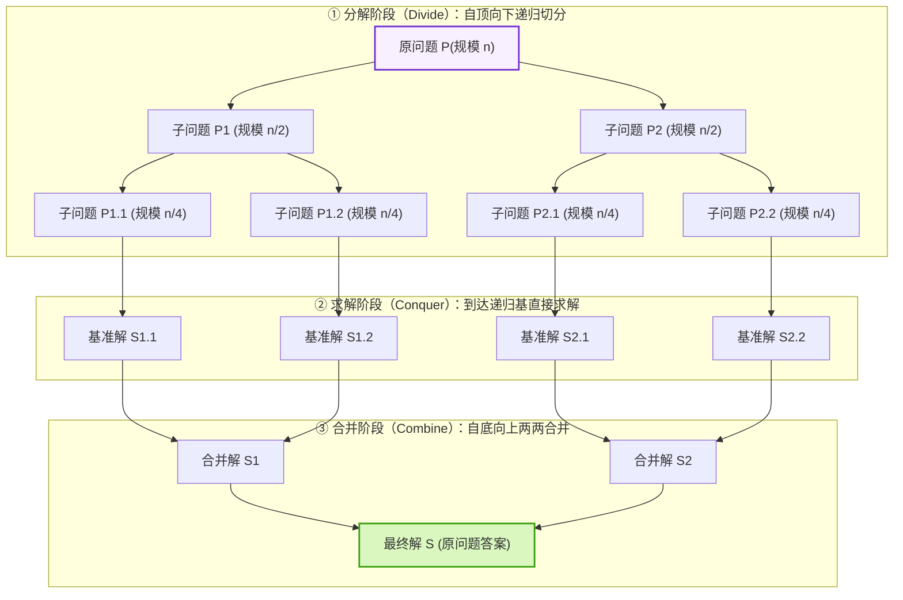
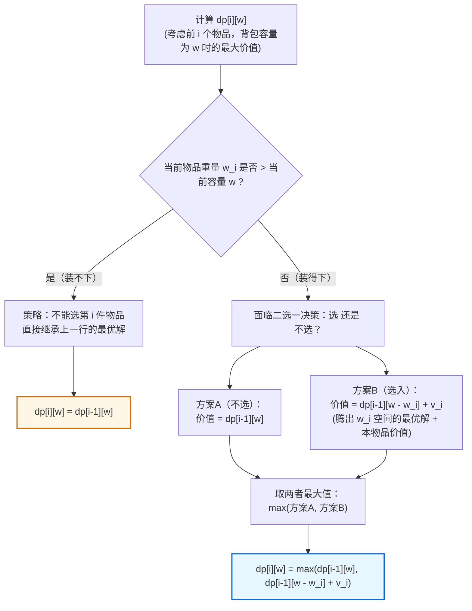
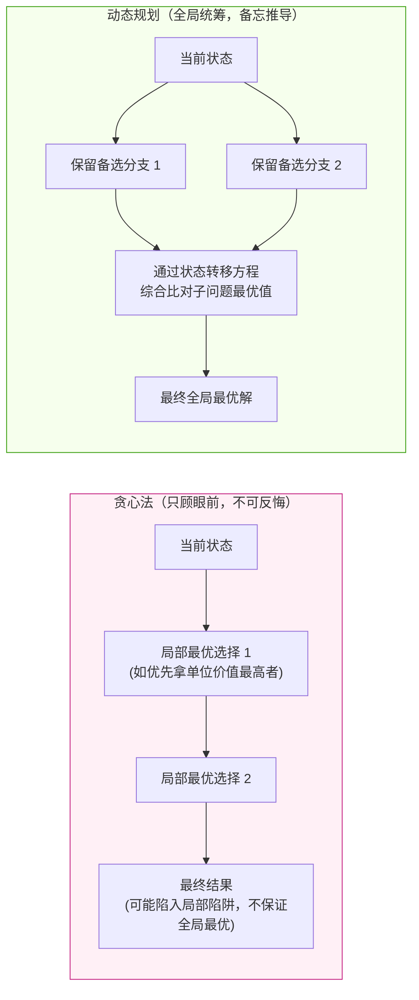
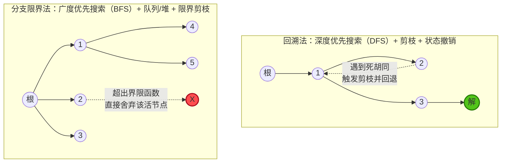

# 软件设计师核心算法原理全景图解指南

> **所属模块**：软考中级《软件设计师》—— 下午试题四（15分算法核心大题）
> **定位说明**：本附录采用原生 Mermaid 代码构建四大核心算法原理的心智模型图解，100% 纯代码矢量渲染，零外部图片依赖，支持离线与跨平台全兼容。

---

## 图一：分治法（Divide & Conquer）——“分-治-合”倒树模型

分治法的灵魂是：**大化小、小化了、自底向上拼结果**。其核心前提是**各子问题相互独立且与原问题结构相同**。

### 考点速记与复杂度公式
- **三大步骤**：
  1. **Divide（分）**：将大问题切分为若干规模较小、相互独立的子问题。
  2. **Conquer（治）**：若子问题规模足够小（达到递归基），则直接求解；否则继续递归。
  3. **Combine（合）**：将各子问题的解自底向上逐步合并为原问题的解。
- **典型考题**：归并排序（Merge Sort）、快速排序、折半查找。
- **复杂度推导（主定理 Master Theorem）**：
  $$T(n) = 2T(n/2) + O(n) \implies O(n \log n)$$

---

## 图二：动态规划法（DP）—— 0-1背包状态转移与二维填表决策流

动态规划的灵魂是：**重叠子问题 + 最优子结构**。通过建立表格记录已求解的子问题，避免指数级的暴力递归重复计算。

### 核心状态转移方程与填表依赖
$$
	ext{DP}[i][w] = egin{cases} 
	ext{DP}[i-1][w], & w < w_i \
\max(	ext{DP}[i-1][w], \; 	ext{DP}[i-1][w - w_i] + v_i), & w \ge w_i
\end{cases}
$$

当你在填算第 $i$ 行、第 $w$ 列时，它的数据来源只有两个格子的指引：

| 行 \ 列 (容量) | ... | $w - w_i$ | ... | $w$ |
| :--- | :---: | :---: | :---: | :---: |
| **第 $i-1$ 行** | ... | **`dp[i-1][w - w_i]`** *(加上 $v_i$ 参与比选)* | ... | **`dp[i-1][w]`** *(直接垂直落下)* |
| **第 $i$ 行** | ... | | ... | $\Downarrow$ **`dp[i][w] = max(...)`** |

- **时空复杂度**：时间复杂度 $O(n \cdot W)$，空间复杂度 $O(n \cdot W)$（滚动数组优化后可降至 $O(W)$）。

---

## 图三：贪心法 vs 动态规划法——“抉择分歧”对比图

下午题常考问答：“为什么该问题采用动态规划而不是贪心算法？”

### 经典考例比对（背包问题）
* **部分背包（物品可任意切割）**：可以直接按 $rac{	ext{价值}}{	ext{重量}}$ 从大到小优先装满。**贪心法有效**，复杂度 $O(n \log n)$。
* **0-1 背包（物品不可切，要么全拿要么不拿）**：若贪心拿单价最高者，可能因空间剩余无法装其他物品而导致总价值极低。**贪心法失效，必须使用动态规划**。

---

## 图四：回溯法 vs 分支限界法——解空间树搜索策略全景图

回溯法与分支限界法都用于在**解空间树**中搜索问题的解，但**搜索策略与数据结构截然不同**：

### 核心考点对照速查表

| 对比维度 | 回溯法（Backtracking） | 分支限界法（Branch & Bound） |
| :--- | :--- | :--- |
| **搜索方式** | **深度优先（DFS）** | **广度优先（BFS）** 或 极小化代价优先 |
| **遍历机制** | 一次只深入一个子节点，走不通回退上一层（试探与回退） | 一次性生成当前活结点的**所有**子节点 |
| **底层数据结构** | **系统调用栈（递归实现）** | **FIFO 队列** 或 **优先队列（大/小顶堆）** |
| **求解目标** | 找出满足约束的**所有解**或任一可行解 | 找出满足目标函数的最优解（极值问题） |
| **典型考题** | N皇后问题、迷宫巡线、八数码 | 0-1背包分支限界、单源最短路径、旅行商(TSP) |
