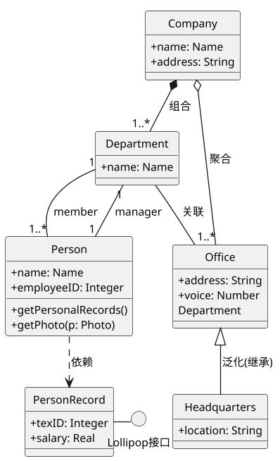
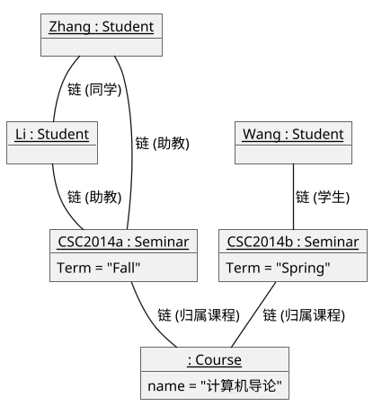
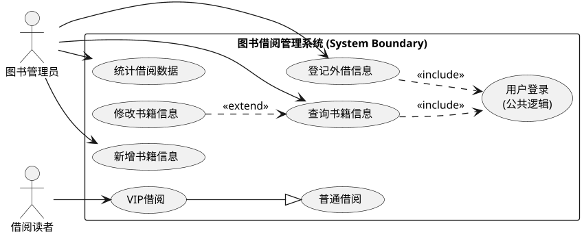
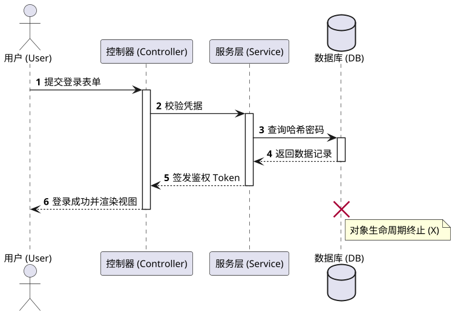
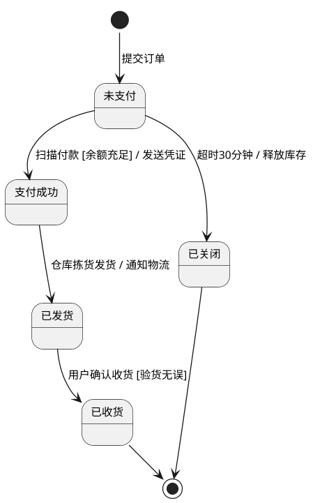
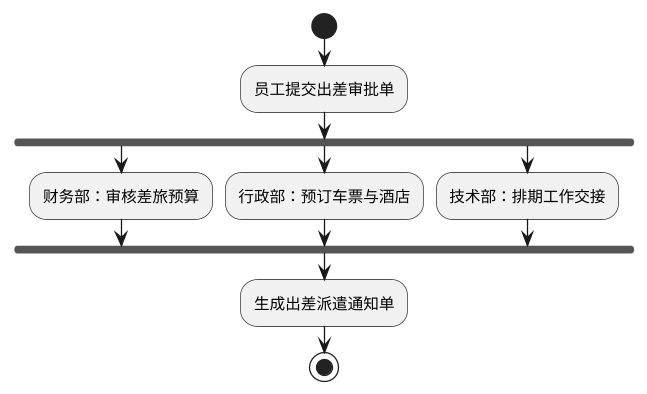
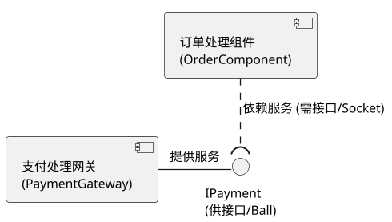
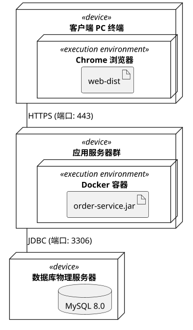

# UML 核心建模图谱（方案 A：PlantUML 工业级纯正代码建模版）

> **设计理念**：采用 UML-as-Code 领域的工业级事实标准 **PlantUML**。  
> **核心优势**：语法 100% 严格对应 OMG UML 2.5 规范标准。原生支持真实的火柴人 Actor、球窝装配接口、3D 节点与完整的对象属性声明。非常适合搭配 VS Code PlantUML 插件或自动化 Docs-as-Code 工具链。

---

## 快速导航索引

* [01. 类图 (Class Diagram) —— 静态设计视图核心](#01-类图-class-diagram--静态设计视图核心)
* [02. 对象图 (Object Diagram) —— 运行时快照与链](#02-对象图-object-diagram--运行时快照与链)
* [03. 用例图 (Use Case Diagram) —— 需求模型与三大关系](#03-用例图-use-case-diagram--需求模型与三大关系)
* [04. 顺序图 / 时序图 (Sequence Diagram) —— 时间垂直生命线](#04-顺序图--时序图-sequence-diagram--时间垂直生命线)
* [05. 通信图 / 协作图 (Communication Diagram) —— 空间拓扑与数字编号](#05-通信图--协作图-communication-diagram--空间拓扑与数字编号)
* [06. 状态图 (Statechart Diagram) —— 单对象全生命周期变迁](#06-状态图-statechart-diagram--单对象全生命周期变迁)
* [07. 活动图 (Activity Diagram) —— 并发分叉与汇合](#07-活动图-activity-diagram--并发分叉与汇合)
* [08. 构件图 / 组件图 (Component Diagram) —— 软件封装与球窝接口](#08-构件图--组件图-component-diagram--软件封装与球窝接口)
* [09. 部署图 (Deployment Diagram) —— 软硬件物理拓扑](#09-部署图-deployment-diagram--软硬件物理拓扑)
* [附录：9 大图考场标志物一秒速杀对照表](#附录9-大图考场标志物一秒速杀对照表)

---

## 01. 类图 (Class Diagram) —— 静态设计视图核心

### 标准 PlantUML 建模源码

### 读图要领与考场核心题眼
1. **三段式语法**：`class` 关键字声明类，大括号内分别罗列属性与方法。符号 `+` (public)、`-` (private)、`#` (protected)、`~` (package)。
2. **关系符号对照**：`*--` 组合（实心菱形）、`o--` 聚合（空心菱形）、`--` 关联（纯实线）、`<|--` 泛化（实线空心三角）、`..>` 依赖（虚线箭头）。
3. **菱形端铁律**：菱形符号长在哪一侧，就代表哪一侧是【整体类】。

---

## 02. 对象图 (Object Diagram) —— 运行时快照与链

### 标准 PlantUML 建模源码

### 读图要领与考场核心题眼
1. **下划线与对象定义**：PlantUML 使用 `object` 声明对象，名称使用 `<u>对象名 : 类名</u>` 表达内存实例。
2. **匿名对象**：`: Course`（冒号前留空），代表系统中无需明确引用的匿名单例或组件。
3. **链与多重度**：对象之间用普通实线 `--` 连接（代表链 Link），**绝不能标注多重度**。

---

## 03. 用例图 (Use Case Diagram) —— 需求模型与三大关系

### 标准 PlantUML 建模源码

### 读图要领与考场核心题眼
1. **原生火柴人**：`actor` 关键字原生渲染标准的 UML 火柴人图形。
2. **包含 (`..> <<include>>`)**：**无条件必定执行**，提取公共步骤。**箭头由基础用例指向公共子用例**。
3. **扩展 (`..> <<extend>>`)**：**满足特定扩展点条件才可选执行**。**箭头由扩展用例反向指向基础用例**。
4. **泛化 (`--|>`)**：用例继承，子用例指向父用例。

---

## 04. 顺序图 / 时序图 (Sequence Diagram) —— 时间垂直生命线

### 标准 PlantUML 建模源码

### 读图要领与考场核心题眼
1. **时间轴向下**：严格按垂直生命线向下推进。
2. **激活与挂起**：`activate` 与 `deactivate` 生成标准的**激活期狭长细矩形**。
3. **消息箭头语法**：`->` 同步实心调用、`-->` 虚线返回消息、`destroy` 渲染底部的**对象销毁大叉 X**。

---

## 05. 通信图 / 协作图 (Communication Diagram) —— 空间拓扑与数字编号

### 标准 PlantUML 建模源码

### 读图要领与考场核心题眼
1. **拓扑与等价性**：强调对象间的空间关系，与顺序图在语义上 100% 等价。
2. **顺序标定**：依靠连线上的消息序号（如 `1:`, `1.1:`, `1.2.1:`）标定先后次序。

---

## 06. 状态图 (Statechart Diagram) —— 单对象全生命周期变迁

### 标准 PlantUML 建模源码

### 读图要领与考场核心题眼
1. **单对象范围**：只表达单个对象（如订单实体）的生命周期。
2. **初态与终态**：`[*]` 自动映射为实心圆初态或同心圆终态。
3. **语法公式**：`事件 [监护条件] / 动作`。中括号包裹布尔条件，斜杠后紧跟触发动作。

---

## 07. 活动图 (Activity Diagram) —— 并发分叉与汇合

### 标准 PlantUML 建模源码

### 读图要领与考场核心题眼
1. **并发控制**：`fork` 与 `end fork` 原生渲染出标准 UML 的**粗黑同步条**。
2. **分支与汇合**：分叉（一条进，多条出同时运行）；汇合（多条进，全部运行完毕才继续向下）。

---

## 08. 构件图 / 组件图 (Component Diagram) —— 软件封装与球窝接口

### 标准 PlantUML 建模源码

### 读图要领与考场核心题眼
1. **构造型组件**：`[组件名]` 原生渲染标准构件矩形。
2. **球窝装配连接**：`()` 原生渲染供接口圆球；`..(` 语法原生渲染半圆插座，表达组件解耦与装配。

---

## 09. 部署图 (Deployment Diagram) —— 软硬件物理拓扑

### 标准 PlantUML 建模源码

### 读图要领与考场核心题眼
1. **3D 透视立方体**：`node` 关键字原生渲染标准的三维立方体硬件节点。
2. **软硬件映射**：硬件 `<<device>>` 内部嵌套运行容器 `<<execution environment>>` 与可执行文件 `artifact`。

---

## 附录：9 大图考场标志物一秒速杀对照表

| 图名称 | 动/静属性 | 一秒识别的“视觉标志物” | 考题标志性特征词 |
| :--- | :---: | :--- | :--- |
| **类图** | **静态** | 三段式矩形、继承三角、组合聚合菱形 | **静态设计视图**、多重度、类间关系 |
| **对象图** | **静态** | 名字带**下划线**（如 `<u>:Course</u>`）、无方法格 | **特定时刻快照 (Snapshot)**、链 |
| **用例图** | **动态** | **火柴人**、椭圆、系统大矩形框 | **最基本需求模型**、`<<include>>`、`<<extend>>` |
| **顺序图** | **动态** | **垂直向下虚线（生命线）**、细矩形激活条 | **时间顺序**、调用消息、返回消息 |
| **通信图** | **动态** | 网状对象连线、**`1.1, 1.2` 消息数字编号** | 与顺序图等价、**对象组织结构拓扑** |
| **状态图** | **动态** | 初态实心圆、终态牛眼同心圆、圆角矩形 | **单对象生命周期**、`事件[条件]/动作` |
| **活动图** | **动态** | **粗黑水平/垂直同步条 (Fork/Join)** | 类似程序流程图、**并行分叉与汇合**、泳道 |
| **构件图** | **静态** | «component»、**供接口圆球与需接口插座** | 物理软件模块封装、`.dll/.jar` |
| **部署图** | **静态** | **3D 立方体节点**、网络连线标协议 | **软硬件映射**、物理节点 (Node) |
