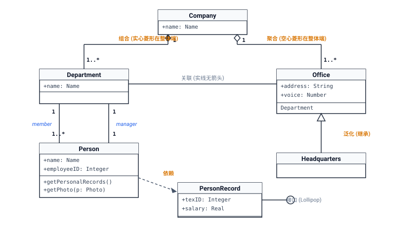
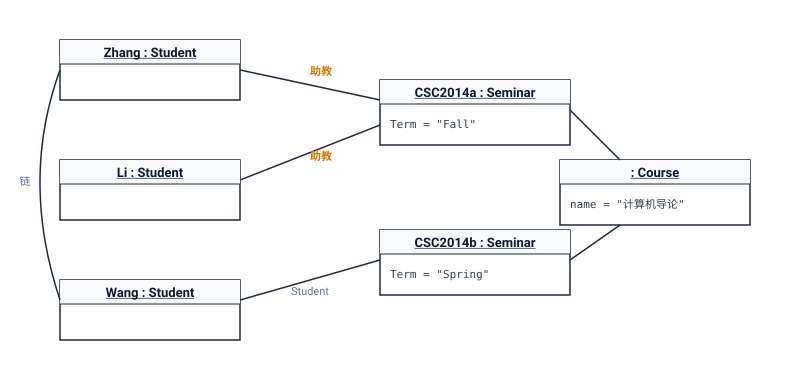
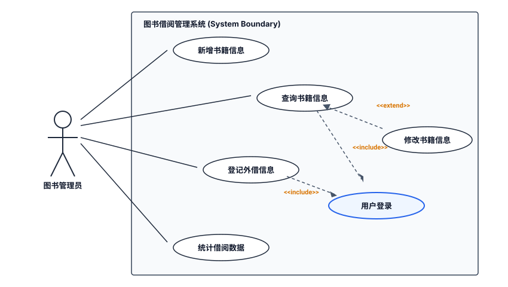
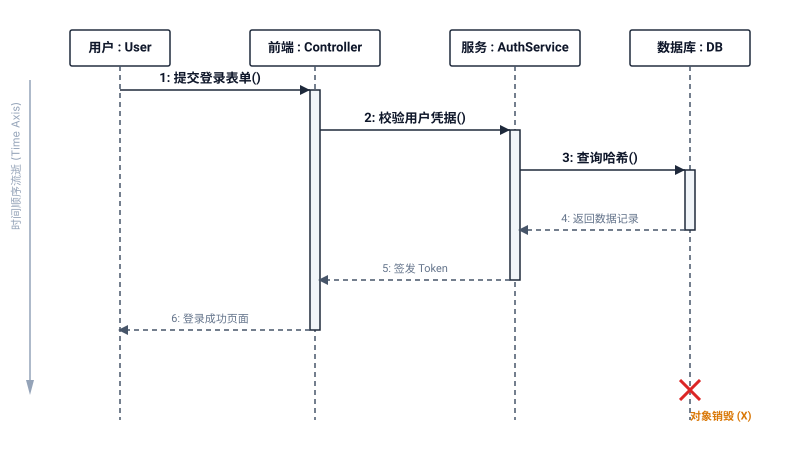
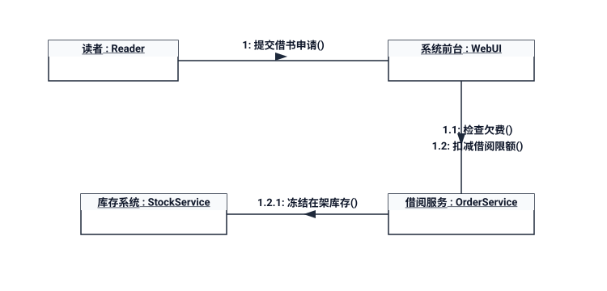
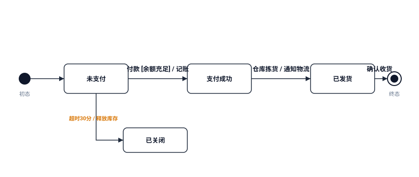
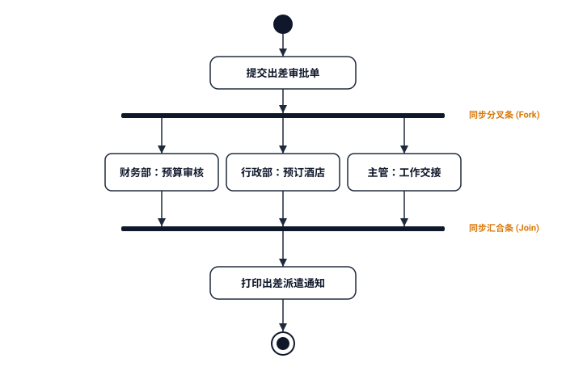
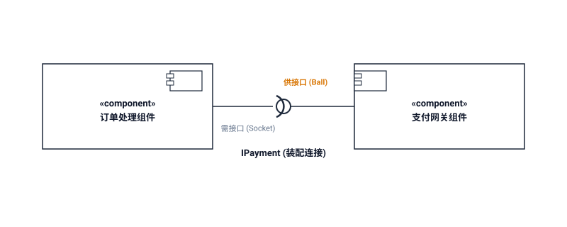
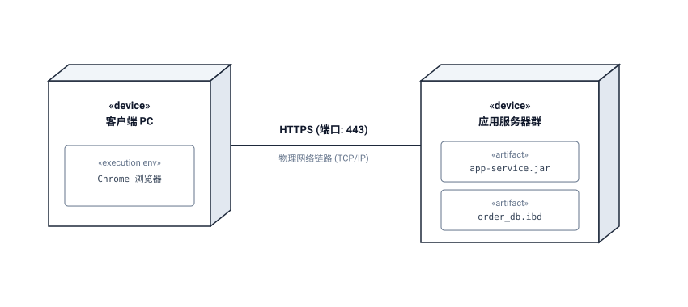

# UML 核心建模图谱（方案 B：教材级 1:1 高保真矢量图版）

> **设计理念**：100% 像素级对齐清华大学出版社《软件设计师教程》官方教材与文老师课件原图。  
> **核心优势**：所见即所得、符号绝对规范（包含标准火柴人 Actor、3D 透视立方体节点、球窝装配接口、实心/空心菱形与空心三角），全平台 100% 免插件直接秒开，彻底规避任何渲染语法错误与失真。

---

## 快速导航索引

* [01. 类图 (Class Diagram) —— 静态设计视图核心](#01-类图-class-diagram--静态设计视图核心)
* [02. 对象图 (Object Diagram) —— 运行时快照与链](#02-对象图-object-diagram--运行时快照与链)
* [03. 用例图 (Use Case Diagram) —— 需求模型与三大关系](#03-用例图-use-case-diagram--需求模型与三大关系)
* [04. 顺序图 / 时序图 (Sequence Diagram) —— 时间垂直生命线](#04-顺序图--时序图-sequence-diagram--时间垂直生命线)
* [05. 通信图 / 协作图 (Communication Diagram) —— 空间拓扑与数字编号](#05-通信图--协作图-communication-diagram--空间拓扑与数字编号)
* [06. 状态图 (Statechart Diagram) —— 单对象全生命周期变迁](#06-状态图-statechart-diagram--单对象全生命周期变迁)
* [07. 活动图 (Activity Diagram) —— 并发分叉与汇合](#07-活动图-activity-diagram--并发分叉与汇合)
* [08. 构件图 / 组件图 (Component Diagram) —— 软件封装与球窝接口](#08-构件图--组件图-component-diagram--软件封装与球窝接口)
* [09. 部署图 (Deployment Diagram) —— 软硬件物理拓扑](#09-部署图-deployment-diagram--软硬件物理拓扑)
* [附录：9 大图考场标志物一秒速杀对照表](#附录9-大图考场标志物一秒速杀对照表)

---

## 01. 类图 (Class Diagram) —— 静态设计视图核心

### 1:1 官方教材经典模型（教材图 10-11）

### 读图要领与考场核心题眼
1. **三段式结构**：顶部为类名（抽象类为*斜体*），中间为属性列表，底部为操作/方法列表。符号：`+` 公有、`-` 私有、`#` 保护、`~` 包级。
2. **菱形位置铁律（下午试题三必考填空）**：无论是实心菱形（组合）还是空心菱形（聚合），**菱形端必须严格画在【整体类】身上**！
3. **多重度与角色**：`1`（唯一）、`0..1`（可选）、`*` 或 `0..*`（零到多）、`1..*`（至少一个）；连线两端标注的角色名（如 `member` 与 `manager`）用于区分业务角色。
4. **接口表现形式**：可画为矩形构造型 `<<interface>>`（虚线空心三角连接），也可画为一个小圆圈 `○`（棒棒糖连接法）。

---

## 02. 对象图 (Object Diagram) —— 运行时快照与链

### 1:1 官方教材经典模型（教材图 10-12）

### 读图要领与考场核心题眼
1. **下划线标识**：对象名称必须带有下划线，常见格式：
   - `Zhang : Student`（对象名 + 类名）
   - `: Course`（**匿名对象**，冒号前为空，下午大题高频填空！）
   - `Student1`（仅对象名）
2. **只展示具体属性值，无方法格**：对象是内存快照，只记录特定瞬间的属性取值（如 `Term = "Fall"`），不展示操作函数。
3. **连线称为“链 (Link)”**：连线是类间关联关系的具象化实例，**两端绝不能标注多重度**。

---

## 03. 用例图 (Use Case Diagram) —— 需求模型与三大关系

### 1:1 官方教材经典模型（教材图 10-13）

### 读图要领与考场核心题眼
1. **参与者 (Actor)**：必须是标准**火柴人**图形。不仅代表具体的人，还可以是**外部硬件设备、定时器或其他外部交互系统**！
2. **包含 (`<<include>>`)**：**必须无条件执行**。提取多个用例共用的基础逻辑（如借书、查书必定都要先登录）。**箭头方向：基础用例 ────▶ 被包含用例**。
3. **扩展 (`<<extend>>`)**：**有条件可选执行**。满足特定扩展点才触发（如修改书籍信息是查询书籍后的可选补充）。**箭头方向：扩展用例 ────▶ 基础用例**（方向相反，考场最易扣分点！）。
4. **泛化 (继承)**：参与者或用例之间的特殊与一般关系（实线空心三角形 `--|>` 指向父类）。

---

## 04. 顺序图 / 时序图 (Sequence Diagram) —— 时间垂直生命线

### 1:1 官方标准交互模型

### 读图要领与考场核心题眼
1. **核心观察轴**：**垂直向下代表时间顺序**（越往下发生得越晚），水平轴排列参与对象。
2. **生命线与激活期**：垂直虚线为对象生命线；生命线上的狭长细矩形为**激活期（Activation）**，表示对象正在占用 CPU 执行操作。
3. **消息调用类型**：
   - 实线实心三角箭头（`->>`）：**同步消息**（发送方阻塞等待结果）；
   - 实线开放普通箭头（`->`）：**异步消息**（发送方无需等待，继续向下执行）；
   - 虚线开放箭头（`-->>`）：**返回消息**；
   - 底部大叉（`X`）：表示对象生命周期结束（**对象销毁**）。

---

## 05. 通信图 / 协作图 (Communication Diagram) —— 空间拓扑与数字编号

### 1:1 官方标准拓扑模型

### 读图要领与考场核心题眼
1. **与顺序图语义等价**：顺序图强调时间次序，通信图强调**对象之间的空间组织网络结构**，两者可相互无损转换。
2. **无垂直生命线**：执行次序完全依靠连线上的**层级数字前缀**（如 `1:`, `1.1:`, `1.2.1:`）来严格标定。
3. **秒杀题眼**：看到满屏网状方框连线上带有 `1.1`、`1.2` 消息序号的，**100% 选通信图（协作图）**。

---

## 06. 状态图 (Statechart Diagram) —— 单对象全生命周期变迁

### 1:1 官方标准状态机模型

### 读图要领与考场核心题眼
1. **观察范围**：描述**单个对象在其整个生命周期内**因外部事件刺激而产生的状态演化（不是整个业务系统）。
2. **初态与终态**：`●` 黑色实心圆点为初态（全局唯一）；`◉` 同心牛眼圆为终态（可有多个或无）。
3. **状态变迁三要素语法**：
   $$\text{事件 (Event)} \; [\text{监护条件 (Guard)}] \; / \; \text{动作 (Action)}$$
   *中括号内为布尔监护条件，斜杠后为触发时瞬间执行的动作*。

---

## 07. 活动图 (Activity Diagram) —— 并发分叉与汇合

### 1:1 官方标准工作流模型

### 读图要领与考场核心题眼
1. **本质与进阶**：传统程序流程图的高级版，核心升华点在于**支持并发执行**与**泳道责任划分**。
2. **粗黑同步条（考场第一绝对标志物）**：
   - **分叉条 (Fork)**：一条输入线进入粗黑条，引出多条并行输出线同时执行；
   - **汇合条 (Join)**：多条并行线进入粗黑条，只有所有并发前置操作全部就绪，才汇合为一条线继续向下流转。
3. **秒杀题眼**：**只要在题干截图中看到【粗水平黑线 / 粗垂直黑线】，答案无脑选活动图！**

---

## 08. 构件图 / 组件图 (Component Diagram) —— 软件封装与球窝接口

### 1:1 官方标准物理模块模型

### 读图要领与考场核心题眼
1. **物理模块封装**：展现源代码、二进制文件、共享库（`.dll`, `.jar`, `.exe`）之间的组织依赖。
2. **球窝连接 (Ball-and-Socket 装配连接)**：
   - **供接口（提供服务）**：完整圆球 `○`（棒棒糖），由实现该接口的构件引出实线连接；
   - **需接口（依赖服务）**：半圆插座 `)`，由依赖该接口的构件引出实线/虚线连接并扣在圆球上。

---

## 09. 部署图 (Deployment Diagram) —— 软硬件物理拓扑

### 1:1 官方标准物理架构模型

### 读图要领与考场核心题眼
1. **物理映射**：描述系统的软硬件物理架构，将软件制品（Artifact）分配到具体的**物理计算节点（Node）**上。
2. **核心标志物**：**三维立体长方体（3D Box 节点）**。
3. **秒杀题眼**：看到带 `«device»`、物理服务器、计算设备、网络协议标注（如 HTTP、TCP/IP、JDBC）的拓扑图，**100% 选部署图**。

---

## 附录：9 大图考场标志物一秒速杀对照表

| 图名称 | 动/静属性 | 一秒识别的“视觉标志物” | 考题标志性特征词 |
| :--- | :---: | :--- | :--- |
| **类图** | **静态** | 三段式矩形、继承三角、组合聚合菱形 | **静态设计视图**、多重度、类间关系 |
| **对象图** | **静态** | 名字带**下划线**（如 `<u>:Course</u>`）、无方法格 | **特定时刻快照 (Snapshot)**、链 |
| **用例图** | **动态** | **火柴人**、椭圆、系统大矩形框 | **最基本需求模型**、`<<include>>`、`<<extend>>` |
| **顺序图** | **动态** | **垂直向下虚线（生命线）**、细矩形激活条 | **时间顺序**、调用消息、返回消息 |
| **通信图** | **动态** | 网状对象连线、**`1.1, 1.2` 消息数字编号** | 与顺序图等价、**对象组织结构拓扑** |
| **状态图** | **动态** | 初态实心圆、终态牛眼同心圆、圆角矩形 | **单对象生命周期**、`事件[条件]/动作` |
| **活动图** | **动态** | **粗黑水平/垂直同步条 (Fork/Join)** | 类似程序流程图、**并行分叉与汇合**、泳道 |
| **构件图** | **静态** | «component»、**供接口圆球与需接口插座** | 物理软件模块封装、`.dll/.jar` |
| **部署图** | **静态** | **3D 立方体节点**、网络连线标协议 | **软硬件映射**、物理节点 (Node) |
