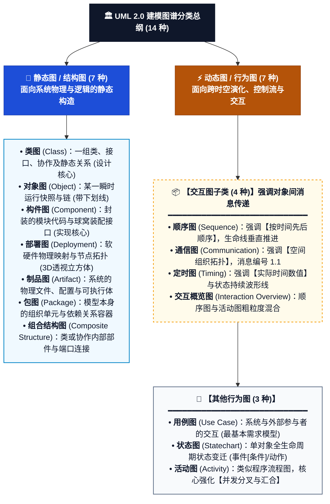
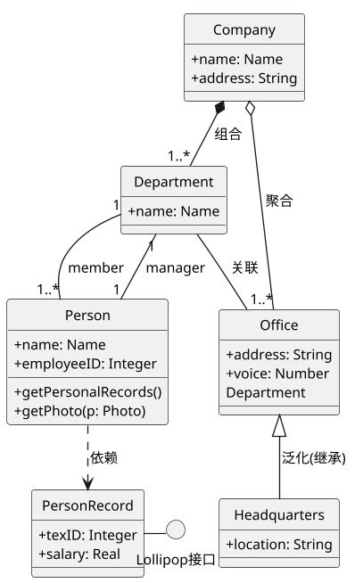
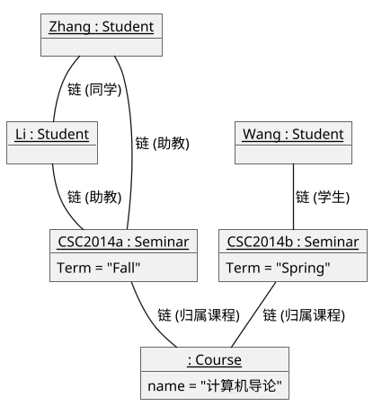
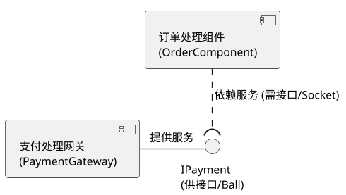
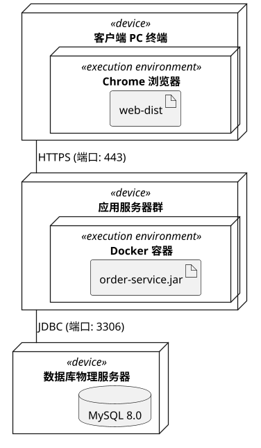
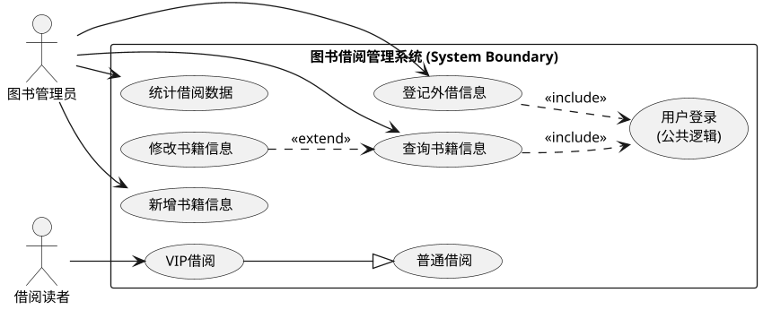
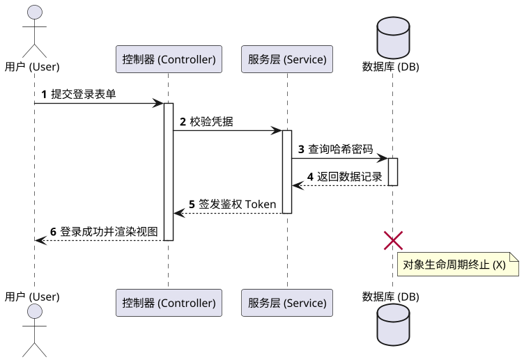
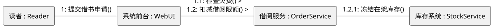
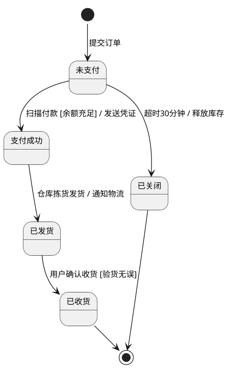
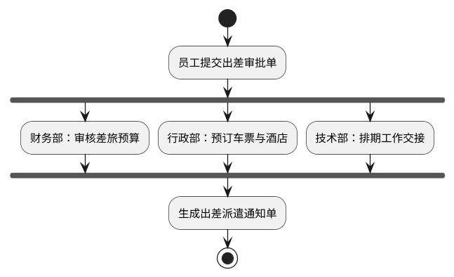

# UML 核心建模图谱（UML 2.0 全景与 4+1 架构金字塔精讲）

> **金字塔导读**：本专题遵循“**宏观全景（塔尖） ➔ 架构视图（统领） ➔ 动静分类（中层） ➔ 微观图解（细化） ➔ 题眼速杀（底座）**”的金字塔认知模型组织。  
> **建模规范与选型**：
> 1. **宏观认知层（01 节分类大树 & 02 节 4+1 视图拓扑）**：采用原生 **Mermaid** 绘制。轻量免依赖、开箱即显、自适应排版、配色优雅，契合知识拓扑与概念关系图。
> 2. **微观设计层（03 ~ 11 节 9 大核心图）**：全量采用工业级标准 **PlantUML** 声明式代码建模。100% 符合 OMG UML 2.5 规范语义，球窝接口、生命线激活条、3D 部署节点原生高精度渲染。

---

## 🏛️ 金字塔快速导航索引

- **第一部分：宏观认知（金字塔塔尖·全局俯瞰）**
  * [01. 整体概要说明：UML 2.0 动静态 14 图分类大树](#01-整体概要说明uml-20-动静态-14-图分类大树)
  * [02. 架构视角统领：UML 4+1 视图与多角色映射模型](#02-架构视角统领uml-41-视图与多角色映射模型)
- **第二部分：中层支柱 A —— 静态结构视图核心建模**
  * [03. 类图 (Class Diagram) —— 静态设计视图核心](#03-类图-class-diagram--静态设计视图核心)
  * [04. 对象图 (Object Diagram) —— 运行时快照与链](#04-对象图-object-diagram--运行时快照与链)
  * [05. 构件图 / 组件图 (Component Diagram) —— 软件封装与球窝接口](#05-构件图--组件图-component-diagram--软件封装与球窝接口)
  * [06. 部署图 (Deployment Diagram) —— 软硬件物理拓扑](#06-部署图-deployment-diagram--软硬件物理拓扑)
- **第三部分：中层支柱 B —— 动态行为与交互视图核心建模**
  * [07. 用例图 (Use Case Diagram) —— 需求模型与三大关系](#07-用例图-use-case-diagram--需求模型与三大关系)
  * [08. 顺序图 / 时序图 (Sequence Diagram) —— 时间垂直生命线](#08-顺序图--时序图-sequence-diagram--时间垂直生命线)
  * [09. 通信图 / 协作图 (Communication Diagram) —— 空间拓扑与数字编号](#09-通信图--协作图-communication-diagram--空间拓扑与数字编号)
  * [10. 状态图 (Statechart Diagram) —— 单对象全生命周期变迁](#10-状态图-statechart-diagram--单对象全生命周期变迁)
  * [11. 活动图 (Activity Diagram) —— 并发分叉与汇合](#11-活动图-activity-diagram--并发分叉与汇合)
- **第四部分：实战收敛（金字塔底座·考场速杀）**
  * [附录：9 大核心图考场标志物一秒速杀对照表](#附录9-大核心图考场标志物一秒速杀对照表)

---

## 01. 整体概要说明：UML 2.0 动静态 14 图分类大树

### 1.1 全景分类架构图

### 1.2 考纲重点归纳与深度辨析

> [!IMPORTANT]
> **官方教材分类口径**：清华版教材正文常表述为 **13 种图**（因为早期标准将“制品图”归入构件/部署层，不作为顶级图），部分现代考题也会算上“制品图”统称为 **14 种图**。考生切勿纠结数字，关键在于掌握**“静态结构”与“动态行为”的二分法判定法则**！

1. **静态图（结构图）判定铁律**：
   - 不随时间发生流动或变迁，描述系统在某一时刻的结构蓝图或物理部件。
   - **典型成员**：类图、对象图、构件图、部署图、制品图、包图、组合结构图。
2. **动态图（行为图）判定铁律**：
   - 包含时间流动、状态迁移、控制流或对象间的消息通讯。
   - **交互图子类（重点考点）**：顺序图（时间优先）、通信图（空间优先）、定时图（数值优先）、交互概览图。**凡是带有消息流转的，均属于交互图**！
   - **非交互图**：用例图（需求起点）、状态图（单对象生命全貌）、活动图（业务流程与并行）。

---

## 02. 架构视角统领：UML 4+1 视图与多角色映射模型

### 2.1 4+1 视图经典拓扑关系图（四象限矩阵架构）

| 📐 **逻辑视图 (Logical View)** 👤 **系统分析 / 设计人员** 🎯 **展现系统功能** 🧩 类与对象、接口、设计子系统 📊 *对应图：类图、对象图、状态图* | ════ 映射为源代码 ════▶ | 📦 **实现视图 (Implementation View)** 👤 **程序员 / 开发人员** 🎯 **源代码物理结构** 🧩 物理代码文件、组件、包 📊 *对应图：构件图、包图* |
| :---: | :---: | :---: |
| ║ 运行时并发执行实例 ▼ | ⭐ **【用例视图 (Use-Case View)】** ⭐ ━━━━━━━━━━━━━━━━━━━━ 👤 **面向角色**：最终用户 (End User) 🎯 **核心定位**：**最基本需求分析模型** 📌 **枢纽作用**：驱动并验证其余四大工程视图 | ║ 物理节点部署运行 ▼ |
| ⚡ **进程视图 (Process View)** 👤 **系统集成人员** 🎯 **并发与同步结构** 🧩 线程、进程、并发同步 📊 *对应图：活动图、顺序图、通信图* | ════ 分布式通信协同 ════▶ | 🖥️ **部署视图 (Deployment View)** 👤 **系统 / 网络工程师** 🎯 **软硬件物理映射** 🧩 物理机、容器、网络拓扑分布 📊 *对应图：部署图* |

### 2.2 4+1 视图核心考点辨析矩阵（文老师高频题眼）

| 视图名称 | 别名 | 面向角色 | 关注重点 / 建模内容 | 对应核心 UML 图 | 考场高频题眼与特征词 |
| :--- | :--- | :--- | :--- | :--- | :--- |
| **用例视图** *(Use-Case)* | **需求视图** | **最终用户** *(End User)* | **最基本的需求分析模型**，定义系统边界与功能边界 | 用例图 (Use Case) | **“核心驱动枢纽”**、描述用户可见行为 |
| **逻辑视图** *(Logical)* | **设计视图** | **系统分析/设计人员** *(Analyst/Designer)* | **展现系统功能**，设计模型中具有架构意义的类、接口、子系统 | 类图、对象图、状态图 | **“类与对象”**、**“展现系统功能”**、设计子集 |
| **实现视图** *(Implementation)*| **开发视图** | **程序员 / 开发人员** *(Programmer)* | **源代码结构**，组成基于系统的物理代码文件和构件 | 构件图、包图 | **“物理代码文件”**、**“构件建模”**、编译打包 |
| **进程视图** *(Process)* | **并发视图** | **系统集成人员** *(Integrator)* | **并发与同步结构**，是逻辑视图的一次执行实例，关注非功能需求 | 活动图、顺序图、通信图 | **“线程与进程”**、**“并发与同步”**、性能可伸缩性 |
| **部署视图** *(Deployment)* | **物理视图** | **系统/网络工程师** *(Engineer)* | **软件到硬件的物理映射**，构件部署到物理节点的拓扑分布 | 部署图 (Deployment) | **“物理节点”**、**“软硬件映射”**、网络分布拓扑 |

---

## 03. 类图 (Class Diagram) —— 静态设计视图核心

### 标准 PlantUML 建模源码

### 读图要领与考场核心题眼
1. **三段式语法**：`class` 关键字声明类，大括号内分别罗列属性与方法。符号 `+` (public)、`-` (private)、`#` (protected)、`~` (package)。
2. **关系符号对照**：`*--` 组合（实心菱形）、`o--` 聚合（空心菱形）、`--` 关联（纯实线）、`<|--` 泛化（实线空心三角）、`..>` 依赖（虚线箭头）。
3. **菱形端铁律**：菱形符号长在哪一侧，就代表哪一侧是【整体类】。

---

## 04. 对象图 (Object Diagram) —— 运行时快照与链

### 标准 PlantUML 建模源码

### 读图要领与考场核心题眼
1. **下划线与对象定义**：PlantUML 使用 `object` 声明对象，名称使用 `<u>对象名 : 类名</u>` 表达内存实例。
2. **匿名对象**：`: Course`（冒号前留空），代表系统中无需明确引用的匿名单例或组件。
3. **链与多重度**：对象之间用普通实线 `--` 连接（代表链 Link），**绝不能标注多重度**。

---

## 05. 构件图 / 组件图 (Component Diagram) —— 软件封装与球窝接口

### 标准 PlantUML 建模源码

### 读图要领与考场核心题眼
1. **构造型组件**：`component` 关键字原生渲染标准构件矩形与内部标牌。
2. **球窝装配连接**：`interface` 或 `()` 原生渲染供接口圆球 (Ball)；`..(` 语法原生渲染需接口半圆插座 (Socket)，生动表达组件的解耦与即插即用装配。

---

## 06. 部署图 (Deployment Diagram) —— 软硬件物理拓扑

### 标准 PlantUML 建模源码

### 读图要领与考场核心题眼
1. **3D 透视立方体**：`node` 关键字原生渲染标准的三维立方体硬件节点。
2. **软硬件映射**：硬件 `<<device>>` 内部嵌套运行容器 `<<execution environment>>` 与可执行文件 `artifact`。

---

## 07. 用例图 (Use Case Diagram) —— 需求模型与三大关系

### 标准 PlantUML 建模源码

### 读图要领与考场核心题眼
1. **原生火柴人**：`actor` 关键字原生渲染标准的 UML 火柴人图形。
2. **包含 (`..> <<include>>`)**：**无条件必定执行**，提取公共步骤。**箭头由基础用例指向公共子用例**。
3. **扩展 (`..> <<extend>>`)**：**满足特定扩展点条件才可选执行**。**箭头由扩展用例反向指向基础用例**。
4. **泛化 (`--|>`)**：用例继承，子用例指向父用例。

---

## 08. 顺序图 / 时序图 (Sequence Diagram) —— 时间垂直生命线

### 标准 PlantUML 建模源码

### 读图要领与考场核心题眼
1. **时间轴向下**：严格按垂直生命线向下推进。
2. **激活与挂起**：`activate` 与 `deactivate` 生成标准的**激活期狭长细矩形**。
3. **消息箭头语法**：`->` 同步实心调用、`-->` 虚线返回消息、`destroy` 渲染底部的**对象销毁大叉 X**。

---

## 09. 通信图 / 协作图 (Communication Diagram) —— 空间拓扑与数字编号

### 标准 PlantUML 建模源码

### 读图要领与考场核心题眼
1. **拓扑与等价性**：强调对象间的空间关系，与顺序图在语义上 100% 等价。
2. **顺序标定**：依靠连线上的消息序号（如 `1:`, `1.1:`, `1.2.1:`）标定先后次序。

---

## 10. 状态图 (Statechart Diagram) —— 单对象全生命周期变迁

### 标准 PlantUML 建模源码

### 读图要领与考场核心题眼
1. **单对象范围**：只表达单个对象（如订单实体）的生命周期。
2. **初态与终态**：`[*]` 自动映射为实心圆初态或同心圆终态。
3. **语法公式**：`事件 [监护条件] / 动作`。中括号包裹布尔条件，斜杠后紧跟触发动作。

---

## 11. 活动图 (Activity Diagram) —— 并发分叉与汇合

### 标准 PlantUML 建模源码

### 读图要领与考场核心题眼
1. **并发控制**：`fork` 与 `end fork` 原生渲染出标准 UML 的**粗黑同步条**。
2. **分支与汇合**：分叉（一条进，多条出同时运行）；汇合（多条进，全部运行完毕才继续向下）。

---

## 附录：9 大图考场标志物一秒速杀对照表

| 图名称 | 动/静属性 | 所属 4+1 视图 | 一秒识别的“视觉标志物” | 考题标志性特征词 |
| :--- | :---: | :---: | :--- | :--- |
| **类图** | **静态** | 逻辑视图 | 三段式矩形、继承三角、组合聚合菱形 | **静态设计视图**、多重度、类间关系 |
| **对象图** | **静态** | 逻辑视图 | 名字带**下划线**（如 `<u>:Course</u>`）、无方法格 | **特定时刻快照 (Snapshot)**、链 |
| **构件图** | **静态** | 实现视图 | «component»、**供接口圆球与需接口插座** | 物理软件模块封装、`.dll/.jar`、接口解耦 |
| **部署图** | **静态** | 部署视图 | **3D 立方体节点**、网络连线标协议 | **软硬件映射**、物理节点 (Node)、分布结构 |
| **用例图** | **动态** | 用例视图 | **火柴人**、椭圆、系统大矩形框 | **最基本需求模型**、`<<include>>`、`<<extend>>` |
| **顺序图** | **动态** | 进程/交互 | **垂直向下虚线（生命线）**、细矩形激活条 | **时间顺序**、调用消息、返回消息 |
| **通信图** | **动态** | 进程/交互 | 网状对象连线、**`1.1, 1.2` 消息数字编号** | 与顺序图等价、**空间组织结构拓扑** |
| **状态图** | **动态** | 逻辑视图 | 初态实心圆、终态牛眼同心圆、圆角矩形 | **单对象生命周期**、`事件[条件]/动作` |
| **活动图** | **动态** | 进程/逻辑 | **粗黑水平/垂直同步条 (Fork/Join)** | 类似程序流程图、**并行分叉与汇合**、泳道 |
