# UML 核心建模图谱与设计视图全景图解

> **定位**：专注图解呈现底层原理。去繁从简，以图为主，辅以核心读图要领与考场题眼。  
> **绘图技术规约**：全文档 **100% 统一采用标准原生 Mermaid 矢量图**，彻底摒弃 ASCII 字符框图与非法字符，保证全平台 100% 渲染零报错。

---

## 快速导航索引

* [01. UML 架构基石：4 大事物与 14 种图动静大树](#01-uml-架构基石4-大事物与-14-种图动静大树)
* [02. 类图 (Class Diagram) —— 静态设计视图核心](#02-类图-class-diagram--静态设计视图核心)
* [03. 对象图 (Object Diagram) —— 运行时快照与链](#03-对象图-object-diagram--运行时快照与链)
* [04. 用例图 (Use Case Diagram) —— 需求模型与三大关系](#04-用例图-use-case-diagram--需求模型与三大关系)
* [05. 顺序图 / 时序图 (Sequence Diagram) —— 时间垂直生命线](#05-顺序图--时序图-sequence-diagram--时间垂直生命线)
* [06. 通信图 / 协作图 (Communication Diagram) —— 空间拓扑与数字编号](#06-通信图--协作图-communication-diagram--空间拓扑与数字编号)
* [07. 状态图 (Statechart Diagram) —— 单对象全生命周期变迁](#07-状态图-statechart-diagram--单对象全生命周期变迁)
* [08. 活动图 (Activity Diagram) —— 并发分叉与泳道](#08-活动图-activity-diagram--并发分叉与泳道)
* [09. 构件图 / 组件图 (Component Diagram) —— 软件封装与球窝接口](#09-构件图--组件图-component-diagram--软件封装与球窝接口)
* [10. 部署图 (Deployment Diagram) —— 软硬件物理拓扑](#10-部署图-deployment-diagram--软硬件物理拓扑)
* [附录：9 大图考场标志物一秒速杀对照表](#附录9-大图考场标志物一秒速杀对照表)

---

## 01. UML 架构基石：4 大事物与 14 种图动静大树

### 1.1 UML 4 大事物分类全景图

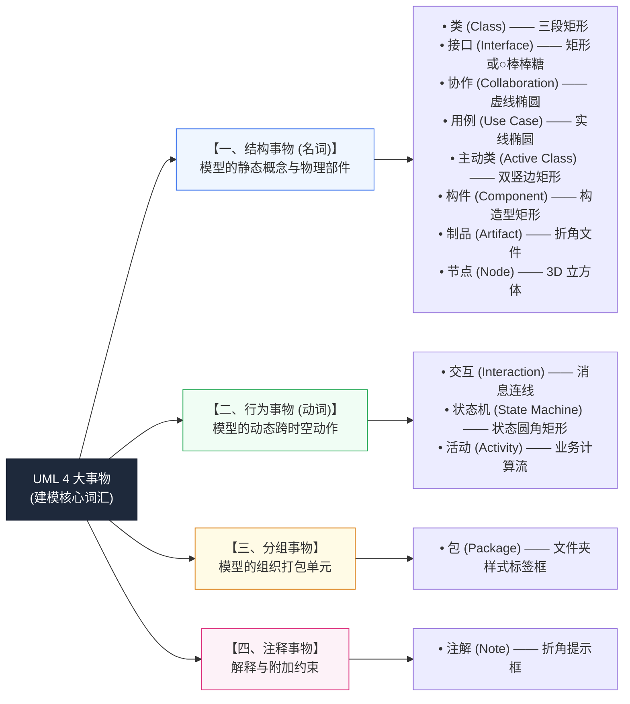

### 1.2 UML 2.0 动静态 14 图分类大树

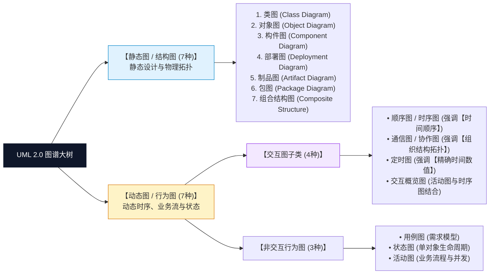

---

## 02. 类图 (Class Diagram) —— 静态设计视图核心

### 原理图解（对标官方教材经典企业模型）

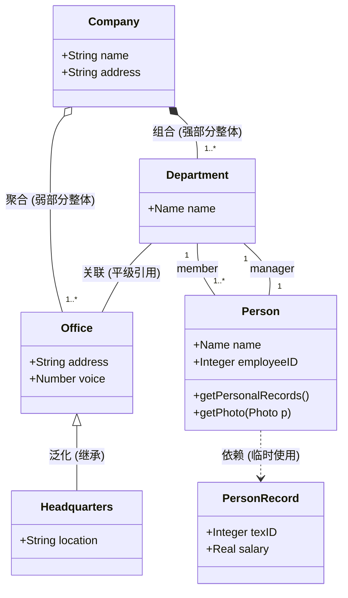

### 读图要领与考场题眼
1. **三段式矩形**：顶部类名（抽象类为*斜体*）、中部属性列表、底部方法列表。符号：`+` 公有、`-` 私有、`#` 保护、`~` 包级。
2. **菱形位置铁律（试题三必考）**：无论是实心菱形（组合）还是空心菱形（聚合），**菱形端永远在【整体】身上**！
3. **多重度与角色**：`1`（唯一）、`0..1`（可选）、`*` 或 `0..*`（零到多）、`1..*`（至少一个）；同一连线两端标注的角色名（如 `member` 与 `manager`）用来区分业务职责。

---

## 03. 对象图 (Object Diagram) —— 运行时快照与链

### 原理图解（某一运行瞬间的内存快照）

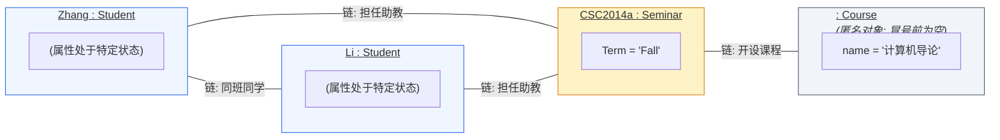

### 读图要领与考场题眼
1. **下划线标识**：对象名称必须带有下划线，格式为 `对象名 : 类名`、`对象名` 或 `: 类名`（**匿名对象**，冒号前留空，下午填空常考）。
2. **只有属性值，无方法列表**：对象图体现运行时具体的静态数据（如 `Term = 'Fall'`），不展示操作函数。
3. **连线称为“链（Link）”**：连线代表关联关系的具体实例，**两端绝不能标注多重度**。

---

## 04. 用例图 (Use Case Diagram) —— 需求模型与三大关系

### 原理图解（图书借阅系统经典模型）

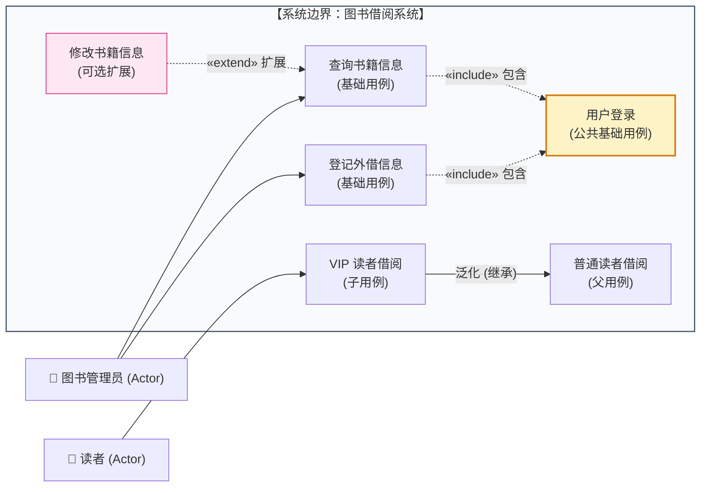

### 读图要领与考场题眼
1. **包含 (`<<include>>`)**：**必须无条件执行**。提取公共逻辑（借书、查书必定都要先登录）。**箭头方向：基础用例 ────▶ 被包含用例**。
2. **扩展 (`<<extend>>`)**：**有条件可选执行**。满足特定扩展点才触发（如修改信息是查询信息后的可选动作）。**箭头方向：扩展用例 ────▶ 基础用例**（方向相反，考场极高频易错点！）。
3. **泛化 (继承)**：特殊与一般的 `is-a` 关系。用**实线空心三角形 `--|>` 指向父类**。

---

## 05. 顺序图 / 时序图 (Sequence Diagram) —— 时间垂直生命线

### 原理图解（按时间次序组织的消息流）

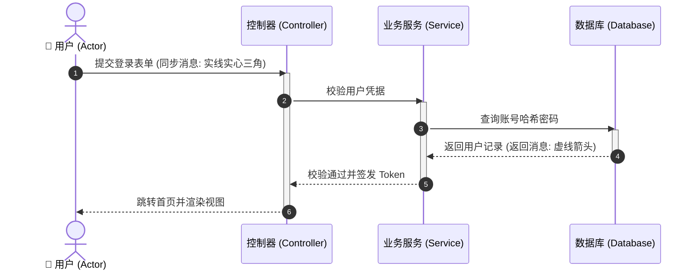

### 读图要领与考场题眼
1. **核心观察轴**：**垂直向下代表时间流逝**（越往下发生得越晚），水平排列对象。
2. **生命线与激活期**：垂直虚线为生命线；生命线上的狭长细矩形为**激活期（Activation）**，代表对象占有 CPU 正在执行。
3. **箭头含义**：`->>` 实线实心三角为**同步调用**（阻塞等待返回）；`->` 实线普通箭头为**异步调用**；`-->>` 虚线箭头为**返回消息**；生命线底部打大叉 `X` 表示**对象销毁**。

---

## 06. 通信图 / 协作图 (Communication Diagram) —— 空间拓扑与数字编号

### 原理图解（强调组织结构拓扑连接）

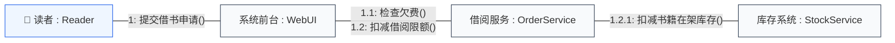

### 读图要领与考场题眼
1. **与顺序图语义等价**：顺序图强调时间，通信图强调**空间拓扑组织结构**，两者可无损互转。
2. **无垂直生命线**：执行次序完全依靠消息前的**层级数字前缀**（如 `1:`, `1.1:`, `1.2.1:`）来标注。
3. **秒杀题眼**：看到满屏网状方框连线上带有 `1.1`、`1.2` 消息序号的，**100% 选通信图（协作图）**。

---

## 07. 状态图 (Statechart Diagram) —— 单对象全生命周期变迁

### 原理图解（订单对象的生命状态流转）

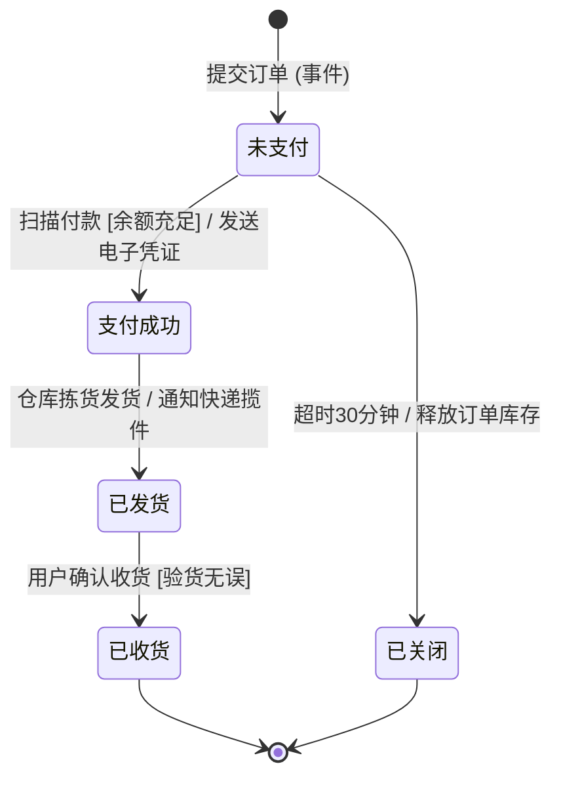

### 读图要领与考场题眼
1. **观察范围**：描述**单个对象在其整个生命周期内**因事件刺激而产生的状态迁移（不是整个系统！）。
2. **起始与终结**：`●` 实心圆点为初态（全局唯一）；`◉` 牛眼同心圆为终态（可多个或无）。
3. **转换标注标准语法**：
   $$\text{事件 (Event)} \; [\text{监护条件 (Guard)}] \; / \; \text{动作 (Action)}$$
   *监护条件必须用中括号 `[...]` 包裹，动作前面加斜杠 `/`*。

---

## 08. 活动图 (Activity Diagram) —— 并发分叉与泳道

### 原理图解（出差申请审批流与并发处理）

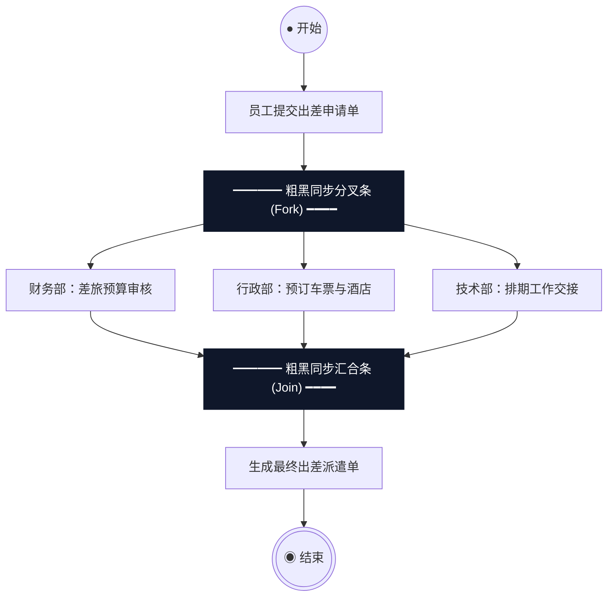

### 读图要领与考场题眼
1. **本质与进阶**：流程图的高级版，核心增强了**并发控制**与**泳道责任分配**。
2. **粗黑同步条（考场第一绝对标志物）**：
   - **分叉条 (Fork)**：一根粗黑线，一条输入线进入，引出多条并行向下的输出线；
   - **汇合条 (Join)**：一根粗黑线，多条并行线进入，只有当所有并行操作全部完成，才汇合为一条输出线继续向下。
3. **秒杀题眼**：**题干只要出现粗水平黑线/粗垂直黑线，答案无脑选活动图！**

---

## 09. 构件图 / 组件图 (Component Diagram) —— 软件封装与球窝接口

### 原理图解（模块解耦与供需接口装配）

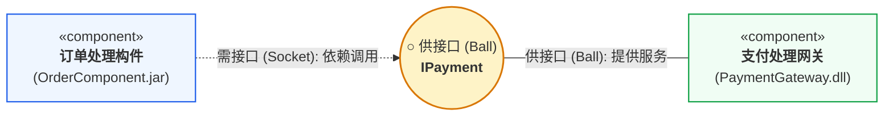

### 读图要领与考场题眼
1. **物理模块封装**：展现可执行代码、库、二进制模块（`.dll`, `.jar`, `.exe`）之间的依赖组织。
2. **球窝连接 (Ball-and-Socket)**：
   - **供接口（提供服务）**：完整圆球 `○`（棒棒糖），由实现该接口的构件引出实线连接；
   - **需接口（依赖服务）**：半圆凹槽/插座 `)`，由依赖该接口的构件引出虚线箭头指向圆球。

---

## 10. 部署图 (Deployment Diagram) —— 软硬件物理拓扑

### 原理图解（软件制品向硬件计算节点的映射）

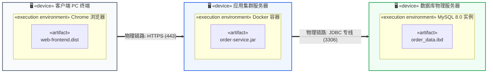

### 读图要领与考场题眼
1. **物理架构**：将软件构件或制品（Artifact）分配到具体的**物理计算节点（Node）**上。
2. **核心标志物**：**三维立体长方体（3D Box 节点）**。
3. **秒杀题眼**：看到带 `«device»`、物理服务器、计算设备、网络连接协议（HTTP, TCP/IP）的拓扑图，**100% 选部署图**。

---

## 附录：9 大图考场标志物一秒速杀对照表

| 图名称 | 动/静属性 | 一秒识别的“视觉标志物” | 考题标志性特征词 |
| :--- | :---: | :--- | :--- |
| **类图** | **静态** | 三段式矩形、继承三角、组合聚合菱形 | **静态设计视图**、多重度、类间关系 |
| **对象图** | **静态** | 名字带**下划线**（如 `<u>:Course</u>`）、无方法格 | **特定时刻快照 (Snapshot)**、链 |
| **用例图** | **动态** | 火柴人、椭圆、系统大矩形框 | **最基本需求模型**、`<<include>>`、`<<extend>>` |
| **顺序图** | **动态** | **垂直向下虚线（生命线）**、细矩形激活条 | **时间顺序**、调用消息、返回消息 |
| **通信图** | **动态** | 网状对象连线、**`1.1, 1.2` 消息数字编号** | 与顺序图等价、**对象组织结构拓扑** |
| **状态图** | **动态** | 初态实心圆、终态牛眼同心圆、圆角矩形 | **单对象生命周期**、`事件[条件]/动作` |
| **活动图** | **动态** | **粗黑水平/垂直同步条 (Fork/Join)** | 类似程序流程图、**并行分叉与汇合**、泳道 |
| **构件图** | **静态** | «component»、**供接口圆球与需接口插座** | 物理软件模块封装、`.dll/.jar` |
| **部署图** | **静态** | **3D 立方体节点**、网络连线标协议 | **软硬件映射**、物理节点 (Node) |
