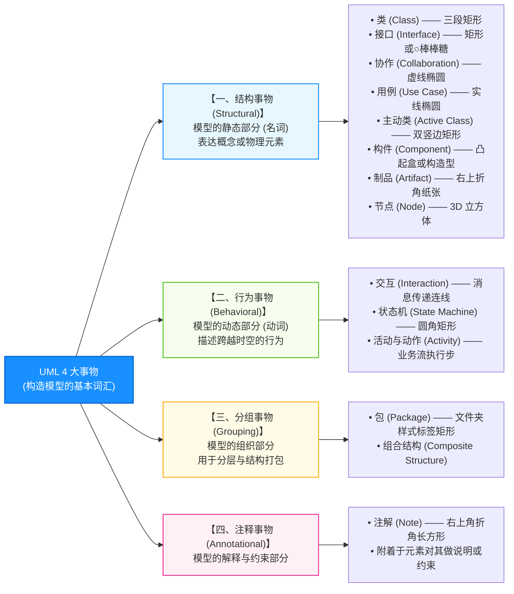
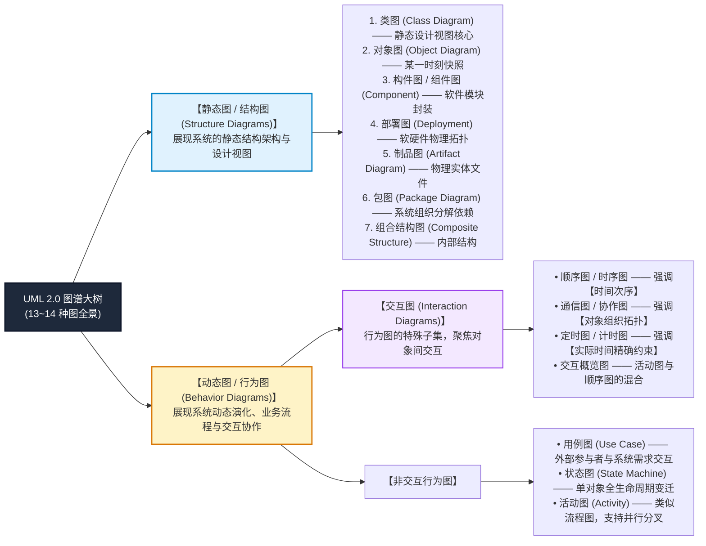
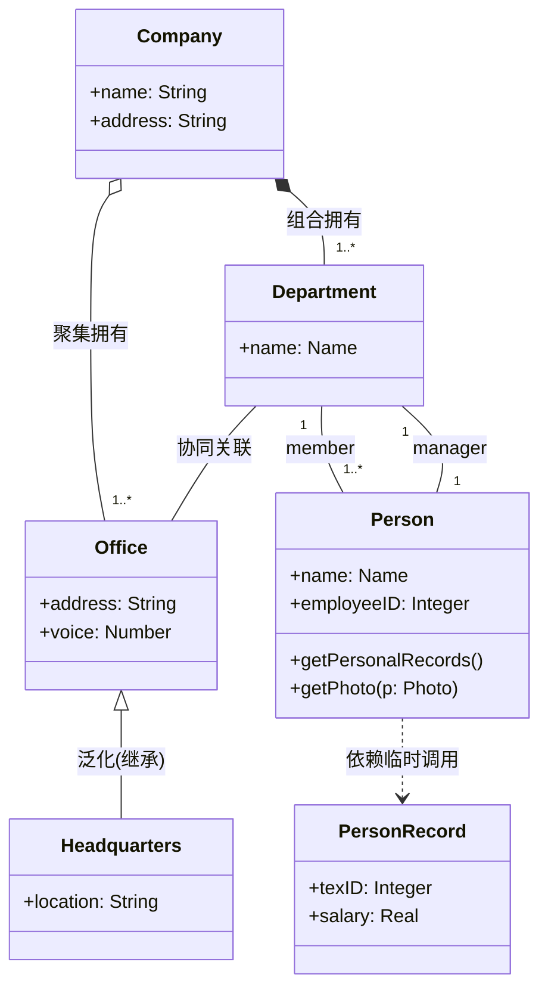
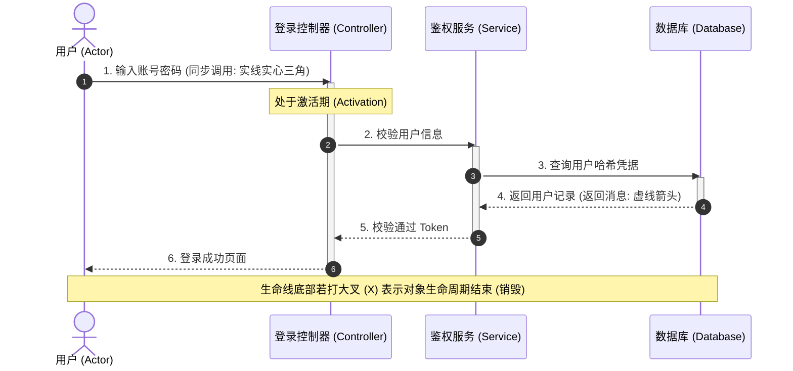
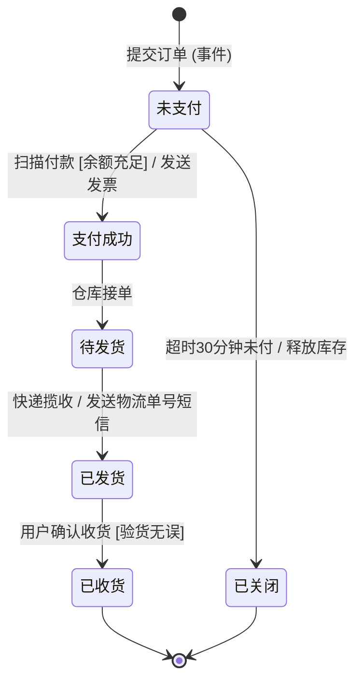
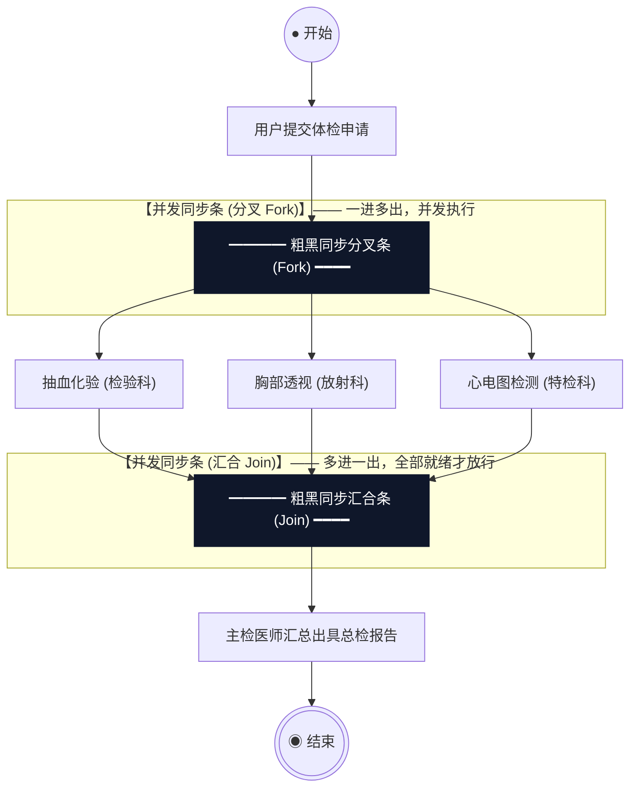

# 02-UML 核心建模图谱与设计视图全景图解

> **专栏定位**：软考中级《软件设计师》下午试题三（15分决胜盘）与上午面向对象高频考点（4~6分）专属攻坚宝典。  
> **编写依据**：UML 2.5 国际规范、清华版官方教材及文老师软考课件（全面覆盖 4 大事物、4 大关系及 9 大核心高频图）。  
> **核心特色**：拒绝纯文字概念堆砌，全量采用标准图示、微观机制流、核心辨析矩阵与命题挖空靶点，建立立体空间心智模型。

---

## 维度 1：【分值画像与考场战略定级】

- **上午场权重**：**4 ~ 6 分**（单选题，必考 UML 图动静分类、图例特征辨析、用例包含/扩展关系、状态图转换标签）。
- **下午场权重**：**整整 15 分！【下午试题三：面向对象分析与设计】的绝对主战场**！
  - 考查形式：给出一篇 800~1200 字的项目背景与业务规则，要求补充完整 **用例图**、**类图（补全类名/属性/方法/多重度/关系连线）** 或 **顺序图/状态图/活动图**，并回答用例关系与设计模式辨析问答。
- **性价比评星**：★★★★★（全卷最高性价比，得分即拉开分差的黄金题型）。
- **通关战略建议**：
  - 上午单选抓**“标志物”**（看到 3D 立方体选部署图，看到粗黑同步条选活动图，看到生命线选顺序图）；
  - 下午大题抓**“语义关系与多重度”**（菱形永远在整体端，包含是必须、扩展是可选，角色多重度从题干逐字提取）。

---

## 维度 2：【UML 构造基石：4大事物 + 4大关系 + 14图分类全景大树】

UML（Unified Modeling Language，统一建模语言）的基本构造块由 **事物（Things）**、**关系（Relationships）** 和 **图（Diagrams）** 构成。

### 1. UML 4 大事物分类与标志符号全景



---

### 2. UML 2.0 动静态 14 种图分类全景大树（上午必考 1 题！）



---

## 维度 3：【高频核心 9 大图微观机制原理图解与考点深度剖析】

---

### 1. 类图（Class Diagram，静态设计视图 · 下午试题三命根子）

#### 1.1 核心定义与官方教材经典模型
- **核心定义**：展现了一组类、接口、协作以及它们之间的静态结构与关系，是面向对象设计的主骨架。
- **三段式结构**：
  - **顶部**：类名（抽象类字体为斜体）；
  - **中间**：属性列表 `[可见性] 属性名 : 类型 [= 默认值]`；
  - **底部**：方法/操作列表 `[可见性] 方法名(参数列表) : 返回类型`。
- **可见性修饰符**：
  - `+`：`public`（公有）
  - `-`：`private`（私有）
  - `#`：`protected`（保护）
  - `~`：`package`（包内私有）

#### 1.2 官方经典类图原理图解（对应课件教材图 10-11）



> [!IMPORTANT]
> **🌟 试题三连线大表必考靶点**：
> 1. **多重度（Multiplicity）必填**：
>    - `1`：必须且仅有 1 个；
>    - `0..1`：0 个或 1 个（可选）；
>    - `*` 或 `0..*`：0 个到多个；
>    - `1..*`：至少 1 个，上不封顶。
> 2. **角色名标注**：连线两端如出现多个相同类，通过角色区分（如部门中员工标注 `member`，负责人标注 `manager`）。
> 3. **接口两种表现法**：
>    - 构造型矩形：类指向带有 `<<interface>>` 的矩形（用虚线空心三角 `..|>` 连接）；
>    - 棒棒糖法（Lollipop）：类引出一根实线连接一个小圆圈 `○`。

---

### 2. 对象图（Object Diagram，某一时刻快照）

#### 2.1 核心定义与题眼
- **核心定义**：展现了在**某一特定时刻**一组对象以及它们之间的关系。**对象图是类图的某一“运行快照”（Snapshot）**。
- **与类图的核心区别**：
  1. **类名有下划线**：对象必须加下划线表示实例，命名格式为：
     - `Zhang : Student`（包含对象名和类名）
     - `: Course`（**匿名对象**，只写类名，冒号前为空，下午常考填空！）
     - `Student1`（只写对象名）
  2. **只有属性值，没有操作列表**：对象是静态数据承载体，只记录具体属性取值（如 `Term = "Fall"`），不列操作。
  3. **关系称为“链（Link）”**：对象间连线是类间关联关系的实例，**两端绝不能标注多重度**（因为实例个数已经完全具象化了）。

#### 2.2 官方经典对象图原理图解（对应课件教材图示）

```text
┌────────────────────────┐                    ┌────────────────────────┐
│     Zhang : Student    │───────────────────▶│   CSC2014a : Seminar   │
├────────────────────────┤   (链: 担任助教)   ├────────────────────────┤
│ (属性处于特定状态)     │                    │ Term = "Fall"          │
└────────────────────────┘                    └────────────────────────┘
            │                                              ▲
            │ (链: 同学)                                   │
            ▼                                              │ (链: 归属课程)
┌────────────────────────┐                    ┌────────────────────────┐
│      Li : Student      │                    │        : Course        │
├────────────────────────┤                    ├────────────────────────┤
│ (属性处于特定状态)     │                    │ name = "计算机导论"    │
└────────────────────────┘                    │ (匿名对象: 冒号前为空) │
                                              └────────────────────────┘
```

---

### 3. 用例图（Use Case Diagram，需求分析与试题三前哨站）

#### 3.1 核心定义与三大要素
- **核心定义**：展现了一组**用例（Use Case）**、**参与者（Actor）** 以及它们之间的交互关系，是**需求分析阶段最基本的模型**。
- **3 大核心要素**：
  - **参与者（Actor）**：火柴人图形。**不仅是人，还可以是外部硬件设备、外部定时器或其他外部系统**！
  - **用例（Use Case）**：水平椭圆形。表示系统为参与者执行的一组完整业务操作并产生有价值的结果（用动宾短语命名，如“查询书籍信息”）。
  - **系统边界（System Boundary）**：大矩形框，系统用例包含在框内，参与者立于框外。

#### 3.2 用例间 3 大高频关系（下午试题三必考判定！）

```mermaid
flowchart LR
    subgraph SystemBoundary["【系统边界: 图书借阅管理系统】"]
        direction TB
        UC_Borrow["登记外借信息<br>(基础用例)"]
        UC_Login["用户登录<br>(共用基础用例)"]
        UC_Search["查询书籍信息<br>(基础用例)"]
        UC_Modify["修改书籍信息<br>(可选扩展用例)"]
        UC_Card["普通读者办卡<br>(父用例)"]
        UC_VIPCard["VIP读者办卡<br>(子用例)"]

        UC_Borrow -->|"<<include>>"| UC_Login
        UC_Search -.->|"<<include>>"| UC_Login
        UC_Modify -.->|"<<extend>>"| UC_Search
        UC_VIPCard ──▷ UC_Card
    end

    Actor["图书管理员<br>(Actor)"] --> UC_Borrow
    Actor --> UC_Search
    Reader["借阅读者<br>(Actor)"] --> UC_VIPCard

    style SystemBoundary fill:#f8fafc,stroke:#334155,stroke-width:1.5px
    style UC_Borrow fill:#eff6ff,stroke:#2563eb
    style UC_Login fill:#fef3c7,stroke:#d97706,stroke-width:2px
    style UC_Modify fill:#fce7f3,stroke:#db2777
    style UC_Search fill:#eff6ff,stroke:#2563eb
```

> [!IMPORTANT]
> **🔥 用例关系考场秒杀辨析表**：
> - **包含关系 (`<<include>>`)**：
>   - **题眼**：“必须”、“必然发生”、“提取公共步骤”。
>   - **箭头方向**：**基础用例指向被包含用例**（从“登记外借”指向“用户登录”）。
> - **扩展关系 (`<<extend>>`)**：
>   - **题眼**：“可选”、“在特定条件下触发”、“异常补充”。
>   - **箭头方向**：**扩展用例指向基础用例**（从“修改信息”指向“查询信息”，极易反向扣分！）。
> - **泛化关系 (继承)**：
>   - **题眼**：“is-a”、“特殊与一般”。用实线空心三角形指向父用例或父参与者。

---

### 4. 顺序图 / 时序图（Sequence Diagram，强调时间次序）

#### 4.1 核心定义与空间维度
- **核心定义**：一种交互图，**强调按“时间顺序”组织的对象之间的消息交互**。
- **两大空间维度（必考）**：
  - **水平维度**：排列参与交互的对象（独立参与者/对象）；
  - **垂直维度**：**生命线（从上至下表示时间推移，越往下时间越晚）**。

#### 4.2 核心元素与微观原理时序图解



> **🔥 考点题眼**：
> 1. **同步消息**：实线实心三角箭头（`->>`），调用者必须等待返回才能继续；
> 2. **异步消息**：实线开放普通箭头（`->`），发出后无需等待，继续向下执行；
> 3. **返回消息**：虚线箭头（`-->>`）；
> 4. **激活期（Activation）**：生命线上的狭长细矩形，表示对象正在执行操作或等待。

---

### 5. 通信图 / 协作图（Communication Diagram，强调对象拓扑结构）

#### 5.1 核心定义与语义等价性
- **核心定义**：UML 1.x 称为“协作图”，UML 2.0 正式更名为“通信图”。它与顺序图在语义上是**完全等价的（可相互无损转换）**。
- **与顺序图的根本区别**：
  - **通信图没有垂直生命线**！它强调参加交互的**对象组织结构（拓扑网络关系）**；
  - **时间次序通过消息前缀的数字序号表达**（如 `1: login()`, `1.1: verify()`, `1.2: query()`, `2: showHome()`）。

#### 5.2 拓扑网络图示

```text
┌──────────────────────┐   1: 提交借书申请()   ┌──────────────────────┐
│     读者 : Reader    │─────────────────────▶│  系统前台 : WebUI    │
└──────────────────────┘                      └──────────────────────┘
                                                          │
                                                          │ 1.1: 检查欠费()
                                                          │ 1.2: 扣减库存()
                                                          ▼
                                              ┌──────────────────────┐
                                              │   库存服务 : Service │
                                              └──────────────────────┘
```

> **💡 考场秒杀口诀**：**“顺序图看垂直生命线，通信图看网状数字点”**。看到图里满屏幕 `1.1, 1.2, 2.1` 序号连在网状方块之间的，必定是**通信图（协作图）**。

---

### 6. 状态图（State Machine Diagram，单对象生命周期演化）

#### 6.1 核心定义与题眼
- **核心定义**：描述**单个对象在其整个生命周期内**，因接收外部事件刺激而发生的状态演化序列，以及对事件的响应动作。
- **三大约束符号**：
  - **初态（Initial State）**：实心黑色实心圆点 `●`（一个状态图只能有 1 个初态）；
  - **终态（Final State）**：牛眼圆圈或同心圆（外圈细实线圆，内圈实心圆点 `◉`，可有多个或无）；
  - **状态（State）**：圆角矩形。内部可细分为：
    - `entry / 操作`：进入该状态立即执行；
    - `do / 操作`：处于该状态持续执行；
    - `exit / 操作`：退出该状态前执行。

#### 6.2 状态变迁三要素公式与微观状态图解

$$\text{状态转换标签语法标准：}\quad \text{事件 (Event)} \; [\text{监护条件 (Guard)}] \; / \; \text{动作 (Action)}$$



> **🔥 考点题眼**：监护条件必须用方括号 `[...]` 包裹，它是一个布尔表达式；斜杠 `/` 后面是状态迁移触发时瞬间执行的动作。

---

### 7. 活动图（Activity Diagram，工作流与并行分叉神器）

#### 7.1 核心定义与题眼
- **核心定义**：描述系统从一个活动到另一个活动的控制流，本质是一种高级程序流程图。
- **与传统程序流程图的本质升华**：
  1. **支持并发分叉与汇合（Fork & Join）**；
  2. **支持泳道（Swimlanes）划分组织责任**；
  3. 支持对象流（在活动间流转的数据对象）。

#### 7.2 核心要素与并发泳道图解



> **🔥 考场标志性题眼**：
> - **分叉（Fork）**：一个箭头进入粗黑线，引出多个并行向下的箭头；
> - **汇合（Join）**：多个并行箭头发向粗黑线，最终只引出一个箭头继续向下；
> - **只要在选择题题干截图中看到【粗水平黑线/粗垂直黑线】，答案 100% 是活动图！**

---

### 8. 构件图 / 组件图（Component Diagram，物理代码封装视图）

#### 8.1 核心定义与题眼
- **核心定义**：展现了一组构件之间的组织与依赖关系，描述了系统的**软件物理模块封装结构**（如 `.dll`, `.jar`, `.exe`, 共享库等）。
- **接口两种标志形态（球窝连接 Ball-and-Socket）**：
  - **供接口（Provided Interface）**：构件对外提供的服务，用**实线 + 完整圆圈（球形/棒棒糖）**表示；
  - **需接口（Required Interface）**：构件正常运行所依赖的外部服务，用**半圆/圆弧（插座/凹槽）**表示；
  - **装配连接（Assembly Connector）**：供接口球体嵌入需接口插座内，表达两个组件无缝对接。

#### 8.2 构件与球窝接口图解

```text
┌───────────────────────────────┐                  ┌───────────────────────────────┐
│  «component» 订单处理组件     │                  │  «component» 银行支付网关     │
│                               │   装配连接       │                               │
│                     ┌───┐     │ (供需无缝嵌合)   │     ( )                       │
│                     │   │ ────┼─────( )──────────┼────▶ │ 支付接口               │
│                     └───┘     │  需接口  供接口  │                               │
└───────────────────────────────┘                  └───────────────────────────────┘
```

---

### 9. 部署图（Deployment Diagram，软硬件物理映射）

#### 9.1 核心定义与题眼
- **核心定义**：展现了系统的**软硬件物理架构**。将软件构件或制品（Artifact）部署到具体的**物理硬件计算节点（Node）**上。
- **核心标志物**：**三维立体长方体 / 立方体（3D Box）**！
  - 节点内部可以包含构件、可执行制品或运行环境（如 `<<device>> 数据库服务器`, `<<execution environment>> Tomcat`）；
  - 节点之间的连线是**物理通信路径**，实线上通常标注协议（如 `HTTP`, `TCP/IP`, `gRPC`, `JDBC`）。

#### 9.2 物理部署拓扑图解

```text
       ┌────────────────────────┐                   ┌────────────────────────┐
      ╱                        ╱│  物理网络连线     ╱                        ╱│
     ┌────────────────────────┐ │ (TCP/IP: 443)    ┌────────────────────────┐ │
     │   «device» 客户端PC    │ │─────────────────▶│ «device» 应用服务器群  │ │
     │  ┌──────────────────┐  │ │                  │  ┌──────────────────┐  │ │
     │  │ Chrome 浏览器    │  │ │                  │  │ SpringBoot Web   │  │ │
     │  └──────────────────┘  │╱                   │  └──────────────────┘  │╱
     └────────────────────────┘                    └────────────────────────┘
                                                               │
                                                               │ (JDBC: 3306)
                                                               ▼
                                                   ┌────────────────────────┐
                                                  ╱                        ╱│
                                                 ┌────────────────────────┐ │
                                                 │ «device» MySQL 数据库  │ │
                                                 │  ┌──────────────────┐  │ │
                                                 │  │ order_db.ibd     │  │ │
                                                 │  └──────────────────┘  │╱
                                                 └────────────────────────┘
```

> **🔥 考场标志性题眼**：
> - 看到 **3D 立方体**、看到带 `<<device>>`、服务器、网络节点，**100% 选部署图**！

---

## 维度 4：【考场四大核心辨析矩阵（上午选择题秒杀神器）】

### 矩阵 1：UML 9 大高频图动静态、视角与考场标志词秒杀大表

| 图谱名称 | 动/静态 | 核心观察视角与表达内容 | 考场绝对标志词（选它的题眼） |
| :--- | :---: | :--- | :--- |
| **类图 (Class)** | **静态** | 类、接口、协作及其静态关系（三段式矩形） | 系统的**静态设计视图**、多重度、泛化/关联 |
| **对象图 (Object)** | **静态** | **某一特定时刻**一组对象及其链（快照） | **快照 (Snapshot)**、下划线对象名、无操作栏 |
| **构件图 (Component)** | **静态** | 软件构件封装与接口装配 | **供接口/需接口**、球窝连接、`.dll/.jar`物理模块 |
| **部署图 (Deployment)**| **静态** | 软硬件物理拓扑架构（构件到物理节点的映射） | **3D 立方体**、节点 (Node)、硬件拓扑、协议连线 |
| **用例图 (Use Case)** | **动态/行为** | 系统外部参与者与功能交互（需求模型） | **最基本需求模型**、参与者、`include/extend` |
| **顺序图 (Sequence)** | **动态/交互** | **强调按“时间顺序”**组织的对象交互 | **时间垂直轴**、生命线、激活期、消息箭头 |
| **通信图 (Communication)**| **动态/交互**| **强调参与交互对象的“组织结构”** | 与顺序图等价、**数字次序编号 (1.1, 1.2)**、网络拓扑 |
| **状态图 (Statechart)** | **动态/行为** | **单个对象在其全生命周期内**的状态迁移 | **单对象生命周期**、事件触发、`事件[条件]/动作` |
| **活动图 (Activity)** | **动态/行为** | 类似程序流程图，描述业务操作控制流 | **并发分叉与汇合 (粗黑同步条)**、泳道责任划分 |

---

### 矩阵 2：交互图双雄 —— 顺序图 vs 通信图 深度辨析

| 对比维度 | 顺序图 / 时序图 (Sequence) | 通信图 / 协作图 (Communication) |
| :--- | :--- | :--- |
| **核心表达重心** | **时间次序（何时做）**：严格的自顶向下时间流逝 | **空间结构（谁和谁连）**：对象间的物理或逻辑拓扑连接 |
| **时间次序表达机制** | 靠**垂直向下的生命线**物理排布次序 | 靠连线上的**层级数字前缀**（如 `1:`, `1.1:`, `2:`） |
| **对象生命期管理** | 清晰呈现激活条与底部大叉（销毁） | 无法清晰展现对象创建与销毁的具体时间点 |
| **互换性** | **两者在语义上完全等价**，现代建模工具均支持 1:1 无损相互转换 |

---

### 矩阵 3：用例图 3 大关系判定矩阵（下午试题三填空常考）

| 关系名称 | 触发条件与本质特征 | 箭头方向（核心踩分点） | 典型业务场景例句 |
| :--- | :--- | :--- | :--- |
| **包含 (`<<include>>`)** | **无条件必须执行**：基础用例启动后，必定调用被包含用例；用于抽取多个用例的公共逻辑 | **基础用例 ────▶ 被包含用例**<br>*(指向公共子逻辑)* | 借书、还书、查书**必定都要【用户登录】** |
| **扩展 (`<<extend>>`)** | **有条件可选执行**：基础用例执行到扩展点（Extension Point）且满足特定条件时才触发 | **扩展用例 ────▶ 基础用例**<br>*(特别注意：指向原基础用例！)* | 考试交卷后，**如果成绩不及格才【申请重考】**；修改信息后**可选【发送提醒短信】** |
| **泛化 (继承)** | **特殊与一般 (is-a)**：子用例继承父用例所有行为与属性，并可进行特殊扩展 | **子用例 ────▷ 父用例**<br>*(实线空心三角指父类)* | “微信支付”与“支付宝支付”泛化为“在线支付” |

---

## 维度 5：【下午试题三满分踩分大招与秒杀口诀】

### 1. 试题三长文本快速定位 4 步法
- **第一步：看关系定框架**：
  - 扫视类图骨架，找大三角形（继承）、实心菱形（组合）、空心菱形（聚合）。
- **第二步：找题干特征词抓类名**：
  - 题干中出现“每个部门包含多名员工”、“公司由总公司和分公司组成”，直接定位实体类名；
- **第三步：挖空多重度代入**：
  - 找“至少一个”填 `1..*`；找“可能没有，最多一个”填 `0..1`；找“一对一”两端填 `1`；
- **第四步：设计模式名称回填（最后 1 问）**：
  - 结合题目给出的骨架代码辨析 23 种设计模式（抽象工厂、策略、观察者、状态模式占考题 80%）。

---

### 2. UML 考场 5 句通关押韵口诀

> **UML 图谱看分明，静态动态记于心；**  
> **时序强调时间线，通信拓扑标序号；**  
> **状态单体度余生，活动粗线是并发；**  
> **菱形长在整体身，包含必须扩展挑；**  
> **三维盒子部署图，软硬映射分不差！**
