# 03-设计模式核心图谱与真题命题密码（考霸通关专著）

> **【考霸极速直达通道】**：
> * 🚀 考前 5 分钟急救：直接跳转 [4.1 23 种设计模式考场特征词一秒速杀总表](#41-23-种设计模式考场特征词一秒速杀全景总表上午单选极速通关神表)
> * 🎯 下午 15 分代码大题：直接跳转 [4.2 下午试题五六万能解题套路与 5 大挖空靶点](#42-下午试题五六java-c-15分大题万能解题套路与-5-大挖空靶点)
> * ⚔️ 排除干扰防坑矩阵：直接跳转 [3.1 五大经典孪生模式决斗辨析矩阵](#31-五大经典孪生模式决斗辨析矩阵专攻命题人挖坑单选)

---

## 🏛️ 第一部分：宏观认知与战略定级（金字塔塔尖·全局俯瞰）

### 1.1 软件模式三层次体系辨析（上午概念单选必考）

在软考上午场，命题人常考“模式三层次划分”，切勿将宏观架构模式与微观设计模式混为一谈：

| 层次级别 | 概念定义 | 适用范围 / 抽象级别 | 典型代表（考场必选） |
| :--- | :--- | :--- | :--- |
| **架构模式 (Architectural Pattern)** | 软件系统的高层组织结构和宏观蓝图，决定了子系统划分、通信机制与系统级非功能属性。 | **最高层**（全局系统级架构） | MVC、三层架构、管道-过滤器 (Pipe-Filter)、微服务、黑板模式 (Blackboard)、分层模式 |
| **设计模式 (Design Pattern)** | 解决子系统或模块内部特定设计问题的中观结构方案，细化类与对象的职责分配与协作。 | **中层**（模块/子系统结构） | **GoF 23 种设计模式**（单例、策略、观察者、工厂、装饰、适配器等） |
| **代码惯用法 (Idiom / 编码风格)** | 特定编程语言中解决底层具体实现问题的微观技巧，与编程语言特性强绑定。 | **最底层**（语言级微观实现） | C++ 的 RAII 资源获取即初始化、Java 的双重检查锁定 (DCL)、引用计数指针 |

---

### 1.2 GoF 23 种设计模式分类总纲

根据模式的**目的与意图**，GoF 将 23 种设计模式划分为三大经典家族：

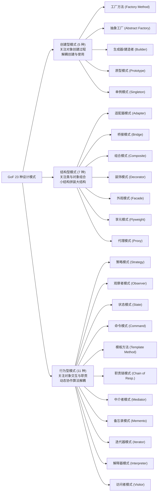

---

### 1.3 作用范围二分法：4 大类模式 vs 19 大对象模式（下划线送分考点）

> [!IMPORTANT]
> **【考场送分法则】**：
> 软考单选题常出现：*“以下属于类模式的是（ ）”*。
> 绝大多数（19 种）都是**对象模式**（基于组合/委托，运行期动态绑定）。**类模式仅有 4 个**（基于继承，编译期静态确定）。

| 作用范围 | 核心机制 | 绑定时期 | 涵盖模式（死记 4 个类模式即可） | 记忆口诀 |
| :--- | :--- | :--- | :--- | :--- |
| **类模式 (Class Pattern)**<br>*(仅 4 种)* | 处理类与子类之间的**继承关系** | **编译期**<br>(静态) | 1. **工厂方法模式 (Factory Method)** (创建型)<br>2. **类适配器模式 (Class Adapter)** (结构型)<br>3. **解释器模式 (Interpreter)** (行为型)<br>4. **模板方法模式 (Template Method)** (行为型) | **“厂配解模”**<br>（**工**厂、**适**配、**解**释、**模**板） |
| **对象模式 (Object Pattern)**<br>*(其余 19 种)* | 处理对象之间的**组合/聚合/关联** | **运行期**<br>(动态) | 抽象工厂、生成器、原型、单例、对象适配器、桥接、组合、装饰、外观、享元、代理、策略、观察者、状态、命令、职责链、中介者、备忘录、迭代器、访问者 | 除去 4 个类模式，其余全选对象模式 |

---

### 1.4 80/20 真题考频全景雷达与 ABC 梯队战略

软考历年真题具有显著的**马太效应**，23 个设计模式切忌平均用力！考生必须按梯队作战：

* **★ 梯队 A：核心核武库（8 种·占下午 15 分大题 90% 出题率）**
  * 涵盖：**策略、观察者、工厂方法/抽象工厂、状态、命令、装饰、适配器、组合**
  * 攻坚要求：背熟参与者角色类图，必须能够默写 Java/C++ 多态委托调用与填空！
* **★★ 梯队 B：高频常客（9 种·上午 3~5 分题眼大户）**
  * 涵盖：**单例、建造者、原型、桥接、外观、模板方法、中介者、备忘录、职责链**
  * 攻坚要求：抓死题干特征词（如“两维度独立变化”、“分步构建”、“撤销重做”），10 秒排除干扰项。
* **★★★ 梯队 C：冷门防冷箭（6 种·考前 3 分钟混眼熟）**
  * 涵盖：**享元、代理、迭代器、解释器、访问者**
  * 攻坚要求：仅记定义与一句话典型场景（如文法解析、细粒度共享、双重分派），不做复杂代码推导。

---

## 🧩 第二部分：GoF 23 种设计模式 6 维深度全解（中层支柱）

### 【第一篇：创建型模式 (Creational Patterns，5 种)】

> **创建型心法**：**“解耦对象的创建与使用”**。类创建型模式使用继承改变实例化的类；对象创建型模式将实例化委托给另一个对象。

---

#### 01. 工厂方法模式 (Factory Method) —— 延迟到子类实例化的延期支票

`类模式 (编译期继承绑定)` | `考频：★★★★★ (Tier A 必考大题)` | `生活类比：披萨加盟连锁店（分店决定具体口味）`

* **痛点场景**：框架只知道何时需要创建对象，但无法预知需要创建哪种具体类的对象，希望避免具体产品类硬编码在客户端。
* **核心解法**：定义一个创建对象的抽象接口，将具体类的**实例化延迟到子类**完成。
* **考场题眼**：**“定义一个创建对象的接口，让子类决定实例化哪一个类”**、**“使类的实例化延迟到其子类”**、**“单一产品等级结构”**、**“符合开闭原则”**。
* **架构代价**：新增产品只需扩展具体工厂子类和产品子类，完全符合开闭原则；但系统中类数量成对成倍增加。

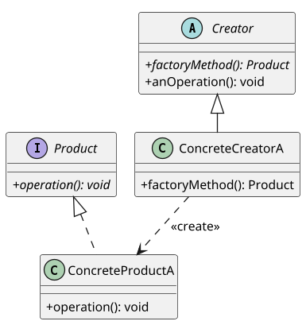

* **下午题核心填空靶点 (C++ / Java)**：
  * 工厂纯虚函数声明：`virtual Product* factoryMethod() = 0;` (C++) / `public abstract Product factoryMethod();` (Java)
  * 具体工厂返回实例化：`return new ConcreteProductA();`
  * 客户端多态调用：`Creator* creator = new ConcreteCreatorA(); Product* p = creator->factoryMethod();`

---

#### 02. 抽象工厂模式 (Abstract Factory) —— 成套产品家族的超级军工厂

`对象模式 (运行期组合委托)` | `考频：★★★★★ (Tier A 必考大题)` | `生活类比：宜家成套家居（极简风沙发+极简风茶几）`

* **痛点场景**：系统需要创建一系列**相互关联或相互依赖的产品族**，必须强制保证客户端始终使用同一族产品，杜绝风格乱搭。
* **核心解法**：提供一个创建**一系列相关或相互依赖对象**的接口，而无需指定它们具体的类。
* **考场题眼**：**“创建一系列相关或相互依赖的对象，而无需指定它们具体的类”**、**“产品族 (Product Family)”**、**“多个产品等级结构”**、**“保证产品族一致性”**。
* **架构代价**：切换整套产品族极其轻松；但**增加新产品等级（新种类）极难**，需要修改抽象工厂接口及所有子类，破坏开闭原则（开闭原则倾斜性）。

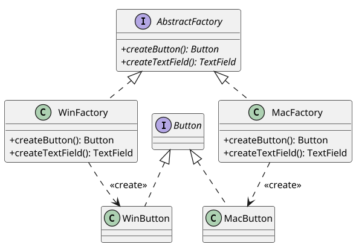

* **下午题核心填空靶点 (C++ / Java)**：
  * 工厂接口声明多个产品生产方法：`public Button createButton();` 与 `public TextField createTextField();`
  * 具体工厂成套实例化配对：`WinFactory` 内部统一创建并返回 `new WinButton()` 与 `new WinTextField()`。

---

#### 03. 生成器 / 建造者模式 (Builder) —— 复杂对象精细化分步装配

`对象模式` | `考频：★★★★☆ (Tier B 高频常客)` | `生活类比：赛百味做三明治（店长指定工序，装配工操作）`

* **痛点场景**：复杂对象由多个零部件按特定顺序装配而成，直接调用构造函数会导致参数爆炸，且装配算法与部件制作紧密耦合。
* **核心解法**：将复杂对象的**构建与它的表示分离**，使得**同样的构建过程可以创建不同的表示**；由 Director 统一控制装配步骤，由 Builder 负责生产零部件。
* **考场题眼**：**“将一个复杂对象的构建与它的表示分离，使得同样的构建过程可以创建不同的表示”**、**“分步骤 (Step-by-step) 逐步构建”**、**“Director 负责装配流程”**。
* **架构代价**：精细控制构建过程，解耦装配算法；但若产品之间零部件差异过大，则无法共用建造者。

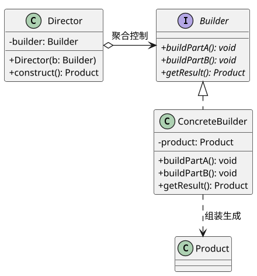

* **下午题核心填空靶点**：
  * 指挥者装配方法内链式调用：`builder.buildPartA(); builder.buildPartB(); return builder.getResult();`

---

#### 04. 原型模式 (Prototype) —— 细胞分裂式克隆母体

`对象模式` | `考频：★★★☆☆ (Tier B 概念单选)` | `生活类比：复印机复印策划案（基于母本快速生成副本）`

* **痛点场景**：通过 `new` 直接实例化对象的代价太高（如需要读取大文件、数据库或网络初始化），或者需要批量生成初始状态一致的对象副本。
* **核心解法**：用原型实例指定创建对象的种类，并且通过**拷贝/克隆这些原型**创建新的对象。
* **考场题眼**：**“用原型实例指定创建对象的种类，并且通过拷贝这些原型创建新的对象”**、**“clone() / 克隆”**、**“浅拷贝与深拷贝”**。
* **架构代价**：动态增减产品，性能极高；但每个类都必须实现克隆方法，复杂嵌套对象的深拷贝容易引发内存与共享隐患。

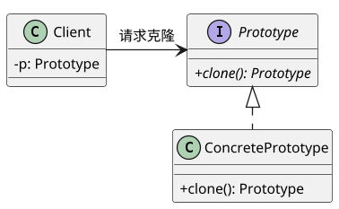

* **考场核心语句**：`return (ConcretePrototype) super.clone();` (Java) 或 `return new ConcretePrototype(*this);` (C++ 拷贝构造)。

---

#### 05. 单例模式 (Singleton) —— 独一无二的至高统领

`对象模式` | `考频：★★★★☆ (Tier B 高频考点)` | `生活类比：公司唯一的财务总监（谁报销都只能找这一个人）`

* **痛点场景**：系统运行生命周期中有且仅能存在一个全局实例（如日志管理器、任务调度器、打印池），防止多头操作导致状态错乱。
* **核心解法**：私有化构造函数防止外部 `new`；类自身维护一个静态私有唯一实例，并对外提供全局静态访问方法 `getInstance()`。
* **考场题眼**：**“保证一个类仅有一个实例，并提供一个访问它的全局访问点”**、**“私有构造函数 (private)”**、**“static 静态唯一实例”**、**“getInstance()”**。
* **架构代价**：对唯一实例提供受控访问，极大节约系统内存；但没有抽象层不易扩展，且在单元测试中难以被 Mock。

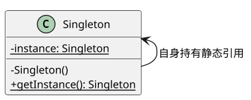

* **下午题核心填空靶点 (懒汉式延迟加载)**：
  ```java
  private static Singleton instance = null;
  private Singleton() {} // 挖空：私有构造函数
  public static Singleton getInstance() {
      if (instance == null) { instance = new Singleton(); } // 挖空：判空并实例化
      return instance;
  }
  ```

---

### 【第二篇：结构型模式 (Structural Patterns，7 种)】

> **结构型心法**：**“关注类和对象的组合，构建更大更灵活的结构”**。类模式采用继承机制组合接口；对象模式描述如何对对象进行动态组合以实现新功能。

---

#### 06. 适配器模式 (Adapter) —— 解决接口不兼容的万能转换插头

`类模式 / 对象模式兼具` | `考频：★★★★★ (Tier A 必考大题)` | `生活类比：电源转接头（国标扁插头转欧标双圆孔）`

* **痛点场景**：想要复用现有的老旧类，但它的接口与当前系统要求的接口不兼容，且无法修改老类的源代码。
* **核心解法**：将一个类的接口**转换成客户希望的另外一个接口**，使原本由于接口不兼容而不能一起工作的类协同工作。
* **考场题眼**：**“将一个类的接口转换成客户希望的另外一个接口”**、**“接口不兼容”**、**“包装器 (Wrapper)”**、**“Target（目标）、Adaptee（适配者）、Adapter（适配器）”**。
* **架构代价**：极佳地复用了现有代码；但过多使用会使系统结构凌乱，增加调用链理解难度。

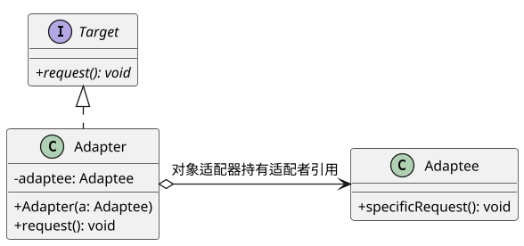

* **下午题核心填空靶点 (C++ / Java)**：
  * 适配器类实现目标接口：`public class Adapter implements Target`
  * 内部持有被适配者引用：`private Adaptee adaptee;`
  * 委托转换调用：`public void request() { adaptee.specificRequest(); }`

---

#### 07. 桥接模式 (Bridge) —— 独立双维度的自由立交桥

`对象模式` | `考频：★★★★☆ (Tier B 高频考点)` | `生活类比：毛笔与颜料（3种笔号+12种颜料，工具只要 15 样，避免 36 支蜡笔类爆炸）`

* **痛点场景**：系统存在两个（或多个）独立变化的维度（如跨平台操作系统 + 图像文件格式），若用传统多层继承会导致子类数量成笛卡尔积爆炸 ($M 	imes N$)。
* **核心解法**：**将抽象部分与它的实现部分分离，使它们都可以独立地变化**；用组合/聚合代替继承关系。
* **考场题眼**：**“将抽象部分与它的实现部分分离，使它们都可以独立地变化”**、**“两个独立变化的维度”**、**“脱耦抽象与实现”**、**“避免继承爆炸”**。
* **架构代价**：子类总数从乘积级 $M 	imes N$ 降为线性级 $M + N$；但增加了系统初期辨识独立维度的设计难度。

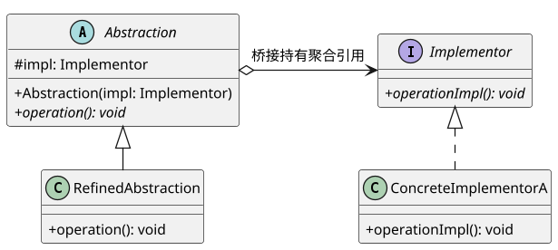

* **下午题核心填空靶点**：
  * 抽象类持有实现接口指针：`protected Implementor impl;`
  * 委托调用底层实现：`void RefinedAbstraction::operation() { impl->operationImpl(); }`

---

#### 08. 组合模式 (Composite) —— 一视同仁的树形部分整体

`对象模式` | `考频：★★★★★ (Tier A 必考大题)` | `生活类比：文件系统（文件夹既能装文件，又能装子文件夹，对复制删除一视同仁）`

* **痛点场景**：需要表示对象的部分-整体层次结构，并且希望客户端能够忽略组合对象与单个对象的差异，以统一的方式对待所有对象。
* **核心解法**：**将对象组合成树形结构以表示“部分-整体”的层次结构**，使用户对单个对象和组合对象的使用具有**一致性**。
* **考场题眼**：**“树形结构表示‘部分-整体’层次”**、**“用户对单个对象和组合对象的使用具有一致性”**、**“Component（抽象构件）、Leaf（叶子）、Composite（容器）”**。
* **架构代价**：定义了包含基本对象与组合对象的类层次结构，简化了客户端调用；但难以在编译期限制容器只能装特定类型的叶子。

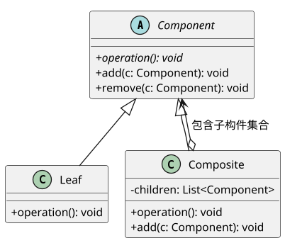

* **下午题核心填空靶点 (C++ / Java)**：
  * 容器内部维护子构件集合：`private List<Component> children = new ArrayList<>();`
  * 组合构件递归遍历：`for (Component c : children) { c.operation(); }`

---

#### 09. 装饰模式 (Decorator) —— 奶茶加小料的动态功能包裹

`对象模式` | `考频：★★★★★ (Tier A 必考大题)` | `生活类比：奶茶加小料（原味奶茶+珍珠+椰果，加完后依然还是一杯奶茶）`

* **痛点场景**：需要动态为单个对象添加额外职责；若使用继承扩展功能会导致子类爆炸，且静态继承无法在运行期自由组装和拆卸。
* **核心解法**：**动态地给一个对象添加一些额外的职责**；装饰器类与被装饰类实现同一个抽象构件接口，并在内部聚合一个抽象构件引用。
* **考场题眼**：**“动态地给一个对象添加一些额外的职责”**、**“就增加功能而言比生成子类更为灵活”**、**“透明地扩展功能”**、**“Java I/O 流体系”**。
* **架构代价**：比静态继承更灵活，支持任意层级嵌套；但产生大量细小对象，多层嵌套装饰时排查调试困难。

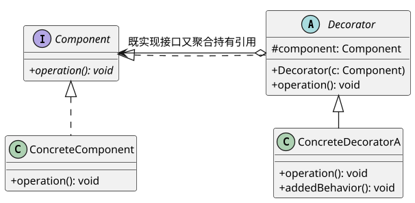

* **下午题核心填空靶点 (C++ / Java)**：
  * 抽象装饰器内部持有被装饰对象：`protected Component component;`
  * 先调用原操作再附加行为：`super.operation(); addedBehavior();`

---

#### 10. 外观模式 (Facade) —— 一站式综合服务前台

`对象模式` | `考频：★★★★☆ (Tier B 高频常客)` | `生活类比：政务办事大厅一站式导医台 / 智能影院一键观影`

* **痛点场景**：子系统内部组件复杂分散，客户端如果直接与这些小类交互，会导致客户端代码与子系统高度网状耦合。
* **核心解法**：**为子系统中的一组接口提供一个一致的界面**。Facade 模式定义了一个高层接口，使子系统更加容易使用。
* **考场题眼**：**“为子系统中的一组接口提供一个一致的界面”**、**“定义高层接口使子系统更易使用”**、**“迪米特法则 / 最少知识原则”**。
* **架构代价**：对客户屏蔽了子系统细节，极大降低耦合；但若子系统接口频繁改动，外观类容易演化为沉重的“上帝类”。

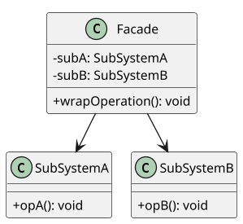

* **下午题核心考点**：外观类方法内依次调用各子系统实例的方法（`subA.opA(); subB.opB();`）。

---

#### 11. 享元模式 (Flyweight) —— 共享细粒度对象的值钱棋子

`对象模式` | `考频：★★☆☆☆ (Tier C 冷门防冷箭)` | `生活类比：围棋棋子（黑白两色为内部状态共享，棋盘落子坐标为外部状态）`

* **痛点场景**：系统需要创建大量细粒度的对象，导致内存开销过大甚至内存溢出。
* **核心解法**：**运用共享技术有效地支持大量细粒度的对象**；将状态严格划分为**内部状态**（在对象内部可共享）和**外部状态**（随环境变化由外部传入）。
* **考场题眼**：**“运用共享技术有效地支持大量细粒度的对象”**、**“内部状态 (Intrinsic) 与外部状态 (Extrinsic)”**、**“FlyweightFactory 对象池”**。
* **架构代价**：大幅度减少内存中对象的数量；但使系统更加复杂，剥离外部状态使得运行时查询耗时增加。
* **一句话真题原型**：字处理软件文字字符对象池、围棋/五子棋棋盘对象池。

---

#### 12. 代理模式 (Proxy) —— 掌控门禁的忠诚经纪人

`对象模式` | `考频：★★★☆☆ (Tier C 冷门防冷箭)` | `生活类比：明星的专职经纪人（负责核验合同、排期拦截，演戏才交还明星本体）`

* **痛点场景**：由于安全控制、性能优化、网络远程通信等原因，客户端无法或不便于直接访问目标真实对象。
* **核心解法**：**为其他对象提供一种代理以控制对这个对象的访问**；代理类与真实目标类实现同一接口。
* **考场题眼**：**“为其他对象提供一种代理以控制对这个对象的访问”**、**“远程代理 (Remote)”**、**“虚代理 (Virtual，大图延迟加载占位)”**、**“保护代理 (Protection，权限控制)”**。
* **架构代价**：在客户端与目标对象之间起到保护和解耦作用；但增加了间接层，可能会导致请求处理响应变慢。
* **一句话真题原型**：RPC 远程调用代理、大图加载占位图虚代理、接口权限拦截器。

---

### 【第三篇：行为型模式 (Behavioral Patterns，11 种)】

> **行为型心法**：**“关注对象间的通信、职责分配与动态协作”**。行为型类模式使用继承在类间分派行为；行为型对象模式采用对象复合机制协调对象协作。

---

#### 13. 策略模式 (Strategy) —— 随意拔插的算法战术锦囊

`对象模式` | `考频：★★★★★ (Tier A 出现率榜首)` | `生活类比：高德地图路线规划（骑行/公交/打车，同一目的地算法互换）`

* **痛点场景**：完成某项任务有多种算法或业务逻辑，如果不做抽象，会导致代码中充斥着冗长丑陋且难以维护的多重 `if-else` 或 `switch-case` 语句。
* **核心解法**：**定义一系列算法，把它们一个个封装起来，并且使它们可以相互替换**。Strategy 使得算法可以独立于使用它的客户而变化。
* **考场题眼**：**“定义一系列算法，封装起来并使它们可以相互替换”**、**“算法独立于使用它的客户而变化”**、**“消除多重条件转移选择分支”**、**“Context, Strategy, ConcreteStrategy”**。
* **架构代价**：彻底消灭了多重条件分支；但客户端必须提前知晓所有策略的区别，以便自行选择合适的策略注入。

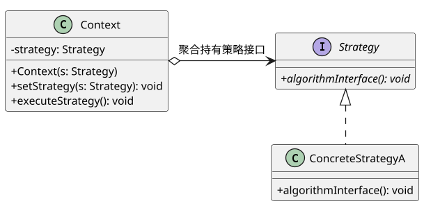

* **下午题核心填空靶点 (C++ / Java)**：
  * 环境类内部维护抽象策略引用：`private Strategy strategy;`
  * Setter 依赖注入：`public void setStrategy(Strategy s) { this.strategy = s; }`
  * 委托调用多态算法：`public void executeStrategy() { strategy.algorithmInterface(); }`

---

#### 14. 观察者模式 (Observer) —— 牵一发而动全身的广播订阅网

`对象模式` | `考频：★★★★★ (Tier A 出现率榜二)` | `生活类比：微信公众号发布推文（作者一点击群发，所有粉丝手机立刻收到推送）`

* **痛点场景**：一个对象的状态改变需要同时联动更新多个其他对象，且不知道具体有多少个对象需要更新，希望保持各对象间松散耦合。
* **核心解法**：**定义对象间的一种一对多的依赖关系，当一个对象的状态发生改变时，所有依赖于它的对象都得到通知并被自动更新**。
* **考场题眼**：**“定义对象间的一种一对多的依赖关系”**、**“状态发生改变时所有依赖对象得到通知并自动更新”**、**“发布-订阅 (Publish-Subscribe)”**、**“Subject, Observer, attach, detach, notify”**。
* **架构代价**：目标与观察者高度解耦；但若观察者数量庞大，循环通知开销较大，且需小心循环依赖引发死锁。

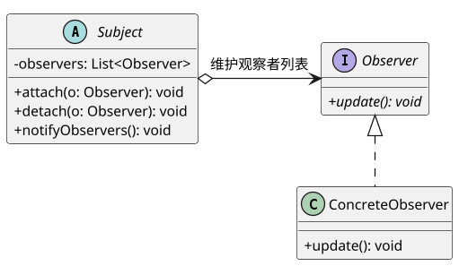

* **下午题核心填空靶点 (C++ / Java)**：
  * 目标类广播遍历：`for (Observer o : observers) { o.update(); }`
  * 注册与解绑：`observers.add(o);` 与 `observers.remove(o);`

---

#### 15. 状态模式 (State) —— 随心而动的多态变身术

`对象模式` | `考频：★★★★★ (Tier A 必考大题)` | `生活类比：水的三态变化（固态冰、液态水、气态水蒸气，同一杯水状态不同行为质变）`

* **痛点场景**：一个对象的行为取决于它的内部状态，在运行时刻需要根据状态切换行为，以往代码中充斥着依赖状态的大型 `switch-case`。
* **核心解法**：**允许一个对象在其内部状态改变时改变它的行为。对象看起来似乎修改了它的类**。将每一个状态及其行为独立封装为一个状态类。
* **考场题眼**：**“允许对象在其内部状态改变时改变它的行为”**、**“对象看起来似乎修改了它的类”**、**“状态驱动行为转移”**、**“消除状态分支判断”**。
* **架构代价**：消除臃肿的分支语句，状态转换显式化；但导致状态类数量迅速膨胀。

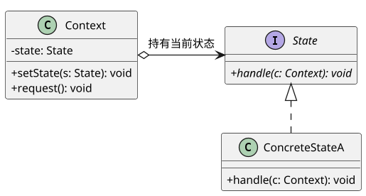

* **下午题核心填空靶点 (C++ / Java)**：
  * 状态内部触发自动状态迁移：`context.setState(new ConcreteStateB());`
  * 环境类委托当前状态执行：`state.handle(this);`

---

#### 16. 命令模式 (Command) —— 餐厅点餐排单小票与撤销后悔药

`对象模式` | `考频：★★★★★ (Tier A 必考大题)` | `生活类比：餐厅点餐排单小票（顾客点单 $	o$ 小票排单 $	o$ 大厨照单炒菜，小票可撤销重做）`

* **痛点场景**：需要将请求调用者（如按钮、菜单栏）与请求接收执行者（如文档保存引擎、绘制模块）彻底解耦；需要支持请求排队、事务日志记录或撤销 (Undo) / 重做 (Redo)。
* **核心解法**：**将一个请求封装为一个对象，从而使你可用不同的请求对客户进行参数化；对请求排队或记录请求日志，以及支持可撤销的操作**。
* **考场题眼**：**“将一个请求封装为一个对象”**、**“参数化客户请求”**、**“支持可撤销 (Undo) 和可重做 (Redo)”**、**“请求排队与事务日志”**、**“Invoker, Command, Receiver”**。
* **架构代价**：彻底解耦调用者与接收者，极易组合宏命令；但可能导致系统中具体命令类过多。

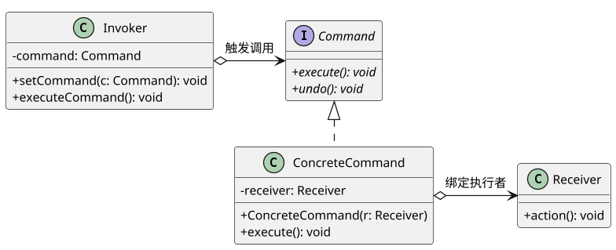

* **下午题核心填空靶点 (C++ / Java)**：
  * 具体命令内部委托接收者：`public void execute() { receiver.action(); }`
  * 调用者触发执行：`command.execute();`

---

#### 17. 模板方法模式 (Template Method) —— 统一步调的标准冲泡流程

`类模式 (编译期继承绑定)` | `考频：★★★★☆ (Tier B 高频常客)` | `生活类比：冲热饮通用流程（烧水 $	o$ 冲泡 $	o$ 倒杯 $	o$ 加料；骨架定死，冲咖啡还是茶由子类实现）`

* **痛点场景**：多个子类具有完全相同的流程算法骨架，但具体某些步骤在不同子类中表现各异；希望避免在每个子类中重复编写相同的流程控制逻辑。
* **核心解法**：**定义一个操作中的算法的骨架，而将一些步骤延迟到子类中。Template Method 使得子类可以不改变一个算法的结构即可重定义该算法的某些特定步骤**。
* **考场题眼**：**“定义操作中的算法骨架，将步骤延迟到子类”**、**“不改变算法结构重定义特定步骤”**、**“好莱坞法则 (Don't call us, we'll call you)”**、**“基本方法 + 钩子方法 (Hook)”**。
* **架构代价**：反向控制结构，极大提高代码复用性；但父类规定死了算法执行顺序，灵活性受到一定限制。

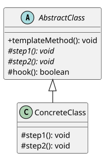

* **核心代码靶点**：
  ```java
  public final void templateMethod() {
      step1();
      step2();
      if (hook()) { /* 钩子扩展 */ }
  }
  ```

---

#### 18. 职责链模式 (Chain of Responsibility) —— 层层上报的击鼓传花链

`对象模式` | `考频：★★★★☆ (Tier B 高频常客)` | `生活类比：员工请假审批（1天组长批，3天经理批，7天总监批；员工只交请假条，内部沿链传递）`

* **痛点场景**：多个对象都有可能处理同一个请求，但具体由谁处理在运行时刻前是不确定的；希望避免请求发送者与具体接收者之间的强耦合。
* **核心解法**：**使多个对象都有机会处理请求，从而避免请求的发送者和接收者之间的耦合关系。将这些对象连成一条链，并沿着这条链传递该请求，直到有一个对象处理它为止**。
* **考场题眼**：**“使多个对象都有机会处理请求，避免发送者和接收者之间的耦合”**、**“沿着链传递请求直到有一个对象处理它”**、**“Handler 持有 successor 后继者引用”**。
* **架构代价**：简化了对象连接；但不能保证请求一定会被处理（可能传到末尾无人认领），且链过长会消耗性能。

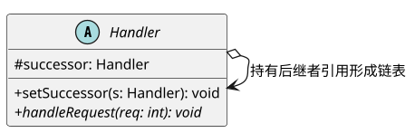

* **核心代码靶点**：
  ```java
  public void handleRequest(int req) {
      if (canHandle(req)) { /* 本级处理 */ }
      else if (successor != null) { successor.handleRequest(req); } // 沿链传递
  }
  ```

---

#### 19. 中介者模式 (Mediator) —— 消除网状耦合的航空调度塔台

`对象模式` | `考频：★★★★☆ (Tier B 高频常客)` | `生活类比：机场航空管制塔台（20架飞机无需互相通信，全由塔台集中调度）`

* **痛点场景**：对象之间存在复杂的网状交叉引用，导致系统耦合度极高；任何一个对象的微小改动都会牵一发而动全身。
* **核心解法**：**用一个中介对象来封装一系列的对象交互。中介者使各对象不需要显式地相互引用，从而使其耦合松散，而且可以独立地改变它们之间的交互**。将网状拓扑转变为星型拓扑。
* **考场题眼**：**“用一个中介对象来封装一系列的对象交互”**、**“使各对象不需要显式地相互引用”**、**“将网状多对多转化为星型一对多”**、**“Mediator 与 Colleague”**。
* **架构代价**：解耦了各同事类；但中介者类自身容易演变成庞大而脆弱的“上帝类”。

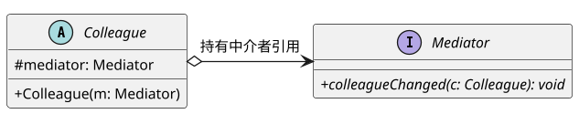

* **核心代码靶点**：同事类状态变化时通知中介者：`mediator.colleagueChanged(this);`。

---

#### 20. 备忘录模式 (Memento) —— 绝不破坏封装的游戏存档读档

`对象模式` | `考频：★★★☆☆ (Tier B 高频考点)` | `生活类比：单机游戏存档读档（打 Boss 前 F5 存档，打输了 F9 读档恢复，保证外界不能改存档数值）`

* **痛点场景**：需要保存一个对象在某一时刻的内部状态以便后续恢复，但必须严守对象的封装边界，严禁将私有内部状态直接暴露给外部。
* **核心解法**：**在不破坏封装性的前提下，捕获一个对象的内部状态，并在该对象之外保存这个状态。这样以后就可将该对象恢复到原先保存的状态**。
* **考场题眼**：**“在不破坏封装性的前提下捕获内部状态并在外部保存”**、**“恢复到原先保存的状态”**、**“Originator（原发器）、Memento（备忘录）、Caretaker（负责人）”**。
* **架构代价**：严密保持了封装边界；但若状态数据庞大，频繁创建备忘录会消耗巨量内存。

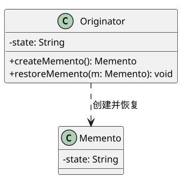

* **核心代码靶点**：
  * 原发器生成快照：`return new Memento(this.state);`
  * 原发器回灌快照：`this.state = m.getState();`

---

#### 21. 迭代器模式 (Iterator) —— 游刃有余的游标检票员

`对象模式` | `考频：★★☆☆☆ (Tier C 冷门防冷箭)` | `生活类比：公交车售票员（从前门走到后门挨个查票，无需过问乘客家里住哪）`

* **痛点场景**：需要顺序遍历一个聚合容器对象中的各个元素，但不想将容器内部具体的数据存储结构暴露给外界。
* **核心解法**：**提供一种方法顺序访问一个聚合对象中各个元素，而又不需暴露该对象的内部表示**。
* **考场题眼**：**“提供一种方法顺序访问一个聚合对象中各个元素，而又不需暴露该对象的内部表示”**、**“游标 (Cursor)”**、**“hasNext(), next()”**。
* **架构代价**：支持以不同方式遍历同一个聚合对象；但额外增加了迭代器类数量。
* **一句话真题原型**：Java `java.util.Iterator`、C++ STL 迭代器。

---

#### 22. 解释器模式 (Interpreter) —— 自创文法的小型编译器

`类模式 (编译期继承绑定)` | `考频：★★☆☆☆ (Tier C 冷门防冷箭)` | `生活类比：乐谱简谱演奏机（解析简谱中的数字与休止符，将其转化为钢琴击键动作）`

* **痛点场景**：特定领域的问题可以表示为一种简单语言的句子，且能将该语言的句子解析为抽象语法树 (AST) 进行求值。
* **核心解法**：**给定一个语言，定义它的文法的一种表示，并定义一个解释器，这个解释器使用该表示来解释语言中的句子**。
* **考场题眼**：**“给定一个语言，定义它的文法的一种表示，并定义一个解释器”**、**“抽象语法树 (AST)”**、**“终结符表达式与非终结符表达式”**。
* **架构代价**：极易改变和扩展文法；但复杂的文法难以维护，执行效率低下。
* **一句话真题原型**：简单算术四则运算计算器、机器人移动指令解析器。

---

#### 23. 访问者模式 (Visitor) —— 稳坐钓鱼台的双重分派大师

`对象模式` | `考频：★★☆☆☆ (Tier C 冷门防冷箭)` | `生活类比：会计师与审计师查账（公司账目结构固定只有收入单和支出单；会计师算利润，税务局查税款）`

* **痛点场景**：一个对象结构中的元素类型极少改变，但经常需要对这些元素实施新的、多变的操作，希望在不修改元素类的前提下扩展操作。
* **核心解法**：**表示一个作用于某对象结构中的各元素的操作。它使你可以在不改变各元素的类的前提下定义作用于这些元素的新操作**（双重分派机制：`element.accept(v)` $	o$ `v.visit(this)`）。
* **考场题眼**：**“表示作用于某对象结构中各元素的操作”**、**“不改变各元素类的前提下定义新操作”**、**“数据结构稳定，但操作算法易变”**、**“双重分派 (Double Dispatch)”**。
* **架构代价**：极易新增针对元素的操作；但**新增元素类极难（破坏开闭原则）**，且暴露了元素内部细节。
* **一句话真题原型**：编译器的抽象语法树遍历（类型检查器、代码优化器、代码生成器作为访问者）。

---

## ⚔️ 第三部分：高频辨析与陷阱攻防（破除考场混淆盲区）

### 3.1 五大经典“孪生模式”决斗辨析矩阵（专攻命题人挖坑单选）

软考命题人最擅长在题干中用模棱两可的描述混淆结构相似的模式。以下 5 组决斗矩阵是考场高频防坑宝典：

#### 对决 1：策略模式 (Strategy) vs 状态模式 (State)

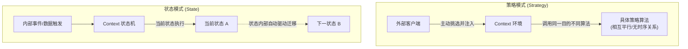

| 维度 | 策略模式 (Strategy) | 状态模式 (State) |
| :--- | :--- | :--- |
| **驱动主体** | **外部客户端主动决定**（客户端根据业务需要挑选算法注入 Context） | **内部事件驱动自动变身**（Context 内部根据条件自动转换状态） |
| **状态/算法关系** | 各策略之间是**平行、可替代的关系**，彼此互不知晓，无先后顺序 | 各状态之间通常存在**生命周期或流转关系**（如草稿 $	o$ 审批 $	o$ 发布） |
| **切换位置** | 通常在 Context 外部通过 `setStrategy()` 切换 | 通常在具体 State 类内部调用 `context.setState()` 自动切换 |
| **题眼判定** | 题干出现：“定义一系列算法”、“算法相互替换”、“根据不同情况选择计费方式” | 题干出现：“行为随内部状态改变而改变”、“似乎修改了它的类”、“状态机迁移” |

---

#### 对决 2：装饰模式 (Decorator) vs 适配器模式 (Adapter) vs 代理模式 (Proxy)

三者在结构上都属于“包装器 (Wrapper)”，内部都聚合了另一个对象，但**核心意图截然不同**：

| 模式名称 | 核心意图 (Intent) | 接口变化情况 | 典型比喻 | 考场秒杀题眼 |
| :--- | :--- | :--- | :--- | :--- |
| **适配器模式 (Adapter)** | **解决接口不兼容问题** | **改变接口**：旧接口转换为客户期望的新接口 | 电源转接头 | “使得原本因接口不兼容而不能一起工作的类协同工作” |
| **装饰模式 (Decorator)** | **动态扩展对象的职责/功能** | **保持接口不变**：装饰器与被装饰者实现同一接口 | 奶茶加珍珠椰果 | “动态地给对象添加额外的职责”、“比生成子类更为灵活” |
| **代理模式 (Proxy)** | **控制对目标对象的访问** | **保持接口一致**：代理类与真实目标实现同一接口 | 明星的经纪人 | “控制对对象的访问”、“权限控制”、“远程/虚代理延迟加载” |

---

#### 对决 3：工厂方法模式 (Factory Method) vs 抽象工厂模式 (Abstract Factory)

| 维度 | 工厂方法模式 (Factory Method) | 抽象工厂模式 (Abstract Factory) |
| :--- | :--- | :--- |
| **产品等级数量** | **单一产品等级**（只生产一种产品，如仅生产日志器 Logger） | **多个产品等级 / 产品族**（生产成套产品，如生产按钮 + 文本框 + 窗口） |
| **工厂方法个数** | 每个抽象工厂接口中**通常只有 1 个工厂方法** | 每个抽象工厂接口中**有多个工厂方法**（分别创建不同产品） |
| **增加新维度的开销** | 增加新产品极其容易（增加一对工厂和产品类，完全符合 OCP） | 增加新产品族容易（符合 OCP）；但**增加新产品等级极难**（破坏 OCP） |
| **类/对象模式归属** | **类模式**（GoF 4 大类模式之一） | **对象模式** |

---

#### 对决 4：桥接模式 (Bridge) vs 适配器模式 (Adapter)

| 维度 | 桥接模式 (Bridge) | 适配器模式 (Adapter) |
| :--- | :--- | :--- |
| **设计时期** | **设计初期（前瞻性设计）**：提前识别系统中的两个独立变化维度 | **设计后期或维护期（事后补救）**：发现两个现有类的接口不兼容 |
| **关注重点** | 将抽象与实现分离，支持两个维度各自独立演化，避免类爆炸 | 复用现有老代码，通过转换接口使之融入新框架 |
| **考场典型案例** | 跨平台图形绘制、跨数据库引擎连接池 | 遗留系统对接、封装第三方开源库方法 |

---

#### 对决 5：外观模式 (Facade) vs 中介者模式 (Mediator)

| 维度 | 外观模式 (Facade) | 中介者模式 (Mediator) |
| :--- | :--- | :--- |
| **通信流向** | **单向通信**：客户端 $	o$ 外观 $	o$ 多个子系统（子系统通常不知道外观的存在） | **双向通信**：各个同事类与中介者之间双向交互与协作 |
| **主要目的** | 简化客户端的调用，提供一个统一高层访问入口 | 消除同事类之间的网状多对多复杂依赖，将其解耦为星型结构 |
| **设计原则** | 迪米特法则（最少知识原则） | 迪米特法则 + 单一职责原则 |

---

### 3.2 历年考生 3 大致命偷换概念陷阱（考前避坑）

* 🚨 **陷阱 1：看到“包装对象”就直接秒选适配器模式**
  * *避坑法则*：若接口变了（老接口 $	o$ 新接口），是**适配器模式**；若接口没变且强调功能一层层叠加，是**装饰模式**；若接口没变且强调安全拦截/延迟加载/远程访问，是**代理模式**！
* 🚨 **陷阱 2：看到“树形结构”就直接选组合模式，忽略了“访问者模式”**
  * *避坑法则*：如果题干强调的是**“部分-整体的层次结构，客户端对单个对象和组合对象一致对待”**，必选**组合模式**；如果题干强调**“在稳定的树形节点结构上定义新的编译/报表操作，且不修改节点类”**，必选**访问者模式**！
* 🚨 **陷阱 3：混淆“类模式”与“对象模式”**
  * *避坑法则*：在 23 个模式中，只要不是**“工厂方法、类适配器、解释器、模板方法”**这 4 个，其余 19 个全部都是对象模式！

---

## 🎯 第四部分：考场实战收敛（金字塔底座·10秒速杀工具箱）

### 4.1 23 种设计模式考场特征词一秒速杀全景总表（上午单选极速通关神表）

> [!TIP]
> 考场做上午单选题时，**直接在题干中抓取以下加粗特征词**，10 秒内即可排除 3 个干扰项：

| 序号 | 模式名称 | 英文名 | 分类 | 范围 | 考场核心特征词（题干必出关键词） | 典型真题原型 |
| :---: | :--- | :--- | :---: | :---: | :--- | :--- |
| 1 | **工厂方法** | Factory Method | 创建 | **类** | **定义创建对象的接口，让子类决定实例化哪一个类**、延期实例化、单一产品 | 跨平台日志记录器 |
| 2 | **抽象工厂** | Abstract Factory | 创建 | 对象 | **创建一系列相关或相互依赖的对象**、无需指定具体类、**产品族** | 跨平台 UI 皮肤组件库 |
| 3 | **生成器** | Builder | 创建 | 对象 | **将复杂对象的构建与表示分离，使同样的构建过程创建不同的表示**、分步构建 | 复杂格式文档生成器 |
| 4 | **原型模式** | Prototype | 创建 | 对象 | **通过拷贝/克隆这些原型创建新对象**、`clone()`、创建成本过高 | 游戏怪兽批量刷怪 |
| 5 | **单例模式** | Singleton | 创建 | 对象 | **保证类仅有一个实例，提供全局访问点**、私有构造函数、`getInstance()` | 全局配置管理器、打印池 |
| 6 | **适配器** | Adapter | 结构 | **类/对象** | **将一个类的接口转换成客户希望的另外一个接口**、接口不兼容、包装器 | 遗留旧排序算法复用 |
| 7 | **桥接模式** | Bridge | 结构 | 对象 | **将抽象部分与实现部分分离，使它们可以独立变化**、**两个独立变化的维度** | 跨平台多颜色图形绘制 |
| 8 | **组合模式** | Composite | 结构 | 对象 | **树形结构表示部分-整体层次**、**单个对象和组合对象使用具有一致性** | 文件与文件夹、表达式树 |
| 9 | **装饰模式** | Decorator | 结构 | 对象 | **动态给对象添加额外职责**、比生成子类更为灵活、透明扩展功能 | Java I/O 流、窗口滚动条 |
| 10 | **外观模式** | Facade | 结构 | 对象 | **为子系统中一组接口提供一致界面**、定义高层接口更易使用、最少知识原则 | 统一编译器入口、智能影院 |
| 11 | **享元模式** | Flyweight | 结构 | 对象 | **运用共享技术有效支持大量细粒度对象**、**内部状态与外部状态**、对象池 | 围棋棋子、文本字符排版 |
| 12 | **代理模式** | Proxy | 结构 | 对象 | **为其他对象提供一种代理以控制对该对象的访问**、远程/虚/保护代理 | 权限拦截、大图延迟加载 |
| 13 | **策略模式** | Strategy | 行为 | 对象 | **定义一系列算法，封装起来并可相互替换**、**算法独立于客户变化**、消除分支 | 商场打折结算、排序算法 |
| 14 | **观察者** | Observer | 行为 | 对象 | **一对多依赖关系**、**状态改变时所有依赖对象得到通知并自动更新**、发布-订阅 | 气象站看板、股市大屏 |
| 15 | **状态模式** | State | 行为 | 对象 | **对象内部状态改变时改变行为，看起来似乎修改了它的类**、状态驱动转移 | 银行卡状态、TCP 连接 |
| 16 | **命令模式** | Command | 行为 | 对象 | **将请求封装为对象**、请求参数化、**支持撤销 Undo/重做 Redo**、排队与日志 | 遥控器、文本撤销栈 |
| 17 | **模板方法** | Template Method | 行为 | **类** | **定义操作中的算法骨架，将步骤延迟到子类**、不改变结构重定义步骤、好莱坞原则 | 冲泡热饮流程、JUnit |
| 18 | **职责链** | Chain of Resp. | 行为 | 对象 | **使多个对象有机会处理请求，沿着链传递请求直到被处理**、解耦发送与接收 | 请假报销审批流、Filter |
| 19 | **中介者** | Mediator | 行为 | 对象 | **中介对象封装一系列对象交互**、各对象不显式引用、**网状结构变为星型结构** | 航空管制塔台、聊天室 |
| 20 | **备忘录** | Memento | 行为 | 对象 | **不破坏封装性前提下捕获内部状态并在外部保存**、恢复状态、快照 | 单机游戏存档、悔棋系统 |
| 21 | **迭代器** | Iterator | 行为 | 对象 | **顺序访问聚合对象各个元素，不需暴露内部表示**、游标 Cursor | 集合遍历、`hasNext()` |
| 22 | **解释器** | Interpreter | 行为 | **类** | **给定语言定义文法表示并定义解释器**、终结符与非终结符表达式、AST | 简单算术解释器、正则 |
| 23 | **访问者** | Visitor | 行为 | 对象 | **作用于对象结构中各元素的操作**、**不改变各元素类的前提下定义新操作**、双重分派 | 编译器语法树类型检查 |

---

### 4.2 下午试题五/六（Java/C++ 15分大题）万能解题套路与 5 大挖空靶点

> [!IMPORTANT]
> **【下午代码大题命题规律】**：
> 下午试题五（C++）和试题六（Java）二选一，分值 15 分，通常由 1 道背景说明 + 1 张设计模式类图 + 5 个填空组成（每个空 3 分）。
> 无论题目具体背景怎么变，命题人的 5 个空必定严格命中以下 **5 大多态语法套路**：

#### 5 大黄金挖空套路：

```
[套路 1]：抽象基类 / 接口声明与继承实现关键字
         ↳ Java: class Concrete implements Interface / class Concrete extends AbstractClass
         ↳ C++:  class Concrete : public BaseClass

[套路 2]：聚合/组合内部成员变量声明
         ↳ Java: private Strategy strategy;
         ↳ C++:  Strategy* strategy;

[套路 3]：构造函数或 Setter 依赖注入
         ↳ Java: this.strategy = strategy;
         ↳ C++:  this->strategy = strategy;

[套路 4]：委托多态方法调用（核心业务执行）
         ↳ Java: strategy.algorithmInterface();
         ↳ C++:  strategy->algorithmInterface();

[套路 5]：客户端组装与运行调用
         ↳ Java: Context ctx = new Context(new ConcreteStrategyA()); ctx.execute();
         ↳ C++:  Context* ctx = new Context(new ConcreteStrategyA()); ctx->execute();
```

---

#### 核心大题实战模板一：策略模式 (Strategy)

##### C++ 语言版本（试题五）：
```cpp
#include <iostream>
using namespace std;

// 1. 抽象策略类 (Strategy)
class DiscountStrategy {
public:
    virtual double calculate(double originalPrice) = 0; // 纯虚函数
    virtual ~DiscountStrategy() {}
};

// 2. 具体策略类 (ConcreteStrategy)
class VipDiscount : public DiscountStrategy { // [挖空 1: 继承抽象策略基类]
public:
    double calculate(double originalPrice) {
        return originalPrice * 0.8; // 八折
    }
};

// 3. 环境类 (Context)
class Cashier {
private:
    DiscountStrategy* strategy; // [挖空 2: 持有抽象策略指针]
public:
    Cashier(DiscountStrategy* s) {
        this->strategy = s;     // [挖空 3: 构造注入]
    }
    void setStrategy(DiscountStrategy* s) {
        this->strategy = s;
    }
    double getFinalPrice(double price) {
        return strategy->calculate(price); // [挖空 4: 多态委托调用]
    }
};

// 4. 客户端主函数
int main() {
    DiscountStrategy* s = new VipDiscount();
    Cashier* cashier = new Cashier(s); // [挖空 5: 客户端实例化与依赖注入]
    cout << "Final Price: " << cashier->getFinalPrice(100.0) << endl;
    delete cashier;
    delete s;
    return 0;
}
```

##### Java 语言版本（试题六）：
```java
// 1. 抽象策略接口
interface DiscountStrategy {
    public double calculate(double originalPrice);
}

// 2. 具体策略实现
class VipDiscount implements DiscountStrategy { // [挖空 1: 实现策略接口]
    @Override
    public double calculate(double originalPrice) {
        return originalPrice * 0.8;
    }
}

// 3. 环境类
class Cashier {
    private DiscountStrategy strategy; // [挖空 2: 声明接口引用]

    public Cashier(DiscountStrategy strategy) {
        this.strategy = strategy;      // [挖空 3: 构造器赋值]
    }

    public void setStrategy(DiscountStrategy strategy) {
        this.strategy = strategy;
    }

    public double getFinalPrice(double price) {
        return strategy.calculate(price); // [挖空 4: 接口多态方法调用]
    }
}

// 4. 客户端测试
public class Client {
    public static void main(String[] args) {
        DiscountStrategy strategy = new VipDiscount();
        Cashier cashier = new Cashier(strategy); // [挖空 5: 注入具体策略]
        System.out.println("Final Price: " + cashier.getFinalPrice(100.0));
    }
}
```

---

#### 核心大题实战模板二：观察者模式 (Observer)

##### Java 语言版本（试题六高频真题还原）：
```java
import java.util.*;

// 1. 抽象观察者接口
interface Observer {
    public void update(String state);
}

// 2. 具体观察者
class ConcreteObserver implements Observer {
    private String name;
    public ConcreteObserver(String name) { this.name = name; }

    @Override
    public void update(String state) { // [挖空 1: 实现更新接口]
        System.out.println(name + " 收到最新状态: " + state);
    }
}

// 3. 抽象目标类 (Subject)
abstract class Subject {
    private List<Observer> observers = new ArrayList<>(); // [挖空 2: 观察者列表集合]

    public void attach(Observer o) {
        observers.add(o); // [挖空 3: 添加观察者]
    }

    public void detach(Observer o) {
        observers.remove(o);
    }

    public void notifyObservers(String state) {
        for (Observer o : observers) { // [挖空 4: 遍历所有观察者]
            o.update(state);           // [挖空 5: 广播触发更新]
        }
    }
}
```

---

### 4.3 软考真题精选深度复盘剖析

#### 典型真题（上午单选题眼秒杀示范）：
> **【真题题干】**：某公司欲开发一个跨平台的图形绘制系统，要求该系统能支持在 Windows、Linux 和 macOS 等不同操作系统上绘制圆形 (Circle)、矩形 (Rectangle) 和三角形 (Triangle)。为使图形格式的扩展与底层显示 API 的变化相互独立、互不影响，采用（ ）设计模式最为合适。
> A. 适配器模式 (Adapter)
> B. 装饰模式 (Decorator)
> C. 桥接模式 (Bridge)
> D. 代理模式 (Proxy)

* **10 秒秒杀破题路径**：
  * **步骤 1 抓题眼**：“图形格式”（维度一）与“操作系统底层 API”（维度二），明确识别出**系统存在两个独立变化的维度**；
  * **步骤 2 抓需求**：“使两者的变化相互独立、互不影响”，即**将抽象部分与实现部分分离**；
  * **步骤 3 对表秒杀**：直接对应 4.1 节速杀表中的**桥接模式 (Bridge)**，秒选 **C**！

---

### 4.4 机考防冷箭盲盒清单（Edge Cases 考前 1 分钟混眼熟）

在全面推行机考后，题库偶尔会抽取以下 4 个较偏僻的术语或设计模式衍生概念：

1. **多例模式 (Multiton Pattern)**：单例模式的变体，通过键值对字典维护有限个命名实例（如数据库多数据源路由）。
2. **黑板模式 (Blackboard Pattern)**：属于**架构模式**（非 GoF 设计模式），由知识源、黑板和控制组件三部分组成，专用于语音识别、模式匹配等无确定算法的不确定性问题求解。
3. **迪米特法则 (Law of Demeter / 最少知识原则)**：一个对象应当对其他对象有尽可能少的了解，“只与直接的朋友通信”。外观模式和中介者模式是该法则的最典型应用。
4. **好莱坞原则 (Hollywood Principle)**：“不要打电话给我们，我们会打给你 (Don't call us, we'll call you)”。模板方法模式和框架事件机制是该原则的典型体现。

---

### 4.5 随堂实战互动自测（检验记忆）

> **【考霸实战题】**：
> 在开发一个大型电商订单系统中，订单状态包括“待付款”、“已付款”、“已发货”、“已签收”和“已取消”。当用户在不同状态下执行“取消订单”操作时，系统的业务处理截然不同（例如待付款状态下直接关闭订单并释放库存；而已付款状态下需要先发起退款审核流程；已发货状态下则提示用户联系快递拦截）。随着业务规则频繁变动，开发团队决定重构消除订单类中臃肿的 `switch-case` 语句。该重构最适合采用的设计模式是（ ），该模式属于（ ）模式。
>
> 请在心中作答后核对：
> * 模式名称：**状态模式 (State Pattern)**
> * 归属分类：**行为型对象模式**
> * 提分逻辑：对象的行为直接取决于其内部所处的“订单状态”，且重构的核心目标是消除庞大的状态分支判断语句并支持状态自动流转。

---
