# 03-设计模式核心图谱与真题命题密码（考霸通关专著）

> **【定位导读】**：
> 本文是针对软考《软件设计师》下午 15 分设计模式大题（试题五/六）与上午 3~5 分高频单选的**终极专项提分核武器**。
> 本文与本专栏已有文档定位严格区分：
> * `14.面向对象技术速记指南.md` 负责面向对象基础（类关系、SOLID 设计原则、面向对象生命周期）；
> * `02-UML核心建模图谱.md` 负责 UML 14 种图全景语法规范与 4+1 架构视图；
> * **本文档 100% 穷尽 GoF 23 种设计模式**，严格采用培训机构教研的 **“80/20 ABC 考频分级”**、Refactoring.Guru 式 **“生活类比 + 真题原型”**、OMG 规范级 **PlantUML 类图** 与 **下午题 Java/C++ 多态填空代码靶点**，帮助考生建立 10 秒定位题眼的直觉，彻底拿下全卷 20~25 分！

---

## 🏛️ 第一部分：宏观认知与战略定级（金字塔塔尖·全局俯瞰）

### 1.1 软件模式三层次体系辨析（上午概念单选必考）

在软考上午场，命题人常考“模式三层次划分”，切勿将宏观架构模式与微观设计模式混为一谈：

| 层次级别 | 概念定义 | 适用范围 / 抽象级别 | 典型代表（考场必选） |
| :--- | :--- | :--- | :--- |
| **架构模式 (Architectural Pattern)** | 软件系统的高层组织结构和宏观蓝图，决定了子系统划分、通信机制与系统级非功能属性。 | **最高层**（全局系统级架构） | MVC、三层架构、管道-过滤器 (Pipe-Filter)、微服务、黑板模式 (Blackboard)、分层模式 |
| **设计模式 (Design Pattern)** | 解决子系统或模块内部特定设计问题的中观结构方案，细化类与对象的职责分配与协作。 | **中层**（模块/子系统结构） | **GoF 23 种设计模式**（单例、策略、观察者、工厂、装饰、适配器等） |
| **代码惯用法 (Idiom / 编码风格)** | 特定编程语言中解决底层具体实现问题的微观技巧，与编程语言特性强绑定。 | **最底层**（语言级微观实现） | C++ 的 RAII 资源获取即初始化、Java 的双重检查锁定 (DCL)、引用计数计数器 |

---

### 1.2 GoF 23 种设计模式分类总纲

根据模式的**目的与意图**，GoF 将 23 种设计模式划分为三大经典家族：

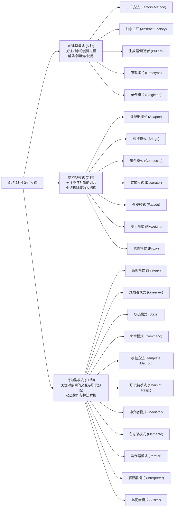

---

### 1.3 作用范围二分法：4 大类模式 vs 19 大对象模式（下划线送分考点）

> [!IMPORTANT]
> **【考场白送分规则】**：
> 软考单选题常出现：*“以下属于类模式的是（ ）”* 或 *“在 GoF 设计模式中，基于继承实现且属于类模式的是（ ）”*。
> 绝大多数（19 种）都是**对象模式**（基于组合/委托，运行期确定关系）。**类模式仅有 4 个**（基于继承，编译期静态确定关系）。

| 作用范围 | 核心机制 | 绑定时期 | 涵盖模式（死记 4 个类模式即可） | 记忆口诀 |
| :--- | :--- | :--- | :--- | :--- |
| **类模式 (Class Pattern)**<br>*(仅 4 种)* | 处理类与子类之间的**继承关系** | **编译期**<br>(静态) | 1. **工厂方法模式 (Factory Method)** (创建型)<br>2. **类适配器模式 (Class Adapter)** (结构型)<br>3. **解释器模式 (Interpreter)** (行为型)<br>4. **模板方法模式 (Template Method)** (行为型) | **“厂配解模”**<br>（**工**厂、**适**配、**解**释、**模**板） |
| **对象模式 (Object Pattern)**<br>*(其余 19 种)* | 处理对象之间的**组合/聚合/关联** | **运行期**<br>(动态) | 抽象工厂、生成器、原型、单例、对象适配器、桥接、组合、装饰、外观、享元、代理、策略、观察者、状态、命令、职责链、中介者、备忘录、迭代器、访问者 | 除去 4 个类模式，其余全选对象模式 |

---

### 1.4 80/20 真题考频全景雷达与 ABC 梯队战略

软考历年真题具有极其显著的**马太效应**。23 个设计模式绝不能平均用力！考生必须严格按照三大梯队配置复习精力：

```
★ 梯队 A：核心核武库 (8 种·考频占下午 15 分大题 90%)
   [策略、观察者、工厂方法/抽象工厂、状态、命令、装饰、适配器、组合]
   ↳ 战略要求：背熟参与者角色类图，能盲写 Java/C++ 多态委托调用与填空！

★★ 梯队 B：高频常客 (9 种·上午 3~5 分题眼大户)
   [单例、建造者、原型、桥接、外观、模板方法、中介者、备忘录、职责链]
   ↳ 战略要求：抓死题干特征词（如"两维度独立变化"、"分步构建"、"撤销重做"），10秒排除干扰！

★★★ 梯队 C：冷门防冷箭 (6 种·考前 3 分钟混眼熟)
   [享元、代理、迭代器、解释器、访问者]
   ↳ 战略要求：仅记定义与典型场景（如文法解析、细粒度共享、访问者双重分派），不做复杂推导。
```

---

## 🧩 第二部分：GoF 23 种设计模式 6 维深度全解（中层支柱）

### 【第一篇：创建型模式 (Creational Patterns，5 种)】

> **创建型模式核心心法**：**“解耦对象的创建与使用”**。创建型模式将系统与它的对象创建、组合和表示分离。一个类创建型模式使用继承改变实例化的类，而一个对象创建型模式将实例化委托给另一个对象。

---

#### 01. 工厂方法模式 (Factory Method) —— 延迟到子类实例化的延期支票

* **【模式档案】**：
  * **分类**：创建型模式
  * **作用范围**：**类模式**（GoF 4 大类模式之一，基于继承）
  * **真题考频**：★★★★★（Tier A 核心核武库·下午代码题常客）
* **【生活类比 & 真题原型】**：
  * **生活类比**：**连锁披萨加盟店**。总部只制定规则（所有分店都必须能制作披萨），但究竟生产海鲜披萨还是牛肉披萨，由具体的“北京分店”、“上海分店”子类自行决定。
  * **真题原型**：**跨平台日志记录器**。定义抽象日志记录器工厂 `LoggerFactory`，具体子类 `FileLoggerFactory` 创建文件日志器，`DbLoggerFactory` 创建数据库日志器。
* **【GoF 四大核心要素】**：
  * ① **模式名称 (Name)**：工厂方法模式 (Factory Method / Virtual Constructor)。
  * ② **产生问题 (Problem)**：框架或父类只知道何时要创建一个对象，但无法预知究竟需要创建哪个具体类的对象；希望避免将具体产品类硬编码到客户端。
  * ③ **解决方案 (Solution)**：定义一个用于创建对象的接口，让子类决定实例化哪一个类。工厂方法使一个类的实例化延迟到其子类。
  * ④ **应用效果 (Consequences)**：
    * *优点*：彻底符合**开闭原则 (OCP)**，增加新产品时只需扩展具体工厂子类和产品子类，客户端代码无须改动；
    * *缺点*：每增加一种产品，都必须增加一个具体工厂类和一个具体产品类，系统中的类成对增加，增加了编译与维护开销。
* **【考场标志性特征词 (10 秒秒杀题眼)】**：
  * **“定义一个创建对象的接口，让子类决定实例化哪一个类”**
  * **“使类的实例化延迟到其子类”**
  * **“单一产品等级结构”**
  * **“针对每种产品提供一个对应的具体工厂”**
* **【标准 PlantUML 角色类图】**：

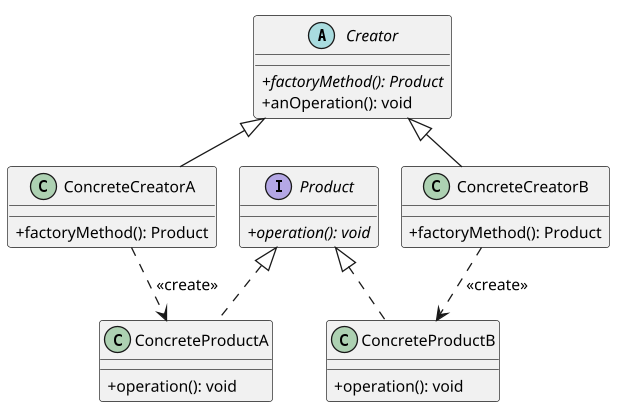

* **【下午题代码填空套路靶点 (C++ / Java)】**：
  * **核心挖空 1（工厂虚函数声明）**：`virtual Product* CreateProduct() = 0;` (C++) 或 `public abstract Product createProduct();` (Java)
  * **核心挖空 2（子类具体创建实例化）**：`return new ConcreteProductA();`
  * **核心挖空 3（客户端多态调用）**：`Creator* creator = new ConcreteCreatorA(); Product* p = creator->factoryMethod();`

---

#### 02. 抽象工厂模式 (Abstract Factory) —— 生产成套产品家族的超级军工厂

* **【模式档案】**：
  * **分类**：创建型模式
  * **作用范围**：**对象模式**（基于委托与组合）
  * **真题考频**：★★★★★（Tier A 核心核武库·上午下午双高频）
* **【生活类比 & 真题原型】**：
  * **生活类比**：**宜家成套家居系列**。“极简现代风工厂”生产极简沙发和极简茶几；“欧式古典风工厂”生产古典沙发和古典茶几。客户必须买同一种风格的成套家具，绝不能把极简沙发和古典茶几乱搭。
  * **真题原型**：**跨平台 UI 风格库**。同一界面需要匹配 Windows 或 Mac 风格。`WinFactory` 生产 `WinButton` 和 `WinTextField`；`MacFactory` 生产 `MacButton` 和 `MacTextField`。
* **【GoF 四大核心要素】**：
  * ① **模式名称 (Name)**：抽象工厂模式 (Abstract Factory / Kit)。
  * ② **产生问题 (Problem)**：系统需要创建一系列**相互关联或相互依赖的产品族**，且系统必须保证客户端始终只使用同一产品族中的对象，防止混用导致逻辑灾难。
  * ③ **解决方案 (Solution)**：提供一个创建**一系列相关或相互依赖对象**的接口，而无需指定它们具体的类。
  * ④ **应用效果 (Consequences)**：
    * *优点*：隔离了具体类的生成；保证了客户端始终只使用同一个产品族的产品；切换整个产品族极其容易（替换具体工厂即可）；
    * *缺点*：**对增加新的产品等级（新种类）支持不佳（开闭原则倾斜性）**：如果要在所有 UI 风格中新增一个 Slider 滑动条，必须修改抽象工厂接口及所有子类工厂。
* **【考场标志性特征词 (10 秒秒杀题眼)】**：
  * **“创建一系列相关或相互依赖的对象，而无需指定它们具体的类”**
  * **“产品族 (Product Family)”**
  * **“多个产品等级结构”**
  * **“保证客户端始终只消费同一个族的产品”**
* **【标准 PlantUML 角色类图】**：

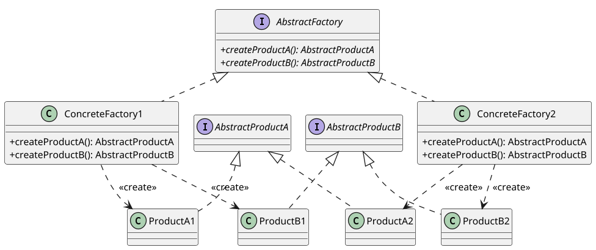

* **【下午题代码填空套路靶点 (C++ / Java)】**：
  * **核心挖空 1（工厂接口多产品方法定义）**：`public Button createButton();` 和 `public TextField createTextField();`
  * **核心挖空 2（具体工厂配对创建）**：`ConcreteFactory1` 内分别返回同一族的 `new ProductA1()` 与 `new ProductB1()`。

---

#### 03. 生成器 / 建造者模式 (Builder) —— 复杂对象精细化分步装配

* **【模式档案】**：
  * **分类**：创建型模式
  * **作用范围**：**对象模式**
  * **真题考频**：★★★★☆（Tier B 高频常客·题眼秒杀率 100%）
* **【生活类比 & 真题原型】**：
  * **生活类比**：**赛百味三明治装配**。店长（Director）指导装配步骤（先选面包 $	o$ 加肉饼 $	o$ 加芝士 $	o$ 淋酱汁）。具体操作员（Builder）按步骤操作。无论做牛肉堡还是金枪鱼堡，装配流水线完全一致，但最终得到的三明治不同。
  * **真题原型**：**复杂跨格式文档生成器**。读取一份富文本文档，由指挥者按照章节依次调用 `buildHeader()`、`buildBody()`、`buildFooter()`，`PdfBuilder` 产出 PDF，`HtmlBuilder` 产出 HTML。
* **【GoF 四大核心要素】**：
  * ① **模式名称 (Name)**：生成器模式 / 建造者模式 (Builder)。
  * ② **产生问题 (Problem)**：需要创建一个复杂对象，该对象由多个零部件按特定顺序装配而成。如果全部写在一个构造函数中会导致构造参数爆炸（Telescoping Constructor），且装配算法与部件具体实现耦合。
  * ③ **解决方案 (Solution)**：将一个复杂对象的**构建与它的表示分离**，使得**同样的构建过程可以创建不同的表示**。引入指挥者 (Director) 负责装配时序，具体建造者 (ConcreteBuilder) 负责部件生产。
  * ④ **应用效果 (Consequences)**：
    * *优点*：精细控制构建过程；解耦部件生产与装配算法；增加新的具体建造者非常方便；
    * *缺点*：如果产品内部差异过大（如不同产品完全没有共同的部件组成），则不适合使用生成器。
* **【考场标志性特征词 (10 秒秒杀题眼)】**：
  * **“将一个复杂对象的构建与它的表示分离，使得同样的构建过程可以创建不同的表示”**
  * **“分步骤 (Step-by-step) 逐步构建复杂对象”**
  * **“指挥者 (Director) 与建造者 (Builder) 的协作”**
  * **“构建过程算法独立于部件的组成与装配方式”**
* **【标准 PlantUML 角色类图】**：

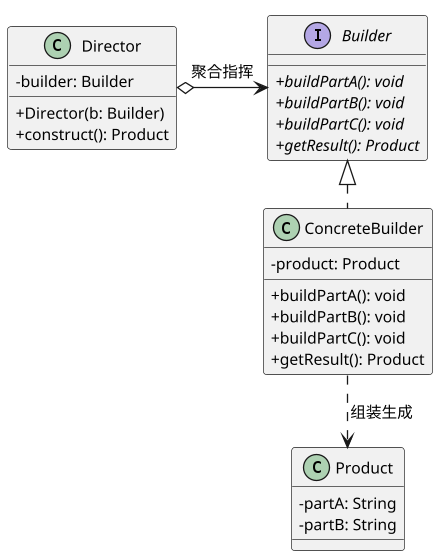

* **【下午题代码填空套路靶点 (C++ / Java)】**：
  * **核心挖空 1（指挥者调用建造流程）**：
    ```java
    public Product construct() {
        builder.buildPartA();
        builder.buildPartB();
        return builder.getResult(); // 挖空：返回最终构建结果
    }
    ```
  * **核心挖空 2（构造器注入 Builder）**：`this.builder = builder;`

---

#### 04. 原型模式 (Prototype) —— 细胞分裂式克隆母体

* **【模式档案】**：
  * **分类**：创建型模式
  * **作用范围**：**对象模式**
  * **真题考频**：★★★☆☆（Tier B 高频常客·上午概念考点）
* **【生活类比 & 真题原型】**：
  * **生活类比**：**办公室复印机克隆**。写好了一份完美的活动策划案模板，同事需要时直接拿去复印一份（克隆），然后只把名字和日期改掉，而不是从头到尾重新打字。
  * **真题原型**：**游戏怪兽批量生成 / 邮件群发模板**。游戏中同屏出现 100 只哥布林，初始化每只怪兽需要加载庞大纹理和数据，直接调用原型对象的 `clone()` 方法创建 100 个副本，性能极高。
* **【GoF 四大核心要素】**：
  * ① **模式名称 (Name)**：原型模式 (Prototype)。
  * ② **产生问题 (Problem)**：通过 `new` 关键字直接实例化对象的代价太高（如需要读取庞大数据库、网络或磁盘初始化），或者类的初始化状态极其复杂且经常需要大量重复副本。
  * ③ **解决方案 (Solution)**：用原型实例指定创建对象的种类，并且通过**拷贝这些原型**创建新的对象。
  * ④ **应用效果 (Consequences)**：
    * *优点*：动态增加或减少产品类；极大提升复杂对象的创建性能；避免了工厂方法复杂的继承层级；
    * *缺点*：每个类都必须实现克隆方法；**深拷贝 (Deep Copy)** 与 **浅拷贝 (Shallow Copy)** 容易出现指针或引用共享的安全隐患。
* **【考场标志性特征词 (10 秒秒杀题眼)】**：
  * **“用原型实例指定创建对象的种类，并且通过拷贝这些原型创建新的对象”**
  * **“clone() / 克隆 / 复制实例”**
  * **“创建对象成本过高时直接复制现有实例”**
  * **“浅拷贝与深拷贝”**
* **【标准 PlantUML 角色类图】**：

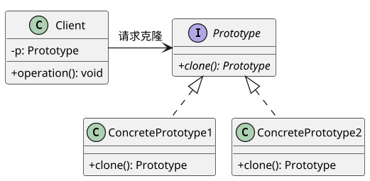

* **【下午题代码填空套路靶点 (C++ / Java)】**：
  * **核心挖空 1（实现 Cloneable 或克隆方法）**：`return (ConcretePrototype) super.clone();` (Java) 或 `return new ConcretePrototype(*this);` (C++ 拷贝构造)

---

#### 05. 单例模式 (Singleton) —— 独一无二的至高统领

* **【模式档案】**：
  * **分类**：创建型模式
  * **作用范围**：**对象模式**
  * **真题考频**：★★★★☆（Tier B 高频常客·代码挖空极度规范）
* **【生活类比 & 真题原型】**：
  * **生活类比**：**一国之君或公司首席财务官**。全公司发工资、报销全部只能找这同一个财务总监审批，绝不能每个人自己偷偷“new”一个财务总监出来，否则账目必乱。
  * **真题原型**：**系统全局日志管理器 / 数据库连接池 / 操作系统任务管理器**。保证系统内部无论多少个模块调用，操作的永远是同一个内存实例。
* **【GoF 四大核心要素】**：
  * ① **模式名称 (Name)**：单例模式 (Singleton)。
  * ② **产生问题 (Problem)**：某些类要求在整个系统的运行生命周期中**有且仅能存在一个全局实例**，防止资源冲突或全局状态不一致。
  * ③ **解决方案 (Solution)**：将类的构造函数设为私有 (`private`)，防止外部直接实例化；类自身维护一个静态私有唯一实例，并对外提供一个全局静态公共获取方法 (`getInstance()`)。
  * ④ **应用效果 (Consequences)**：
    * *优点*：对唯一实例的受控访问；节约系统开销，避免频繁创建销毁；
    * *缺点*：没有抽象层，扩展极其困难；职责过重，在一定程度上违反了单一职责原则。
* **【考场标志性特征词 (10 秒秒杀题眼)】**：
  * **“保证一个类仅有一个实例，并提供一个访问它的全局访问点”**
  * **“私有构造函数 (private constructor)”**
  * **“全局唯一静态实例 (static instance)”**
  * **“getInstance() 方法”**
* **【标准 PlantUML 角色类图】**：

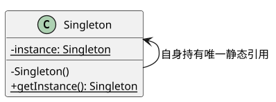

* **【下午题代码填空套路靶点 (C++ / Java)】**：
  * **核心挖空 1（私有构造函数）**：`private Singleton() { ... }`（防止外部 `new`）
  * **核心挖空 2（静态实例声明）**：`private static Singleton instance = null;`
  * **核心挖空 3（静态获取方法判空）**：
    ```java
    public static Singleton getInstance() {
        if (instance == null) { // 挖空点：懒汉式延迟加载判空
            instance = new Singleton();
        }
        return instance; // 挖空点：返回静态唯一实例
    }
    ```

---

### 【第二篇：结构型模式 (Structural Patterns，7 种)】

> **结构型模式核心心法**：**“关注类和对象的组合，构建更大更灵活的结构”**。结构型类模式采用继承机制来组合接口或实现；而结构型对象模式描述了如何对对象进行组合，以实现新功能（由于可以在运行时刻改变对象组合，这种灵活性是静态类组合无法实现的）。

---

#### 06. 适配器模式 (Adapter) —— 解决接口不兼容的万能转换插头

* **【模式档案】**：
  * **分类**：结构型模式
  * **作用范围**：**类模式 / 对象模式兼具**（类适配器基于多重继承；对象适配器基于组合委托）
  * **真题考频**：★★★★★（Tier A 核心核武库·历年下午大题超高频）
* **【生活类比 & 真题原型】**：
  * **生活类比**：**出国电源转接头**。中国的笔记本电脑插头是三相扁脚（客户端 Target 期望），但欧洲墙壁插座是双孔圆孔（Adaptee 被适配者）。插头无法直接插进插座，必须加一个“电源转换插头”（Adapter）在中间中转。
  * **真题原型**：**遗留旧系统接入新平台**。新系统定义了统一的数据读取接口 `DataOperation`（包含 `sort()` 方法），现有一个老旧但高效的第三方快速排序类 `QuickSortHelper`（方法名为 `quickSort()`），通过编写适配器类包装该旧类，使之符合新接口。
* **【GoF 四大核心要素】**：
  * ① **模式名称 (Name)**：适配器模式 (Adapter / Wrapper 包装器)。
  * ② **产生问题 (Problem)**：想要复用现有的类，但是它的接口与系统目前所要求的接口不兼容，且无法或不愿修改现有类的源码。
  * ③ **解决方案 (Solution)**：将一个类的接口**转换成客户希望的另外一个接口**。Adapter 模式使得原本由于**接口不兼容**而不能一起工作的那些类可以一起工作。
  * ④ **应用效果 (Consequences)**：
    * *优点*：极佳的复用性；客户端透明访问；类适配器与对象适配器可自由根据语言特性选型；
    * *缺点*：过度使用适配器会导致系统结构零乱，增加代码理解成本。
* **【考场标志性特征词 (10 秒秒杀题眼)】**：
  * **“将一个类的接口转换成客户希望的另外一个接口”**
  * **“使得原本由于接口不兼容而不能一起工作的那些类可以一起工作”**
  * **“Target（目标接口）、Adaptee（适配者）、Adapter（适配器）”**
  * **“类适配器（继承 Adaptee）与对象适配器（委托持有 Adaptee 引用）”**
* **【标准 PlantUML 角色类图】**：

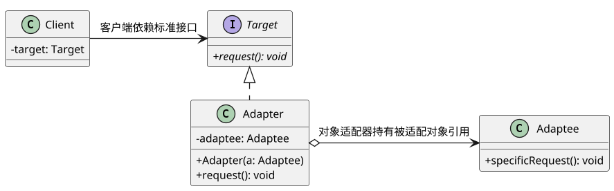

* **【下午题代码填空套路靶点 (C++ / Java)】**：
  * **核心挖空 1（适配器类实现目标接口）**：`public class Adapter implements Target`
  * **核心挖空 2（内部聚合被适配者）**：`private Adaptee adaptee;`
  * **核心挖空 3（委托调用转换）**：
    ```java
    public void request() {
        adaptee.specificRequest(); // 挖空：调用旧类具体方法
    }
    ```

---

#### 07. 桥接模式 (Bridge) —— 独立双维度的自由立交桥

* **【模式档案】**：
  * **分类**：结构型模式
  * **作用范围**：**对象模式**
  * **真题考频**：★★★★☆（Tier B 高频常客·上午大题与概念双覆盖）
* **【生活类比 & 真题原型】**：
  * **生活类比**：**蜡笔 vs 毛笔与水彩**。如果你要画 3 种粗细（大中小）、12 种颜色的画，用蜡笔需要买 $3 	imes 12 = 36$ 支蜡笔（类爆炸）；如果改用毛笔，只需买 3 支毛笔（抽象维度：型号），再买 12 盒颜料（实现维度：颜色），工具总数只需 $3 + 12 = 15$ 样。
  * **真题原型**：**跨平台多格式图像解析器**。维度一为图像格式（JPG、PNG、GIF），维度二为操作系统平台（Windows、Linux、Mac）。使用桥接模式使图像格式和系统底层绘制 API 分离独立演化。
* **【GoF 四大核心要素】**：
  * ① **模式名称 (Name)**：桥接模式 (Bridge / Handle and Body)。
  * ② **产生问题 (Problem)**：当一个系统存在**两个（或多个）独立变化的维度**时，如果采用传统多层继承，会导致子类数量爆炸（笛卡尔乘积 $M 	imes N$），且系统紧密耦合，无法独立扩展。
  * ③ **解决方案 (Solution)**：**将抽象部分与它的实现部分分离，使它们都可以独立地变化**。用关联/聚合组合代替继承关系。
  * ④ **应用效果 (Consequences)**：
    * *优点*：彻底解耦抽象与实现；类数量从乘积级 $M 	imes N$ 降为线性加和级 $M + N$；极度符合开闭原则；
    * *缺点*：增加了系统的理解与设计难度，需要准确识别出系统中两个独立变化的维度。
* **【考场标志性特征词 (10 秒秒杀题眼)】**：
  * **“将抽象部分与它的实现部分分离，使它们都可以独立地变化”**
  * **“两个独立变化的维度”**
  * **“避免类的继承爆炸（M*N 变为 M+N）”**
  * **“脱耦抽象与实现 (Decouple abstraction from implementation)”**
* **【标准 PlantUML 角色类图】**：

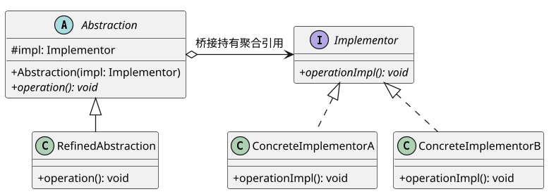

* **【下午题代码填空套路靶点 (C++ / Java)】**：
  * **核心挖空 1（抽象类持有实现接口指针）**：`protected Implementor impl;`
  * **核心挖空 2（委托调用实现部分）**：
    ```cpp
    void RefinedAbstraction::operation() {
        impl->operationImpl(); // 挖空：通过桥接指针调用底层实现
    }
    ```

---

#### 08. 组合模式 (Composite) —— 一视同仁的树形部分整体

* **【模式档案】**：
  * **分类**：结构型模式
  * **作用范围**：**对象模式**
  * **真题考频**：★★★★★（Tier A 核心核武库·下午代码大题常考）
* **【生活类比 & 真题原型】**：
  * **生活类比**：**计算机文件系统（文件与文件夹）**。文件夹里可以放普通文件（叶子 Leaf），也可以放其他子文件夹（容器 Composite）。当用户对某个对象按 `Delete` 键时，无论是单个文本文件还是装有 1 万张照片的文件夹，操作方式完全一致。
  * **真题原型**：**企业组织架构 / 绘图软件图元组合 / 算术表达式语法树**。集团公司包含子公司，子公司包含部门，部门包含员工；绘制软件中“点、线”是叶子，“由多条线组成的复杂图元”是组合构件。
* **【GoF 四大核心要素】**：
  * ① **模式名称 (Name)**：组合模式 (Composite)。
  * ② **产生问题 (Problem)**：需要表示对象的部分-整体层次结构，并且希望客户端能够忽略组合对象与单个对象的差异，以一致的方式对待所有对象。
  * ③ **解决方案 (Solution)**：**将对象组合成树形结构以表示“部分-整体”的层次结构**。组合模式使得用户对单个对象和组合对象的使用具有**一致性**。
  * ④ **应用效果 (Consequences)**：
    * *优点*：定义了包含基本对象和组合对象的类层次结构；简化了客户端代码（无需写复杂的 `if(isFolder)` 判断）；符合开闭原则，极易添加新构件；
    * *缺点*：难以限制组合中的组件类型（由于叶子和容器都实现共同接口，无法在编译期强制要求某个文件夹只能装特定文件）。
* **【考场标志性特征词 (10 秒秒杀题眼)】**：
  * **“将对象组合成树形结构以表示‘部分-整体’的层次结构”**
  * **“使得用户对单个对象和组合对象的使用具有一致性”**
  * **“Component（抽象构件）、Leaf（叶子构件）、Composite（复合容器构件）”**
  * **“透明方式 vs 安全方式（add/remove 接口定义位置）”**
* **【标准 PlantUML 角色类图】**：

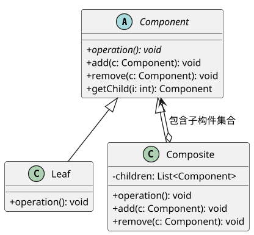

* **【下午题代码填空套路靶点 (C++ / Java)】**：
  * **核心挖空 1（容器内部维护子构件集合）**：`private List<Component> children = new ArrayList<>();`
  * **核心挖空 2（组合构件的递归遍历执行）**：
    ```java
    public void operation() {
        for (Component child : children) { // 挖空：循环遍历递归调用
            child.operation();
        }
    }
    ```

---

#### 09. 装饰模式 (Decorator) —— 奶茶加小料的动态功能包裹

* **【模式档案】**：
  * **分类**：结构型模式
  * **作用范围**：**对象模式**
  * **真题考频**：★★★★★（Tier A 核心核武库·下午代码常客）
* **【生活类比 & 真题原型】**：
  * **生活类比**：**奶茶加料 / 给手机戴壳贴膜**。一杯原味基础奶茶（ConcreteComponent），你可以给它加珍珠（DecoratorA），再加椰果（DecoratorB），再加布丁（DecoratorC）。加完所有配料后，它**依然还是一杯奶茶**（与原奶茶实现同一个接口），但功能与价格动态叠加上去了。
  * **真题原型**：**Java I/O 流设计**。`FileInputStream` 是底层读取文件的具体流，通过 `BufferedInputStream` 包装增加缓冲功能，再通过 `DataInputStream` 包装增加读取基本数据类型功能。
* **【GoF 四大核心要素】**：
  * ① **模式名称 (Name)**：装饰模式 (Decorator / Wrapper 包装器)。
  * ② **产生问题 (Problem)**：希望动态地为单个对象添加职责，如果采用继承扩展功能，当功能排列组合较多时会导致子类爆炸，且继承是静态的，无法在运行时刻自由装卸。
  * ③ **解决方案 (Solution)**：**动态地给一个对象添加一些额外的职责**。就增加功能而言，Decorator 模式比生成子类更为灵活。装饰器类既继承了抽象构件，又在内部聚合了一个抽象构件的引用。
  * ④ **应用效果 (Consequences)**：
    * *优点*：比静态继承更灵活；可以按任意顺序嵌套装饰；符合单一职责原则（各装饰类专注单一功能）；
    * *缺点*：产生许多小对象，多层嵌套装饰时排查调试困难。
* **【考场标志性特征词 (10 秒秒杀题眼)】**：
  * **“动态地给一个对象添加一些额外的职责”**
  * **“比生成子类更为灵活”**
  * **“透明地扩展对象功能”**
  * **“同宗同源（既是 Component 的子类，内部又持有 Component 的指针/引用）”**
* **【标准 PlantUML 角色类图】**：

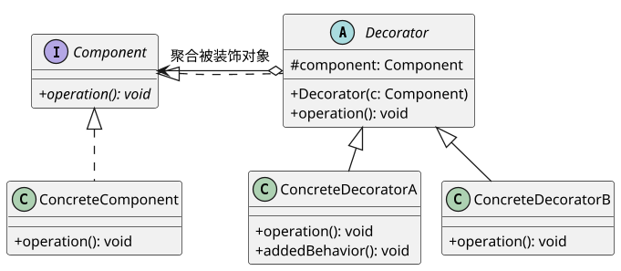

* **【下午题代码填空套路靶点 (C++ / Java)】**：
  * **核心挖空 1（装饰抽象基类继承并持有接口）**：
    ```java
    public abstract class Decorator implements Component {
        protected Component component; // 挖空：持有被装饰构件
        public Decorator(Component c) { this.component = c; }
        public void operation() { component.operation(); }
    }
    ```
  * **核心挖空 2（具体装饰器先调用原操作再加行为）**：
    ```cpp
    void ConcreteDecoratorA::operation() {
        Decorator::operation(); // 挖空：调用原有行为
        addedBehavior();        // 挖空：执行新装饰行为
    }
    ```

---

#### 10. 外观模式 (Facade) —— 一揽子接待的综合服务前台

* **【模式档案】**：
  * **分类**：结构型模式
  * **作用范围**：**对象模式**
  * **真题考频**：★★★★☆（Tier B 高频常客·迪米特法则最佳代言）
* **【生活类比 & 真题原型】**：
  * **生活类比**：**市民服务大厅一站式办事窗口 / 医院导医台**。去政府办证如果自己跑，需要跑税务局、工商局、公安局、环保局等 10 个窗口；而一站式办事大厅（Facade）让你只需要在一个总服务台提交一套材料，由总台统一协调各个底层子部门。
  * **真题原型**：**编译器子系统调用 / 智能家庭影院一键观影模式**。用户看电影只需按一个“观影模式”按钮，外观类内部依次关闭窗帘、调暗灯光、打开投影仪、启动音响、播放影片。
* **【GoF 四大核心要素】**：
  * ① **模式名称 (Name)**：外观模式 (Facade / 门面模式)。
  * ② **产生问题 (Problem)**：复杂的子系统包含众多互相依赖的小类，客户端如果直接与这些小类交互，会导致客户端代码与子系统高度紧密耦合。
  * ③ **解决方案 (Solution)**：**为子系统中的一组接口提供一个一致的界面**。Facade 模式定义了一个高层接口，这个接口使得这一子系统更加容易使用。
  * ④ **应用效果 (Consequences)**：
    * *优点*：极大地简化了客户端调用；对客户屏蔽了子系统组件；松散耦合，完美实践**迪米特法则（最少知识原则）**；
    * *缺点*：不能很好地限制客户使用子系统类；若不合理设计，外观类容易演变成庞大沉重的“上帝类”。
* **【考场标志性特征词 (10 秒秒杀题眼)】**：
  * **“为子系统中的一组接口提供一个一致的界面”**
  * **“定义了一个高层接口，使子系统更加容易使用”**
  * **“迪米特法则 / 最少知识原则”**
  * **“对外提供统一入口，对内协调多个复杂子系统”**
* **【标准 PlantUML 角色类图】**：

```plantuml
@startuml
!pragma layout smetana
skinparam dpi 125
skinparam defaultFontSize 12
skinparam classAttributeIconSize 0

class Facade {
    - subA: SubSystemA
    - subB: SubSystemB
    - subC: SubSystemC
    + wrapOperation(): void
}

class SubSystemA { + opA(): void }
class SubSystemB { + opB(): void }
class SubSystemC { + opC(): void }

class Client

Client -> Facade : 仅与外观类交互
Facade --> SubSystemA
Facade --> SubSystemB
Facade --> SubSystemC
@enduml
```

* **【下午题代码填空套路靶点 (C++ / Java)】**：
  * **核心挖空 1（外观方法组合调用子系统方法）**：
    ```java
    public void watchMovie() {
        light.dim();       // 挖空：调用子系统组件
        projector.on();    // 挖空
        dvdPlayer.play();  // 挖空
    }
    ```

---

#### 11. 享元模式 (Flyweight) —— 共享细粒度对象的值钱棋子

* **【模式档案】**：
  * **分类**：结构型模式
  * **作用范围**：**对象模式**
  * **真题考频**：★★☆☆☆（Tier C 冷门防冷箭·概念与内部/外部状态考查）
* **【生活类比 & 真题原型】**：
  * **生活类比**：**围棋棋盘与棋子**。一盘围棋有 361 个交叉点。如果每下一个棋子就 `new` 一个棋子对象，内存里会有几百个对象。但其实所有黑子长得一模一样，所有白子也一模一样。棋子的“黑色/白色”是**内部状态（共享）**；棋子落在“(5, 8)”还是“(12, 16)”是**外部状态（由棋盘位置传入）**。系统全局只需要两个享元对象（一个黑子，一个白子）。
  * **真题原型**：**文档编辑器的字符渲染 / 跨平台文字排版**。文档中有几十万个字母 'A'，字符字体、字形属于内部状态共享，位置坐标属于外部状态。
* **【GoF 四大核心要素】**：
  * ① **模式名称 (Name)**：享元模式 (Flyweight)。
  * ② **产生问题 (Problem)**：系统需要创建大量细粒度的对象，导致内存开销巨大，甚至可能导致内存溢出。
  * ③ **解决方案 (Solution)**：**运用共享技术有效地支持大量细粒度的对象**。将对象状态剥离为内部状态（不变、可共享）和外部状态（随环境变化、不可共享，使用时由外部参数传入）。
  * ④ **应用效果 (Consequences)**：
    * *优点*：大幅度减少内存中对象的数量，极大地节约系统内存资源；
    * *缺点*：使系统更加复杂；必须使内部状态和外部状态分离，读取外部状态使运行时间变长。
* **【考场标志性特征词 (10 秒秒杀题眼)】**：
  * **“运用共享技术有效地支持大量细粒度的对象”**
  * **“内部状态 (Intrinsic State) 与外部状态 (Extrinsic State)”**
  * **“FlyweightFactory 享元工厂管理对象池”**
  * **“大量相似对象共享内存”**
* **【标准 PlantUML 角色类图】**：

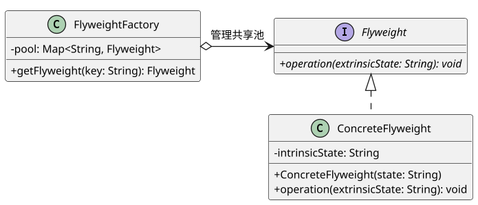

* **【下午题代码填空套路靶点 (C++ / Java)】**：
  * **核心挖空 1（享元工厂对象池查找与懒加载）**：
    ```java
    public Flyweight getFlyweight(String key) {
        if (!pool.containsKey(key)) {
            pool.put(key, new ConcreteFlyweight(key)); // 挖空：不存在则新建放入池
        }
        return pool.get(key); // 挖空：从池中获取共享对象
    }
    ```

---

#### 12. 代理模式 (Proxy) —— 掌控门禁的忠诚经纪人

* **【模式档案】**：
  * **分类**：结构型模式
  * **作用范围**：**对象模式**
  * **真题考频**：★★★☆☆（Tier C 冷门防冷箭·概念考点）
* **【生活类比 & 真题原型】**：
  * **生活类比**：**明星的专业经纪人**。制片人想找一线明星演戏，不能直接拨通明星私人电话，必须联系经纪人（代理 Proxy）。经纪人负责过滤无聊邀约（保护代理）、核验预算定金（权限控制）、安排档期。只有到真正开拍的那天，才让明星本体（RealSubject）出场。
  * **真题原型**：**远程方法调用 (RPC/RMI 远程代理) / 大尺寸图片占位符延迟加载 (虚代理) / 权限控制过滤器 (保护代理)**。
* **【GoF 四大核心要素】**：
  * ① **模式名称 (Name)**：代理模式 (Proxy / Surrogate)。
  * ② **产生问题 (Problem)**：由于安全、性能、远程访问等原因，客户端无法直接访问或者不便于直接引用一个目标对象。
  * ③ **解决方案 (Solution)**：**为其他对象提供一种代理以控制对这个对象的访问**。代理类与真实主题类实现同一个接口，代理类内部持有真实主题的引用。
  * ④ **应用效果 (Consequences)**：
    * *优点*：协调调用者与被调用者，在客户端与目标对象之间起到中介和保护作用；符合开闭原则；
    * *缺点*：在客户端和真实对象之间增加了代理对象，可能会导致请求处理速度变慢。
* **【考场标志性特征词 (10 秒秒杀题眼)】**：
  * **“为其他对象提供一种代理以控制对这个对象的访问”**
  * **“远程代理 (Remote Proxy)”**
  * **“虚代理 (Virtual Proxy，开销大对象延迟加载)”**
  * **“保护代理 (Protection Proxy，权限控制)”**
  * **“智能引用代理 (Smart Reference)”**
* **【标准 PlantUML 角色类图】**：

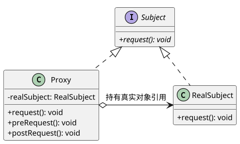

* **【下午题代码填空套路靶点 (C++ / Java)】**：
  * **核心挖空 1（代理方法前置/后置增强与委托）**：
    ```java
    public void request() {
        if (checkAccess()) { // 挖空：前置权限校验
            if (realSubject == null) realSubject = new RealSubject(); // 虚代理延迟初始化
            realSubject.request(); // 挖空：委托调用真实对象
            log(); // 后置审计日志
        }
    }
    ```

---

### 【第三篇：行为型模式 (Behavioral Patterns，11 种)】

> **行为型模式核心心法**：**“关注对象间的通信、算法职责分配与动态协作”**。行为型模式不仅关注类和对象的结构，更关注它们之间的交互流。行为型类模式采用继承机制在类间分派行为（如模板方法、解释器）；行为型对象模式采用对象复合机制来协调对象行为。

---

#### 13. 策略模式 (Strategy) —— 随意拔插的算法战术锦囊

* **【模式档案】**：
  * **分类**：行为型模式
  * **作用范围**：**对象模式**
  * **真题考频**：★★★★★（Tier A 核心核武库·真题出现率榜首）
* **【生活类比 & 真题原型】**：
  * **生活类比**：**出行高德地图路线规划 / 诸葛亮的锦囊妙计**。去机场你可以选择“坐地铁（快且稳）”、“打快车（舒适但怕堵）”或“骑单车（便宜但累）”。目的地只有一个，但路线算法可以随心所欲自由切换。
  * **真题原型**：**商场收银促销计费系统 / 排序算法切换器**。根据不同顾客级别或促销活动，动态采用“原价策略”、“八折促销策略”或“满300减50策略”。
* **【GoF 四大核心要素】**：
  * ① **模式名称 (Name)**：策略模式 (Strategy / Policy 政策模式)。
  * ② **产生问题 (Problem)**：完成一项任务有多种算法或实现方式，如果不做抽象，会导致在客户端代码中堆砌庞大且难以维护的多分支 `if-else` 或 `switch-case` 语句，违反开闭原则。
  * ③ **解决方案 (Solution)**：**定义一系列算法，把它们一个个封装起来，并且使它们可以相互替换**。Strategy 模式使得**算法可以独立于使用它的客户而变化**。
  * ④ **应用效果 (Consequences)**：
    * *优点*：彻底消除庞大多条件分支选择；算法自由切换；扩展新算法只需增加具体策略类，符合开闭原则；
    * *缺点*：客户端必须了解所有策略的具体区别，才能选定合适的策略；策略类数量较多。
* **【考场标志性特征词 (10 秒秒杀题眼)】**：
  * **“定义一系列算法，把它们一个个封装起来，并且使它们可以相互替换”**
  * **“使得算法可以独立于使用它的客户而变化”**
  * **“消除多重条件选择语句 (if-else / switch-case)”**
  * **“Context（环境类）、Strategy（抽象策略）、ConcreteStrategy（具体策略）”**
* **【标准 PlantUML 角色类图】**：

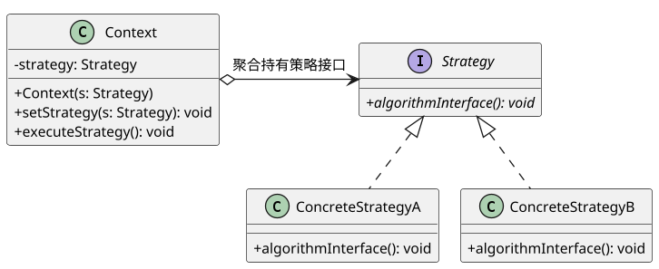

* **【下午题代码填空套路靶点 (C++ / Java)】**：
  * **核心挖空 1（环境类内部维护抽象策略指针）**：`private Strategy strategy;`
  * **核心挖空 2（Setter 依赖注入）**：`public void setStrategy(Strategy s) { this.strategy = s; }`
  * **核心挖空 3（委托执行算法）**：
    ```java
    public void executeStrategy() {
        strategy.algorithmInterface(); // 挖空：多态调用具体策略算法
    }
    ```

---

#### 14. 观察者模式 (Observer) —— 牵一发而动全身的广播订阅网

* **【模式档案】**：
  * **分类**：行为型模式
  * **作用范围**：**对象模式**
  * **真题考频**：★★★★★（Tier A 核心核武库·真题大题最高频榜二）
* **【生活类比 & 真题原型】**：
  * **生活类比**：**微信公众号推送 / 报纸订阅**。你关注了一个官方公众号（Subject），公众号后台维护着所有粉丝的订阅列表。一旦作者点击“发布新推文”，系统自动循环遍历粉丝列表，瞬间将最新文章通知推送到每个人的手机上（Observer）。
  * **真题原型**：**气象站与多显示看板联动 / 股市行情大屏实时刷新 / GUI 事件监听机制 (Listener)**。气象站测量数据一变，温度看板、湿度看板和气压看板全部被动自动刷新。
* **【GoF 四大核心要素】**：
  * ① **模式名称 (Name)**：观察者模式 (Observer / Publish-Subscribe 发布-订阅 / Dependents)。
  * ② **产生问题 (Problem)**：一个对象的状态改变需要同时通知多个其他对象，而且不知道究竟有多少个对象需要通知，同时希望保持被观察者与观察者之间的松散耦合。
  * ③ **解决方案 (Solution)**：**定义对象间的一种一对多的依赖关系，当一个对象的状态发生改变时，所有依赖于它的对象都得到通知并被自动更新**。
  * ④ **应用效果 (Consequences)**：
    * *优点*：目标与观察者之间松散耦合；支持广泛的广播通信；符合开闭原则；
    * *缺点*：如果观察者过多，通知全部观察者会花费较多时间；若观察者之间存在循环依赖，可能引发系统死锁或崩溃。
* **【考场标志性特征词 (10 秒秒杀题眼)】**：
  * **“定义对象间的一种一对多的依赖关系”**
  * **“当一个对象的状态发生改变时，所有依赖于它的对象都得到通知并被自动更新”**
  * **“发布-订阅 (Publish-Subscribe)”**
  * **“Subject（目标）、Observer（观察者）、attach()、detach()、notify()”**
* **【标准 PlantUML 角色类图】**：

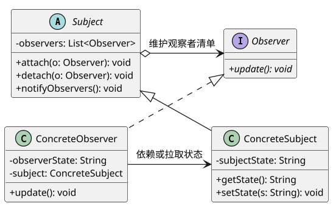

* **【下午题代码填空套路靶点 (C++ / Java)】**：
  * **核心挖空 1（广播通知循环）**：
    ```java
    public void notifyObservers() {
        for (Observer obs : observers) { // 挖空：遍历所有注册的观察者
            obs.update();                // 挖空：调用更新接口
        }
    }
    ```
  * **核心挖空 2（观察者接收到通知后拉取状态）**：`observerState = subject.getState();`

---

#### 15. 状态模式 (State) —— 随心而动的多态变身术

* **【模式档案】**：
  * **分类**：行为型模式
  * **作用范围**：**对象模式**
  * **真题考频**：★★★★★（Tier A 核心核武库·与策略模式孪生对决）
* **【生活类比 & 真题原型】**：
  * **生活类比**：**水的三态变化 / 自动售货机投币状态**。水在零度以下是“冰（固态）”，你可以拿它当砖头敲；加热到 50 度变成“水（液态）”，可以喝；加热到 100 度变成“水蒸气（气态）”，可以推汽轮机。对象还是那杯水，但**因为内部状态不同，外部行为发生质的改变**。
  * **真题原型**：**银行账户透支状态机（绿卡正常状态、黄卡透支状态、红卡冻结状态）/ TCP 连接状态迁移**。在正常状态下取款直接扣钱；在透支状态下扣钱加收利息；在冻结状态下禁止取款。
* **【GoF 四大核心要素】**：
  * ① **模式名称 (Name)**：状态模式 (State / Objects for States)。
  * ② **产生问题 (Problem)**：一个对象的行为取决于它的状态，并且它必须在运行时刻根据状态改变它的行为；以往代码中充斥着庞大的依赖状态判断的条件语句。
  * ③ **解决方案 (Solution)**：**允许一个对象在其内部状态改变时改变它的行为。对象看起来似乎修改了它的类**。将每一个具体状态封装为一个独立的类。
  * ④ **应用效果 (Consequences)**：
    * *优点*：将与特定状态相关的行为局部化，并且将不同状态的行为分割开来；消除臃肿的分支语句；使状态转换显式化；
    * *缺点*：导致状态类数量迅速膨胀。
* **【考场标志性特征词 (10 秒秒杀题眼)】**：
  * **“允许一个对象在其内部状态改变时改变它的行为”**
  * **“对象看起来似乎修改了它的类”**
  * **“将状态相关的行为分散到不同的状态类中”**
  * **“状态自动转移（在状态类内部触发 `context.setState(...)`）”**
* **【标准 PlantUML 角色类图】**：

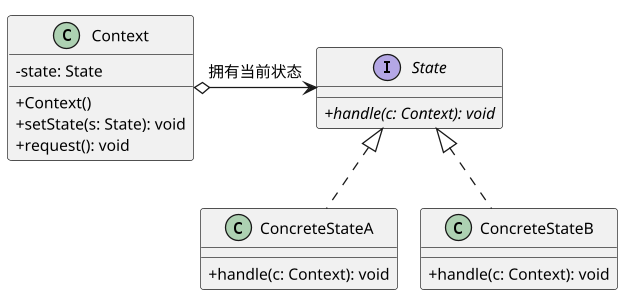

* **【下午题代码填空套路靶点 (C++ / Java)】**：
  * **核心挖空 1（状态执行完后自动切换下一状态）**：
    ```java
    public void handle(Context context) {
        // 执行当前状态行为...
        context.setState(new ConcreteStateB()); // 挖空：状态驱动自身转移！
    }
    ```

---

#### 16. 命令模式 (Command) —— 餐厅点餐排单小票与撤销后悔药

* **【模式档案】**：
  * **分类**：行为型模式
  * **作用范围**：**对象模式**
  * **真题考频**：★★★★★（Tier A 核心核武库·撤销重做与排队机制考查）
* **【生活类比 & 真题原型】**：
  * **生活类比**：**餐厅服务员的点餐小票**。客人（Client）点了一道宫保鸡丁，服务员（Invoker）并不自己炒菜，而是把需求写成一张纸质小票（Command）。这张小票被排在厨房的插单架上（排队等待）。后厨大厨（Receiver）根据小票炒菜。如果客人反悔，服务员只要抽出小票即可取消（撤销 Undo）。
  * **真题原型**：**文本编辑器的撤销重做 (Undo / Redo) / 电视机万能遥控器按键绑定 / 批处理任务队列**。
* **【GoF 四大核心要素】**：
  * ① **模式名称 (Name)**：命令模式 (Command / Action 动作模式 / Transaction 事务模式)。
  * ② **产生问题 (Problem)**：需要将请求调用者（如按钮、菜单栏）与请求接收处理者（如文档保存模块、绘制引擎）彻底解耦；需要支持请求排队、日志记录或撤销操作。
  * ③ **解决方案 (Solution)**：**将一个请求封装为一个对象，从而使你可用不同的请求对客户进行参数化；对请求排队或记录请求日志，以及支持可撤销的操作**。
  * ④ **应用效果 (Consequences)**：
    * *优点*：彻底解耦调用操作的对象与执行操作的对象；容易设计宏命令；扩展新命令不影响现有类；
    * *缺点*：可能导致系统中存在过多的具体命令类。
* **【考场标志性特征词 (10 秒秒杀题眼)】**：
  * **“将一个请求封装为一个对象”**
  * **“使你可用不同的请求对客户进行参数化”**
  * **“支持可撤销 (Undo) 和可重做 (Redo) 的操作”**
  * **“对请求排队 (Queue) 或记录请求日志 (Log)”**
  * **“Invoker（调用者）、Command（抽象命令）、Receiver（接收者）”**
* **【标准 PlantUML 角色类图】**：

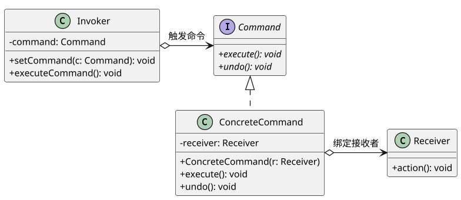

* **【下午题代码填空套路靶点 (C++ / Java)】**：
  * **核心挖空 1（命令内部转调接收者）**：
    ```java
    public void execute() {
        receiver.action(); // 挖空：真正命令执行委托给接收者
    }
    ```
  * **核心挖空 2（调用者调用 execute）**：`command.execute();`

---

#### 17. 模板方法模式 (Template Method) —— 统一步调的标准冲泡流程

* **【模式档案】**：
  * **分类**：行为型模式
  * **作用范围**：**类模式**（GoF 4 大类模式之一，基于继承）
  * **真题考频**：★★★★☆（Tier B 高频常客·框架级代码复用考查）
* **【生活类比 & 真题原型】**：
  * **生活类比**：**冲泡热饮通用四部曲**。冲咖啡和泡茶的流程骨架完全一致：① 把水烧开 $	o$ ② 用热水冲泡 $	o$ ③ 把饮料倒进杯子 $	o$ ④ 加调料。这四步骨架被严格规定死（模板方法）；具体“泡咖啡粉还是泡茶叶”、“加糖还是加柠檬”，留给各自子类自行实现。
  * **真题原型**：**银行柜台办理业务标准化流程**：① 取号排队 $	o$ ② 办理具体业务（存钱/取钱/买理财） $	o$ ③ 给柜员评价。框架决定执行次序，子类决定具体细节。
* **【GoF 四大核心要素】**：
  * ① **模式名称 (Name)**：模板方法模式 (Template Method)。
  * ② **产生问题 (Problem)**：多个子类具有完全相同的处理流程骨架，但流程中的某些具体步骤在不同子类中表现不同；希望避免在每个子类中重复编写相同的流程控制逻辑。
  * ③ **解决方案 (Solution)**：**定义一个操作中的算法的骨架，而将一些步骤延迟到子类中。Template Method 使得子类可以不改变一个算法的结构即可重定义该算法的某些特定步骤**。
  * ④ **应用效果 (Consequences)**：
    * *优点*：反向控制结构（好莱坞原则：“别打电话给我们，我们会打给你”）；极大提高代码复用性；
    * *缺点*：每个不同的实现都需要定义一个子类，导致类的个数增加；父类规定死算法骨架，灵活性受限。
* **【考场标志性特征词 (10 秒秒杀题眼)】**：
  * **“定义一个操作中的算法的骨架，而将一些步骤延迟到子类中”**
  * **“子类不改变算法结构即可重定义某些特定步骤”**
  * **“好莱坞法则 (Don't call us, we'll call you)”**
  * **“基本方法 (Primitive/Abstract) + 钩子方法 (Hook Method) + 模板方法 (Template)”**
* **【标准 PlantUML 角色类图】**：

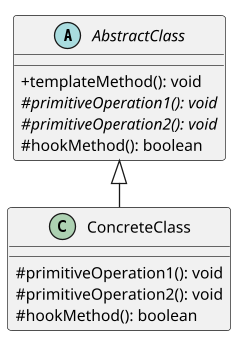

* **【下午题代码填空套路靶点 (C++ / Java)】**：
  * **核心挖空 1（模板方法锁定执行顺序，不可被子类重写）**：
    ```java
    public final void templateMethod() { // final 防止被篡改
        primitiveOperation1(); // 挖空：子类实现的抽象基本步骤
        primitiveOperation2();
        if (hookMethod()) {    // 挖空：钩子方法判定
            // 执行扩展逻辑
        }
    }
    ```

---

#### 18. 职责链模式 (Chain of Responsibility) —— 层层上报的击鼓传花链

* **【模式档案】**：
  * **分类**：行为型模式
  * **作用范围**：**对象模式**
  * **真题考频**：★★★★☆（Tier B 高频常客·OA 审批系统原型）
* **【生活类比 & 真题原型】**：
  * **生活类比**：**公司员工请假审批**。请假 1 天以内的，组长直接批准；请假 1~3 天的，组长无权批，流转给部门经理；请假 3~7 天的，经理流转给总监；超过 7 天的，流转给总经理。员工只需向自己的直接上级提交申请，不必关心到底是哪个大领导最终批复。
  * **真题原型**：**供应链采购报销审批 / 窗口事件传递 / Java Web Filter 过滤器链条**。
* **【GoF 四大核心要素】**：
  * ① **模式名称 (Name)**：职责链模式 / 责任链模式 (Chain of Responsibility)。
  * ② **产生问题 (Problem)**：多个对象都可以处理同一个请求，但处理请求的具体对象在运行时刻前是不确定的；想要避免请求的发送者与接收者之间的显式耦合。
  * ③ **解决方案 (Solution)**：**使多个对象都有机会处理请求，从而避免请求的发送者和接收者之间的耦合关系。将这些对象连成一条链，并沿着这条链传递该请求，直到有一个对象处理它为止**。
  * ④ **应用效果 (Consequences)**：
    * *优点*：降低耦合度；简化了对象之间的相互连接；灵活地增加或修改链条节点；
    * *缺点*：不能保证请求一定会被接收处理（可能传到链尾没人管）；较长的链可能影响性能。
* **【考场标志性特征词 (10 秒秒杀题眼)】**：
  * **“使多个对象都有机会处理请求，避免发送者和接收者之间的耦合”**
  * **“将这些对象连成一条链，并沿着这条链传递请求，直到有一个对象处理它为止”**
  * **“Handler（抽象处理者持有 successor 后继者引用）”**
  * **“纯职责链（要么处理要么转交） vs 不纯职责链（处理一部分后继续向下传递）”**
* **【标准 PlantUML 角色类图】**：

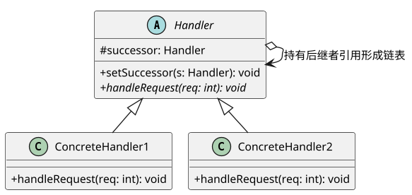

* **【下午题代码填空套路靶点 (C++ / Java)】**：
  * **核心挖空 1（后继传递判空）**：
    ```java
    public void handleRequest(int req) {
        if (req <= 3) {
            // 本级处理
        } else if (successor != null) {
            successor.handleRequest(req); // 挖空：交给后继节点处理
        }
    }
    ```

---

#### 19. 中介者模式 (Mediator) —— 消除网状耦合的航空调度塔台

* **【模式档案】**：
  * **分类**：行为型模式
  * **作用范围**：**对象模式**
  * **真题考频**：★★★★☆（Tier B 高频常客·迪米特法则体现）
* **【生活类比 & 真题原型】**：
  * **生活类比**：**机场空中交通管制塔台 / 聊天室服务器**。如果机场有 20 架飞机同时降落，如果让飞机两两互相无线电沟通防撞，沟通线路是 $20 	imes 19 / 2 = 190$ 条（网状爆炸）；而引入塔台（Mediator）后，所有飞机只跟塔台一人通信，通信线路瞬间变为 20 条（星型结构）。
  * **真题原型**：**复杂图形界面组件联动**。一个表单里包含文本框、复选框、提交按钮、下拉列表等，当复选框被勾选时，文本框变灰、按钮变亮。由 `DialogDirector` 中介者统一协调各个控件。
* **【GoF 四大核心要素】**：
  * ① **模式名称 (Name)**：中介者模式 (Mediator / Controller 调停者)。
  * ② **产生问题 (Problem)**：对象之间存在复杂的网状相互引用，导致系统耦合度极高；任何一个对象的改动都会牵一发而动全身，使得对象难以单独复用。
  * ③ **解决方案 (Solution)**：**用一个中介对象来封装一系列的对象交互。中介者使各对象不需要显式地相互引用，从而使其耦合松散，而且可以独立地改变它们之间的交互**。将“网状拓扑”改造为“星型拓扑”。
  * ④ **应用效果 (Consequences)**：
    * *优点*：减少子类生成；将各 Colleague 解耦；简化了对象协议；
    * *缺点*：中介者类自身容易演化成一个庞大而复杂的巨石类（God Object）。
* **【考场标志性特征词 (10 秒秒杀题眼)】**：
  * **“用一个中介对象来封装一系列的对象交互”**
  * **“使各对象不需要显式地相互引用，从而使其耦合松散”**
  * **“将多对多 (网状) 结构转化为一对多 (星型) 结构”**
  * **“Mediator（抽象中介者）、Colleague（同事类）”**
* **【标准 PlantUML 角色类图】**：

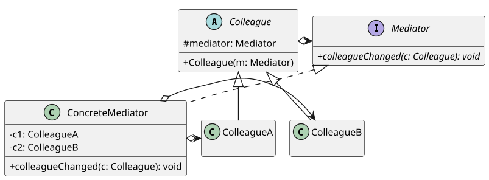

* **【下午题代码填空套路靶点 (C++ / Java)】**：
  * **核心挖空 1（同事类通知中介者）**：
    ```java
    public void changed() {
        mediator.colleagueChanged(this); // 挖空：同事类向中介者汇报变化
    }
    ```

---

#### 20. 备忘录模式 (Memento) —— 绝不破坏封装的游戏存档读档

* **【模式档案】**：
  * **分类**：行为型模式
  * **作用范围**：**对象模式**
  * **真题考频**：★★★☆☆（Tier B 高频常客·快照与撤销机制）
* **【生活类比 & 真题原型】**：
  * **生活类比**：**单机游戏打 BOSS 前的存档（F5 QuickSave）与读档（F9 QuickLoad）**。在进入危险关卡前，把当前人物的血量、装备、状态打包保存成一个独立文件（Memento）。如果阵亡，直接从存档还原。关键在于：游戏存档绝不能被外部修改作弊（不破坏原发器的内部封装）。
  * **真题原型**：**文本编辑器的快照历史记录 / 棋局悔棋系统**。记录当前棋盘状态，存入撤销栈中。
* **【GoF 四大核心要素】**：
  * ① **模式名称 (Name)**：备忘录模式 (Memento / Token 标记)。
  * ② **产生问题 (Problem)**：需要保存一个对象在某一时刻的内部状态，以便在未来需要时能够恢复到该状态，但同时必须严守对象的封装边界，不把内部私有属性对外暴露。
  * ③ **解决方案 (Solution)**：**在不破坏封装性的前提下，捕获一个对象的内部状态，并在该对象之外保存这个状态。这样以后就可将该对象恢复到原先保存的状态**。
  * ④ **应用效果 (Consequences)**：
    * *优点*：保持了封装边界；简化了原发器代码；
    * *缺点*：如果状态数据庞大，频繁创建备忘录对象会耗费大量的内存。
* **【考场标志性特征词 (10 秒秒杀题眼)】**：
  * **“在不破坏封装性的前提下，捕获一个对象的内部状态，并在该对象之外保存”**
  * **“使以后可将该对象恢复到原先保存的状态”**
  * **“Originator（原发器）、Memento（备忘录）、Caretaker（负责人）”**
  * **“快照保存与撤销恢复 (Snapshot & Restore)”**
* **【标准 PlantUML 角色类图】**：

```plantuml
@startuml
!pragma layout smetana
skinparam dpi 125
skinparam defaultFontSize 12
skinparam classAttributeIconSize 0

class Originator {
    - state: String
    + createMemento(): Memento
    + setMemento(m: Memento): void
}

class Memento {
    - state: String
    ~ Memento(s: String)
    ~ getState(): String
}

class Caretaker {
    - memento: Memento
    + getMemento(): Memento
    + setMemento(m: Memento): void
}

Originator ..> Memento : 创建并恢复
Caretaker o-> Memento : 仅负责保存传递
@enduml
```

* **【下午题代码填空套路靶点 (C++ / Java)】**：
  * **核心挖空 1（创建备忘录返回当前状态快照）**：
    ```java
    public Memento createMemento() {
        return new Memento(this.state); // 挖空：生成快照
    }
    ```
  * **核心挖空 2（从备忘录恢复状态）**：
    ```java
    public void restoreMemento(Memento m) {
        this.state = m.getState(); // 挖空：从备忘录回灌状态
    }
    ```

---

#### 21. 迭代器模式 (Iterator) —— 游刃有余的游标检票员

* **【模式档案】**：
  * **分类**：行为型模式
  * **作用范围**：**对象模式**
  * **真题考频**：★★☆☆☆（Tier C 冷门防冷箭·概念与游标考查）
* **【生活类比 & 真题原型】**：
  * **生活类比**：**公交车上的售票员验票**。公交车上挤满了乘客（聚合对象内部无论用链表、数组还是二叉树存储）。售票员（迭代器）拿着打票机从前门走到后门，挨个喊“请出示车票”。售票员不用关心乘客是怎么排位置的，只负责“找下一个乘客”和“是否到车尾了”。
  * **真题原型**：**Java/C++ 集合框架的通用遍历容器（`java.util.Iterator`、STL `vector<T>::iterator`）**。
* **【GoF 四大核心要素】**：
  * ① **模式名称 (Name)**：迭代器模式 (Iterator / Cursor 游标)。
  * ② **产生问题 (Problem)**：需要遍历一个聚合对象（容器），但不想暴露其内部的数据结构（不管是数组、散列表还是树）。
  * ③ **解决方案 (Solution)**：**提供一种方法顺序访问一个聚合对象中各个元素，而又不需暴露该对象的内部表示**。
  * ④ **应用效果 (Consequences)**：
    * *优点*：支持以不同的方式遍历一个聚合对象；简化了聚合类；在同一个聚合上可以有多个遍历；
    * *缺点*：增加了系统类数量。
* **【考场标志性特征词 (10 秒秒杀题眼)】**：
  * **“提供一种方法顺序访问一个聚合对象中各个元素，而又不需暴露该对象的内部表示”**
  * **“游标 (Cursor)”**
  * **“Iterator（迭代器抽象）、Aggregate（聚合抽象）”**
  * **“hasNext()、next()、first()、isDone()”**
* **【标准 PlantUML 角色类图】**：

```plantuml
@startuml
!pragma layout smetana
skinparam dpi 125
skinparam defaultFontSize 12
skinparam classAttributeIconSize 0

interface Iterator {
    + {abstract} first(): void
    + {abstract} next(): void
    + {abstract} isDone(): boolean
    + {abstract} currentItem(): Object
}

interface Aggregate {
    + {abstract} createIterator(): Iterator
}

class ConcreteIterator implements Iterator
class ConcreteAggregate implements Aggregate {
    + createIterator(): Iterator
}

ConcreteAggregate ..> ConcreteIterator : <<create>>
ConcreteIterator o-> ConcreteAggregate : 持有聚合引用
@enduml
```

* **【下午题代码填空套路靶点 (C++ / Java)】**：
  * **核心挖空 1（容器生成迭代器）**：`return new ConcreteIterator(this);`
  * **核心挖空 2（迭代器指针移动判空）**：`public boolean hasNext() { return cursor < items.size(); }`

---

#### 22. 解释器模式 (Interpreter) —— 自创文法的小型编译器

* **【模式档案】**：
  * **分类**：行为型模式
  * **作用范围**：**类模式**（GoF 4 大类模式之一，基于继承）
  * **真题考频**：★★☆☆☆（Tier C 冷门防冷箭·文法与表达式树）
* **【生活类比 & 真题原型】**：
  * **生活类比**：**乐谱简谱自动演奏机**。简谱中有数字 `1, 2, 3` 代表音调（终结符），还有 `( )` 括号升调、`-` 延长线（非终结符）。演奏机逐字解析简谱语法树，将其解释为机械臂弹奏钢琴琴键的动作。
  * **真题原型**：**简单算术表达式计算器（如计算 `1 + 2 * 3`） / 机器人行走控制语言解释器（“MOVE 5 AND TURN 90”） / 正则表达式解析器**。
* **【GoF 四大核心要素】**：
  * ① **模式名称 (Name)**：解释器模式 (Interpreter)。
  * ② **产生问题 (Problem)**：当有一个语言需要解释执行，并且你可以将该语言中的句子表示为一个抽象语法树时。
  * ③ **解决方案 (Solution)**：**给定一个语言，定义它的文法的一种表示，并定义一个解释器，这个解释器使用该表示来解释语言中的句子**。
  * ④ **应用效果 (Consequences)**：
    * *优点*：易于改变和扩展文法；容易实现文法；
    * *缺点*：复杂的文法难以维护；执行效率较低。
* **【考场标志性特征词 (10 秒秒杀题眼)】**：
  * **“给定一个语言，定义它的文法的一种表示，并定义一个解释器”**
  * **“抽象语法树 (AST)”**
  * **“终结符表达式 (TerminalExpression) 与 非终结符表达式 (NonterminalExpression)”**
  * **“Context（环境类保存解释器全局状态）”**
* **【标准 PlantUML 角色类图】**：

```plantuml
@startuml
!pragma layout smetana
skinparam dpi 125
skinparam defaultFontSize 12
skinparam classAttributeIconSize 0

interface AbstractExpression {
    + {abstract} interpret(c: Context): void
}

class TerminalExpression implements AbstractExpression {
    + interpret(c: Context): void
}

class NonterminalExpression implements AbstractExpression {
    - left: AbstractExpression
    - right: AbstractExpression
    + interpret(c: Context): void
}

NonterminalExpression o--> AbstractExpression : 包含子表达式
@enduml
```

* **【下午题代码填空套路靶点 (C++ / Java)】**：
  * **核心挖空 1（非终结符递归解释子表达式）**：
    ```java
    public int interpret(Context context) {
        return left.interpret(context) + right.interpret(context); // 挖空：递归解释左右子树
    }
    ```

---

#### 23. 访问者模式 (Visitor) —— 稳坐钓鱼台的双重分派大师

* **【模式档案】**：
  * **分类**：行为型模式
  * **作用范围**：**对象模式**
  * **真题考频**：★★☆☆☆（Tier C 冷门防冷箭·概念与双重分派）
* **【生活类比 & 真题原型】**：
  * **生活类比**：**会计师与审计师查账**。一家公司的财务报表账目结构是固定的（固定有“收入单”和“支出单”两类元素）。如果请普通会计师（Visitor 1）来访，他做的是“计算利润”；如果请税务稽查局（Visitor 2）来访，他做的是“核定应缴税额”。**元素结构绝对稳定，但对元素的操作算法千变万化**。
  * **真题原型**：**编译器的抽象语法树遍历 (AST)**。语法树节点只有变量、函数、表达式等固定几类，但针对语法树的处理有：类型检查器、代码优化器、汇编代码生成器等不同访问者。
* **【GoF 四大核心要素】**：
  * ① **模式名称 (Name)**：访问者模式 (Visitor)。
  * ② **产生问题 (Problem)**：一个包含许多不同类对象的结构，你想对这些对象实施一些依赖于其具体类的操作，但你不想在这些类中增加新方法（防止“污染”数据结构），且该对象结构很少改变。
  * ③ **解决方案 (Solution)**：**表示一个作用于某对象结构中的各元素的操作。它使你可以在不改变各元素的类的前提下定义作用于这些元素的新操作**。核心机制为**双重分派 (Double Dispatch)**。
  * ④ **应用效果 (Consequences)**：
    * *优点*：极易增加新的操作（只需增加一个新 Visitor）；将有关的行为集中到一个访问者对象中；
    * *缺点*：**增加新的元素类极度困难（破坏开闭原则）**；破坏了元素的封装性（元素必须向访问者暴露内部细节）。
* **【考场标志性特征词 (10 秒秒杀题眼)】**：
  * **“表示一个作用于某对象结构中的各元素的操作”**
  * **“在不改变各元素的类的前提下定义作用于这些元素的新操作”**
  * **“对象结构相对稳定，但操作算法易变”**
  * **“双重分派 (Double Dispatch)：element.accept(v) 内部转调 v.visit(this)”**
* **【标准 PlantUML 角色类图】**：

```plantuml
@startuml
!pragma layout smetana
skinparam dpi 125
skinparam defaultFontSize 12
skinparam classAttributeIconSize 0

interface Visitor {
    + {abstract} visitElementA(e: ElementA): void
    + {abstract} visitElementB(e: ElementB): void
}

class ConcreteVisitor1 implements Visitor {
    + visitElementA(e: ElementA): void
    + visitElementB(e: ElementB): void
}

interface Element {
    + {abstract} accept(v: Visitor): void
}

class ElementA implements Element {
    + accept(v: Visitor): void
}

class ElementB implements Element {
    + accept(v: Visitor): void
}

ElementA ..> Visitor : accept(v)
ConcreteVisitor1 ..> ElementA : visitElementA(this)
@enduml
```

* **【下午题代码填空套路靶点 (C++ / Java)】**：
  * **核心挖空 1（双重分派核心：元素接受访问者）**：
    ```java
    public void accept(Visitor v) {
        v.visitElementA(this); // 挖空：双重分派，把自己作为参数回传！
    }
    ```

---

## ⚔️ 第三部分：高频辨析与陷阱攻防（破除考场混淆盲区）

### 3.1 五大经典“孪生模式”决斗辨析矩阵（专攻命题人挖坑单选）

软考命题人最擅长在题干中用模棱两可的描述混淆结构相似的模式。以下 5 组决斗矩阵是考场高频防坑宝典：

#### 对决 1：策略模式 (Strategy) vs 状态模式 (State)

```mermaid
flowchart TD
    subgraph Strategy["策略模式 (Strategy)"]
        S_Client["外部客户端"] -->|主动挑选并注入| S_Context["Context 环境"]
        S_Context -->|调用同一目的不同算法| S_Algo["具体策略算法
(相互平行/无时序关系)"]
    end

    subgraph State["状态模式 (State)"]
        St_Event["内部事件/数据触发"] --> St_Context["Context 状态机"]
        St_Context -->|当前状态执行| St_Current["当前状态 A"]
        St_Current -.->|状态内部自动驱动迁移| St_Next["下一状态 B"]
    end
```

| 维度 | 策略模式 (Strategy) | 状态模式 (State) |
| :--- | :--- | :--- |
| **驱动主体** | **外部客户端主动决定**（客户端根据业务需要挑选算法注入 Context） | **内部事件驱动自动变身**（Context 内部根据条件自动转换状态） |
| **状态/算法关系** | 各策略之间是**平行、可替代的关系**，彼此互不知晓，无先后顺序 | 各状态之间通常存在**生命周期或流转关系**（如草稿 $	o$ 审批 $	o$ 发布） |
| **切换位置** | 通常在 Context 外部通过 `setStrategy()` 切换 | 通常在具体 State 类内部调用 `context.setState()` 自动切换 |
| **题眼判定** | 题干出现：“定义一系列算法”、“算法相互替换”、“根据不同情况选择计费方式” | 题干出现：“行为随内部状态改变而改变”、“似乎修改了它的类”、“状态机迁移” |

---

#### 对决 2：装饰模式 (Decorator) vs 适配器模式 (Adapter) vs 代理模式 (Proxy)

三者在结构上都属于“包装器 (Wrapper)”，内部都聚合了另一个对象，但**意图截然不同**：

| 模式名称 | 核心意图 (Intent) | 接口变化情况 | 典型比喻 | 考场秒杀题眼 |
| :--- | :--- | :--- | :--- | :--- |
| **适配器模式 (Adapter)** | **解决接口不兼容问题** | **改变接口**：旧接口转换为客户期望的新接口 | 电源转接头 | “使得原本因接口不兼容而不能一起工作的类协同工作” |
| **装饰模式 (Decorator)** | **动态扩展对象的职责/功能** | **保持接口不变**：装饰器与被装饰者实现同一接口 | 奶茶加珍珠椰果 | “动态地给对象添加额外的职责”、“比生成子类更为灵活” |
| **代理模式 (Proxy)** | **控制对目标对象的访问** | **保持接口一致**：代理类与真实目标实现同一接口 | 明星的经纪人 | “控制对对象的访问”、“权限控制”、“远程/虚代理延迟加载” |

---

#### 对决 3：工厂方法模式 (Factory Method) vs 抽象工厂模式 (Abstract Factory)

| 维度 | 工厂方法模式 (Factory Method) | 抽象工厂模式 (Abstract Factory) |
| :--- | :--- | :--- |
| **产品等级数量** | **单一产品等级**（只生产一种产品，如仅生产日志器 Logger） | **多个产品等级 / 产品族**（生产成套产品，如生产按钮 + 文本框 + 窗口） |
| **工厂方法个数** | 每个抽象工厂接口中**通常只有 1 个工厂方法** | 每个抽象工厂接口中**有多个工厂方法**（分别创建不同产品） |
| **增加新维度的开销** | 增加新产品极其容易（增加一对工厂和产品类，完全符合 OCP） | 增加新产品族容易（符合 OCP）；但**增加新产品等级极难**（破坏 OCP） |
| **类/对象模式归属** | **类模式**（GoF 4 大类模式之一） | **对象模式** |

---

#### 对决 4：桥接模式 (Bridge) vs 适配器模式 (Adapter)

| 维度 | 桥接模式 (Bridge) | 适配器模式 (Adapter) |
| :--- | :--- | :--- |
| **设计时期** | **设计初期（前瞻性设计）**：提前识别系统中的两个独立变化维度 | **设计后期或维护期（事后补救）**：发现两个现有类的接口不兼容 |
| **关注重点** | 将抽象与实现分离，支持两个维度各自独立演化，避免类爆炸 | 复用现有老代码，通过转换接口使之融入新框架 |
| **考场典型案例** | 跨平台图形绘制、跨数据库引擎连接池 | 遗留系统对接、封装第三方开源库方法 |

---

#### 对决 5：外观模式 (Facade) vs 中介者模式 (Mediator)

| 维度 | 外观模式 (Facade) | 中介者模式 (Mediator) |
| :--- | :--- | :--- |
| **通信流向** | **单向通信**：客户端 $	o$ 外观 $	o$ 多个子系统（子系统通常不知道外观的存在） | **双向通信**：各个同事类与中介者之间双向交互与协作 |
| **主要目的** | 简化客户端的调用，提供一个统一高层访问入口 | 消除同事类之间的网状多对多复杂依赖，将其解耦为星型结构 |
| **设计原则** | 迪米特法则（最少知识原则） | 迪米特法则 + 单一职责原则 |

---

### 3.2 历年考生 3 大致命偷换概念陷阱（考前避坑）

* 🚨 **陷阱 1：看到“包装对象”就直接秒选适配器模式**
  * *避坑法则*：若接口变了（老接口 $	o$ 新接口），是**适配器模式**；若接口没变且强调功能一层层叠加，是**装饰模式**；若接口没变且强调安全拦截/延迟加载/远程访问，是**代理模式**！
* 🚨 **陷阱 2：看到“树形结构”就直接选组合模式，忽略了“访问者模式”**
  * *避坑法则*：如果题干强调的是**“部分-整体的层次结构，客户端对单个对象和组合对象一致对待”**，必选**组合模式**；如果题干强调**“在稳定的树形节点结构上定义新的编译/报表操作，且不修改节点类”**，必选**访问者模式**！
* 🚨 **陷阱 3：混淆“类模式”与“对象模式”**
  * *避坑法则*：在 23 个模式中，只要不是**“工厂方法、类适配器、解释器、模板方法”**这 4 个，其余 19 个全部都是对象模式！

---

## 🎯 第四部分：考场实战收敛（金字塔底座·10秒速杀工具箱）

### 4.1 23 种设计模式考场特征词一秒速杀全景总表（上午单选极速通关神表）

> [!TIP]
> 考场做上午单选题时，**直接在题干中抓取以下加粗特征词**，10 秒内即可排除 3 个干扰项：

| 序号 | 模式名称 | 英文名 | 分类 | 范围 | 考场核心特征词（题干必出关键词） | 典型真题原型 |
| :---: | :--- | :--- | :---: | :---: | :--- | :--- |
| 1 | **工厂方法** | Factory Method | 创建 | **类** | **定义创建对象的接口，让子类决定实例化哪一个类**、延期实例化、单一产品 | 跨平台日志记录器 |
| 2 | **抽象工厂** | Abstract Factory | 创建 | 对象 | **创建一系列相关或相互依赖的对象**、无需指定具体类、**产品族** | 跨平台 UI 皮肤组件库 |
| 3 | **生成器** | Builder | 创建 | 对象 | **将复杂对象的构建与表示分离，使同样的构建过程创建不同的表示**、分步构建 | 复杂格式文档生成器 |
| 4 | **原型模式** | Prototype | 创建 | 对象 | **通过拷贝/克隆这些原型创建新对象**、`clone()`、创建成本过高 | 游戏怪兽批量刷怪 |
| 5 | **单例模式** | Singleton | 创建 | 对象 | **保证类仅有一个实例，提供全局访问点**、私有构造函数、`getInstance()` | 全局配置管理器、打印池 |
| 6 | **适配器** | Adapter | 结构 | **类/对象** | **将一个类的接口转换成客户希望的另外一个接口**、接口不兼容、包装器 | 遗留旧排序算法复用 |
| 7 | **桥接模式** | Bridge | 结构 | 对象 | **将抽象部分与实现部分分离，使它们可以独立变化**、**两个独立变化的维度** | 跨平台多颜色图形绘制 |
| 8 | **组合模式** | Composite | 结构 | 对象 | **树形结构表示部分-整体层次**、**单个对象和组合对象使用具有一致性** | 文件与文件夹、表达式树 |
| 9 | **装饰模式** | Decorator | 结构 | 对象 | **动态给对象添加额外职责**、比生成子类更为灵活、透明扩展功能 | Java I/O 流、窗口滚动条 |
| 10 | **外观模式** | Facade | 结构 | 对象 | **为子系统中一组接口提供一致界面**、定义高层接口更易使用、最少知识原则 | 统一编译器入口、智能影院 |
| 11 | **享元模式** | Flyweight | 结构 | 对象 | **运用共享技术有效支持大量细粒度对象**、**内部状态与外部状态**、对象池 | 围棋棋子、文本字符排版 |
| 12 | **代理模式** | Proxy | 结构 | 对象 | **为其他对象提供一种代理以控制对该对象的访问**、远程/虚/保护代理 | 权限拦截、大图延迟加载 |
| 13 | **策略模式** | Strategy | 行为 | 对象 | **定义一系列算法，封装起来并可相互替换**、**算法独立于客户变化**、消除分支 | 商场打折结算、排序算法 |
| 14 | **观察者** | Observer | 行为 | 对象 | **一对多依赖关系**、**状态改变时所有依赖对象得到通知并自动更新**、发布-订阅 | 气象站看板、股市大屏 |
| 15 | **状态模式** | State | 行为 | 对象 | **对象内部状态改变时改变行为，看起来似乎修改了它的类**、状态驱动转移 | 银行卡状态、TCP 连接 |
| 16 | **命令模式** | Command | 行为 | 对象 | **将请求封装为对象**、请求参数化、**支持撤销 Undo/重做 Redo**、排队与日志 | 遥控器、文本撤销栈 |
| 17 | **模板方法** | Template Method | 行为 | **类** | **定义操作中的算法骨架，将步骤延迟到子类**、不改变结构重定义步骤、好莱坞原则 | 冲泡热饮流程、JUnit |
| 18 | **职责链** | Chain of Resp. | 行为 | 对象 | **使多个对象有机会处理请求，沿着链传递请求直到被处理**、解耦发送与接收 | 请假报销审批流、Filter |
| 19 | **中介者** | Mediator | 行为 | 对象 | **中介对象封装一系列对象交互**、各对象不显式引用、**网状结构变为星型结构** | 航空管制塔台、聊天室 |
| 20 | **备忘录** | Memento | 行为 | 对象 | **不破坏封装性前提下捕获内部状态并在外部保存**、恢复状态、快照 | 单机游戏存档、悔棋系统 |
| 21 | **迭代器** | Iterator | 行为 | 对象 | **顺序访问聚合对象各个元素，不需暴露内部表示**、游标 Cursor | 集合遍历、`hasNext()` |
| 22 | **解释器** | Interpreter | 行为 | **类** | **给定语言定义文法表示并定义解释器**、终结符与非终结符表达式、AST | 简单算术解释器、正则 |
| 23 | **访问者** | Visitor | 行为 | 对象 | **作用于对象结构中各元素的操作**、**不改变各元素类的前提下定义新操作**、双重分派 | 编译器语法树类型检查 |

---

### 4.2 下午试题五/六（Java/C++ 15分大题）万能解题套路与 5 大挖空靶点

> [!IMPORTANT]
> **【下午代码大题命题规律】**：
> 下午试题五（C++）和试题六（Java）二选一，分值 15 分，通常由 1 道背景说明 + 1 张设计模式类图 + 5 个填空组成（每个空 3 分）。
> 无论题目具体背景怎么变，命题人的 5 个空必定严格命中以下 **5 大多态语法套路**：

#### 5 大黄金挖空套路：

```
[套路 1]：抽象基类 / 接口声明与继承实现关键字
         ↳ Java: class Concrete implements Interface / class Concrete extends AbstractClass
         ↳ C++:  class Concrete : public BaseClass

[套路 2]：聚合/组合内部成员变量声明
         ↳ Java: private Strategy strategy;
         ↳ C++:  Strategy* strategy;

[套路 3]：构造函数或 Setter 依赖注入
         ↳ Java: this.strategy = strategy;
         ↳ C++:  this->strategy = strategy;

[套路 4]：委托多态方法调用（核心业务执行）
         ↳ Java: strategy.algorithmInterface();
         ↳ C++:  strategy->algorithmInterface();

[套路 5]：客户端组装与运行调用
         ↳ Java: Context ctx = new Context(new ConcreteStrategyA()); ctx.execute();
         ↳ C++:  Context* ctx = new Context(new ConcreteStrategyA()); ctx->execute();
```

#### 经典 15 分下午大题代码实战模板（以策略模式为例）：

##### C++ 语言版本（试题五）：
```cpp
#include <iostream>
using namespace std;

// 1. 抽象策略类 (Strategy)
class DiscountStrategy {
public:
    virtual double calculate(double originalPrice) = 0; // 纯虚函数
    virtual ~DiscountStrategy() {}
};

// 2. 具体策略类 (ConcreteStrategy)
class VipDiscount : public DiscountStrategy { // [挖空 1: 继承抽象策略基类]
public:
    double calculate(double originalPrice) {
        return originalPrice * 0.8; // 八折
    }
};

// 3. 环境类 (Context)
class Cashier {
private:
    DiscountStrategy* strategy; // [挖空 2: 持有抽象策略指针]
public:
    Cashier(DiscountStrategy* s) {
        this->strategy = s;     // [挖空 3: 构造注入]
    }
    void setStrategy(DiscountStrategy* s) {
        this->strategy = s;
    }
    double getFinalPrice(double price) {
        return strategy->calculate(price); // [挖空 4: 多态委托调用]
    }
};

// 4. 客户端主函数
int main() {
    DiscountStrategy* s = new VipDiscount();
    Cashier* cashier = new Cashier(s); // [挖空 5: 客户端实例化与依赖注入]
    cout << "Final Price: " << cashier->getFinalPrice(100.0) << endl;
    delete cashier;
    delete s;
    return 0;
}
```

##### Java 语言版本（试题六）：
```java
// 1. 抽象策略接口
interface DiscountStrategy {
    public double calculate(double originalPrice);
}

// 2. 具体策略实现
class VipDiscount implements DiscountStrategy { // [挖空 1: 实现策略接口]
    @Override
    public double calculate(double originalPrice) {
        return originalPrice * 0.8;
    }
}

// 3. 环境类
class Cashier {
    private DiscountStrategy strategy; // [挖空 2: 声明接口引用]

    public Cashier(DiscountStrategy strategy) {
        this.strategy = strategy;      // [挖空 3: 构造器赋值]
    }

    public void setStrategy(DiscountStrategy strategy) {
        this.strategy = strategy;
    }

    public double getFinalPrice(double price) {
        return strategy.calculate(price); // [挖空 4: 接口多态方法调用]
    }
}

// 4. 客户端测试
public class Client {
    public static void main(String[] args) {
        DiscountStrategy strategy = new VipDiscount();
        Cashier cashier = new Cashier(strategy); // [挖空 5: 注入具体策略]
        System.out.println("Final Price: " + cashier.getFinalPrice(100.0));
    }
}
```

---

### 4.3 软考真题精选深度复盘剖析

#### 典型真题 1（上午单选题眼秒杀示范）：
> **【真题题干】**：某公司欲开发一个跨平台的图形绘制系统，要求该系统能支持在 Windows、Linux 和 macOS 等不同操作系统上绘制圆形 (Circle)、矩形 (Rectangle) 和三角形 (Triangle)。为使图形格式的扩展与底层显示 API 的变化相互独立、互不影响，采用（ ）设计模式最为合适。
> A. 适配器模式 (Adapter)
> B. 装饰模式 (Decorator)
> C. 桥接模式 (Bridge)
> D. 代理模式 (Proxy)

* **【10 秒秒杀破题路径】**：
  * **第一步抓题眼**：“图形格式”（维度一）与“操作系统底层 API”（维度二），明确识别出**系统存在两个独立变化的维度**；
  * **第二步抓需求**：“使两者的变化相互独立、互不影响”，即**将抽象部分与实现部分分离**；
  * **第三步对表秒杀**：直接对应 4.1 节速杀表中的**桥接模式 (Bridge)**，秒选 **C**！

---

### 4.4 机考防冷箭盲盒清单（Edge Cases 考前 1 分钟混眼熟）

在全面推行机考后，题库偶尔会抽取以下 4 个较偏僻的术语或设计模式衍生概念：

1. **多例模式 (Multiton Pattern)**：单例模式的变体，通过键值对字典维护有限个命名实例（如数据库多数据源路由）。
2. **黑板模式 (Blackboard Pattern)**：属于**架构模式**（非 GoF 设计模式），由知识源、黑板和控制组件三部分组成，专用于语音识别、模式匹配等无确定算法的不确定性问题求解。
3. **迪米特法则 (Law of Demeter / 最少知识原则)**：一个对象应当对其他对象有尽可能少的了解，“只与直接的朋友通信”。外观模式和中介者模式是该法则的最典型应用。
4. **好莱坞原则 (Hollywood Principle)**：“不要打电话给我们，我们会打给你 (Don't call us, we'll call you)”。模板方法模式和框架事件机制是该原则的典型体现。

---

### 4.5 随堂实战互动自测（检验记忆）

> **【考霸实战题】**：
> 在开发一个大型电商订单系统中，订单状态包括“待付款”、“已付款”、“已发货”、“已签收”和“已取消”。当用户在不同状态下执行“取消订单”操作时，系统的业务处理截然不同（例如待付款状态下直接关闭订单并释放库存；而已付款状态下需要先发起退款审核流程；已发货状态下则提示用户联系快递拦截）。随着业务规则频繁变动，开发团队决定重构消除订单类中臃肿的 `switch-case` 语句。该重构最适合采用的设计模式是（ ），该模式属于（ ）模式。
>
> 请在心中作答后核对：
> * 模式名称：**状态模式 (State Pattern)**
> * 归属分类：**行为型对象模式**
> * 提分逻辑：对象的行为直接取决于其内部所处的“订单状态”，且重构的核心目标是消除庞大的状态分支判断语句并支持状态自动流转。

---
