# 04-常见数据结构核心图谱与真题命题密码（考霸视觉专著）

> **【考霸极速直达通道】**：
> * 🚀 考前 5 分钟急救：直接跳转 [5.1 内部排序时空复杂度与稳定性全景大表](#51-8-大内部排序算法时空复杂度与稳定性全景大表)
> * ⚡ 排序绝杀辨析：直接跳转 [5.3 8 大内部排序算法考场绝杀横向辨析矩阵](#53-8-大内部排序算法考场绝杀横向辨析矩阵)
> * 🌲 树结构全家族对比：直接跳转 [2.5 树结构全家族横向性能与考点全景对比矩阵](#25-树结构全家族横向性能与考点全景对比矩阵)
> * 🌳 树与森林遍历映射：直接跳转 [2.2.2 树、森林与二叉树的相互转换与遍历等价性对比](#222-树森林与二叉树的相互转换与遍历等价性对比左孩子右兄弟)
> * 🔢 矩阵压缩特值代入法：直接跳转 [1.3 二维数组与特殊矩阵压缩存储映射](#13-二维数组与特殊矩阵压缩存储映射考场特值法秒杀)
> * 🧭 最短路径 Dijkstra vs Floyd：直接跳转 [3.4 最短路径双雄决斗矩阵：Dijkstra vs Floyd](#34-最短路径双雄决斗矩阵dijkstra-vs-floyd)
> * 🕸️ 拓扑排序与环路检测：直接跳转 [3.5 拓扑排序与 AOV 网环路检测](#35-拓扑排序与-aov-网环路检测)
> * 🔍 5 大查找算法全景对比：直接跳转 [4.3 常见查找算法核心性能全景对比大表](#43-常见查找算法核心性能全景对比大表)

---

## 🏛️ 第一部分：线性结构与矩阵空间压缩（从连续到离散）

### 1.1 顺序存储 vs 链式存储空间拓扑对比

在软考上午单选中，命题人极爱考察顺序表与链表的物理特性、存取效率及适用场景辨析：

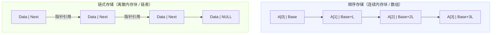

| 比较维度 | 顺序存储（如数组） | 链式存储（如单双链表） | 考场极速秒杀题眼 |
| :--- | :--- | :--- | :--- |
| **存储物理特征** | 物理地址**严格连续**，预先分配固定内存 | 物理地址**离散无序**，运行期动态按需申请 | 问“空间按需动态申请”选**链式** |
| **存储密度** | **$= 1$（极高）**，无额外空间开销 | **$< 1$（较低）**，指针域消耗额外内存 | 问“存储密度高 / 无指针开销”选**顺序** |
| **随机存取能力** | **支持 $O(1)$**（通过基地址 + 下标乘步长直接定位） | **不支持 $O(n)$**（必须从头指针顺藤摸瓜遍历） | 问“按序号快速随机读写”选**顺序** |
| **插入/删除元素** | **$O(n)$**（需挪动平均半数元素以腾挪空间） | **$O(1)$**（仅需修改相邻节点指针指向） | 问“在任意位置频繁插入删除”选**链式** |
| **表长预估要求** | 必须事先准确预估容量，扩容代价极高 | 无需预估长度，只要内存有闲置碎片即可扩充 | 问“长度未知、动态变化极大”选**链式** |

---

### 1.2 栈 (LIFO) 与循环队列 (FIFO) 运行机制

##### 栈的合法出栈序列判定（卡特兰数与特值法）
* **核心特性**：后进先出 (Last In First Out，LIFO)。入栈与出栈均只能在栈顶 (`top`) 操作。
* **可能出栈序列种数（卡特兰数）**：$n$ 个不同元素进栈，不同的出栈序列总数为：
  $$\text{Catalan}(n) = \frac{1}{n+1} \binom{2n}{n} = \frac{(2n)!}{(n+1)!\,n!}$$
  * $n=1 \implies 1$ 种
  * $n=2 \implies 2$ 种
  * $n=3 \implies 5$ 种
  * $n=4 \implies 14$ 种
* **考场快速验证法**：题目若问“已知入栈顺序为 1, 2, 3, 4，以下不可能的出栈顺序是”，直接在草稿纸上模拟进出栈；**后入栈的元素若提前出栈，其前面的元素必须按逆序出栈，绝不可能跳跃超车**。

---

#### 循环队列：牺牲一个单元法（解决队满与队空二义性）

传统顺序队列在频繁入队出队后，会出现 `rear` 到达数组末尾但前端有空闲的“假溢出”现象。循环队列将一维数组逻辑上看作一个环：

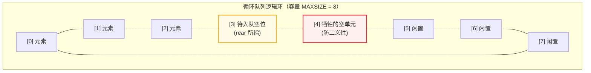

* **痛点根因**：若不作特殊处理，`front == rear` 既可能表示“队空”，也可能表示“队满”。
* **标准解法（软考考查最核心标准）**：**牺牲一个存储单元法**。当尾指针再走一步就撞上头指针时，即判定为满。
* **循环队列三大必背公式**：
  * **队空条件**：`front == rear`
  * **队满条件**：`(rear + 1) % MAXSIZE == front`
  * **当前队列元素个数**：`(rear - front + MAXSIZE) % MAXSIZE`

---

#### 栈 (LIFO) 与队列 (FIFO) 核心应用场景横向对比矩阵

| 对比维度 | 栈 (Stack · 后进先出 LIFO) | 队列 (Queue · 先进先出 FIFO) |
| :--- | :--- | :--- |
| **逻辑操作受限点** | 仅允许在**同一端（栈顶 top）**进行插入和删除 | 允许在**一端（队尾 rear）**插入，在**另一端（队头 front）**删除 |
| **计算机系统底层应用** | 1. 函数调用与多层递归栈帧管理 2. 中断发生时的现场断点保护与恢复 3. 编译器表达式括号匹配检验与语法树解析 | 1. 打印机打印任务缓冲队列（Spooling 技术） 2. 操作系统进程就绪队列与分时调度 3. 网络通信协议栈的数据报文 FIFO 缓存区 |
| **典型算法设计应用** | 1. 图的**深度优先遍历 (DFS)** 回溯实现 2. 算术表达式求值（中缀表达式转后缀/逆波兰式） 3. 迷宫求解/八皇后等经典回溯搜索算法 | 1. 图与二叉树的**广度优先遍历 (BFS) / 层次遍历** 2. 消息中间件解耦与削峰填谷（MQ） 3. 实时流计算中的固定滑动窗口（Sliding Window） |
| **考场极速秒杀题眼** | 题干出现“**回溯、撤销、就近匹配、嵌套调用、逆序输出**”必选**栈** | 题干出现“**排队、缓冲、公平调度、逐层扩散、按先来后到**”必选**队列** |

---

### 1.3 二维数组与特殊矩阵压缩存储映射（考场特值法秒杀！）

#### 行优先 vs 列优先内存一维展开对比
设二维数组 $A[m][n]$（$m$ 行 $n$ 列），基地址为 $\text{Base}$，每个元素占用 $L$ 个字节：

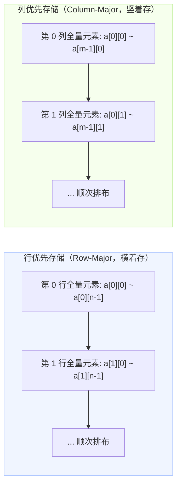

* **行优先地址**：先跳过完整的 $i$ 行（每行 $n$ 个），再加上本行内的第 $j$ 列偏移：
  $$\text{Loc}(A[i][j]) = \text{Base} + (i \times n + j) \times L \quad (\text{下标从 0 起算})$$
* **列优先地址**：先跳过完整的 $j$ 列（每列 $m$ 个），再加上本列内的第 $i$ 行偏移：
  $$\text{Loc}(A[i][j]) = \text{Base} + (j \times m + i) \times L \quad (\text{下标从 0 起算})$$

---

#### 对称矩阵与三角矩阵压缩映射

对于 $n \times n$ 的对称矩阵或下三角矩阵，由于 $a_{ij} = a_{ji}$，只需将下三角（含主对角线）共 $\frac{n(n+1)}{2}$ 个元素压缩存储到一维数组 $B[k]$ 中：

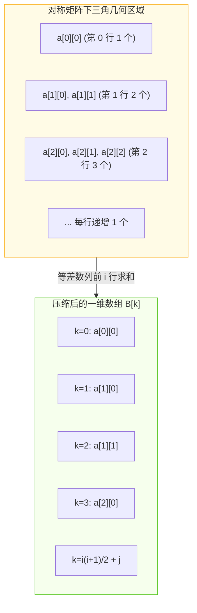

* **下三角压缩公式（设下标从 0 开始，$i \ge j$）**：
  $$k = \frac{i(i+1)}{2} + j$$
* **若下标从 1 开始（$1 \le i, j \le n$）**：
  $$k = \frac{i(i-1)}{2} + j$$
* **💡 考霸特值代入秒杀大招**：
  考场上由于题目可能从 0 或从 1 开始编号，切勿死记带减号加号的公式！**直接取特殊点验算**：
  * 取首个元素 $(0,0)$，代入选项必须使 $k=0$；
  * 取第 1 行第 0 列 $(1,0)$，代入选项必须使 $k=1$；
  * 10 秒钟内直接淘汰 3 个错项，零失误拿分！

---

#### 稀疏矩阵存储方式
* **三元组顺序表**：每个非零元素用 `(行号 i, 列号 j, 元素值 value)` 表示。存储紧凑，但做矩阵加乘运算时查找耗时。
* **十字链表 (Orthogonal List)**：每个非零节点同时链接在两个单链表中（横向行链表 `right` + 纵向列链表 `down`）。适合**频繁插入、删除非零元素**的稀疏矩阵操作。

---

### 1.4 广义表运算（Head 与 Tail 剥洋葱法则）

广义表是线性表的推广，表中的元素既可以是单元素（原子），也可以是另一个广义表（子表）。

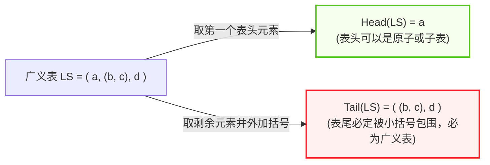

* **`Head(LS)` 表头运算**：取出广义表的**第一个元素**（可以是单一原子，也可以是括号包装的子表）。
* **`Tail(LS)` 表尾运算**：取出除第一个元素以外，**其余所有元素构成的全新广义表**（**必须用外层小括号包起来**）。
* **考场经典破题示范**：
  * 设 $L = ( (a, b), (c, d) )$
  * $\text{Head}(L) = (a, b)$
  * $\text{Tail}(L) = ( (c, d) )$
  * $\text{Head}(\text{Tail}(L)) = (c, d)$
  * $\text{Tail}(\text{Head}(\text{Tail}(L))) = (d)$
* **记忆口诀**：**“头单尾必包，表尾剥皮剩下还是一大包！”**

---

## 🌲 第二部分：树与二叉树（软考分值半壁江山·五星必考）

> **树形结构核心心法**：**“中序遍历是定海神针，叶子永远比双度节点多一个”**。树是软考上午单选与下午算法题中分值密度最高的阵地，几乎所有题目都可通过几何性质与特值代入在 30 秒内秒杀。

---

### 2.1 二叉树 5 大数学命题性质图解

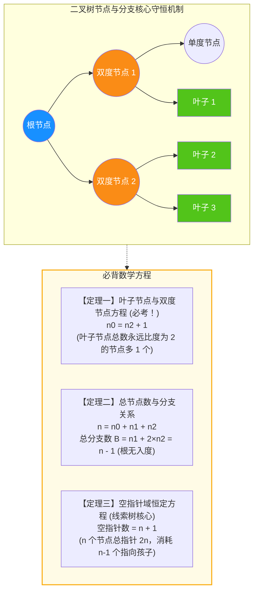

* **【性质一：叶子与双度节点（上午最爱考计算题）】**：
  * 公式：$$n_0 = n_2 + 1$$
  * *几何推导*：从分支角度看，每个双度节点贡献 2 条下行分支，单度节点贡献 1 条分支，叶子贡献 0 条。而除根节点外，每个节点都有 1 条分支指入，故：总节点数 $n = B + 1 = (n_1 + 2n_2) + 1$。又因 $n = n_0 + n_1 + n_2$，联立两式立刻得出 $n_0 = n_2 + 1$！
  * *考场实战*：题目说“某二叉树有 35 个度为 2 的节点，则叶子节点数为（ ）”，直接心算 $35 + 1 = 36$。
* **【性质二：第 $i$ 层最大节点数】**：
  * 在二叉树的第 $i$ 层上至多有 $2^{i-1}$ 个节点（$i \ge 1$）。
* **【性质三：深度为 $k$ 的二叉树最大节点数】**：
  * 深度为 $k$ 的二叉树至多有 $2^k - 1$ 个节点（满二叉树）。
* **【性质四：完全二叉树的深度】**：
  * 具有 $n$ 个节点的完全二叉树，其深度为 $\lfloor \log_2 n \rfloor + 1$。
* **【性质五：完全二叉树父子节点编号关系（根节点编号从 1 起算）】**：
  * 对于编号为 $i$ 的节点：
    * 若 $i=1$，为根节点；若 $i > 1$，其双亲节点编号为 $\lfloor i / 2 \rfloor$；
    * 其左孩子编号为 $2i$（若 $2i > n$ 则无左孩子）；
    * 其右孩子编号为 $2i + 1$（若 $2i + 1 > n$ 则无右孩子）。

---

### 2.2 二叉树遍历时序与逆向还原（中序为骨）

#### 四大遍历递归时序法则
* **前序遍历（Pre-order）**：**根 $\to$ 左 $\to$ 右**（序列的**首个元素必定是整棵树的根**）。
* **中序遍历（In-order）**：**左 $\to$ 根 $\to$ 右**（**定海神针**：根节点左边的元素全在左子树，右边的全在右子树）。
* **后序遍历（Post-order）**：**左 $\to$ 右 $\to$ 根**（序列的**最后一个元素必定是整棵树的根**）。
* **层次遍历（Level-order）**：按层从上到下、同层从左到右，基于队列实现。

---

#### 逆向还原二叉树切分机制图解

> [!IMPORTANT]
> **【考场死律】**：
> 仅知道“前序 + 后序”**绝对无法唯一确定一棵二叉树**（因为无法区分单孩子节点究竟是左孩子还是右孩子）！
> **唯一还原二叉树，必须有【中序遍历】参与**（即：前序+中序 或 后序+中序）。

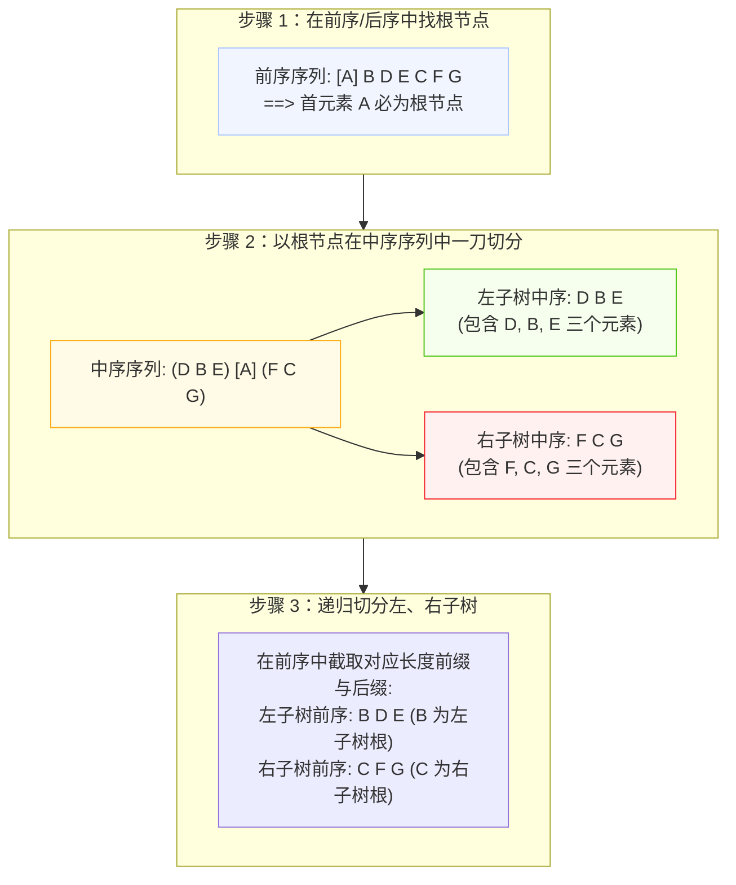

* **还原三步口诀**：**“前序定根，中序切块，左右开弓，递归复现！”**

---

#### 树、森林与二叉树的相互转换与遍历等价性对比（左孩子右兄弟）

树和森林可以通过**孩子兄弟表示法（CST）**唯一转换为二叉树，其转换几何法则为：**“长子为左孩，亲兄为右孩”**。

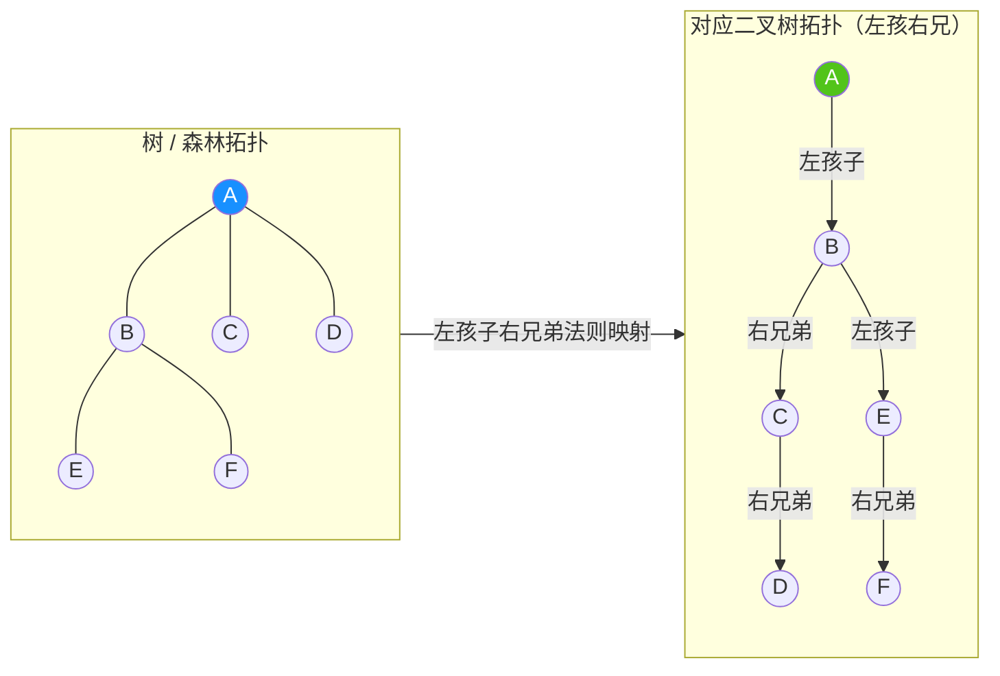

* **【遍历等价性全景对照矩阵（考场高频夺命陷阱）】**：
  | 原始结构类型 | 对应二叉树的前序遍历 (Pre-order) | 对应二叉树的【中序遍历】(In-order) |
  | :--- | :--- | :--- |
  | **树 (Tree)** | **先根遍历**（先根，再依次先根访问子树） | **后根遍历**（先依次后根访问子树，再访问根） |
  | **森林 (Forest)** | **先序遍历**（先访问第一棵树根，再子树森林，最后其余树森林） | **后序遍历**（先后序遍历第一棵树的子树森林，再访第一棵根，再其余树森林） |
  | **考场避坑心诀** | **“树先根对二叉先序，森林先序对二叉先序”**（先序全部平移对等） | **🚨 致命陷阱：“树的后根”与“森林的后序”，全部对应二叉树的【中序遍历】！绝非二叉树后序！** |

---

#### 线索二叉树：空指针再利用与标志位机制对比

* **空指针守恒定律**：含 $n$ 个节点的二叉链表中共有 $2n$ 个指针域；其中除根节点外每个节点都有一个指针指入，故实际有效指针为 $n-1$ 个，**空指针域数量恒为 $n+1$ 个**。
* **线索化定义**：若节点的左孩子为空，将其指向遍历序列中的**前驱**；若右孩子为空，将其指向遍历序列中的**后继**。
* **标志位 `ltag` / `rtag` 状态判定矩阵**：
  | 标志域取值 | `= 0`（实指针：指向树的孩子） | `= 1`（虚线索：指向序列前驱/后继） |
  | :--- | :--- | :--- |
  | **`lchild` + `ltag`** | `lchild` 指向节点的**左孩子 (Left Child)** | `lchild` 指向遍历序列中的**直接前驱 (Predecessor)** |
  | **`rchild` + `rtag`** | `rchild` 指向节点的**右孩子 (Right Child)** | `rchild` 指向遍历序列中的**直接后继 (Successor)** |
* **找前驱与后继的效率辨析**：
  * **中序线索二叉树**：找中序前驱与后继最完美对称，沿线索或子树分支均可直接到达；
  * **后序线索二叉树**：找后继极度困难。若节点是双亲的右孩子（或无右兄弟），必须借助三叉链表（存父指针）才能向上回溯找到后继。

---

### 2.3 二叉排序树 (BST) 与平衡二叉树 (AVL)

#### 二叉排序树 (BST)
* **核心定义**：若左子树非空，则左子树所有节点值 $\le$ 根节点值；若右子树非空，则右子树所有节点值 $\ge$ 根节点值。
* **考场秒杀特征**：**二叉排序树的中序遍历序列必然是严格单调递增的有序序列**！
* **效率陷阱**：最优查找时间复杂度为 $O(\log n)$；若插入序列本身已有序，BST 会严重退化为单链表，最坏时间复杂度跌至 $O(n)$。

---

#### 平衡二叉树 (AVL) 与 4 种失衡旋转
为防止 BST 退化为链表，引入 AVL 树：**任一节点的左右子树高度差绝对值不超过 1**。
* **平衡因子 (Balance Factor, BF)**：$\text{BF} = \text{左子树深度} - \text{右子树深度}$。AVL 树的 BF 取值集合只能是 $\{-1, 0, 1\}$。

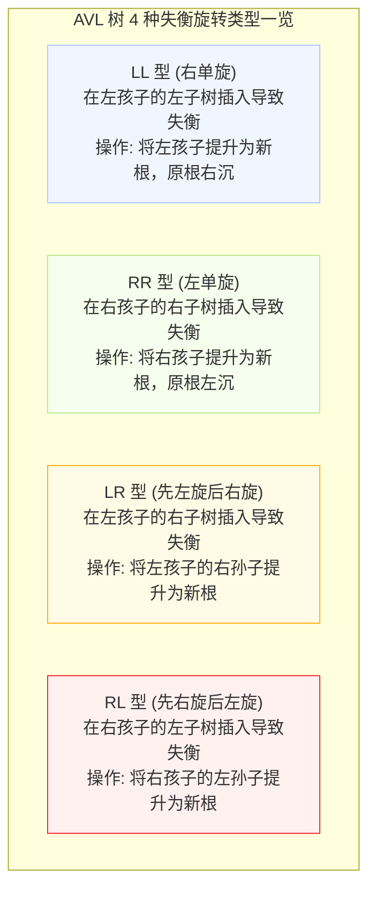

* **秒判新根法**：发生失衡时，找到失衡节点及其向下造成失衡的“儿子与孙子”共 3 个节点。**将这 3 个节点按数值大小排序，处于中间大小的节点必然上升为该子树的新根**！

---

### 2.4 哈夫曼树（最优二叉树）与带权路径长度 (WPL)

#### 哈夫曼树构造流程图（贪心算法）
给定叶子节点权值：$\{2, 3, 4, 7\}$，构造哈夫曼树步骤：

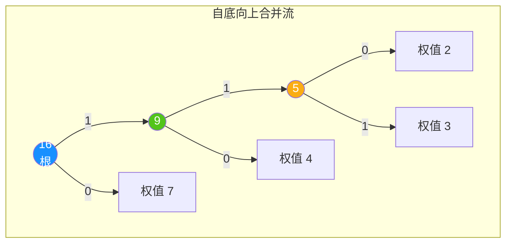

* **构造原则**：每次从森林中挑选**权值最小的两棵树**合并为新二叉树，新根权值为两子树权值之和。新根放回森林，重复该过程，直至只剩 1 棵树。
* **两大关键特性**：
  * 哈夫曼树**不存在度为 1 的分支节点**（只有度为 0 的叶子与度为 2 的分支）；
  * 若叶子节点总数为 $n$，则构造出的哈夫曼树**总结点数恒为 $2n - 1$**。

---

#### 带权路径长度 (WPL) 两种速算法（考场绝技）

* **方法 1：定义乘积法**
  $$\text{WPL} = \sum (\text{叶子权值} \times \text{到根的路径长度})$$
  $$\text{WPL} = 7 \times 1 + 4 \times 2 + 2 \times 3 + 3 \times 3 = 7 + 8 + 6 + 9 = 30$$
* **⭐ 方法 2：非叶子节点权值求和法（考场 5 秒秒杀法，防漏防算错！）**
  $$\text{WPL} = \text{树中所有内部（非叶子）节点权值之和}$$
  $$\text{WPL} = 16 + 9 + 5 = 30$$
* **最优前缀编码**：从根节点出发，走左分支标为 `0`，走右分支标为 `1`。所有叶子节点的编码**互不为前缀**（任一字符的编码绝不是其他字符编码的开头部分），解码无歧义。

---

### 2.5 树结构全家族横向性能与考点全景对比矩阵

| 树结构名称 | 核心拓扑与形态特征 | 查找时间复杂度 | 动态维护代价与方式 | 考场标志性应用与高频真题题眼 |
| :--- | :--- | :---: | :--- | :--- |
| **二叉排序树 (BST)** | 左小右大，无平衡约束；中序遍历严格递增 | 最优 $O(\log n)$ 最坏 **$O(n)$（单链表）** | 极低（直接挂在叶子处，无需旋转） | 问“中序遍历为单调递增有序序列”必选 **BST**；最怕输入序列已有序 |
| **平衡二叉树 (AVL)** | 严格平衡，任意节点左右子树高度差 $\le 1$ | 稳定 **$O(\log n)$** | 极高（插入/删除需执行 LL/RR/LR/RL 旋转） | 适用于**查找极其频繁、但插入删除极少**的静态查询环境 |
| **红黑树 (RBT)** | 弱平衡（黑高相同，无连续红节点，最长 $\le 2 \times$ 最短） | 稳定 **$O(\log n)$** | 适中（最多 3 次旋转即可恢复平衡） | 标准库通用关联容器底层（C++ `std::map`、Java `TreeMap`、Linux 内核调度） |
| **B 树 (B-Tree)** | 多路平衡查找树（$m$ 叉），所有叶子节点都在同一层 | **$O(\log_m n)$** | 适中（通过节点分裂与合并保持多路平衡） | **减少外存磁盘 I/O 读写次数**；广泛用于文件系统的目录与元数据索引 |
| **B+ 树 (B+ Tree)** | 仅叶子节点存数据记录，非叶子仅做索引；叶子由双向链表贯通 | **$O(\log_m n)$** | 适中（仅叶子变动，更利于大批量插入） | **关系型数据库主键索引王**（MySQL InnoDB 底层）；**天然支持区间范围快速扫表** |
| **堆 (Heap)** | 完全二叉树，父子满足偏序（大顶堆/小顶堆），兄弟无序 | 查找特定值 $O(n)$ 查最值 **$O(1)$** | $O(\log n)$（自下而上或自上而下沉浮调整） | **优先队列底层实现**、**Top-K 海量极值筛选**（$O(N \log K)$）、**堆排序** |
| **哈夫曼树 (Huffman)** | 严格二叉树（无度为 1 的节点），叶节点带权，WPL 最小 | 不用于单点检索 | 贪心构建一次性使用（每次挑两最小合并） | **无损数据压缩编码**（哈夫曼前缀编码）；$n$ 个叶子节点总结点数恒为 $2n-1$ |

---

## 🕸️ 第三部分：图结构与经典网络算法（空间拓扑与路径决策）

> **图结构核心心法**：**“矩阵看行出列入，生成树点密边稀，拓扑判环零入度，关键路径求最迟”**。

---

### 3.1 图的存储结构对比：邻接矩阵 vs 邻接表

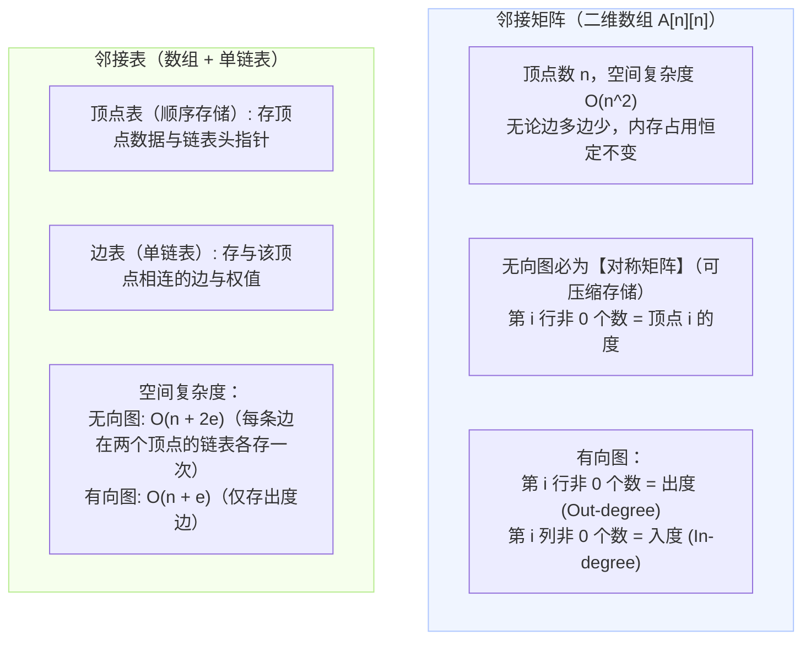

| 存储结构 | 空间复杂度 | 度/入度/出度统计效率 | 适用图类型 | 考场极速秒杀题眼 |
| :--- | :--- | :--- | :--- | :--- |
| **邻接矩阵** | **$O(n^2)$**（与边数 $e$ 无关） | 快速读取任意两顶点间是否存在边 $O(1)$ | **稠密图**（边较多） | 问“判断两顶点间是否有边最快”选**邻接矩阵** |
| **邻接表** | **$O(n + e)$**（与边数强相关） | 统计出度快，统计入度必须遍历所有链表 | **稀疏图**（边较少） | 问“边数远小于顶点数平方的稀疏图”选**邻接表** |

---

### 3.2 图的遍历机制对比：DFS vs BFS

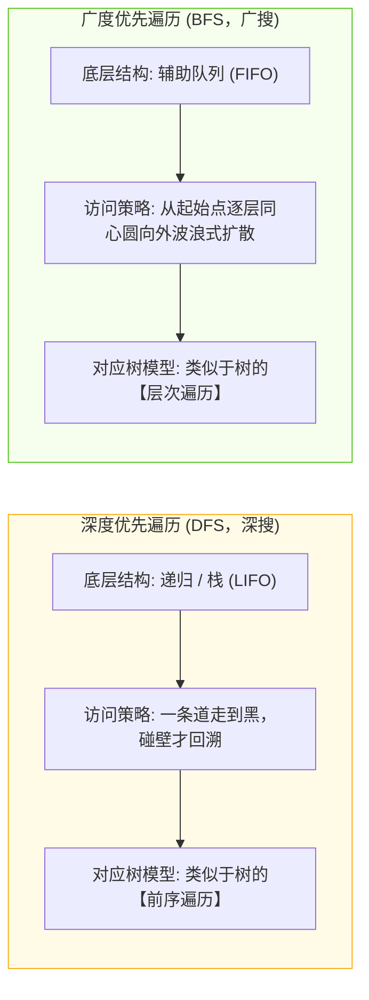

* **时空复杂度**：
  * 基于邻接矩阵存储时：DFS 与 BFS 时间复杂度均为 **$O(n^2)$**；
  * 基于邻接表存储时：DFS 与 BFS 时间复杂度均为 **$O(n + e)$**。
* **生成树唯一性考点**：若图是**连通图**，一次 DFS 或 BFS 即可访问所有顶点，得到生成树；若图是**非连通图**，需调用多次遍历，得到的是**生成森林**。

---

### 3.3 最小生成树（MST）决斗矩阵：Prim vs Kruskal

在一个带权连通无向图中，生成一棵包含所有 $n$ 个顶点、且边权值之和最小的生成树（包含 $n-1$ 条边）：

| 维度 | 普里姆算法 (Prim) | 克鲁斯卡尔算法 (Kruskal) |
| :--- | :--- | :--- |
| **工作原理** | **从顶点出发（加点法）**：每次挑选与当前连通子树相邻且权值最小的顶点加入 | **从边出发（加边法）**：将所有边按权值升序排序，每次挑选最小边（防成环）加入 |
| **核心数据结构**| 候选边距离数组 `lowcost` 与邻接点数组 | 边集数组 + 并查集 (Union-Find 用于检测成环) |
| **时间复杂度** | **$O(n^2)$**（与边数 $e$ 完全无关） | **$O(e \log e)$**（耗时主要在边排序上） |
| **最适图类型** | **稠密图**（边很多） | **稀疏图**（边很少） |
| **算法设计策略**| **贪心算法**（局部最优到全局最优） | **贪心算法**（全局边权升序挑选） |

### 3.4 最短路径双雄决斗矩阵：Dijkstra vs Floyd

软考中考查最短路径主要聚焦在“单源 vs 多源”、“算法设计思想”以及“能否处理负权边”三大核心辨析：

| 对比维度 | 迪杰斯特拉算法 (Dijkstra) | 弗洛伊德算法 (Floyd-Warshall) |
| :--- | :--- | :--- |
| **解决问题** | **单源最短路径**（求从指定单一起点到其余所有顶点的最短路径） | **所有顶点对之间最短路径**（任意两顶点 $u \to v$ 的最短路径） |
| **算法设计策略** | **贪心算法 (Greedy)**：按路径长度递增次序，逐个锁定最近顶点 | **动态规划 (Dynamic Programming)**：以各顶点为中继点迭代松弛 |
| **核心状态转移方程** | 若 `dist[u] + weight(u, v) < dist[v]`，则更新 `dist[v]` | `dist[i][j] = min(dist[i][j], dist[i][k] + dist[k][j])` |
| **时间复杂度** | 普通邻接矩阵：**$O(n^2)$** 优先队列/最小堆优化：**$O(e \log n)$** | 严格三重循环嵌套：恒为 **$O(n^3)$**（代码极简） |
| **负权边处理能力** | 🚨 **绝对不能处理含有负权边的图**！（贪心选择局部最优性质失效） | ✅ **可以有效处理含负权边的图**！ *(但图中绝对不能存在负权回路/负权环)* |
| **考场极速秒杀题眼** | 题干问“**求单源最短路径、所有边权均为非负**”选 **Dijkstra** | 题干问“**求所有顶点对之间最短路径、允许负权边但无负权环**”选 **Floyd** |

---

### 3.5 拓扑排序与 AOV 网环路检测

AOV 网（Activity On Vertex Network）是用顶点表示活动，用有向弧 $\langle v_i, v_j \rangle$ 表示活动 $v_i$ 必须先于活动 $v_j$ 进行的工程图。

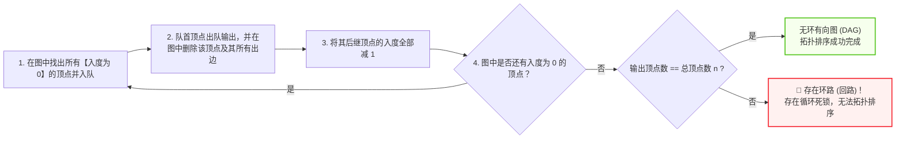

* **【考场核心题眼】**：
  * 若一个工程的 AOV 网中**存在环路（回路）**，则拓扑排序输出的顶点数必将**小于总顶点数 $n$**；
  * **拓扑排序序列往往不唯一**（当多个顶点同时满足“入度为 0”时，出队顺序任意）。

---

### 3.6 关键路径与 AOE 网（工程工期与最短时间）

AOE 网（Activity On Edge Network）是用边表示活动、边上权值表示持续时间，顶点表示事件（表示某些活动已完成，某些活动可开始）。

* **关键路径定义**：从源点到汇点具有**最大长度（最大路径耗时）**的路径。**关键路径的长度即为完成整个工程所需的最短总工期**！
* **四大时间参数推导全景对照表**：
  | 参数符号 | 中文名称 | 计算流向与核心公式 | 考场直白秒杀心法 |
  | :--- | :--- | :--- | :--- |
  | **$ve(i)$** | 事件 $v_i$ **最早发生时间** | **顺推取最大**：$ve(i) = \max \{ ve(k) + \text{dur}(k, i) \}$ | 必须等进入该事件的**所有前序活动全部完工**，故取 $\max$ |
  | **$vl(i)$** | 事件 $v_i$ **最迟发生时间** | **逆推取最小**：$vl(i) = \min \{ vl(k) - \text{dur}(i, k) \}$ | 绝不能耽误从该事件出发的**任何后续活动**最迟开始，故取 $\min$ |
  | **$e(k)$** | 活动 $a_k$ **最早开始时间** | $e(k) = ve(\text{弧尾事件})$ | 起始事件一发生，该活动立刻能开工 |
  | **$l(k)$** | 活动 $a_k$ **最迟开始时间** | $l(k) = vl(\text{弧头事件}) - \text{dur}(a_k)$ | 该活动最晚必须开工的时间，否则拖延汇点工期 |
* **关键活动锁定法则**：若活动的时间余量 $l(k) - e(k) = 0$（即没有可以拖延的富余时间），则该活动就是**关键活动**。
* **工期灵敏度与压缩决策法则（老考生高频失分点）**：
  * 压缩非关键活动的时间对缩短整个工期毫无作用；
  * 只有压缩关键活动的耗时才能缩短工程工期；
  * **若有多条关键路径，必须同时压缩所有关键路径上的关键活动才能缩短工期**；
  * 若过度压缩某一关键活动，原本非关键的路径可能会一跃变成新的关键路径（关键路径发生转移）。

---

## 🔍 第四部分：查找与散列表（时间复杂度的空间代偿）

> **查找心法**：**“折半看二叉判定树，散列算 ASL 填表，线性探测二次聚集，拉链冲突挂链表”**。

---

### 4.1 二分折半查找判定树与 ASL 计算图解

二分折半查找要求线性表必须满足两大前提：**1. 必须采用顺序存储（支持下标随机存取）；2. 关键字必须按大小有序排列**。

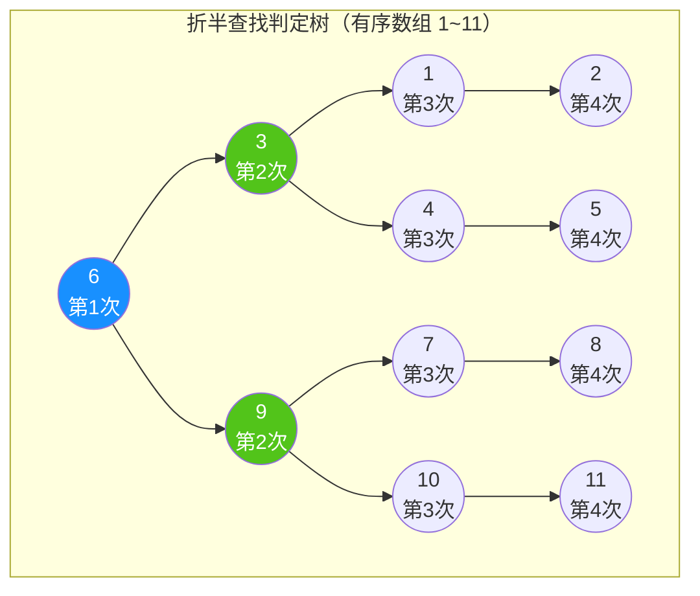

* **判定树特性**：折半查找判定树是一棵**平衡二叉排序树**。树的高度即为最大比较次数：$\lfloor \log_2 n \rfloor + 1$。
* **平均查找长度 (ASL, Average Search Length)**：
  * **查找成功 ASL**：
    $$\text{ASL}_{\text{成功}} = \frac{\sum (\text{各节点层数} \times 1)}{n}$$
    *例如上图 11 个元素：第 1 层 1 个，第 2 层 2 个，第 3 层 4 个，第 4 层 4 个*：
    $$\text{ASL}_{\text{成功}} = \frac{1 \times 1 + 2 \times 2 + 3 \times 4 + 4 \times 4}{11} = \frac{1 + 4 + 12 + 16}{11} = \frac{33}{11} = 3.0$$
* **时间复杂度**：成功与失败的时间复杂度均为 **$O(\log n)$**。

---

### 4.2 散列表 (Hash Table) 与冲突解决机制

散列查找通过散列函数 $H(\text{key}) = \text{Addr}$ 直接计算存放地址，理想情况下查找效率为 $O(1)$。但当不同关键字计算出相同地址时，就会发生**冲突（Collision）**。

#### 冲突解决两大主力流派对比

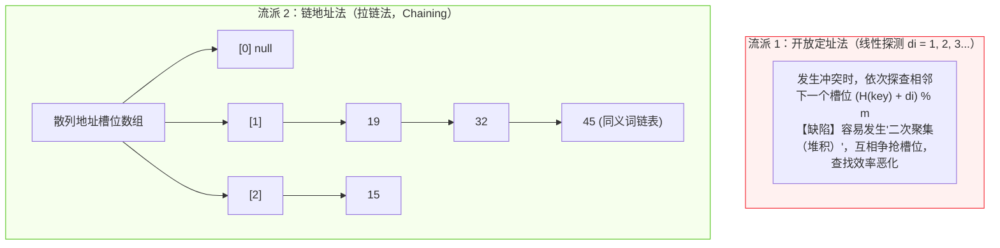

* **线性探测法 ASL 考场算表套路**：
  * 设哈希表长 11，哈希函数 $H(\text{key}) = \text{key} \% 7$。
  * **查找成功 ASL**：每个已存元素从其初始哈希地址走到实际存放地址所需的比较次数之和，除以**元素个数 $n$**；
  * **查找失败 ASL**：按哈希函数可能计算出的取值空间（如 $0 \sim 6$），从各个可能地址出发探查到第一个“空槽位”所需的比较次数之和，除以**模数 $p$**（此处为 7）。

---

### 4.3 常见查找算法核心性能全景对比大表

| 查找算法名称 | 存储结构严格要求 | 关键字有序性要求 | 平均查找长度 (ASL) | 动态增删元素维护效率 | 考场标志性应用场景与命题题眼 |
| :--- | :--- | :--- | :---: | :---: | :--- |
| **顺序查找** | 顺序表 或 任意链表 | **无序即可** | $O(n)$ $\text{ASL}_{\text{成功}} = \frac{n+1}{2}$ | 极高 $O(1)$ （直接追加表尾） | 表中元素极少、或物理存储地址离散无序时的兜底策略 |
| **折半查找 (二分)** | **必须顺序存储（数组）** | **必须严格单调有序** | $O(\log_2 n)$ $\text{ASL} \approx \log_2(n+1)-1$ | 极差 $O(n)$ （插入需大量挪动元素） | **静态查找表最佳选型**（数据预先排好序，后续仅查不增删） |
| **分块查找 (索引顺序)** | 索引表 + 主块表 | **块间有序、块内无序** | 介于顺序与折半之间 $\text{ASL} \approx \sqrt{n} + 1$ | 适中 （块内无序，直接在对应块插入） | 大型数据库分区分表索引、字典词条分段检索 |
| **二叉排序树 (BST)** | 二叉链表 | 结构隐式保持有序 | 最优 $O(\log n)$ 最坏 **$O(n)$（单链）** | 极高 $O(\log n)$ （仅需修改指针，无需挪内存） | **动态查找表经典选型**（数据频繁变动、频繁插入删除检索） |
| **散列查找 (Hash Table)** | 一维数组 + 链表（拉链） | **无序即可** | 理想 **$O(1)$** （与表长 $n$ 无直接线性关系） | 极高 $O(1)$ （计算哈希值直接挂入） | **高性能字典、缓存中间件 (Redis)、符号表秒级唯一检索** |

---

## ⚡ 第五部分：内部排序算法全景大表与机制对比

> **排序必背心法**：**“考研插冒归，心情很稳定；快排怕有序，堆排稳如狗，海量找前K，大顶小顶堆！”**

---

### 5.1 8 大内部排序算法时空复杂度与稳定性全景大表

> [!IMPORTANT]
> **【上午场必考 1~2 分大表】**：
> 历年真题中关于“最好/最坏时间复杂度”、“辅助空间复杂度”和“稳定性”的选择题全部来自本表：

| 排序类别 | 排序算法名称 | 平均时间复杂度 | 最好情况时间 | 最坏情况时间 | 空间复杂度 | 稳定性 | 考场标志性特征与核心应用 |
| :--- | :--- | :---: | :---: | :---: | :---: | :---: | :--- |
| **插入类** | **直接插入排序** | $O(n^2)$ | **$O(n)$** | $O(n^2)$ | $O(1)$ | **稳定** | 待排序列**基本有序或元素极少**时效率极高 |
| | **希尔排序** | $O(n^{1.3})$ | $O(n)$ | $O(n^2)$ | $O(1)$ | 不稳定 | 缩小增量步长分组，跳跃式破坏了稳定性 |
| **交换类** | **冒泡排序** | $O(n^2)$ | **$O(n)$** | $O(n^2)$ | $O(1)$ | **稳定** | 相邻两两比对，每趟将未排序区最大元素沉底 |
| | **快速排序** | $\mathbf{O(n \log n)}$ | $O(n \log n)$ | $\mathbf{O(n^2)}$ | $\mathbf{O(\log n)}$ | 不稳定 | **综合平均性能王**；最怕输入**基本有序**（退化为单支树） |
| **选择类** | **简单选择排序** | $O(n^2)$ | $O(n^2)$ | $O(n^2)$ | $O(1)$ | 不稳定 | 无论输入是否有序，比较次数恒定为 $\frac{n(n-1)}{2}$ |
| | **堆排序** | $\mathbf{O(n \log n)}$ | $O(n \log n)$ | $\mathbf{O(n \log n)}$ | $\mathbf{O(1)}$ | 不稳定 | **最坏依然稳如老狗**；空间只要 $O(1)$；**最擅长求海量 Top-K** |
| **归并类** | **归并排序** | $\mathbf{O(n \log n)}$ | $O(n \log n)$ | $O(n \log n)$ | $\mathbf{O(n)}$ | **稳定** | 分治策略；需要最大的辅助数组内存 $O(n)$ |
| **分布类** | **基数排序** | $O(d(n+r))$ | $O(d(n+r))$ | $O(d(n+r))$ | $O(r)$ | **稳定** | 按数位（个十百位）分配收集，**不基于关键字大小直接比较** |

---

### 5.2 堆排序 (Heap Sort) 与 Top-K 极速建堆图解

堆在逻辑上是一棵**完全二叉树**，在物理存储上用**一维数组**顺序存储。

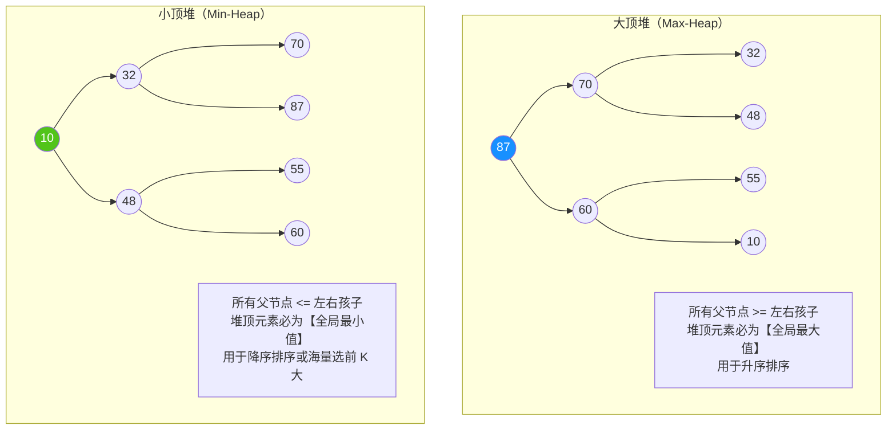

* **初始建堆流程（自底向上筛选调整）**：
  * 从最后一个非叶子节点 $\lfloor n/2 \rfloor$ 开始，逆序向前逐个节点检查是否满足堆性质；
  * 若不满足，将其与孩子中的最大者（大顶堆）交换，并沿着交换路径向下递归下沉调整。
* **Top-K 考场真题秒杀规则**：
  * **在 $N$ 个海量元素中找出前 $K$ 个最大的元素（$K \ll N$）**：
    * 建立一个大小为 $K$ 的**小顶堆**；
    * 遍历剩余 $N-K$ 个元素，若大于堆顶则替换堆顶并下沉调整；
    * 最终小顶堆中留下的就是前 $K$ 个最大值，时间复杂度仅为 **$O(N \log K)$**！

---

### 5.3 8 大内部排序算法考场绝杀横向辨析矩阵

在软考选择题中，命题人极爱从“中间趟状态”、“初始有序性影响”、“比较次数独立性”与“辅助空间开销”4 大隐蔽维度设陷阱。下表为考场极速秒杀核心对照：

| 辨析命题维度 | 具备此特性的排序算法 | 绝对不具备此特性的排序算法 | 考场速记口诀与真题秒杀破局点 |
| :--- | :--- | :--- | :--- |
| **每趟排序能否保证至少一个元素到达全局最终位置？** | **快速排序**（每趟划分确定基准 Pivot 位置） **堆排序**（每趟堆顶与末尾交换，最值到位） **简单选择排序**（每趟挑出极值放入端点） **冒泡排序**（每趟相邻比对将最大值冒泡沉底） | **直接插入排序**（仅维持局部前缀有序，全局未定） **折半插入排序**（同上，仅局部有序） **希尔排序**（各子增量组内局部有序） **归并排序**（两两归并段局部有序，最后合并前全局未定） | **【四能四不能口诀】**： 能：**快、堆、选、冒**！ 不能：**插、折、希、归**！ *(高频单选：“下列算法中，一趟排序后不能保证至少一个元素落入最终位置的是——”)* |
| **待排序列初始基本正序（有序）时的极端反差** | **直接插入排序**（$O(n)$ 比对后直接结束） **优化冒泡排序**（$O(n)$ 一趟无交换直接 break） | **快速排序**（直接恶化跌入 **$O(n^2)$** 灾难深渊！递归树退化为单支树，递归栈升至 $O(n)$） | **“正序插冒笑嘻嘻，快排哭跌成单支”** 若题目说“待排序列已基本有序，最适宜的排序算法是”，选**直接插入排序**！ |
| **关键字比较次数与初始排列状态完全无关** | **简单选择排序**（恒为 $\frac{n(n-1)}{2}$ 次比较） **基数排序**（按数位桶分配与收集，无键值大小比对） | 直接插入、冒泡、快速排序（比较次数极度依赖初始正序/逆序程度） | 题目问“关键字比较次数与记录初始排列状态无关的是”，秒选**简单选择排序**！ |
| **辅助存储空间消耗量横向梯队** | **原地排序 $O(1)$**：直接插入、希尔、冒泡、简单选择、堆排序（无需额外大数组） | **$O(\log n) \sim O(n)$**：快速排序（依赖递归函数调用栈） **$O(n)$**：归并排序（必须开辟与原表同规模的辅助合并数组） **$O(r)$**：基数排序（$r$ 为基数桶指针数组） | 题目问“空间复杂度最大的是”，选**归并排序**（$O(n)$）；问“因递归调用而消耗额外栈空间的是”，选**快速排序**！ |

---

## 🎯 第六部分：考前避坑 3 戒律与随堂实战自测

### 6.1 考前避坑 3 戒律（老考生血泪丢分点）

* 🚨 **戒律 1：看清数组/矩阵起始下标是 0 还是 1**
  * 若题目下标从 0 开始，$A[0][0]$ 偏移量为 0；若从 1 开始，需带入 $(1,1)$ 验证。直接用特值代入选项，切勿死记硬套公式！
* 🚨 **戒律 2：切记“前序+后序”无法唯一确定二叉树**
  * 凡是考二叉树反向唯一还原的题目，选项中如果没有给**中序遍历**，直接判定为无法唯一还原！中序遍历是切分左右子树的“定海神针”。
* 🚨 **戒律 3：快排最差情况不是逆序，而是“基本有序”**
  * 快速排序当待排序列已经基本正序或逆序时，每次选取的基准值只能将序列分成 1 个和 $n-1$ 个，退化为冒泡排序，时间复杂度跌入 $O(n^2)$。

---

### 6.2 随堂实战自测（即刻检验记忆）

> **【真题 1（二叉树性质秒杀）】**  
> 某二叉树共有 60 个叶子节点，且仅有 2 个度为 1 的节点，则该二叉树的总节点数为（ ）。  
> A. 121  
> B. 120  
> C. 119  
> D. 118  
>
> **10秒破题思路**：  
> 1. 根据叶子与双度节点定理：$n_0 = n_2 + 1 \implies n_2 = n_0 - 1 = 60 - 1 = 59$。  
> 2. 总节点数方程：$n = n_0 + n_1 + n_2 = 60 + 2 + 59 = \mathbf{121}$。秒选 **A**！

---
