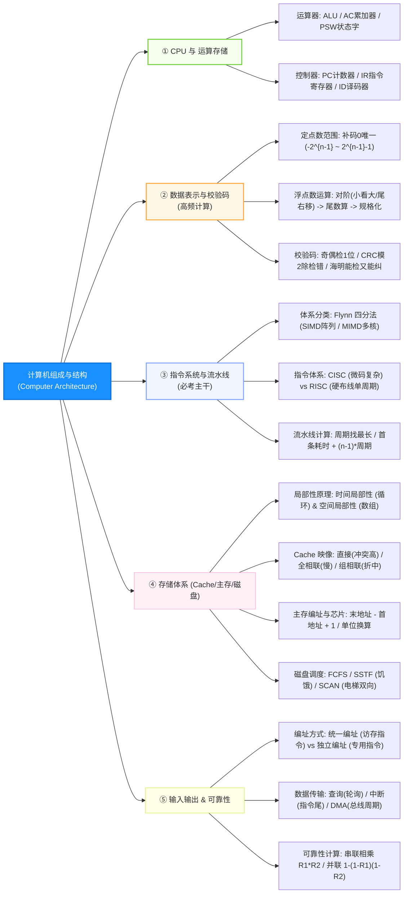

# 软件设计师通关速记文档：计算机组成与体系结构篇

> **所属模块**：软考中级《软件设计师》—— 计算机系统与体系结构（文老师教育讲义核心提炼）  
> **提炼规范**：`ruankao-fast-pass` 体系化通关标准（从左到右思维导图 + 80/20 剪枝 + 机考盲盒防冷箭）

---

## 维度 1：【分值画像与战略定级】

| 考核维度 | 分值权重 | 考点分布与题型特点 |
| :--- | :--- | :--- |
| **上午场（综合知识）** | **6 ~ 8 分** | **卷首第 1~8 题的“绝对霸主”**。主要考查：**CPU 寄存器功能归属、原/反/补/移码范围、流水线计算三套车、Cache 映射对比、主存容量芯片片数计算、可靠性公式**。 |
| **下午场（应用技术）** | **0 分** | 下午 5 道大题不考体系结构。 |
| **性价比评星** | **★★★★★（五星必杀基石）** | **兵家必争之地**。开考前 10 分钟的心态基石。题型 100% 固化、公式极具规律，掌握“特值法”与“口诀”可实现全对。 |

> **通关战略建议**：  
> **抓死核心公式与寄存器功能，绝不深究超标量硬件底层电路！** 流水线、地址计算、海明码全部采用固定套路公式秒杀，为后面的算法大题节省充裕时间。

---

## 维度 2：【知识脉络脑图与核心辨析矩阵】

### 1. 本章知识脉络全景 Mermaid 脑图（从左至右思维导图）

---

### 2. 核心辨析矩阵（上午单选直接对应表格）

#### 矩阵 1：CPU 核心部件归属大辨析（必考 1 题）

| 部件名称 | 英文缩写 | 所属大类 | 核心功能（考题题眼） |
| :--- | :--- | :--- | :--- |
| **程序计数器** | **PC** | **控制器** | 存放**下一条要执行指令的内存地址**，具有自增功能 |
| **指令寄存器** | **IR** | **控制器** | 暂存**当前正在执行的指令** |
| **指令译码器** | **ID** | **控制器** | 对 IR 中的操作码进行分析解释，发出微控制信号 |
| **累加寄存器** | **AC** | **运算器** | 暂存算术/逻辑运算的**源操作数或计算结果** |
| **程序状态字** | **PSW** | **运算器** | 记录运算结果的状态标志（如进位标 C、溢出标 V、零标 Z、负标 N） |
| **算术逻辑单元** | **ALU** | **运算器** | 执行所有算术运算（加减乘除）和逻辑运算（与或非）的核心 |

---

#### 矩阵 2：CISC vs RISC 指令系统终极对比（必考 1 题）

| 比较维度 | CISC（复杂指令集，如 x86） | RISC（精简指令集，如 ARM/MIPS/RISC-V） |
| :--- | :--- | :--- |
| **指令数量与长度** | 指令数量多，**变长格式** | 指令少，**定长格式**，操作频率接近 |
| **执行周期** | 绝大多数指令需要多周期 | **绝大多数指令在一个时钟周期内完成** |
| **控制器实现** | **微程序控制技术（微码）** | **硬布线逻辑（组合逻辑控制器，快）** |
| **通用寄存器数量** | 数量较少 | **数量极多（大量寄存器换速度）** |
| **访存限制** | 多种指令均可直接访问内存 | **仅 Load（读）/ Store（写）指令可访问内存** |
| **流水线支持** | 流水线实现复杂，效率低 | **极易使用流水线技术优化** |

---

#### 矩阵 3：Cache 三种地址映像方式对比

| 映像方式 | 对应规则 | 冲突率 | 电路实现复杂度 | 特点一句话 |
| :--- | :--- | :--- | :--- | :--- |
| **直接映像** | 主存块只能放到**唯一固定的** Cache 块中（取模） | **最高** | 最简单 | 命中率低，调块极易冲突 |
| **全相联映像** | 主存块可放入 Cache 的**任意一个空闲块** | **最低** | 最复杂（昂贵） | 速度较慢，适用于小容量 Cache |
| **组相联映像** | 组间直接映像，组内全相联映像（折中） | 适中 | 适中 | **现代 CPU 最普遍采用** |

---

#### 矩阵 4：I/O 数据传输控制方式横向演进表

| 传输方式 | CPU 干预程度 | 硬件需求 | 响应时间点 | 适用场景 |
| :--- | :--- | :--- | :--- | :--- |
| **程序查询方式** | **全程干预**（CPU 踏步等待轮询） | 最简单 | 随时查询 | 极低速设备 |
| **程序中断方式** | **外设准备好才打断 CPU** | 需要中断控制器 | **一条指令执行结束时** | 中低速外设（键盘、鼠标） |
| **DMA 方式** | **仅在数据块开始与结束时干预** | 需专有 DMA 控制器 | **一个总线周期结束时** | 高速成批数据传输（磁盘） |

---

## 维度 3：【六大必考计算公式与特值秒杀靶点】

### 1. 定点数数值表示范围（背诵与特殊值）
设字长为 $n$ 位：
* **原码 / 反码**：$-(2^{n-1} - 1) \sim +(2^{n-1} - 1)$（0 有两种编码 $+0$ 和 $-0$）
* **补码 / 移码**：**$-2^{n-1} \sim +(2^{n-1} - 1)$**（0 编码唯一，负数端多出 $-2^{n-1}$）
  * *例：8 位补码范围为 $-128 \sim +127$；移码是补码符号位取反，专用于浮点数阶码。*

### 2. 浮点数运算三步走
浮点数格式：$N = F \times 2^E$（$E$ 为阶码决定**范围**；$F$ 为尾数决定**精度**）。
* **第 1 步：对阶（铁律：小阶向大阶看齐）**：
  * 阶码小的那个数，阶码增加，尾数**同步右移**（底数每乘 2，尾数除以 2）。
* **第 2 步：尾数加减**。
* **第 3 步：结果规格化**（带符号尾数的最高数值位必须为有效值：原码 $0.1xxx$ 或 $1.1xxx$；补码正数 $0.1xxx$，负数 $1.0xxx$）。

### 3. 海明校验码（Hamming）位置与位宽公式
* **位数公式**：设有 $n$ 个信息位，$k$ 个校验位，则必满足：
  $$2^k \ge n + k + 1 \quad (\text{或 } 2^k - 1 \ge n + k)$$
  * *秒杀例题：若信息位 $n = 32$，求校验位 $k$ 最少为多少？*
  * *代特值试算：$k=5$ 时 $2^5=32 < 32+5+1=38$（不够）；$k=6$ 时 $2^6=64 \ge 39$（满足），直接秒选 **$k=6$**！*
* **存放位置**：校验位 $P_1, P_2, P_3, P_4 \dots$ 严格固定放在编号为 **$2^0, 2^1, 2^2, 2^3 \dots$（即第 1, 2, 4, 8, 16 位）**。

### 4. 流水线执行时间与性能“三套车”
设某指令分为 $k$ 段，各段耗时最长的一段为流水线周期 $\Delta t$：
* **流水线执行总时间（理论公式）**：
  $$T = \text{1条指令各段总耗时} + (n - 1) \times \Delta t$$
* **吞吐率（$TP$）**：$TP = \frac{n}{T}$；最大吞吐率 $TP_{\max} = \frac{1}{\Delta t}$。
* **加速比（$S$）**：$S = \frac{T_{\text{不使用流水线}}}{T_{\text{使用流水线}}}$。

### 5. 主存地址区间容量与芯片片数计算
* **芯片容量计算公式**：
  $$\text{地址单元个数} = \text{末地址} - \text{首地址} + 1$$
  * *例题：地址从 `80000H` 到 `BFFFFH`，包含多少个存储单元？*
  * *秒杀：$\text{BFFFFH} - \text{80000H} + 1 = \text{3FFFFH} + 1 = \text{40000H} = 4 \times 16^4 = 2^2 \times 2^{16} = 2^{18} = \mathbf{256\text{K}}$ 个单元。*
* **所需芯片片数**：$\frac{\text{总容量}}{\text{单片芯片容量}}$（注意 $B$ 与 $b$ 换算：$1\text{B} = 8\text{b}$）。

### 6. 计算机系统可靠性计算模型
* **串联系统**（一个死全死）：$R_{\text{总}} = R_1 \times R_2 \times \dots \times R_n$
* **并联系统**（一个活全活）：$R_{\text{总}} = 1 - (1 - R_1)(1 - R_2)\dots(1 - R_n)$
* **平均无故障时间（$MTBF$）**：$MTBF = MTTF + MTTR$。

---

## 维度 4：【极速小抄与记忆桩（Memory Pegs）】

### 1. 通关押韵口诀（考场条件反射）

> **【CPU 内部寄存器口诀】**  
> **“PC 指向下一条，IR 锁死本指令；AC 算盘暂存处，PSW 翻看状态牌！”**  
> *解析：PC 是程序计数器存下一条地址；IR 存当前指令；AC 存操作数和结果；PSW 存溢出/进位标志。*

> **【指令体系辨析口诀】**  
> **“CISC 杂乱微码控，RISC 少精硬连线；RISC 单周期大寄存，只许读写碰主存！”**  
> *解析：CISC 指令繁多由微程序实现；RISC 定长单周期硬布线，寄存器极多，仅 Load/Store 能访存。*

> **【浮点对阶口诀】**  
> **“对阶小向大看齐，尾数顺势向右移！”**  

> **【流水线时间口诀】**  
> **“流水周期找最长，首条走完全程路，剩下任务乘周期！”**  

---

### 2. 考前避坑 3 戒律
1. **地址相减千万别忘加 1**：计算 `0000H` 到 `FFFFH` 不是 `FFFF`，必须 $+1$ 得到 `10000H = 64KB`！
2. **区分大 B（Byte 字节）与小 b（bit 位）**：题干给出的芯片是 $16\text{K} \times 4\text{bit}$，换算成字节是 $16\text{K} \times 0.5\text{B} = 8\text{KB}$，丢了除以 8 会导致芯片数翻倍！
3. **中断与 DMA 的响应时机不同**：CPU 响应**中断**是在**一条指令执行结束时**；CPU 响应 **DMA** 请求是在**一个总线周期（存取周期）结束时**。

---

## 维度 5：【机考防冷箭盲盒与即时测验】

### 1. 🛡️ 机考防冷箭盲盒清单（Edge Cases，只记中文混眼熟）
* **VLIW（超长指令字）**：依靠**编译程序（软件）**挖掘并行性，硬件大大简化。
* **超标量（Super Scalar）**：内置多条流水线，**以空间换时间**，一个时钟周期并发多条指令（$CPI < 1$）。
* **哈佛结构（Harvard Architecture）**：**指令总线与数据总线完全分开独立**（与冯·诺依曼总线分时复用相对立）。
* **Write Through（全写法/写直达）**：写 Cache 时**同步写回主存**，速度慢但保持强一致性；**Write Back（写回法）**：只写 Cache，待换出时才写入主存，速度快。
* **统一编址 vs 独立编址**：统一编址把 I/O 映射到内存（用 `MOV` 等访存指令），独立编址用专门的 `IN / OUT` 指令。

---

### 2. 📇 Anki 闪卡库（可直接复制导入）

| 正面（Front: 核心考点提问） | 反面（Back: 核心答案与记忆桩） | 标签（Tags） |
| :--- | :--- | :--- |
| CPU 中，存放下一条即将执行指令地址的寄存器是？ | **程序计数器（PC）**。 （口诀：PC指向下一条，自增寻址不操心） | 软考::软件设计师::计算机组成与体系结构 |
| RISC 架构中，能够访问主存的指令只有哪两类？ | 只有 **Load（读/加载）** 和 **Store（写/存储）** 指令。 | 软考::软件设计师::计算机组成与体系结构 |
| 8 位二进制补码表示的定点整数范围是多少？ | **$-128 \sim +127$**。 （补码的 0 编码唯一，负数多表示一个 $-2^{n-1}$） | 软考::软件设计师::计算机组成与体系结构 |
| 浮点数加减运算中，对阶的原则是什么？ | **小阶向大阶看齐**，阶码小的数尾数**向右移**。 | 软考::软件设计师::计算机组成与体系结构 |
| 设信息位为 16 位，要构成海明码至少需要多少位校验位？ | **5 位**。 （$2^k \ge 16 + k + 1$，当 $k=5$ 时 $32 \ge 22$ 满足） | 软考::软件设计师::计算机组成与体系结构 |
| 某流水线各段耗时为 2ns, 1ns, 3ns, 1ns，则该流水线周期为多少？ | **3ns**。 （流水线周期 $\Delta t$ 为各段中耗时最长的一段） | 软考::软件设计师::计算机组成与体系结构 |
| Cache 的三种地址映像方式中，块冲突概率最高的是哪一种？ | **直接映像**。 （全相联冲突最低但最慢，组相联折中） | 软考::软件设计师::计算机组成与体系结构 |
| CPU 响应中断请求与响应 DMA 请求的时机分别是什么？ | 中断：**一条指令执行结束时**； DMA：**一个总线周期（存取周期）结束时**。 | 软考::软件设计师::计算机组成与体系结构 |

---

### 3. 🎯 现场即时随堂互动测验（检验记忆闭环）

请你在考场思维下，直接回答下面这道历年极具迷惑性的典型高频真题：

> **【随堂测验】**  
> 计算机系统中，CPU 对主存的访问方式以及 Cache 对程序员的透明性分别为（ ）。  
> A. 随机存取，透明 &emsp;&emsp; B. 顺序存取，透明  
> C. 随机存取，不透明 &emsp; D. 顺序存取，不透明  
>
> 💡 **请直接在对话框回复你的选项：`A`、`B`、`C` 或 `D`！**
