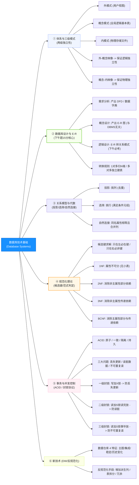

# 软件设计师通关速记文档：数据库系统篇

> **所属模块**：软考中级《软件设计师》—— 数据库技术基础（文老师教育讲义核心提炼）  
> **提炼规范**：`ruankao-fast-pass` 体系化通关标准（从左到右思维导图 + 80/20 剪枝 + 下午大题15分必杀）

---

## 维度 1：【分值画像与战略定级】

| 考核维度 | 分值权重 | 考点分布与题型特点 |
| :--- | :--- | :--- |
| **上午场（综合知识）** | **6 ~ 8 分** | 集中在第 50~58 题。考查：**三级模式两级映像、候选键求解、范式等级判定（1NF~BCNF）、关系代数与SQL等价、事务ACID、封锁协议**。 |
| **下午场（应用技术）** | **整整 15 分（试题二）** | **全卷最大的保底送分题！** 考查：**补充 E-R 图实体与联系、1:1/1:N/M:N 联系类型判断、关系模式主键与外键填空**。 |
| **性价比评星** | **★★★★★（五星核武级：上午+下午共 21~23 分！）** | **决定及格命运的绝对核心**。试题二必须保底拿 13~15 分，上午题套路极死，掌握“出入度求键法”与“范式判定阶梯”可轻松全拿。 |

> **通关战略建议**：  
> **下午试题二 15 分志在必得！** 重点抠死“E-R 图转关系模式三大规则”（特别注意 M:N 联系必须独立建表且联合主键），上午题抓死“两级映像的作用”和“封锁协议等级”。

---

## 维度 2：【知识脉络脑图与核心辨析矩阵】

### 1. 本章知识脉络全景 Mermaid 脑图（从左至右思维导图）

---

### 2. 核心辨析矩阵（上午下午秒杀大招）

#### 矩阵 1：三级模式与两级独立性精准对应表（必考 1 题）

| 映像名称 | 存在位置 | 发生改变时 | 最终达成的效果（考题题眼） |
| :--- | :--- | :--- | :--- |
| **外模式 - 概念模式映像** | 外模式与概念模式之间 | 当概念模式（表结构）修改时，只需调整此映像 | **保证数据的逻辑独立性**（应用程序无需修改） |
| **概念模式 - 内模式映像** | 概念模式与内模式之间 | 当内模式（物理存储方式）修改时，只需调整此映像 | **保证数据的物理独立性**（应用程序与逻辑结构均不变） |

---

#### 矩阵 2：E-R 图转换为关系模式规则大表（下午试题二 15 分命脉！）

| 联系类型 | 转换规则与设计策略 | 主键（Primary Key） | 外键（Foreign Key） |
| :--- | :--- | :--- | :--- |
| **$1:1$ 联系** | 可单独建表；但**通常合并到任意一端实体**中 | 合并后实体的原主键 | 加入另一端实体的主键作为外键 |
| **$1:N$ 联系** | 可单独建表；但**最标准做法是合并到 $N$ 端实体**中 | **$N$ 端实体的原主键** | **将 $1$ 端实体的主键加入 $N$ 端作为外键** |
| **$M:N$ 联系** | **必须单独建立一个独立的关系模式（表）！** | **两端实体主键构成的【联合主键】** | 两端实体的主键分别作为外键 |

---

#### 矩阵 3：范式进化阶梯与判定大表（上午题必出 1~2 题）

| 范式级别 | 核心约束条件（白话一句话） | 常见违例（缺陷） | 改进方法 |
| :--- | :--- | :--- | :--- |
| **1NF** | **每一个属性都是不可分割的原子项** | 属性中出现“子表格”或集合数据 | 把复合字段拆散成单字段 |
| **2NF** | 在 1NF 基础上，**消除非主属性对码的部分依赖** | 复合候选键 $(A, B)$ 中，$A \to C$，非主属性只依赖半个键 | 拆表，把产生部分依赖的字段拉出去建新表 |
| **3NF** | 在 2NF 基础上，**消除非主属性对码的传递依赖** | $A \to B, B \to C$（$B$ 不是候选键，导致非主属性传递推导） | 拆表，把传递依赖链拉出去建新表 |
| **BCNF** | 在 3NF 基础上，**消除主属性对码的部分与传递依赖** | 每一个函数依赖的左边决定因素**必须全部包含候选键** | 彻底消除主属性冗余 |

> **🔥 快速研判法则**：
> 1. 若候选键只有**单属性**（不是联合键），只要满足 1NF，**必自动满足 2NF**！
> 2. 若关系模式中不存在传递推导，只存在“码 $\to$ 属性”，**直接达到 3NF**！

---

#### 矩阵 4：并发不一致性与三级封锁协议对应矩阵（上午必考）

| 封锁协议级别 | 加锁与解锁规则 | 解决的并发问题 | 无法解决的问题 |
| :--- | :--- | :--- | :--- |
| **一级封锁协议** | 修改数据 $R$ 前必须加 **X 锁（写锁）**，**事务结束才释放** | **防止“丢失更新”** | 仍可能读“脏”数据、不可重复读 |
| **二级封锁协议** | 一级基础上，读数据 $R$ 前加 **S 锁（读锁）**，**读完立即释放 S 锁** | 防止丢失更新、**防止“读脏数据”** | 仍可能出现不可重复读 |
| **三级封锁协议** | 一级基础上，读数据 $R$ 前加 **S 锁**，**事务结束才释放 S 锁** | 防止丢失更新、防止读脏、**防止“不可重复读”** | 全部三大并发问题彻底解决 |

---

## 维度 3：【核心解题靶点与下午试题二套路】

### 1. 候选键图论求解“三步出入度法”（10 秒破题）
* **算法模型**：给出关系模式 $R(U, F)$，找候选键。
* **规则**：
  1. **只在所有依赖左边出现的属性** $\implies$ **必在候选键中**（入度为 0）；
  2. **只在所有依赖右边出现的属性** $\implies$ **绝不在任何候选键中**（直接排除）；
  3. **在两边都出现的属性** $\implies$ 需通过闭包计算验证；
  4. **两边都没出现的属性** $\implies$ **必在候选键中**！
* *真题示例：$U=\{A, B, C, D\}, F=\{AB \to C, CD \to B\}$。*
  * *分析：$A, D$ 只出现在左侧 $\implies$ 候选键必含 $AD$；求 $(AD)^+ = AD \to$ 无法推出全集；分别尝试 $(ABD)^+ = ABCD$，$(ACD)^+ = ABCD \implies$ 候选键为 **$ABD$ 和 $ACD$**。*

---

### 2. 下午试题二（15分）三大标准化挖空与应对方案
* **问题 1：补充 E-R 图缺失的实体名与联系类型**（通常 3~4 分）
  * **解法**：拿题干中的名词逐一去对 E-R 图上已有的方框，题干中描述了业务但图上没出现的方框，就是漏掉的实体！
* **问题 2：判断联系类型（$1:1$、$1:N$、$M:N$）**（通常 3~4 分）
  * **解法**：在两端实体之间提问：
    * “一个部门有多个员工吗？”（是，标 $N$）；
    * “一个员工只能属于一个部门吗？”（是，标 $1$） $\implies$ 部门与员工是 **$1:N$** 联系！
* **问题 3：补充关系模式中的主键与外键**（通常 6~8 分）
  * **解法（严格默写公式）**：
    * $1:N$ 关系：在 $N$ 端关系模式中，补充 $1$ 端的主键作为**外键**；
    * $M:N$ 关系：必须独立成表，其**主键为两端实体主键的组合**，并分别作为外键！

---

### 3. 模式分解：两模式无损连接判定公式
设分解为 $\rho = \{R_1, R_2\}$，若要满足无损连接，充要条件是公共属性必须是其中一个模式的超键：
$$(R_1 \cap R_2 \to R_1 - R_2) \quad \text{或} \quad (R_1 \cap R_2 \to R_2 - R_1)$$
*只要两者的交集能函数决定其中一个差集，即为无损连接！*

---

## 维度 4：【极速小抄与记忆桩（Memory Pegs）】

### 1. 通关押韵口诀（考场条件反射）

> **【两级映像独立性口诀】**  
> **“外概保逻辑，概内保物理；模式一修改，外概映像改；内模式变了，概内映像来！”**  

> **【范式判定速记口诀】**  
> **“1NF 属性不可分，2NF 复合消部分；3NF 顺藤消传递，BC 左边必须是码！”**  

> **【封锁协议防雷口诀】**  
> **“一级写锁防丢失，二级读完立即丢（防脏读）；三级读锁陪到底，不可重复全搞定！”**  

> **【E-R 转换口诀】**  
> **“一对多，归多端；多对多，独立建；联合主键两边牵！”**  

---

### 2. 考前避坑 3 戒律
1. **自然连接列数陷阱**：自然连接（$\bowtie$）会自动**合并同名属性列**！计算自然连接后的属性列数 $=$ 关系 1 的属性数 $+$ 关系 2 的属性数 $-$ **公共属性个数**。
2. **候选键不是主键**：候选键可能不止一个（可能有多个），只要能唯一决定全集且无冗余就是候选键；主键是人为主观选定的一个。
3. **数据仓库绝不是用来日常增删改的**：数据仓库面向 OLAP 分析，数据只进行**批量加载和查询**，基本不进行在线修改操作（相对稳定/非易失）。

---

## 维度 5：【机考防冷箭盲盒与即时测验】

### 1. 🛡️ 机考防冷箭盲盒清单（Edge Cases，只记中文混眼熟）
* **反规范化具体技术**：
  * **增加冗余列**（减少多表 JOIN 消耗）；
  * **增加派生列**（把聚合计算结果存下来，减少 `SUM/AVG` 操作）；
  * **重新组表**；**水平分割表**（按行拆散，按时间/地区）；**垂直分割表**（按列拆散，主键在两边，冷热数据分离）。
* **分布式数据库 4 大透明性**：
  * **分片透明（最高级）**：用户不知数据如何分片；
  * **位置透明**：用户不知数据存放在哪个物理节点；
  * **逻辑透明**：用户不知局部采用何种数据模型；
  * **复制透明**：用户不知系统是否有副本及副本放在哪。
* **ETL 技术三步曲**：**Extract（抽取） $\to$ Transform（转换清洗） $\to$ Load（加载入库）**。

---

### 2. 📇 Anki 闪卡库（可直接复制导入）

| 正面（Front: 核心考点提问） | 反面（Back: 核心答案与记忆桩） | 标签（Tags） |
| :--- | :--- | :--- |
| 数据库的三级模式结构中，提供逻辑数据独立性的是哪一级映像？ | **外模式 - 概念模式映像**。 （概念模式变动，只改外概映像，应用程序不变） | 软考::软件设计师::数据库系统 |
| 关系模式中，如果候选键为单属性且满足 1NF，则它至少达到第几范式？ | **至少达到 2NF**。 （单属性不可能存在对码的部分函数依赖） | 软考::软件设计师::数据库系统 |
| 实体 A 与实体 B 存在多对多（$M:N$）联系，转换为关系模型时应如何处理？ | **必须单独建立一个独立的关系模式**，其主键为两实体主键构成的**联合主键**。 | 软考::软件设计师::数据库系统 |
| 解决并发事务“读脏数据”问题，至少需要采用几级封锁协议？ | **二级封锁协议**。 （在一级基础上加读锁 S 锁，读完立即释放） | 软考::软件设计师::数据库系统 |
| 事务 ACID 特性中，银行转账总金额在事务执行前后保持不变体现了什么？ | **一致性（Consistency）**。 | 软考::软件设计师::数据库系统 |
| 关系 $R(A, B, C)$ 与关系 $S(B, C, D)$ 进行自然连接后的属性列数是多少？ | **4 个属性**（$A, B, C, D$）。 （自然连接会自动去重同名属性 $B, C$） | 软考::软件设计师::数据库系统 |
| 某关系中存在依赖 $A \to B, B \to C$（且 $B$ 不能决定 $A$），说明破坏了第几范式？ | **破坏了 3NF**。 （存在非主属性对码的传递函数依赖） | 软考::软件设计师::数据库系统 |
| 分布式数据库中，用户不需要知道数据存放在哪个物理节点的透明性是？ | **位置透明性**。 | 软考::软件设计师::数据库系统 |

---

### 3. 🎯 现场即时随堂互动测验（检验吸收闭环）

请你在考场思维下，直接秒答这道历年极具代表性的范式判定真题：

> **【随堂测验】**  
> 给定关系模式 $R(U, F)$，其中属性集 $U = \{ \text{学号, 姓名, 系号, 系名, 课程号, 成绩} \}$，函数依赖集 $F = \{ \text{学号} \to \text{姓名}, \; \text{学号} \to \text{系号}, \; \text{系号} \to \text{系名}, \; (\text{学号, 课程号}) \to \text{成绩} \}$。  
> 问：该关系模式最高达到了（ ）。  
> A. 1NF &emsp;&emsp; B. 2NF &emsp;&emsp; C. 3NF &emsp;&emsp; D. BCNF  
>
> 💡 **请直接在对话框回复你的选项：`A`、`B`、`C` 或 `D`！**
