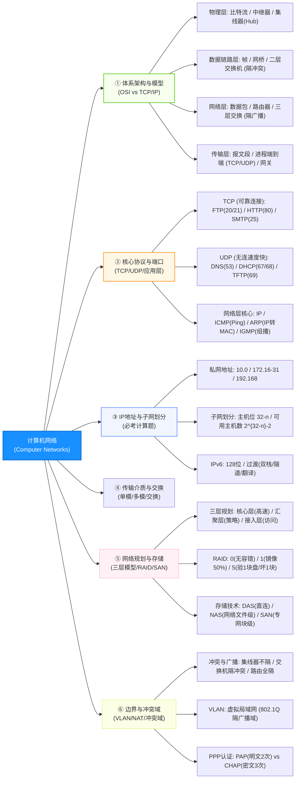

# 软件设计师通关速记文档：计算机网络篇

> **所属模块**：软考中级《软件设计师》—— 计算机网络（文老师教育讲义核心提炼）  
> **提炼规范**：`ruankao-fast-pass` 体系化通关标准（从左到右思维导图 + 80/20 剪枝 + 子网速算大招）

---

## 维度 1：【分值画像与战略定级】

| 考核维度 | 分值权重 | 考点分布与题型特点 |
| :--- | :--- | :--- |
| **上午场（综合知识）** | **3 ~ 5 分** | 通常集中在第 65~70 题附近。考查：**OSI 七层模型与各层设备/协议对应、TCP/UDP 与熟知端口号、CIDR 子网划分与可用主机数计算、网络存储（RAID/DAS/NAS/SAN）、冲突域与广播域划分**。 |
| **下午场（应用技术）** | **0 分** | 软件设计师下午大题不直接考网络工程配置与路由命令行。 |
| **性价比评星** | **★★★★☆（四星纯常识送分专区）** | **知识点范围广但考题极为固定**。不考复杂的路由收敛算法证明，只要把“七层设备对应表”、“熟知端口”和“减 2 主机公式”背熟，3~5 分手到擒来。 |

> **通关战略建议**：  
> **拒绝深究底层的网络抓包与路由协议报文格式！** 重点拿下“子网掩码主机计算”与“OSI各层协议设备归属表”，投入 25 分钟即可稳拿该板块满分。

---

## 维度 2：【知识脉络脑图与核心辨析矩阵】

### 1. 本章知识脉络全景 Mermaid 脑图（从左至右思维导图）

---

### 2. 核心辨析矩阵（上午单选题考眼大表）

#### 矩阵 1：OSI 七层模型与网络设备/数据单位对应大表（必考 1 题）

| 层次编号与名称 | 传输数据单位 | 核心功能 | 典型网络协议 | 典型物理网络互联设备 |
| :--- | :--- | :--- | :--- | :--- |
| **7. 应用层** | 报文 / 数据 | 针对用户进程提供网络接口 | HTTP, FTP, SMTP, POP3, DNS | 应用网关（Gateway） |
| **6. 表示层** | 数据 | 数据格式转换、加密解密、压缩 | JPEG, ASCII, DES, MPEG | 网关 |
| **5. 会话层** | 数据 | 建立、管理和维护进程间会话 | RPC, NFS, SQL | 网关 |
| **4. 传输层** | **报文段（Segment）** | **端到端（进程到进程）**传输 | **TCP**（可靠）、**UDP**（不可靠） | 传输网关 |
| **3. 网络层** | **数据包 / 分组（Packet）**| **点到点（主机到主机）**路由寻址 | **IP, ICMP, IGMP, ARP, RARP** | **路由器（Router）、三层交换机** |
| **2. 数据链路层**| **数据帧（Frame）** | 介质访问控制、物理寻址、差错校验 | IEEE 802.3, HDLC, PPP, STP | **网桥（Bridge）、二层交换机、网卡** |
| **1. 物理层** | **比特流（Bit）** | 在物理信道上传输原始比特流 | RS-232, RJ-45 | **中继器（Repeater）、集线器（Hub）** |

---

#### 矩阵 2：TCP/IP 应用层熟知协议与端口号速查大表（考前必背）

| 协议名称 | 全称与功能 | 底层依赖传输层 | 熟知端口号 | 考场一句话特征 |
| :--- | :--- | :--- | :--- | :--- |
| **FTP** | 文件传输协议（数据/控制分离） | **TCP** | **20（数据连接） 21（控制连接）** | 熟记双端口，传输用 20，连接用 21 |
| **SSH** | 安全外壳协议（加密远程登录） | **TCP** | **22** | 替代不安全的 Telnet |
| **Telnet** | 远程终端仿真协议（明文传输） | **TCP** | **23** | 远程登录，无加密不安全 |
| **SMTP** | 简单邮件传输协议（发邮件） | **TCP** | **25** | 负责**发送**邮件，邮件头需 ASCII 编码 |
| **DNS** | 域名解析系统（域名转 IP） | **UDP / TCP** | **53** | 域名查询用 UDP，区域传输用 TCP |
| **DHCP** | 动态主机配置协议（自动分配 IP）| **UDP** | **67（服务端） 68（客户端）** | 租约更新机制，即插即用自动分配 |
| **TFTP** | 简单文件传输协议 | **UDP** | **69** | 小文件传输，基于 UDP 无连接开销小 |
| **HTTP** | 超文本传输协议 | **TCP** | **80** | 万维网明文协议 |
| **POP3** | 邮局协议版本3（收邮件） | **TCP** | **110** | 负责从邮件服务器**拉取接收**邮件 |
| **SNMP** | 简单网络管理协议 | **UDP** | **161（轮询） 162（Trap陷阱）** | 管理站轮询 161，被管代理异常发陷阱 162 |
| **HTTPS** | 安全超文本传输协议（SSL/TLS加密）| **TCP** | **443** | 80端口的安全版本 |

---

#### 矩阵 3：网络存储技术三剑客（DAS vs NAS vs SAN）

| 存储架构类型 | 物理连接方式 | 传输协议与网络 | 核心共享级别 | 适用场景 |
| :--- | :--- | :--- | :--- | :--- |
| **DAS（直连附加存储）** | 硬盘通过数据线直接插在服务器上 | SCSI / SATA / SAS 线缆 | **硬件堆叠，无法跨机共享** | 单台独立服务器（如个人PC） |
| **NAS（网络附加存储）** | 专用存储设备直接挂在以太网交换机上 | **以太网（TCP/IP 网线）** | **【文件级】共享**（NFS/CIFS） | 局域网内多台电脑共享文档/小文件 |
| **SAN（存储区域网络）** | 服务器与存储磁盘阵列通过专用光纤交换机互联 | **独立专用高速网络（FC 光纤通道）** | **【块级（Block）】共享** | 企业级大型核心数据库、虚拟化云平台 |

---

#### 矩阵 4：冲突域 vs 广播域隔离能力大矩阵

| 网络互联设备 | 工作层次 | 冲突域隔离能力 | 广播域隔离能力 |
| :--- | :--- | :--- | :--- |
| **集线器（Hub）** | 物理层（第 1 层） | **不隔离**（所有端口在同一个冲突域） | **不隔离**（所有端口在同一个广播域） |
| **二层交换机（Switch）/ 网桥** | 数据链路层（第 2 层） | **隔离冲突域**（每个端口是一个独立冲突域） | **不隔离**（全交换机属于同一个广播域） |
| **路由器（Router）/ 三层交换机** | 网络层（第 3 层） | **隔离冲突域**（每个接口是一个独立冲突域） | **隔离广播域**（每个接口是一个独立广播域！） |

---

## 维度 3：【核心计算题型与网络规划靶点】

### 1. CIDR 子网划分与可用主机数计算（秒杀公式：“$2^{32-n} - 2$”）
* **标准题型**：把网络 `117.15.32.0/23` 划分为 `/27` 的子网，能划分出多少个子网？每个子网可用主机数是多少？
* **秒杀两步法**：
  1. **子网个数**：从 `/23` 变到 `/27`，借用了 $27 - 23 = 4$ 位主机位：
     $$\text{子网数} = 2^4 = \mathbf{16} \text{ 个}$$
  2. **每个子网可用主机数**：新子网掩码为 `/27`，剩余主机位为 $32 - 27 = 5$ 位：
     $$\text{可用主机数} = 2^5 - 2 = 32 - 2 = \mathbf{30} \text{ 台}$$
  > **⚠️ 必考避坑**：可用主机数**必须减 2**！因为**主机号全 0 代表本网络地址**，**主机号全 1 代表定向广播地址**，绝不能分配给具体主机！

---

### 2. 廉价磁盘冗余阵列（RAID）等级特性

| RAID 等级 | 磁盘利用率 | 容错能力（允许损坏盘数） | 核心机制 | 考场一句话 |
| :--- | :--- | :--- | :--- | :--- |
| **RAID 0** | **$100\%$** | **0 块**（无容错，坏一块全崩溃） | 纯条带化数据切片并发 | 速度最快，安全性为零 |
| **RAID 1** | **$50\%$** | $N/2$ 块（镜像盘各坏一块不崩溃） | 1:1 完全镜像克隆 | 成本最高，安全性最好 |
| **RAID 5** | **$\frac{N-1}{N}$** | **至多允许损坏 1 块盘** | 奇偶校验信息分布式循环存放 | 综合性价比之王，损失 1 块盘容量做校验 |
| **RAID 10** | **$50\%$** | 允许不同镜像对中各坏 1 块盘 | **先镜像（RAID 1）再条带（RAID 0）** | 安全性优于 RAID 01 |

---

### 3. 经典园区网三层架构规划职责
* **核心层（Core Layer）**：提供**高速无阻塞的数据骨干转发**。要求：高带宽、高可靠；**切忌在核心层配置复杂的访问控制列表（ACL）和数据包过滤，避免拖慢转发！**
* **汇聚层（Distribution Layer）**：负责**路由聚合、访问控制（ACL）、安全过滤、VLAN 间通信**。
* **接入层（Access Layer）**：负责**允许终端用户接入网络**，进行 MAC/IP 地址绑定、端口安全与计费认证。

---

## 维度 4：【极速小抄与记忆桩（Memory Pegs）】

### 1. 通关押韵口诀（考场条件反射）

> **【七层协议与设备口诀】**  
> **“物链网传会示应，七层模型心中清；集线中继在物理，交换网桥二层行；路由三层隔广播，网关应用把关停！”**  

> **【熟知端口速记口诀】**  
> **“FTP 廿一开连接，数据廿号跑得欢；远程终端廿三号，DNS 找五十三；网页八十随处见，加密四四三最安全！”**  

> **【可用主机数口诀】**  
> **“三十二位减掩码，二的幂次算主机；前后掐头去两头（全0全1），减二才是真机器！”**  

> **【网络存储辨析口诀】**  
> **“NAS 文件走网线，SAN 存数据块走光纤！”**  

---

### 2. 考前避坑 3 戒律
1. **可用主机数必须减 2**：无论题目问得多诱人，可用主机数永远是 $2^{\text{主机位数}} - 2$；但问**子网数通常不用减 2**（现代 CIDR 允许全 0 和全 1 子网号）。
2. **单模光纤不是单色光，是“单个传输模式”**：单模光纤芯径极细（约 $9\mu\text{m}$），采用**激光二极管（LD）**作为光源，传输距离可达几十公里；多模采用 **LED**，传输距离短。
3. **URL 中 `www` 是主机名而不是域名**：在 `http://www.abc.com/index.html` 中，`abc.com` 是域名，`www` 是该服务器的主机名！

---

## 维度 5：【机考防冷箭盲盒与即时测验】

### 1. 🛡️ 机考防冷箭盲盒清单（Edge Cases，只记中文混眼熟）
* **802.1Q 帧标签**：VLAN 技术标准，在传统以太网帧结构中插入了 **4 字节的 VLAN 标记（Tag）**，其中包含 12 位的 VLAN ID（支持划分 4096 个 VLAN）。
* **PPP 认证双协议**：
  * **PAP（密码认证协议）**：两次握手，**明文发送用户名和密码**，安全性极低；
  * **CHAP（质询握手认证协议）**：三次握手，采用 **MD5 加密随机质询值**，密文传输，安全性高。
* **IPv6 的 3 种地址类型**：**单播地址（Unicast）、组播/多播地址（Multicast）、任播/泛播地址（Anycast）**（**IPv6 彻底取消了广播地址！** 广播功能全部由组播替代）。
* **NAT 与 NAPT**：NAT 仅实现 IP 映射；**NAPT（网络地址端口转换）**结合端口号映射，允许多台内网主机共享同一个公网 IP。

---

### 2. 📇 Anki 闪卡库（可直接复制导入）

| 正面（Front: 核心考点提问） | 反面（Back: 核心答案与记忆桩） | 标签（Tags） |
| :--- | :--- | :--- |
| 二层交换机与路由器在隔离域能力上的本质区别是？ | 交换机**仅隔离冲突域**（不隔离广播域）； 路由器**既隔离冲突域，又隔离广播域**。 | 软考::软件设计师::计算机网络 |
| 子网掩码为 `255.255.255.224`（/27），该子网能容纳的最大可用主机数是多少？ | **30 台**。 （主机位 $32 - 27 = 5$ 位，可用主机数 $= 2^5 - 2 = 30$） | 软考::软件设计师::计算机网络 |
| FTP 协议中，控制连接与数据连接使用的默认 TCP 端口号分别是什么？ | **控制连接：21**； **数据连接：20**。 | 软考::软件设计师::计算机网络 |
| 在网络存储技术中，NAS 和 SAN 分别提供什么级别的存储共享？ | **NAS 提供【文件级】共享**（通过以太网/NFS/CIFS）； **SAN 提供【块级（Block）】共享**（通过专用光纤网）。 | 软考::软件设计师::计算机网络 |
| RAID 5 阵列中，如果由 4 块 1TB 磁盘组成，实际可用的有效存储容量是多少？ | **3TB**。 （损失 1 块盘容量存储分布式奇偶校验信息，$(4-1) \times 1\text{TB} = 3\text{TB}$） | 软考::软件设计师::计算机网络 |
| 单模光纤（SMF）与多模光纤（MMF）的光源分别是什么？ | **单模光纤：激光二极管（LD）**； **多模光纤：发光二极管（LED）**。 | 软考::软件设计师::计算机网络 |
| 在层次化网络架构中，不建议在核心层配置访问控制列表（ACL）的原因是？ | 核心层的唯一核心使命是**高速无阻塞转发**，配置 ACL 过滤会显著增加延迟、降低主干性能。 | 软考::软件设计师::计算机网络 |
| IPv6 取消了 IPv4 中的哪种传统地址传播类型？ | **取消了广播地址（Broadcast）**，改由组播（Multicast）全面替代。 | 软考::软件设计师::计算机网络 |

---

### 3. 🎯 现场即时随堂互动测验（检验吸收闭环）

请你在考场思维下，直接秒答这道历年极具代表性的高频网络真题：

> **【随堂测验】**  
> 某局域网划分了多个 VLAN。若处于不同 VLAN 的两台主机要进行跨网络相互通信，至少需要工作在 OSI 参考模型第（ ）层的网络设备。  
> A. 1（物理层） &emsp;&emsp; B. 2（数据链路层）  
> C. 3（网络层） &emsp;&emsp; D. 4（传输层）  
>
> 💡 **请直接在对话框回复你的选项：`A`、`B`、`C` 或 `D`！**
