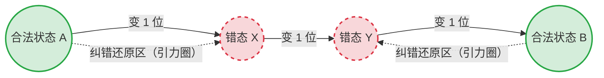

# 🗺️ 专题：海明码距与纠错检错原理底层透析

## 一、一语道破 (The Essence)
在数据传输中，**“码距（Hamming Distance）”就是两个“合法暗号”之间，需要翻转多少个二进制位才能互相转换的物理距离**。
纠错和检错的底层逻辑，就是在广袤的二进制空间中，**人为地拉开合法暗号之间的距离**，使得哪怕数据在传输中被噪声“翻转”了几个位，接收方依然能凭借“距离谁最近”来猜出它原本的面貌。

---

## 二、概念串联：码距的几何空间漫游 (The Big Picture)

假设我们要传输 2 位数据（`00`, `01`, `10`, `11`）。如果不加任何校验，这 4 个状态全都是“合法”的。
这个时候，任何 1 位发生翻转（比如 `00` 变成了 `01`），接收方都会以为你发的就是 `01`，**完全无法发现错误**。因为此时系统的最小码距 $d=1$。

为了能发现错误，我们必须**牺牲空间换取安全**，也就是“增加冗余的校验位”，让一部分状态变成“不合法”的雷区。

### 1. 检错的本质（码距 $d=2$）
我们在末尾加 1 位**奇偶校验位**。规定：合法的编码必须有偶数个 `1`。
此时合法的词变成了：`000`, `011`, `101`, `110`。
非法（无效）的词是：`001`, `010`, `100`, `111`。

我们可以用一幅图来看看两个合法词（如 `000` 和 `011`）之间的关系：

```mermaid
graph LR
    A((合法状态 A\n"000")) -- "翻转 1 位" --> Err1((非法状态\n"010"))
    Err1 -- "翻转 1 位" --> B((合法状态 B\n"011"))
    
    style A fill:#d4edda,stroke:#28a745,stroke-width:2px
    style B fill:#d4edda,stroke:#28a745,stroke-width:2px
    style Err1 fill:#f8d7da,stroke:#dc3545,stroke-width:2px,stroke-dasharray: 5 5
```

> **结论剖析**：
> 从合法状态 A 变到合法状态 B，至少需要翻转 **2 位**。这就是**码距 $d=2$**。
> 如果传输中只发生了 1 位翻转（比如 A 变成了 `010`），它掉进了“非法区”。接收方**能知道出错了（检错能力）**。
> **为什么不能纠错？** 因为 `010` 距离 A（变1步）和距离 B（变1步）**一样近**！接收方不知道它到底是从 A 变来的，还是从 B 变来的。

### 2. 纠错的本质（码距 $d=3$）
为了不仅能知道出错了，还能**把错改回来**，我们必须继续拉大合法状态之间的距离，使得“发生错误后的状态”，**依然离它原来的主子最近！**

我们将码距拉大到 $d=3$（如海明码）：



> **结论剖析**：
> 合法 A 和合法 B 之间隔了 3 步（$d=3$）。
> 假设 A 传输时发生了 **1位错误**，变成了“错态 X”。
> 接收方拿到 X 后，发现它不合法。但接收方计算距离：X 距离 A 只有 1 步，距离 B 却有 2 步。根据“最大似然原则”，它极大概率是从 A 变来的！
> 于是，接收方自信地把它**纠正**回了 A。这就是**纠错能力的物理本质——引力圈（Sphere of Influence）不重叠。**

---

## 三、深层辨析：三大公式的数学必然 (The Breakdown)

明白了上述几何原理，软考那三个死板的数学公式就成了显而易见的常识：

### 1. 为什么检出 $e$ 个错误，要求 $d \ge e + 1$？
如果系统可能发生 $e$ 位错误，那么合法字 A 翻转 $e$ 次后，绝对不能变成另一个合法的字 B（否则接收方会以为本来发的就是 B，漏检）。
所以，A 和 B 之间的距离，必须比 $e$ 还大至少 1 步！
**公式必然：$d > e \implies d \ge e + 1$。**

### 2. 为什么纠正 $t$ 个错误，要求 $d \ge 2t + 1$？
纠错的本质是**划定势力范围（引力半径）**。
如果每个合法字想要罩住半径为 $t$ 的引力圈（即允许出错 $t$ 位还能认祖归宗），那么两个合法字的引力圈**绝对不能接壤或重叠**。
A 的引力半径是 $t$，B 的引力半径也是 $t$。为了中间留出楚河汉界避免误判，它们之间的总距离必须严格大于 $2t$。
**公式必然：$d > 2t \implies d \ge 2t + 1$。**

### 3. 为什么同时检错 $e$ 和纠错 $t$，要求 $d \ge e + t + 1$？
既然又能检错又能纠错，且规定 $e > t$。
这意味着即使发生 $e$ 个错误（掉到了别人家门口），也不能被误当成“别人只犯了 $t$ 个错误”。
A 犯了 $e$ 个错误后的边界，必须与 B 允许纠错的 $t$ 半径边界错开。
**公式必然：$d > e + t \implies d \ge e + t + 1$。**

---

## 四、软考实战应用指南

在软考《计算机组成与体系结构》中，考查这个底层逻辑的方式极其固定，你只需抓住两个考法：

1. **题型 A：给校验码，问码距和纠检错能力。**
   * *奇偶校验*：只能检错 1 位，不能纠错，代入检错公式：$d \ge 1+1 = 2$。
   * *标准海明码*：能纠错 1 位，代入纠错公式：$d \ge 2(1)+1 = 3$。

2. **题型 B：求海明码需要插入多少个校验位。**
   * *公式*：**$2^k \ge n + k + 1$** （其中 $n$ 是数据位长度，$k$ 是你要算出来的校验位长度）。
   * *实战技巧*：遇到这种题，**千万不要去解不等式**！直接把选项 A、B、C、D 里的数字当作 $k$ 往公式里代入，哪个刚好成立（左边大于等于右边）就选哪个。例如数据位 $n=32$，代入 $k=6$，左边 $64 \ge 32+6+1=39$，成立！所以选 6。
