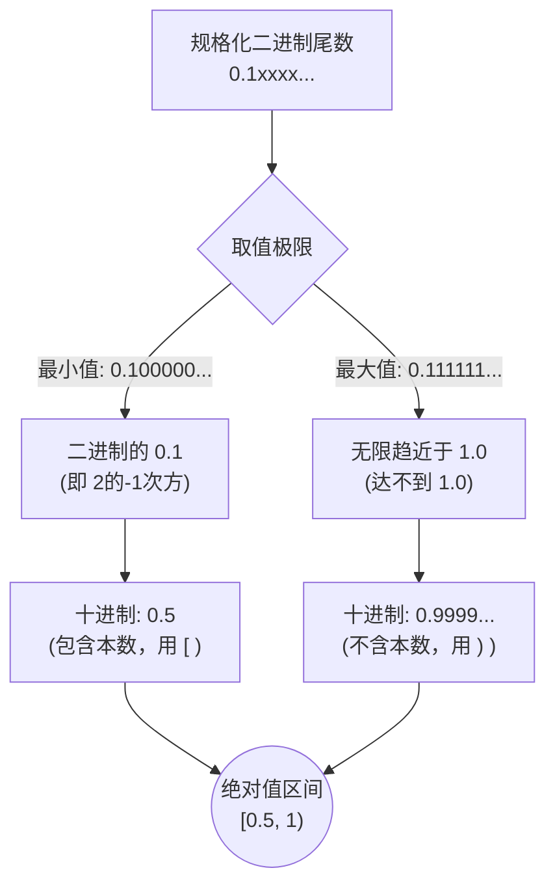

# 专题 06：浮点数规格化与区间 [0.5, 1) 的底层透析

> **核心痛点**：在软考中，经常遇到“规格化表示要求尾数的绝对值限定在区间 [0.5, 1)” 这样的死记硬背考点。本专题将其还原为生活常识，彻底粉碎死记硬背。

## 1. 为什么要“规格化”？（挤干水分）

在日常生活中，如果我们要用有限的格子记录 $0.00314$ 这个数字：
* 如果不加处理直接写：`0` `0` `3`，后面的 `14` 就被丢掉了，精度严重受损。
* 用科学记数法写成 $3.14 \times 10^{-3}$，只需要把 `3` `1` `4` 填进格子里，精度完美保留！

数字前面连串的 `0` 是没用的，它纯粹在浪费宝贵的存储空间。
在十进制里，科学记数法规定：**小数点前面必须是一个 1~9 的非零数字**。这就叫十进制的“规格化”。

## 2. 二进制纯小数的“规格化”铁律

计算机也面临同样的问题，浮点数的尾数长度是固定的。如果前面全是 0，尾部的精度就被截断了。

在经典的计算机底层理论中，浮点数的尾数被定义为**“纯小数”**，即小数点永远钉死在最前面：`0.xxxxx...`。

为了不浪费空间，计算机的“规格化”定下了铁律：**小数点后面第一位，绝对不能是 0！**
而在二进制的世界里，只有 0 和 1。既然第一位不能是 0，那它**必须、只能是 1**！

所以，一个“规格化”后的二进制尾数，长相必然是固定的：
👉 **`0.1xxxxxxx...`** （x 可以是 0 或 1）

## 3. 为什么刚好是 [0.5, 1) 这个区间？

现在，我们将这个必定以 `0.1` 打头的二进制纯小数，翻译回十进制：

1. **最小值**：除第一位外，后面全都是 0：`0.1000000...`
   在二进制小数里，小数点后第一位的权重是 $2^{-1}$，也就是十进制的 **$0.5$**！
   所以，它的最小值就是 $0.5$（包含了 $0.5$，所以是**闭区间 `[`** ）。
2. **最大值**：除第一位外，后面全都是 1：`0.1111111...`
   这个数字无限趋近于 `1.0`，但永远达不到 `1.0`。
   所以，它的最大值是无限接近于 $1$（达不到 $1$，所以是**开区间 `)`** ）。

结合起来，只要一个二进制尾数被“规格化”成了 `0.1xxx...` 的格式，它在数学上代表的绝对值大小，就被死死地卡在了 **$[0.5, 1)$** 这个区间里！

## 4. 考场陷阱与 IEEE 754 的进化

* **软考经典理论考点（纯小数规格化）**：考题不加任何说明时，默认尾数是纯小数。此时规格化区间永远选 **$[0.5, 1)$**。
* **IEEE 754 工业标准考点**：现代电脑发现，既然规格化后第一位**永远是 1**，那干脆连这个 1 都不存在内存里了（称为隐藏位）。IEEE 754 将小数点放在了这个 1 的后面，格式变成了 `1.xxx...`。
  此时，它的最小值是 `1.000...`，最大值趋近于 `2.0`。因此 IEEE 754 的尾数绝对值实际区间是 **$[1, 2)$**。但在软考题中，除非明确提到“IEEE 754的隐藏位机制”，否则不要选这个区间。

> **考场秒杀口诀**：
> **“规格化就是为了挤干水分去前导0！小数点后第一位必须是 1（即 `0.1`）。而二进制的 `0.1` 刚好等于十进制的 0.5，所以区间必是 0.5 到 1 之间！”**
