# 专题 07：进程调度算法与甘特图推导（SRTF 抢占式陷阱）

> **核心痛点**：在计算进程平均等待时间时，极易混淆 SJF（最短作业优先，非抢占）和 SRTF（最短剩余时间优先，抢占式）。本专题用**可视化甘特图**彻底打穿抢占式调度的微观执行过程。

## 1. 核心法则：抢占式调度的“敲门对比机制”

在 SRTF（最短剩余时间优先）算法中，只要有一个**新进程到达（敲门）**，CPU 必须立刻停下手头的工作，做一次生死裁决：
👉 **“当前进程剩下的时间” VS “新来进程需要的时间”**
* 如果新来的更短：**立刻剥夺 CPU**（抢占）。
* 如果当前的更短（或一样）：当前进程继续跑。

## 2. 真题底层推导（以经典 5 进程为例）

**【条件】**
* P1：到达 0，服务 8
* P2：到达 2，服务 4
* P3：到达 4，服务 6
* P4：到达 6，服务 2
* P5：到达 8，服务 1

**【Mermaid 抢占式甘特图（微观推导）】**

```mermaid
gantt
    title SRTF 抢占式调度甘特图推导 (横轴为时间ms)
    dateFormat X
    axisFormat %s
    
    section 进程到达敲门事件
    P1 (需8ms) 到达 :milestone, m1, 0, 0d
    P2 (需4ms) 到达 :milestone, m2, 2, 0d
    P3 (需6ms) 到达 :milestone, m3, 4, 0d
    P4 (需2ms) 到达 :milestone, m4, 6, 0d
    P5 (需1ms) 到达 :milestone, m5, 8, 0d
    
    section CPU 实际运行轨迹
    P1 (运行2ms)       :active, p1_1, 0, 2
    P2 (抢占! 运行4ms)  :done, p2, 2, 6
    P4 (跑最弱! 运行2ms):done, p4, 6, 8
    P5 (跑最弱! 运行1ms):done, p5, 8, 9
    P1 (恢复! 运行6ms)  :active, p1_2, 9, 15
    P3 (最后! 运行6ms)  :done, p3, 15, 21
```

**【每步博弈透析】**
1. **t=0**：P1 独占，开始跑。
2. **t=2**：P2 敲门！P1 跑了 2，还剩 6。P2 只需要 4。**4 < 6，P2 抢占！**
3. **t=4**：P3 敲门！P2 跑了 2，还剩 2。P3 需要 6。2 < 6，P2 稳住继续。
4. **t=6**：P4 敲门！恰好 P2 跑完。剩下 P1(剩6)、P3(剩6)、P4(需2)。**P4 最短，P4 上！**
5. **t=8**：P5 敲门！恰好 P4 跑完。剩下 P1(剩6)、P3(剩6)、P5(需1)。**P5 最短，P5 上！**
6. **t=9**：P5 跑完。剩下 P1(6), P3(6)。一样长，**FCFS 先来后到，P1 上！**，随后 P3 收尾。

## 3. 平均等待时间极速终结公式

> **公式**：等待时间 = 最终完成时间 - 敲门时间(到达时间) - 实际干活时间(服务时间)

* P1: $15 - 0 - 8 = 7$
* P2: $6 - 2 - 4 = 0$
* P3: $21 - 4 - 6 = 11$
* P4: $8 - 6 - 2 = 0$
* P5: $9 - 8 - 1 = 0$
**平均 = $(7 + 0 + 11 + 0 + 0) \div 5 = 3.6	ext{ms}$**
