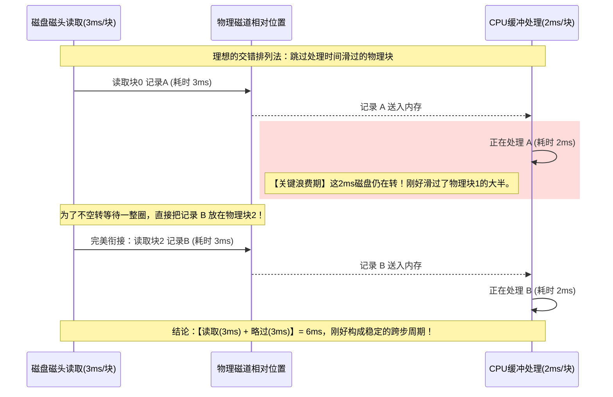

# 专题 09：磁盘单通道交错排列与极限计算

> **核心痛点**：遇到“磁盘顺序读取”和“优化存放读取”时间计算时，直接在脑子里空想磁头旋转极易绕晕。本专题用“物理时序平铺法”彻底透视其运动规律。

## 1. 物理机制：为什么要“交错优化”？

磁盘只有一个磁头（单通道）。
* 磁盘是**匀速且一直旋转**的，不会等你。
* CPU 处理数据是需要时间的。
如果在物理磁盘上挨着放 `[A][B][C]`：读完 A，CPU 花时间去处理 A。等 CPU 处理完，磁盘已经默默转过去了，磁头已经错过了 B 的开头。必须**傻等磁盘转完整整一圈**重新回到 B！这就是巨大的时间浪费。

**优化的本质**：CPU 处理 A 需要多长时间，我们就把 B **往后挪多远**。让磁头跑到 B 开头的时候，CPU 刚好处理完 A。

## 2. Mermaid 极限交错推导图

**【条件】**：共 9 个物理块，转一圈 27ms，读一块需 3ms，处理一块需 2ms。
* **物理跨距估算**：处理 2ms 期间，磁头转过了 $2/3$ 个块。
* **完美落位**：为了不空转，把下个数据放在下一个完整的物理块上（即跳过 1 个物理块）。

## 3. 终极计算公式：拆解“N-1”与“收尾”

* **跨步周期** = 读 1 块的时间 + 跳过 1 块的时间（为了覆盖处理时间）。本题 = $3\text{ms} + 3\text{ms} = 6\text{ms}$。
* **规律**：
  * 前 $N-1$ 个记录（即前 8 个）：必须不断触发这个周期，为了衔接下一个记录。耗时 $8 \times 6\text{ms} = 48\text{ms}$。
  * 第 $N$ 个记录（最后 1 个）：读出来（3ms），处理完（2ms），直接结束！不需要再衔接后面的块了。耗时 $3 + 2 = 5\text{ms}$。
* **极限最短时间** = $48\text{ms} + 5\text{ms} = 53\text{ms}$。
