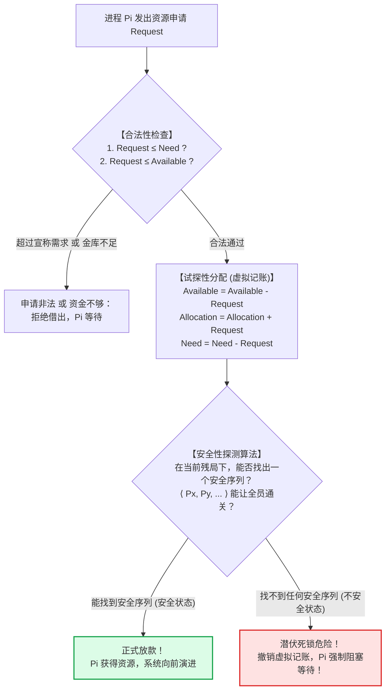
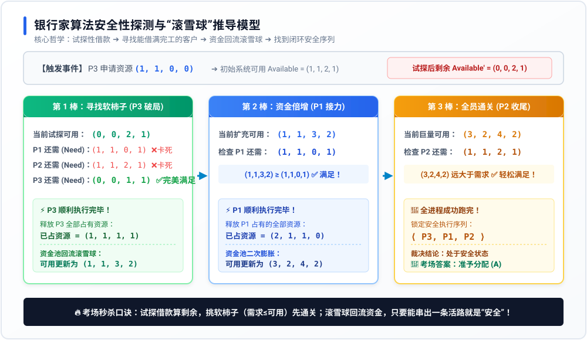

# 专题 10：银行家算法与死锁避免机制——底层透析

> **核心痛点**：软考中涉及“银行家算法”的题目常有两层杀招：一层是**概念哲学题**（误将算法定义套用极值公式，错选“可能死锁”）；另一层是**四维矩阵推导题**（看到一堆数字眼花缭乱，不会手动模拟安全性探测）。本专题从第一性原理出发，一文彻底打通死锁避免的运行全貌。

---

## 1. 第一性原理：银行家为什么永远不破产？

银行家算法由图灵奖得主 **Edsger Dijkstra** 于 1965 年提出。它的设计灵感极其生活化：

### 🏦 银行借贷隐喻
假设一家小银行手里一共有 **60 万元** 周转资金，同时服务 3 位客户（A、B、C）。
每位客户开工一个大项目，最多总共需要 **40 万元**。
* **傻瓜银行（盲目分配 / 导致死锁）**：
  三个客户各来申请 20 万，银行一视同仁全部借出（借出 60 万，金库见底）。此时三个人都还需要 20 万才能完工挣钱还款，但银行手里一分钱都没了。三个人项目全烂尾，银行直接破产！这就是**死锁**。
* **精明银行家（银行家算法 / 死锁避免）**：
  银行家立下一条铁律：“**绝不借钱借到让自己没有退路！**”
  每次有人来借钱，银行家先在脑子里暗暗盘算（试探性分配）：如果借给你，金库剩下的钱，**能不能帮当前至少一位客户做完项目并收回全部本息？**
  * 如果能：资金就能回流滚雪球，全员按顺序通关，**准予放款**（安全状态）；
  * 如果借完后，剩下的钱满足不了任何一个客户的完工需求：哪怕金库里还有闲钱，银行家也**断然拒绝借款，强制申请人排队等待**（不安全状态）。

---

## 2. 考点辨析：死锁“预防” vs 死锁“避免”

在操作系统中，解决死锁有四大流派，考试极其喜欢偷换概念：

| 策略类型 | 核心手段 | 代表方案 | 核心代价 / 局限 |
| :--- | :--- | :--- | :--- |
| **死锁预防 (Prevention)** | 静态立规矩，强行打破死锁四必要条件之一 | 一次性全申请（破请求保持）、资源编号顺序申请（破环路） | **资源利用率极低**，很多资源被白白闲置 |
| **死锁避免 (Avoidance)** | **动态安全性探测**，每次分配前预判风险 | **银行家算法**、安全状态探测 | 运行时需要频繁计算矩阵，有轻微计算开销 |
| **死锁检测 (Detection)** | 放任进程申请，定期通过资源分配图找环 | 资源分配图化简、死锁定理 | 允许死锁发生，只管事后发现 |
| **死锁解除 (Recovery)** | 死锁发生后的抢救措施 | 剥夺资源、强行撤销/杀死进程 | 进程心血白费，现场数据受损 |

> 💡 **核心考点**：**银行家算法是“死锁避免”的唯一绝对代表！**

---

## 3. 核心数学模型：三张表与安全性探测三部曲

系统维护四大核心数据结构（以向量/矩阵表示）：
1. **$Max[i]$（最大需求）**：客户 $i$ 项目总共需要的资源上限。
2. **$Allocation[i]$（已借资源）**：客户 $i$ 目前手里已经借走的资源。
3. **$Need[i]$（还差资源）**：$Need[i] = Max[i] - Allocation[i]$（客户还需要多少钱才能完工）。
4. **$Available$（金库剩余）**：系统当前随时可以借出的物理空闲资源。

### 🔄 银行家审批决策三部曲



---

## 4. 全景矩阵滚雪球推导模型

以下用我们真题（第 76/91 题）的实战数据，完整还原银行家算法安全性探测的**“滚雪球”全流程**：



### 🧩 矩阵现场推演步骤：
* **现状**：
  * 系统剩余 $Available = (1, 1, 2, 1)$。
  * $P3$ 突然申请 $(1, 1, 0, 0)$。
* **第 1 步：试探扣除**
  * 假装借给 $P3$ 后，系统剩余 $Available' = (1,1,2,1) - (1,1,0,0) = (0, 0, 2, 1)$。
* **第 2 步：寻找“第一位吃得饱的破局者”**
  * 检查 $P1$ 还需 $(1, 1, 0, 1)$ $	o$ 金库 $R1, R2$ 均为 0，借不起！❌
  * 检查 $P2$ 还需 $(1, 1, 2, 1)$ $	o$ 金库 $R1, R2$ 均为 0，借不起！❌
  * 检查 $P3$ 还需 $(0, 0, 1, 1)$ $	o$ 金库剩余 $(0, 0, 2, 1) \ge (0, 0, 1, 1)$，**完全能借饱！** ✅
* **第 3 步：资金回流滚雪球**
  * $P3$ 完工，连本带利释放全部资源 $(1, 1, 1, 1)$！
  * 金库资金池膨胀：$Available'' = (0, 0, 2, 1) + (1, 1, 1, 1) = (1, 1, 3, 2)$。
  * 此时资金充足，可以满足 $P1$ 的需求 $(1, 1, 0, 1)$，**$P1$ 跑！**
  * $P1$ 释放全部资源 $(2, 1, 1, 0)$，金库膨胀为 $(3, 2, 4, 2)$，**$P2$ 轻松跑！**
* **结论**：找到安全序列 $\langle P3, P1, P2 
angle$，系统**处于安全状态，准予分配！**

---

## 5. 考场三大致命陷阱与秒杀破局

### ⚠️ 陷阱 1：题干给出极值，却问“采用银行家算法是否会死锁？”
* **反常识真相**：**一定不会死锁！**
* **破局原理**：极值公式 $n 	imes (w - 1) + 1 \le m$ 是在“无调度策略、野蛮申请”时的死锁下界。只要题干带上“采用银行家算法”，就是明牌告诉你：**系统有守门员！不安全的状态根本进不去！**

### ⚠️ 陷阱 2：误以为“不安全状态 = 死锁状态”
* **反常识真相**：**不安全状态 $
e$ 死锁状态！**
* **破局原理**：
  * **安全状态**：必然能找到至少一条安全序列，**一定不死锁**。
  * **不安全状态**：当前没有绝对把握让所有人完工。如果接下来客户不继续申请最大资源，可能平安无事；但只要客户同时顶格申请，就会死锁。
  * 关系是：**死锁是不安全状态的绝对子集**。银行家算法的原则是“只要有一丝不安全，就扼杀在摇篮里”。

```
┌──────────────────────────────────────────────┐
│                  系统所有状态                │
│  ┌────────────────────┬───────────────────┐  │
│  │      安全状态      │     不安全状态    │  │
│  │   (必定不会死锁)   │   ┌───────────┐   │  │
│  │                    │   │ 死锁状态  │   │  │
│  │                    │   └───────────┘   │  │
│  └────────────────────┴───────────────────┘  │
└──────────────────────────────────────────────┘
```

### ⚠️ 陷阱 3：误以为“安全序列具有唯一性”
* **反常识真相**：**安全序列通常不唯一！**
* 只要系统剩余资源比较充裕，先让 $P1$ 跑或先让 $P3$ 跑都能通关。考场上让你判断系统是否安全，**只要你运气好能凑出任意一条走得通的安全序列，就可以立刻拍板选“安全”**！
