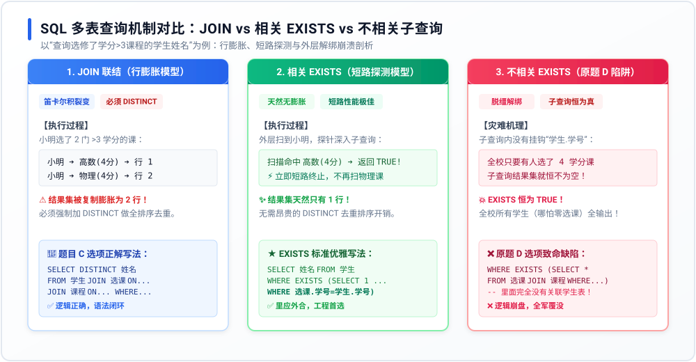

# 专题 11：SQL 多表查询与 EXISTS 核心机制——底层透析

> **核心痛点**：在数据库真题与下午大题中，多表关联查询是绝对必考的命题靶点。很多考生只知无脑写 `JOIN`，却不懂 `EXISTS` 的执行机理；做题时分不清“相关子查询”与“不相关子查询”，甚至落入笛卡尔积行膨胀与全表恒真崩溃的逻辑深坑。本专题从底层执行原理出发，彻底攻克这一核心盲区。

---

## 1. 第一性原理：多表查询的两条根本路线

在关系代数中，要获取跨表数据，底层引擎通常面临两条截然不同的实现哲学：

1. **路线 A：实体拼接流（JOIN 联结）**
   * **哲学**：将两个关系的元组按照关联条件在内存中**拼接成宽表（笛卡尔积子集）**，然后再做投影与过滤。
   * **代价**：当一对多关系存在时（如一个学生对应多门选课记录），主表数据会被**强制复制并裂变成多行（行膨胀）**，迫使开发者必须追加昂贵的 `DISTINCT` 进行全量去重。
2. **路线 B：谓词探测流（EXISTS 存在性检查）**
   * **哲学**：主表的一行数据只被当成一个“探测探针”。子查询并不关心查出的具体字段是什么，**只关心结果集“是否存在（Is Non-Empty）”**。
   * **优势**：主表记录永远不会产生笛卡尔积裂变，命中即止（短路求值），天然不需要去重！

---

## 2. 底层机制全景对比模型

我们以真题（第 102 题）的经典业务场景——**“查询选修了学分 > 3 课程的学生姓名”** 为基准，透视其底层运转机理：



---

## 3. 经典真题复盘：为什么原题 D 选项引发了“全校性灾难”？

**【问题背景】**
* 关系模式：`学生(学号, 姓名, 院系)`、`选课(学号, 课程号, 成绩)`、`课程(课程号, 课程名, 学分)`
* 要求：查询“所有选修了学分大于 3 的课程的学生姓名”。

### ❌ 致命错误代码（原题 D 选项）
```sql
SELECT DISTINCT 姓名 FROM 学生 
WHERE EXISTS (
    SELECT * 
    FROM 选课 JOIN 课程 ON 选课.课程号 = 课程.课程号 
    WHERE 学分 > 3   -- 💥 致命伤：子查询内部完全没有关联学生表！
);
```

### 💥 灾难运行机理剖析：
1. **脱缰的不相关子查询**：
   * `EXISTS` 本质是一个外层驱动内层的循环。外层扫出学号为 001 的张三，启动子查询判断；扫出学号为 002 的李四，再次启动子查询判断。
   * 但请仔细看括号里的子查询：它在查“选课和课程联结后学分是否大于 3”，**里面没有任何一条语句与外层的张三、李四绑定（缺失了 `选课.学号 = 学生.学号`）**！
2. **逻辑恒真与全表沦陷**：
   * 这个子查询脱离了具体学生，变成了**全校层面的全局检索**！
   * 只要全校有一位学霸（比如王五）选了一门 4 学分的课，该子查询的结果集就**永远不为空（Permanent Non-Empty）**！
   * 结果导致：对于全校每一位学生，`WHERE EXISTS(...)` 的判定结果**全部恒为 TRUE**！
   * 最终系统把全校所有学生（哪怕一门课都没选的、刚刚退学的、学分全都是 1 分的）**全员无差别全部打印了出来！**

---

## 4. 架构师级标准写法与工程性能优势

### ✅ 标准优雅正解：相关子查询（Correlated Subquery）
```sql
SELECT 姓名 
FROM 学生
WHERE EXISTS (
    SELECT 1                         -- 规范习惯写 1，无需查出真实字段
    FROM 选课 
    JOIN 课程 ON 选课.课程号 = 课程.课程号
    WHERE 选课.学号 = 学生.学号       -- ★ 核心生命线：必须与外层主表深度挂钩！
      AND 课程.学分 > 3
);
```

### 🚀 为什么在生产高并发系统中，高级 DBA 极其青睐 EXISTS？

| 评估维度 | 方案 A：`JOIN + DISTINCT` | 方案 B：`相关 EXISTS` |
| :--- | :--- | :--- |
| **行数裂变** | 选了 N 门符合条件的课，产生 N 行膨胀 | **天然 0 膨胀**，外表有几行就最多返回几行 |
| **去重开销** | 必须由优化器建立临时表或全量排序去重，CPU开销大 | **无需 DISTINCT**，节省内存与排序消耗 |
| **执行策略** | 必须把关联记录全部匹配完成后统一投影 | **短路求值（Short-Circuit）**：命中第 1 条立刻返回 TRUE 终止检索 |
| **索引感知** | 依赖两表连接键的双向索引 | 极度利用 `选课(学号, 课程号)` 联合索引快速点查 |

---

## 5. 考场进阶：双重 NOT EXISTS 的全称量词魔法

在软考下午大题和高阶 SQL 单选题中，命题人最喜欢用 `NOT EXISTS` 考查形式逻辑中的**全称量词（“任意”、“所有”）**。

> **形式逻辑铁律**：SQL 没有 `FOR ALL` 语法，必须利用**双重否定表肯定**：  
> **“选修了全部课程的学生” $\Longleftrightarrow$ “不存在任何一门课程，是他没有选修的”！**

```sql
-- 查询选修了全部课程的学生姓名
SELECT 姓名 
FROM 学生
WHERE NOT EXISTS (
    SELECT * 
    FROM 课程
    WHERE NOT EXISTS (
        SELECT * 
        FROM 选课 
        WHERE 选课.学号 = 学生.学号 
          AND 选课.课程号 = 课程.课程号
    )
);
```

### 🧠 考场 15 秒秒杀心法：
1. **看里应外合**：看到 `EXISTS`，第一眼先看最内层是否有 `内表.外键 = 外表.主键`。如果没有挂钩，直接判定为“脱缰野马（不相关子查询）”，秒速排除！
2. **看行膨胀**：看到 `JOIN`，第一眼先查字段来自哪张表（不在的表强查必报语法错误）；多对多联结查父表属性，必带 `DISTINCT`！
3. **看双重否定**：看到两个嵌套的 `NOT EXISTS`，不用逐行读，题意必定是**“选修了全部/所有的...”**！
