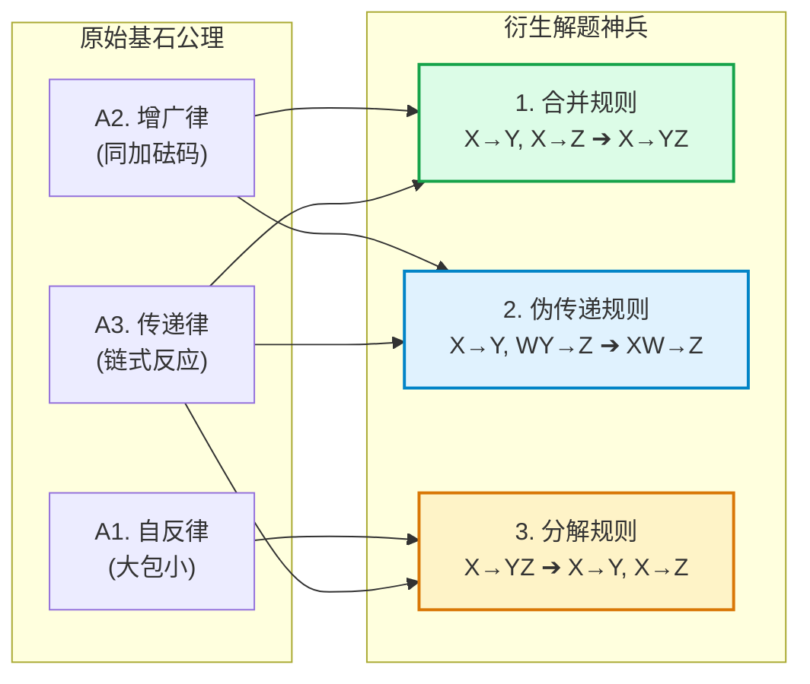
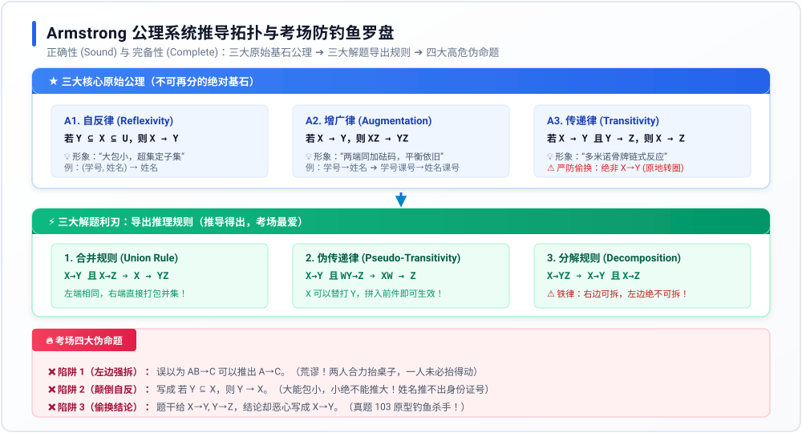

# 专题 12：Armstrong 公理系统与函数依赖推导——底层透析

> **核心痛点**：在数据库规范化理论中，考生常常将 Armstrong 公理系统视为抽象枯燥的数学八股；做题时极易被命题人“偷换结论”、“颠倒包含关系”、“左边非法强拆”等伪命题钓鱼忽悠（如错题 103）。本专题从第一性原理出发，一图打穿公理推导链条与考场排雷罗盘。

---

## 1. 第一性原理：为什么需要 Armstrong 公理系统？

在关系数据库设计中，现实世界存在千丝万缕的业务约束（例如：学号决定身份证号，身份证号决定姓名，系号决定系主任...）。
* **核心难题**：我们不可能在系统里无穷无尽地手工罗列所有可能的依赖关系。如果已知一组基础的函数依赖集合 $F$，**如何用一套严密、无漏洞的逻辑推理规则，自动推导出所有隐含的、真实的依赖（逻辑蕴涵）？**
* **历史突破**：1974 年，计算机科学家 **William W. Armstrong** 提出了这套划时代的公理系统。

### 🛡️ 系统的两大终极数学保证：
1. **正确性（Soundness）**：凡是利用这套规则推导出来的函数依赖，在现实世界中**100% 绝对成立**，绝无假货！
2. **完备性（Completeness）**：凡是在现实世界中成立的所有隐含函数依赖，利用这套规则**100% 能够全部推导出来**，绝无遗漏！

---

## 2. 三大不可再分的基本公理（绝对基石）

设关系模式 $R(U, F)$，$U$ 为属性全集，$X, Y, Z \subseteq U$：

### A1. 自反律 (Reflexivity) —— “大包小，超集定子集”
* **形式定义**：若 $Y \subseteq X \subseteq U$，则 $X \to Y$ 为 $F$ 所蕴涵。
* **物理直觉**：如果 $X$ 包含的内容比 $Y$ 还要多，那么知道 $X$ 必然知道 $Y$。
  * *生活例子*：知道了一个人的 `(身份证号, 手机号)`，当然能唯一知道他的 `手机号`。这种依赖在数学上叫**平凡函数依赖**（显然成立）。
* ⚠️ **考场致命陷阱**：出题人常写成“若 $Y \subseteq X$，则 $Y \to X$”（小推大）或者写成元素包含符号 $Y \in X$（集合混淆）。

### A2. 增广律 (Augmentation) —— “两端同加砝码，平衡依旧”
* **形式定义**：若 $X \to Y$ 为 $F$ 所蕴涵，且 $Z \subseteq U$，则 $XZ \to YZ$ 为 $F$ 所蕴涵。
* **物理直觉**：天平两端本来平衡（$X$ 能决定 $Y$），两边同时加上相同的砝码 $Z$，天平自然依然平衡。
  * *生活例子*：已知 `学号 → 姓名`，两边同时加上 `课程号`，必然有 `(学号, 课程号) → (姓名, 课程号)`。

### A3. 传递律 (Transitivity) —— “多米诺骨牌链式传导”
* **形式定义**：若 $X \to Y$ 且 $Y \to Z$ 为 $F$ 所蕴涵，则 $X \to Z$ 为 $F$ 所蕴涵。
* **物理直觉**：A 决定 B，B 又决定 C，则 A 跨过中介直接决定 C。
* ⚠️ **考场致命陷阱（真题 103 原型）**：出题人故意写成 `若 X→Y 且 Y→Z，则 X→Y`（条件本来就给了 X→Y，后半句纯属复读废话，根本不是传递律的结论）！

---

## 3. 三大实战解题导出规则（解题神兵）

由三大原始公理，可以推导出三把威力巨大的解题利刃：

### 1. 合并规则 (Union Rule) —— “左边同，右边拼”
* **公式**：若 $X \to Y$ 且 $X \to Z$，则 $X \to YZ$。
* **推导**：由增广律，$X \to Y \implies X \to XY$；由增广律，$X \to Z \implies XY \to YZ$；由传递律，得 $X \to YZ$。
* **真题价值**：**错题 103 的正解选项 D！** 只要前件完全一致，后件直接取并集！

### 2. 伪传递规则 (Pseudo-Transitivity) —— “前件替打”
* **公式**：若 $X \to Y$ 且 $WY \to Z$，则 $XW \to Z$。
* **直觉**：后一个依赖需要 $W$ 和 $Y$ 联手才能推出 $Z$，既然 $X$ 能单挑产出 $Y$，那么把 $Y$ 换成 $X$（变成 $XW$），同样能推出 $Z$！

### 3. 分解规则 (Decomposition Rule) —— “右边可拆，左边绝不可拆！”
* **公式**：若 $X \to YZ$，则 $X \to Y$ 且 $X \to Z$。
* ⚠️ **工业级高危禁区**：**右边能拆，绝不代表左边能拆！**
  * $A \to BC$ 可以完美拆分为 $A \to B$ 和 $A \to C$；
  * 但 $AB \to C$ **绝对不能**拆成 $A \to C$ 或 $B \to C$！（两人合力才能抬起钢琴，单挑谁都抬不动）。

---

## 4. 全景拓扑推导与考场防钓鱼罗盘

以下高清矢量罗盘梳理了三大基石公理、三大导出规则与考场高频伪命题的映射关系：

---

## 5. 公理系统的终极工程变现：属性闭包与候选码求解

整个数据库理论之所以要花这么大力气建立 Armstrong 公理，最核心的工程落地就是**计算属性闭包（$X^+$）从而极速求解候选码**！

### 🔑 候选码求解 15 秒极速四步法（基于错题 99 经验）：
1. **L 类属性（只在左边出现）**：必然包含在所有候选码中；
2. **R 类属性（只在右边出现）**：绝不可能出现在任何候选码中（直接排除！）；
3. **N 类属性（孤儿属性，两边都没出现）**：**毫无例外，必须 100% 强行塞进所有候选码中**；
4. **LR 类属性（两边都出现）**：与 L 类和 N 类组合，用 Armstrong 闭包推导测试是否等于全集 $U$。

---

## 6. 考场四大致命伪命题排雷清单（防钓鱼 CheckList）

| 考场钓鱼伪命题 | 错误性质 | 破绽揭露与反例 | 正确法则 |
| :--- | :--- | :--- | :--- |
| **❌ 伪规则 1** `若 AB→C，则 A→C` | **左边非法强拆** | 成绩表里 `(学号, 课程号) → 成绩`，单凭 `学号` 根本查不出某门课成绩！ | **右边可分解，左边绝不分！** |
| **❌ 伪规则 2** `若 Y⊆X，则 Y→X` | **颠倒自反律** | 单凭一个 `姓名`（子集），根本推不出唯一的 `(身份证号, 姓名)`（超集）！ | **超集推子集（大包小：X→Y）！** |
| **❌ 伪规则 3** `若 X→Y, Y→Z，则 X→Y` | **偷换传递结论** | 原题 103 典型陷阱！后件只是复读已知条件，不是推理出的新结论。 | **首尾贯通传递出 X→Z！** |
| **❌ 伪规则 4** `若 X→Y, Z→Y，则 (X-Z)→Y` | **集合非法相减** | 两个人都能完成同一件事，不代表把他们重合的能力减掉后还能成事。 | **函数依赖没有相减规则！** |

> **🔥 考场终极秒杀口诀**：  
> **大包小自反律，同加砝码增广律，首尾连环传递律；**  
> **左同右并合并律，右边可拆左莫动，偷换结论当场毙！**
