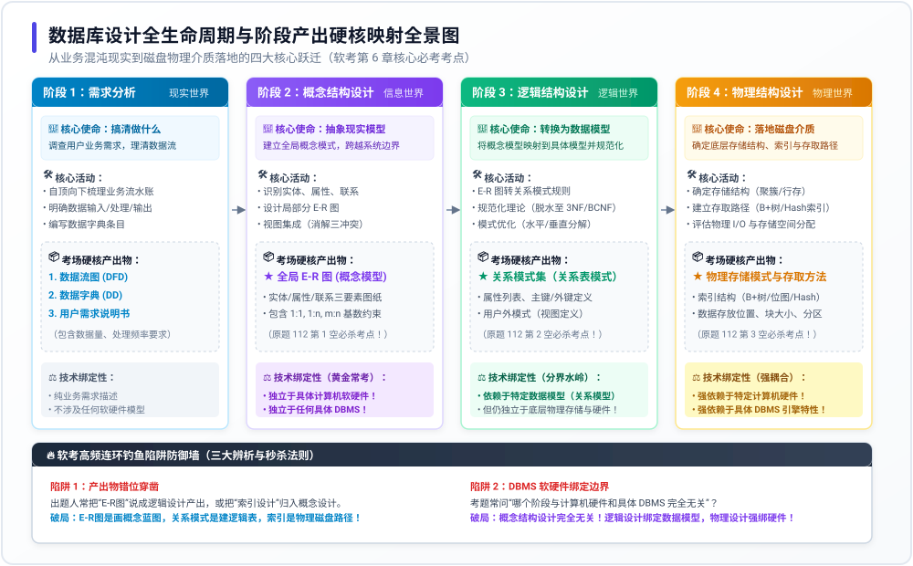

# 专题 13：数据库设计全生命周期与阶段产出映射——底层透析

> **🎯 专题定位**：本专题直击软考上午综合知识 **错题 112** 及历年数据库核心高频考点。针对考生在“概念设计、逻辑设计、物理设计”之间界限模糊、阶段产出物张冠李戴、技术绑定性混淆的痛点，用第一性原理与工程本质拆解**从业务混沌现实到磁盘物理落地的四大跃迁**。

---

## 1. 为什么数据库设计必须分这几个阶段？（底层本质矛盾）

在软件工程中，构建一个企业级数据库面临着**终极认知与工程鸿沟**：
* **一端是现实世界**：业务方的需求是极其混沌的、充满口头俚语、带有歧义且动态变化的自然语言（“我要给图书分类，能查借阅记录”）。
* **另一端是物理世界**：计算机底层只认极其冷酷的二进制数据块、磁道柱面、B+ 树页分裂、内存缓冲区和 I/O 吞吐率。

如果从“业务对话”一步跨到“磁盘建表”，必然导致**牵一发而动全身的架构灾难**（业务稍微调整一个字段，整个底层存储、索引、上层代码全部报废）。

为了解决这个根本矛盾，数据库先驱们建立了**分层解耦的四大递进阶段**：

这四大阶段正是著名的 **ANSI-SPARC 三级模式结构（外模式、概念模式、内模式）** 与 **两级数据独立性（物理独立性、逻辑独立性）** 的诞生的源泉！

---

## 2. 数据库设计全生命周期核心资产全景图

下图高清梳理了四大阶段的输入输出、核心活动与软考考场硬核产出物映射：

---

## 3. 四大核心阶段纵深剖析与技术绑定边界

### 阶段 1：需求分析 (Requirement Analysis) —— “从自然语言到数据字典”
* **核心使命**：搞清楚用户到底需要系统**“做什么”（What to do）**，摸清数据的来龙去脉与体量，严禁涉足“怎么做”。
* **核心活动**：
  1. 调查各部门业务流程，梳理数据输入、处理与输出流向；
  2. 确定系统功能边界，收集安全性与完整性业务规则。
* **📦 考场唯一认准产出物**：
  * **数据流图 (DFD，Data Flow Diagram)**
  * **数据字典 (DD，Data Dictionary)**（包含数据项、数据结构、数据流、数据存储、处理过程）
  * **用户需求规格说明书**
* **⚖️ 软考考点特征**：这是纯粹的业务分析阶段，**完全不涉及任何数据模型、表结构或硬件配置**。

---

### 阶段 2：概念结构设计 (Conceptual Design) —— “面向现实的信息建模”
* **核心使命**：脱离具体计算机与任何数据库软件，用纯粹的概念符号抽象出现实世界中的事物及其联系，绘制出全系统的**逻辑蓝图**。
* **核心方法**：
  1. **自底向上法（最主流）**：先抽象各子系统的分 E-R 图，再进行全局集成；
  2. **自顶向下法**：先画核心骨架，逐步细化。
* **📦 考场唯一认准产出物**：
  * **E-R 图（实体-联系图，Entity-Relationship Diagram）** / 概念数据模型 (CDM)
* **⚖️ 软考黄金考点（考场防钓鱼）**：
  * **与计算机硬件完全无关！**
  * **与具体的 DBMS（无论是 MySQL、Oracle 还是非关系型 MongoDB）完全无关！**
  * 它是纯思维层面的客观抽象。换句话说，哪怕你还没决定买哪家公司的数据库软件，概念设计也必须照样完成！

#### 💡 专题延伸：分 E-R 图集成中的“三大冲突”（上午选择与下午案例必考）
当把多个部门的局部 E-R 图合并为全局 E-R 图时，出题人极爱考察消解的三大冲突：
1. **属性冲突**：
   * *属性域冲突*：同名属性在不同图里类型不同（例如工号一个用 Integer，一个用 String）；
   * *属性单位冲突*：重量一个用“千克”，一个用“磅”。
2. **命名冲突**：
   * *同名异义*：不同分图叫同一个名字，指代的却是不同事物（如教务处的“班级”指行政班，后勤处的“班级”指宿舍班）；
   * *异名同义*：同一事物在不同分图叫不同名字（如学生表的“学号”与借书卡的“读者证号”）。
3. **结构冲突**：
   * 同一对象在某分图中作为“实体”，在另一分图中作为“属性”；
   * 同一联系在不同分图中具有不同的基数（如一端是 1:n，另一端是 m:n）。

---

### 阶段 3：逻辑结构设计 (Logical Design) —— “翻译为二维关系表与脱水提纯”
* **核心使命**：将抽象的 E-R 图“翻译”成特定 DBMS 支持的**具体数据模型（软考中 99% 为关系模型）**，并运用**规范化理论（1NF~3NF/BCNF）**对其脱水提纯，消除冗余与异常。
* **核心步骤**：
  1. **E-R 图向关系模式转换**：
     * **实体集转换**：每个实体集转换为一个独立关系模式；
     * **联系集转换**：
       * **1:1 联系**：可独立建表，也可合并入任意一端（最少不增加表数）；
       * **1:n 联系**：可独立建表，也可将 1 端主键并入 n 端作为外键（最少不增加表数）；
       * **m:n 或多元多对多联系（如 m:n:p）**：**必须独立转换为一个独立关系模式**（主键为各参与实体的主键组合）！*（真题 105 的核心考点：3 个实体 + m:n:p 联系，最少转换为 3 + 1 = 4 个关系模式！）*
  2. **关系规范化（模式分解）**：消除部分依赖（2NF）、传递依赖（3NF）、主属性依赖（BCNF）；
  3. **模式评价与优化**：必要时进行垂直分割（常用列与冷门列分表）或水平分割（按时间/地域分表），甚至引入适当反规范化以换取查询速度；
  4. **设计用户外模式**：定义安全视图（View）。
* **📦 考场唯一认准产出物**：
  * **关系模式集（关系表模式定义：表名、字段名、数据类型、主键、外键、约束）**
  * **用户视图（外模式定义）**
* **⚖️ 软考黄金考点（技术分水岭）**：
  * **开始依赖于特定的数据模型（明确选择了关系模型）**；
  * **但依然完全独立于具体的底层物理存储结构与硬件环境！**（写 SQL 建表定义不需要关心数据存在哪个磁盘扇区）。

---

### 阶段 4：物理结构设计 (Physical Design) —— “水泥浇筑落地磁盘”
* **核心使命**：为一个给定的逻辑数据模型选取一个最适合应用环境的**物理存储结构、存取路径与存储分配方案**，追求 I/O 效率、存储开销与并发性能的极限平衡。
* **核心活动**：
  1. **确定存取方法**：建立索引结构（B+ 树索引、Hash 索引、聚簇索引 Cluster、位图索引 Bitmap）；
  2. **确定存储结构**：数据存放位置、磁盘阵列 RAID 级别、块大小（Block/Page Size）、数据与日志分离存放；
  3. **存储空间分配**：预估数据量增长曲线，配置表空间扩展策略。
* **📦 考场唯一认准产出物**：
  * **物理存储模式（内部模式）**
  * **索引方案设计（Index Design）**
  * **存取路径与物理分区配置表**
* **⚖️ 软考黄金考点（底层强耦合）**：
  * **强依赖于特定的计算机硬件性能（内存大小、磁盘 I/O 吞吐、CPU 核心数）**；
  * **强依赖于具体 DBMS 引擎特性（如 MySQL 的 InnoDB 聚簇特性与 Oracle 的表空间机制完全不同）！**

---

### 阶段 5 & 6：数据库实施与运行维护（工程收尾阶段）
* **数据库实施阶段**：
  * 用 DDL 语言编写建库建表脚本；
  * 组织数据入库（数据抽取清洗加载 ETL）；
  * 编写应用程序并联调；
  * 试运行与压力测试。
* **数据库运行维护阶段**：
  * 日常热备份与冷备份、容灾演练；
  * 数据库重构（随业务发展新增字段、拆分表）；
  * 慢查询优化与性能重调优（慢 SQL 抓取、重新计算索引统计信息）。

---

## 4. 纵向技术关联：设计阶段与 ANSI 三级模式的精准映射

软考出题人极其喜欢将“设计阶段”与“三级模式/两级映像”横向跨章节串联命题：

| 数据库设计阶段 | 对应的 ANSI-SPARC 模式层级 | 对应的抽象层级与使命 | 保证的数据独立性 |
| :--- | :--- | :--- | :--- |
| **逻辑结构设计**（外模式设计） | **外模式 (External Schema)** *(子模式 / 用户视图)* | **最高层抽象** 面向最终用户/开发人员，隐藏底层细节 | **逻辑数据独立性** （概念模式改变时，修改外模式/模式映像，用户视图无需修改） |
| **逻辑结构设计**（全局模式设计） | **概念模式 (Conceptual Schema)** *(逻辑模式 / 全局表)* | **中间层抽象** 全局所有实体的逻辑结构与联系 | — |
| **物理结构设计** | **内模式 (Internal Schema)** *(物理模式 / 存储模式)* | **最低层抽象** 面向磁盘存储格式、索引、物理寻址 | **物理数据独立性** （内模式存储改变时，修改模式/内模式映像，全局逻辑模式保持不变） |

---

## 5. 考场四大致命伪命题排雷清单（防钓鱼 CheckList）

| 考场钓鱼伪命题 | 错误性质 | 破绽揭露与真题反例 | 正确法则 |
| :--- | :--- | :--- | :--- |
| **❌ 伪命题 1** `逻辑设计阶段的成果是 E-R 图` | **阶段产出错位** | E-R 图是“概念模型”，连表结构都还没成型，绝不能叫逻辑设计！逻辑设计的产出是**关系模式（二维表结构）**。 | **E-R 蓝图归概念，二维表模式归逻辑！** |
| **❌ 伪命题 2** `概念结构设计依赖于特定的 DBMS 软件` | **技术绑定混淆** | 概念结构设计纯粹是对现实业务的抽象，换用任何数据库该阶段产出的 E-R 图都一模一样。 | **概念设计超然物外，与软硬件及 DBMS 完全无关！** |
| **❌ 伪命题 3** `建立 B+ 树索引属于逻辑结构设计` | **底层机制越界** | 逻辑设计只管“有哪些字段与约束”，根本不管底层数据是用 B+ 树还是 Hash 索引来查。索引属于**存取路径**，归**物理设计**！ | **表与字段归逻辑，索引存取归物理！** |
| **❌ 伪命题 4** `需求分析阶段产出关系数据字典` | **提前涉足实现** | 需求分析阶段的数据字典是记录业务数据流的（数据项、数据流、处理过程），绝非关系数据库系统里的系统表（如 `information_schema`）。 | **需求只管“业务账本”，绝不碰“数据库系统表”！** |

---

## 6. 🔥 考场终极秒杀口诀

> **业务流水（DFD/字典）需求管，**  
> **抽象现实 E-R 图归概念（软硬无关）；**  
> **转成表做规范归逻辑（关系模型），**  
> **落地磁盘建索引归物理（强绑硬件）！**
