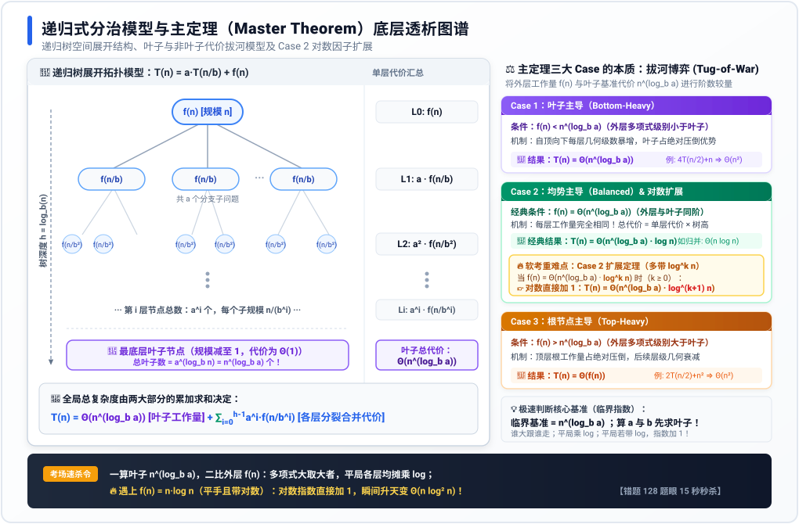

# 专题 14：递归式时间复杂度与主定理及扩展——底层透析

> **定位与使命**：分治算法与递归式时间复杂度是软考《数据结构与算法基础》（上午场 1~2 分、下午试题四核心大题填空）的必考高频硬核考点。很多考生往往死记硬背公式，遇到稍微变形（如 $f(n) = n\log n$ 的对数因子）便彻底失分（如错题 128）。
> 本专题旨在用**第一性原理**穿透递归式的数学本质，通过**递归树空间展开几何模型**与**矢量原理讲解图**，彻底讲透主定理（Master Theorem）三大情形及对数扩展定理的内在推导与考场秒杀技法。

---

## 1. 一语道破：主定理解决的核心矛盾 (The Essence)

### 1.1 分治递归式的通用模型

在计算机科学与算法设计中，绝大多数分治算法（Divide and Conquer）遵循三步法：
1. **Divide（划分）**：将原规模为 $n$ 的问题划分为 $a$ 个独立的子问题，每个子问题的规模缩减为 $n/b$；
2. **Conquer（解决）**：递归地求解这 $a$ 个子问题；
3. **Combine（合并）**：将子问题的解合并为原问题的解。

其运行时间函数可形式化为标准**分治递归关系式**：

$$T(n) = a T(n/b) + f(n)$$

其中核心参数的物理与工程含义如下：
* **$a \ge 1$（分支因子 / Branching Factor）**：每一层递归分解出的**子问题数量**（对应递归树的“出度”或分叉数）；
* **$b > 1$（规模缩减因子 / Problem Shrink Factor）**：每个子问题的规模相对于原问题的**缩减比例**（例如二分法 $b = 2$）；
* **$f(n)$（非递归开销 / Divide & Combine Overhead）**：在当前层进行**问题切分与子问题解合并**所需的工作量（通常由数组遍历、数据搬运、快速排序划分 Partition 或归并操作 Merge 产生）。

---

### 1.2 主定理的本质：一场“叶子”与“非叶子”的拔河博弈 (The Tug-of-War)

求解 $T(n)$ 的渐进上界 $\Theta$，本质上不是繁琐的代数积分，而是**两大阵营工作量的较量**：

```
                      【全局总时间复杂度 T(n)】
                                 ║
            ╔════════════════════╩════════════════════╗
            ▼                                         ▼
   【最底层叶子总工作量】                     【各层非叶子合并总工作量】
     n^(log_b a) · Θ(1)                      ∑ a^i · f(n/b^i)
   (基本子问题的数量规模)                     (划分与合并代价沿树高的累加)
```

这两大力量的博弈存在三种终局：
1. **叶子压倒一切（Bottom-Heavy）**：子问题分支膨胀太快（$a$ 很大），最底层叶子数量呈爆炸式暴增，**全局复杂度完全由叶子总数决定** $\implies T(n) = \Theta(n^{\log_b a})$；
2. **两端平分秋色（Balanced）**：每一层递归的划分与合并工作量恰好相等（几何级数公比 $r = 1$），总工作量等于**单层代价 $\times$ 树的深度** $\implies T(n) = \Theta(n^{\log_b a} \log n)$；
3. **顶层根节点主导（Top-Heavy）**：外层划分合并代价 $f(n)$ 极其庞大，随着向下递归各层代价快速衰减（几何级数公比 $r < 1$），**后续所有层加起来都赶不上第一层** $\implies T(n) = \Theta(f(n))$。

---

## 2. 递归树模型与原理架构图解 (Visual Architecture)

为了将抽象的代数递推具象化，我们构建**递归树（Recursion Tree）空间拓扑模型**。

下图清晰揭示了树的逐层展开机理、每层子问题规模、单层代价求和、树高推导，以及主定理三大 Case 的几何级数拔河本质：



---

### 2.1 递归树四大关键数学参数推导

从上图可以严格推导分治算法递归树的微观参数：

1. **树的深度（Tree Height / Depth）**：
   - 根节点规模为 $n$，第 1 层为 $n/b$，第 $i$ 层为 $n/b^i$；
   - 当规模衰减至基本情况（Base Case，规模为 1）时递归终止：
     $$n / b^h = 1 \implies b^h = n \implies h = \log_b n$$
   - 递归树共有 $h = \log_b n$ 层（若计入根节点则为 $1 + \log_b n$ 层）。

2. **第 $i$ 层的节点总数与单层总代价**：
   - 根节点有 1 个，第 1 层有 $a$ 个，第 $i$ 层有 $a^i$ 个节点；
   - 第 $i$ 层每个节点的子规模为 $n/b^i$，单个节点代价为 $f(n/b^i)$；
   - **第 $i$ 层的总工作量**为：
     $$\text{Cost}_i = a^i \cdot f(n/b^i)$$

3. **最底层（叶子层）的节点总数（临界指数基准）**：
   - 当深度达到 $h = \log_b n$ 时，叶子节点的总数量为：
     $$\text{Leaves} = a^h = a^{\log_b n}$$
   - 根据对数换底与指数对换公式：$x^{\log_b y} = y^{\log_b x}$，得到极其震撼的核心等式：
     $$a^{\log_b n} = n^{\log_b a}$$
   - **每个叶子节点解决规模为 1 的基础子问题，代价为 $\Theta(1)$**；
   - 故**叶子层总代价恒为 $\Theta(n^{\log_b a})$**！

4. **全局工作量累加求和公式**：
   $$T(n) = \Theta(n^{\log_b a}) + \sum_{i=0}^{\log_b n - 1} a^i f(n/b^i)$$

---

## 3. 主定理三大经典 Case 深度透析 (The Breakdown)

我们定义**临界基准指数（Critical Exponent）**：

$$c_{\text{crit}} = \log_b a$$

它代表**叶子节点的增长阶数 $n^{\log_b a}$**。我们将外层合并代价 $f(n) = \Theta(n^d)$ 的指数 $d$ 与临界基准指数 $\log_b a$ 进行比对。

---

### 3.1 Case 1：叶子节点占主导地位（Bottom-Heavy）

* **数学判据**：存在常数 $\epsilon > 0$，使得：
  $$f(n) = O(n^{\log_b a - \epsilon}) \quad (\text{即 } d < \log_b a)$$
* **底层几何机制**：
  - 考察相邻两层的代价比值：
    $$\frac{\text{Cost}_{i+1}}{\text{Cost}_i} = \frac{a^{i+1} f(n/b^{i+1})}{a^i f(n/b^i)} = a \cdot \left(\frac{1}{b}\right)^d = \frac{a}{b^d}$$
  - 因为 $d < \log_b a \implies b^d < b^{\log_b a} = a$，所以公比 $r = \frac{a}{b^d} > 1$；
  - 这是一个**递增的等比数列**！树越往下走，每层的工作量呈指数级暴增；
  - 整个几何级数求和的结果主要由**最大项（即最底层的叶子层）**主导，上面的所有层加起来不过是叶子层的一个常数倍小数！
* **结论**：
  $$T(n) = \Theta(n^{\log_b a})$$
* **经典实战范式**：
  * **Strassen 矩阵乘法**：$T(n) = 7T(n/2) + \Theta(n^2)$
    - $a=7, b=2 \implies \log_b a = \log_2 7 \approx 2.807$；
    - 外层合并 $f(n) = \Theta(n^2) \implies d=2$；
    - 对比：$d=2 < 2.807 \implies$ 叶子占统治地位；
    - 结论：$T(n) = \Theta(n^{\log_2 7}) \approx \Theta(n^{2.81})$。
  * **Karatsuba 大整数乘法**：$T(n) = 3T(n/2) + \Theta(n)$
    - $a=3, b=2 \implies \log_2 3 \approx 1.585 > 1$；
    - 结论：$T(n) = \Theta(n^{\log_2 3}) \approx \Theta(n^{1.585})$。

---

### 3.2 Case 2：层层均摊、平分秋色（Balanced across levels）

* **数学判据**：
  $$f(n) = \Theta(n^{\log_b a}) \quad (\text{即 } d = \log_b a)$$
* **底层几何机制**：
  - 相邻两层代价公比：$r = \frac{a}{b^d} = \frac{a}{a} = 1$；
  - **每一层的工作量完全相同！**
    - 第 0 层工作量 $= f(n) = \Theta(n^{\log_b a})$；
    - 第 1 层工作量 $= a \cdot f(n/b) = a \cdot (n/b)^{\log_b a} = \frac{a}{b^{\log_b a}} n^{\log_b a} = n^{\log_b a}$；
    - ...每一层都是 $\Theta(n^{\log_b a})$！
  - 树一共有 $\log_b n$ 层，总代价直接等于**单层工作量 $\times$ 树的高度**！
* **结论**：
  $$T(n) = \Theta(n^{\log_b a} \log n)$$
* **经典实战范式**：
  * **归并排序（Merge Sort）**：$T(n) = 2T(n/2) + \Theta(n)$
    - $a=2, b=2 \implies \log_2 2 = 1$；
    - 叶子代价 $n^1 = n$，外层合并 $f(n) = \Theta(n)$，二者完全同阶（公比为 1）；
    - 结论：$T(n) = \Theta(n \log n)$。
  * **二分查找（Binary Search）**：$T(n) = T(n/2) + \Theta(1)$
    - $a=1, b=2 \implies \log_2 1 = 0 \implies n^0 = 1$；
    - 叶子代价为 1，外层比较为 $\Theta(1)$，同阶；
    - 结论：$T(n) = \Theta(1 \cdot \log n) = \Theta(\log n)$。

---

### 3.3 Case 3：根节点外层占主导地位（Top-Heavy）

* **数学判据**：存在常数 $\epsilon > 0$，使得：
  $$f(n) = \Omega(n^{\log_b a + \epsilon}) \quad (\text{即 } d > \log_b a)$$
  同时满足正则性条件（Regularity Condition）：存在常数 $c < 1$ 及充分大的 $n$，使得 $a f(n/b) \le c f(n)$。
* **底层几何机制**：
  - 相邻两层代价公比：$r = \frac{a}{b^d} < 1$；
  - 这是一个**递减的等比数列**！从根节点往下，每层的工作量呈几何级数快速衰减；
  - 几何级数求和 $\sum_{i=0}^{\infty} r^i = \frac{1}{1-r}$（常数倍），整棵树的总代价被**第一层（即根节点的划分合并代价 $f(n)$）**牢牢统治；
  - 后续所有子问题加起来，都不如顶层一开始干的工作多！
* **结论**：
  $$T(n) = \Theta(f(n))$$
* **经典实战范式**：
  * 例题：$T(n) = 2T(n/2) + n^2$
    - $a=2, b=2 \implies \log_2 2 = 1 \implies$ 叶子基准为 $n^1 = n$；
    - 外层工作量 $f(n) = n^2 \implies d = 2$；
    - 对比：$d=2 > 1$，顶层工作量 $n^2$ 远大于叶子层 $n$；
    - 验证正则性：$2 (n/2)^2 = 2 \cdot \frac{n^2}{4} = \frac{1}{2} n^2 \le c n^2$（取 $c=1/2 < 1$ 成立）；
    - 结论：$T(n) = \Theta(n^2)$。

---

## 4. 软考命题硬核杀招：Case 2 扩展定理 (Extended Master Theorem)

这是命题人针对高分段考生（如上午场难题、下午题算法复杂度推导）最喜欢设陷阱的区域——**错题 128 的核心考点**！

### 4.1 为什么标准主定理会遇到盲区？

标准主定理的 Case 1 和 Case 3 均严格要求**“多项式级别（Polynomially）的差异”**（即必须差一个 $n^\epsilon$ 次方）。
如果 $f(n)$ 与 $n^{\log_b a}$ 只差了一个**对数因子 $\log^k n$**，标准主定理的 Case 1 和 Case 3 便均不适用！此时适用的是 **Case 2 的扩展定理**。

---

### 4.2 Case 2 扩展定理完整形式化陈述

若递归式 $T(n) = a T(n/b) + f(n)$ 中，$f(n)$ 满足：

$$f(n) = \Theta(n^{\log_b a} \log^k n) \quad (\text{其中 } k \ge 0)$$

则其渐进时间复杂度为：

$$T(n) = \Theta(n^{\log_b a} \log^{k+1} n)$$

> 💡 **核心助记法则**：**基准多项式阶数相同，每多带一个 $\log n$ 因子，全局结果的对数指数就直接加 1！**
> * 当 $k = 0$ 时：$f(n) = \Theta(n^{\log_b a}) \implies T(n) = \Theta(n^{\log_b a} \log^{0+1} n) = \Theta(n^{\log_b a} \log n)$（退化为经典 Case 2！）；
> * 当 $k = 1$ 时：$f(n) = \Theta(n^{\log_b a} \log n) \implies T(n) = \Theta(n^{\log_b a} \log^2 n)$；
> * 当 $k = 2$ 时：$f(n) = \Theta(n^{\log_b a} \log^2 n) \implies T(n) = \Theta(n^{\log_b a} \log^3 n)$。

---

### 4.3 底层数学推导：为什么指数恰好加 1？

通过递归树展开逐层求和：
1. 树高 $h = \log_b n$；
2. 第 $i$ 层节点数为 $a^i$，子规模为 $n/b^i$；
3. 代入 $f(n/b^i) = \Theta\left((n/b^i)^{\log_b a} \log^k(n/b^i)\right)$；
4. 因为 $a^i \cdot (n/b^i)^{\log_b a} = n^{\log_b a}$（每层底数项恒等），所以第 $i$ 层的代价为：
   $$\text{Cost}_i = n^{\log_b a} \log^k(n/b^i)$$
5. 对所有层求和：
   $$\sum_{i=0}^{\log_b n} \text{Cost}_i = n^{\log_b a} \sum_{i=0}^{\log_b n} \log^k(n/b^i)$$
6. 级数 $\sum_{i=0}^{\log_b n} \log^k(n/b^i)$ 在积分近似下：
   $$\int_0^{\log n} x^k \, dx = \frac{1}{k+1} \log^{k+1} n = \Theta(\log^{k+1} n)$$
7. 因此全局总代价必为：
   $$T(n) = \Theta(n^{\log_b a} \log^{k+1} n)$$
数学严密推导再次证实：**累加本质就是积分，对数积分后幂次必然提升 1 阶！**

---

### 4.4 错题 128 真题极速推导复盘

> **【真题】** 求解递归式 $T(n) = 2T(n/2) + n\log n$ 的时间复杂度。

* **第一步：提取参数**：
  $a = 2, b = 2, f(n) = n\log n$
* **第二步：计算临界指数与叶子基准**：
  $$\log_b a = \log_2 2 = 1 \implies \text{叶子基准为 } n^1 = n$$
* **第三步：将 $f(n)$ 与叶子基准对比**：
  $$f(n) = n\log n = n^1 \cdot \log^1 n$$
  底数项与叶子完全同阶（均为 $n^1$），且多带了一个对数因子 $\log^k n$，此时 $k = 1$！
* **第四步：直接应用扩展定理秒杀**：
  $$T(n) = \Theta(n^1 \cdot \log^{1+1} n) = \Theta(n \log^2 n)$$
  考场上直接锁定选项 **$\Theta(n \log^2 n)$**，全程耗时不超过 15 秒！

---

## 5. 主定理的“三大盲区”与备用解法 (When Master Theorem Fails)

主定理并非万能钥匙。软考若在下午大题出到特殊递归式，必须清醒识别主定理的**不适用场景**并熟练启用替代武器。

### 5.1 主定理三大失效边界（Gap）

| 失效场景 | 典型递归式示例 | 为什么主定理失效？ | 推荐替代解法 |
| :--- | :--- | :--- | :--- |
| **盲区 1：非多项式级差异** | $T(n) = 2T(n/2) + \frac{n}{\log n}$ | $f(n) = n/\log n$ 虽小于 $n$，但不是多项式级别小于（不存在 $\epsilon > 0$ 使 $n/\log n \le n^{1-\epsilon}$） | **递归树展开法** 直接逐层求和（结果为 $\Theta(n \log \log n)$） |
| **盲区 2：非等分子问题** | $T(n) = T(n/3) + T(2n/3) + n$ | 各分支子问题的规模缩减因子不统一（一个是 $n/3$，一个是 $2n/3$） | **递归树展开法**（分析最浅叶子深度与最深叶子深度） |
| **盲区 3：线性递减（非除法缩小）** | $T(n) = T(n-1) + T(n-2) + O(1)$<br>（斐波那契序列） | 子问题规模以减法缩小（$n-1$），而非按比例除法缩小（$n/b$） | **特征方程法**（求解 $r^2 - r - 1 = 0 \implies \Theta(\phi^n)$） |

---

### 5.2 终极兜底武器：递归树展开法实战（以非等分子问题为例）

> **【示例】** 求解 $T(n) = T(n/3) + T(2n/3) + cn$。

* **展开每一层**：
  - 第 0 层：$cn$；
  - 第 1 层：$c(n/3) + c(2n/3) = cn$；
  - 第 2 层：$c(n/9) + c(2n/9) + c(2n/9) + c(4n/9) = cn$；
  - **规律**：在所有叶子节点出现之前，**每一层的代价恒为 $cn$**！
* **分析树高**：
  - 最短分支（全走 $n/3$）：深度为 $\log_3 n$；
  - 最长分支（全走 $2n/3$）：深度为 $\log_{3/2} n$；
* **综合上下界**：
  - 下界：$\Omega(cn \log_3 n) = \Omega(n\log n)$；
  - 上界：$O(cn \log_{3/2} n) = O(n\log n)$；
* **结论**：$T(n) = \Theta(n\log n)$。

---

## 6. 软考全真题型神级速查表与秒杀口诀 (The Ultimate Cheat Sheet)

### 6.1 经典算法与高频真题递归式对照表

| 经典算法 / 考题背景 | 递归式标准形式 | 参数 $a, b, f(n)$ | 临界基准 $n^{\log_b a}$ | 适用 Case | 最终时间复杂度 | 考场极速点拨 |
| :--- | :--- | :--- | :--- | :--- | :--- | :--- |
| **二分查找 (Binary Search)** | $T(n) = T(n/2) + O(1)$ | $a=1, b=2, f(n)=1$ | $n^0 = 1$ | Case 2 | **$\Theta(\log n)$** | 叶子与外层均为 1，乘 log |
| **归并排序 (Merge Sort)** | $T(n) = 2T(n/2) + O(n)$ | $a=2, b=2, f(n)=n$ | $n^1 = n$ | Case 2 | **$\Theta(n\log n)$** | 均势，单层 $n$ 乘树高 $\log n$ |
| **快速排序 (最好/平均)** | $T(n) = 2T(n/2) + \Theta(n)$ | $a=2, b=2, f(n)=n$ | $n^1 = n$ | Case 2 | **$\Theta(n\log n)$** | 基准元素每次完美平分 |
| **快速排序 (最坏单边倾斜)** | $T(n) = T(n-1) + \Theta(n)$ | 减法递推，非主定理 | — | 累加求和 | **$\Theta(n^2)$** | 退化为等差数列求和 $\sum i$ |
| **Karatsuba 大整数乘法** | $T(n) = 3T(n/2) + O(n)$ | $a=3, b=2, f(n)=n$ | $n^{\log_2 3} \approx n^{1.585}$ | Case 1 | **$\Theta(n^{\log_2 3})$** | 叶子爆炸，外层 $n^1$ 远小于叶子 |
| **Strassen 矩阵乘法** | $T(n) = 7T(n/2) + O(n^2)$ | $a=7, b=2, f(n)=n^2$ | $n^{\log_2 7} \approx n^{2.807}$ | Case 1 | **$\Theta(n^{\log_2 7})$** | 矩阵乘法从 $O(n^3)$ 优化到 $n^{2.81}$ |
| **大顶堆建堆下沉** | $T(n) = 2T(n/2) + O(1)$ | $a=2, b=2, f(n)=1$ | $n^1 = n$ | Case 1 | **$\Theta(n)$** | 叶子 $n$ 远大于外层常数 1 |
| **🔥 错题 128 核心真题** | $T(n) = 2T(n/2) + n\log n$ | $a=2, b=2, f(n)=n\log n$ | $n^1 = n$ | **Case 2 扩展** | **$\Theta(n\log^2 n)$** | **平手且多带 $\log n$，指数直接加 1** |
| **扩展变式题 1** | $T(n) = 4T(n/2) + n^2 \log n$ | $a=4, b=2, f(n)=n^2\log n$ | $n^{\log_2 4} = n^2$ | **Case 2 扩展** | **$\Theta(n^2 \log^2 n)$** | 叶子 $n^2$ 与外层 $n^2$ 平手，对数加 1 |
| **扩展变式题 2** | $T(n) = 4T(n/2) + n$ | $a=4, b=2, f(n)=n$ | $n^2$ | Case 1 | **$\Theta(n^2)$** | 叶子 $n^2$ 碾压外层 $n$ |
| **扩展变式题 3** | $T(n) = 2T(n/2) + n^2$ | $a=2, b=2, f(n)=n^2$ | $n^1 = n$ | Case 3 | **$\Theta(n^2)$** | 外层 $n^2$ 碾压叶子 $n$ |

---

### 6.2 考场 15 秒秒杀三步走思维模型

```
           遇到分治递归式 T(n) = a·T(n/b) + f(n)
                             │
            【第 1 步】求临界指数：c = log_b a
              算出叶子基准工作量：n^c
                             │
            【第 2 步】比对阶数：将 f(n) 与 n^c PK
                             │
       ┌─────────────────────┼─────────────────────┐
       ▼                     ▼                     ▼
【f(n) 多项式小于 n^c】   【f(n) 与 n^c 同阶】   【f(n) 多项式大于 n^c】
   (如 c=2, f(n)=n)     (如 c=1, f(n)=n)      (如 c=1, f(n)=n²)
       │                     │                     │
  【Case 1：叶子赢】      【Case 2：平分秋色】      【Case 3：根节点赢】
   T(n) = Θ(n^c)             │                T(n) = Θ(f(n))
                             ▼
                 【第 3 步】检查是否带 log^k n？
                 ┌───────────┴───────────┐
                 ▼                       ▼
            【不带 log】             【带 log^k n】
             乘单个 log              对数指数直接加 1！
        T(n) = Θ(n^c · log n)    T(n) = Θ(n^c · log^(k+1) n)
```

---

### 6.3 考场避坑终极记忆口诀

> **分治递归主定理，算 $a$ 算 $b$ 找根基；**
> **$\log_b a$ 求叶子，叶子出来定乾坤。**
> **外层多项式比大小，谁大全局就归谁；**
> **两端平局最常考，单层乘以树高度；**
> **平手若带 $\log n$，指数加 1 变平方（$\log^2 n$）！**
