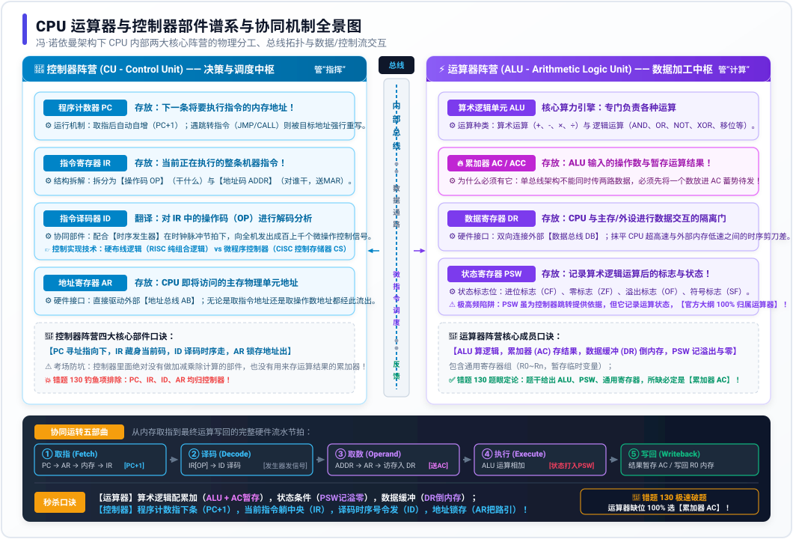

# 专题 15：CPU 运算器与控制器部件谱系与协同机制——底层透析

> **定位与使命**：CPU 内部部件划分与功能定性是软考《计算机组成与体系结构》（上午场 1~2 分）的必考常客，也是考生极易“张冠李戴”的重灾区。很多考生经常把**累加器 AC、状态寄存器 PSW、程序计数器 PC、指令寄存器 IR** 搞混，甚至误以为 PSW 和 AC 归控制器（如错题 130）。
> 本专题旨在基于**第一性原理**穿透冯·诺依曼计算机架构的控制流与数据流机制，通过**全景矢量架构图**，彻底理清运算器与控制器两大阵营的物理分工、交互通路、指令执行五步流水及考场避坑绝技。

---

## 1. 一语道破：两大阵营的核心分工哲学 (The Essence)

冯·诺依曼计算机体系结构的核心灵魂是**“存储程序、控制流驱动”**。中央处理器（CPU）作为计算机的心脏，其内部结构严格切分为两大阵营：

```
                              【中央处理器 CPU】
                                      ║
             ╔════════════════════════╩════════════════════════╗
             ▼                                                 ▼
    【运算器阵营 (ALU)】                               【控制器阵营 (CU)】
      负责“干体力活”                                     负责“发号施令”
      (数据加工、计算与状态记录)                          (取指、译码、寻址与时序调度)
    • 算术逻辑单元 ALU                                  • 程序计数器 PC
    • 累加寄存器 AC (暂存结果)                           • 指令寄存器 IR
    • 数据缓冲寄存器 DR (倒腾数据)                        • 指令译码器 ID
    • 状态条件寄存器 PSW (存运算标志)                     • 地址寄存器 AR / MAR
    • 通用寄存器组 R0~Rn                                • 时序发生器与控制逻辑
```

### 1.1 肌肉与计算器：运算器阵营 (Arithmetic Logic Unit)
* **本质**：纯粹的数据加工执行工厂。
* **行为模式**：它自身没有任何“自主意识”，绝不决定下一步干什么。它的唯一使命是：**等待控制器发来控制微信号，从指定寄存器取来操作数，执行算术或逻辑运算，把结果暂存起来，并将运算后的特征状态（是否溢出、是否为零）如实记录下来**。

### 1.2 大脑与指挥官：控制器阵营 (Control Unit)
* **本质**：全机的神经中枢与交通警察。
* **行为模式**：它自身不参与任何具体算术运算。它的唯一使命是：**按照时钟节拍，盯着乐谱（从内存取指令），看清指令要干啥（译码），吹响口哨指挥各个部件协调动作（发控制微信号），并随时记录下一曲的播放位置（PC 自增或跳转）**。

---

## 2. CPU 内部部件拓扑与总线协同架构图 (Visual Architecture)

下图清晰揭示了控制器（CU）与运算器（ALU）的内部部件拓扑、CPU 内部总线交互通路、外部系统总线接口，以及一条指令从取指到写回的完整生命周期流转：



---

## 3. 运算器四大金刚深度解剖 (The ALU Breakdown)

运算器负责处理所有算术与逻辑运算，其核心由以下关键部件构成：

### 3.1 算术逻辑单元（ALU - Arithmetic and Logic Unit）
* **核心使命**：整个 CPU 的运算动力引擎。
* **功能范畴**：
  1. **算术运算**：二进制加法、减法、乘法、除法；
  2. **逻辑运算**：与（AND）、或（OR）、非（NOT）、异或（XOR）；
  3. **辅助运算**：逻辑移位、算术移位、循环移位、求补码等。
* **物理特征**：纯组合逻辑电路，内部不具备记忆功能，输入撤销则输出消失。因此它的输入端和输出端必须由寄存器紧密锁存！

---

### 3.2 累加器（AC / ACC - Accumulator）【🔥 错题 130 题眼】
* **核心使命**：专门暂存 ALU 运算的输入操作数与运算输出结果。
* **为什么必须有它？（底层工程矛盾）**：
  - 在典型的单总线或双总线 CPU 内部架构中，无法在同一瞬间同时从总线送入两个操作数；
  - 必须先将**第一个操作数**从内存或寄存器读入 **AC（累加器）** 中“蓄势待发”；
  - 然后再将**第二个操作数**送入 ALU，ALU 立即将两者相加，并将**最终运算结果重新写回 AC**！
* **考场定性**：**累加器（AC）是运算器的绝对嫡系核心成员！**

---

### 3.3 数据缓冲寄存器（DR / MDR - Memory Data Register）
* **核心使命**：CPU 内部总线与外部【数据总线 DB】之间的双向隔离水闸。
* **功能机理**：
  - CPU 内部的时钟频率极高（GHz 级别），而主存（DRAM）的访问速度相对缓慢（纳秒级别）；
  - 从内存读取数据时，数据先在 DR 中锁存，待总线稳定后再送往 ALU 或其他寄存器；
  - 向内存写入数据时，待写入数据先在 DR 暂存，随后由 DR 驱动数据总线写回内存。

---

### 3.4 状态条件寄存器（PSW - Program Status Word）【⚠️ 极高频钓鱼陷阱】
* **核心使命**：保存算术逻辑运算后的特征状态标志以及当前 CPU 的工作状态。
* **内部标志位拆解**：
  1. **运算结果状态标志（由 ALU 操作直接打入）**：
     * **ZF（Zero Flag，零标志）**：运算结果为 0 时置 1，否则置 0；
     * **CF（Carry Flag，进位标志）**：最高有效位产生进位/借位时置 1；
     * **OF（Overflow Flag，溢出标志）**：补码运算产生符号溢出时置 1；
     * **SF / NF（Sign / Negative Flag，符号标志）**：结果为负数时置 1；
  2. **系统控制状态标志**：中断允许标志（IF）、陷入标志（TF）、CPU 工作模式（用户态 / 核心态）。
* **考场终极避坑**：
  - 很多考生认为：“控制器需要根据 ZF 是否为 0 决定是否跳转（如 `JZ` 指令），所以 PSW 应该归控制器？”——**大错特错！**
  - **PSW 记录的是 ALU 的运算生理指标！在软考官方大纲与历年真题中，状态寄存器（PSW）100% 坚定不移地划归【运算器】！**

---

### 3.5 通用寄存器组（General Purpose Registers，如 R0 ~ Rn）
* **核心使命**：CPU 内部的高速临时数据仓库。
* **功能**：用来暂存参与运算的操作数、中间临时变量、或作为基址/变址寻址的地址偏移行，程序员可通过汇编指令直接对其进行读写（如 `MOV AX, BX`）。

---

## 4. 控制器四大金刚深度解剖 (The CU Breakdown)

控制器是指令流的领航员，负责解释指令并生成微操作控制序列：

### 4.1 程序计数器（PC - Program Counter）
* **核心使命**：**永远存放“下一条将要执行指令的内存物理地址”**。
* **运转规律**：
  1. **顺序执行**：CPU 从内存取出当前指令后，硬件自增器自动执行 **$PC \leftarrow PC + 1$**（或加上当前指令字长字节数），自动指向下一条连续指令；
  2. **分支跳转 / 函数调用**：当执行条件转移指令（如 `JMP`、`JZ`、`CALL`）时，目标转移地址会被强行覆写写入 PC，打破线性执行流。

---

### 4.2 指令寄存器（IR - Instruction Register）
* **核心使命**：**暂存“当前正在执行的整条机器指令”**。
* **内部结构**：
  一条机器指令从内存被读入 IR 后，被物理拆分为两截：
  $$\text{IR} = [\text{操作码 OP}] + [\text{地址码 ADDR}]$$
  * **操作码（OP-Code）**：指明“干什么”（如加法、乘法、存盘、跳转），直接送往**指令译码器 ID**；
  * **地址码（Address）**：指明“对谁干”（操作数的内存地址或寄存器编号），送往**地址寄存器 AR** 或寻址计算部件。

---

### 4.3 指令译码器（ID - Instruction Decoder）
* **核心使命**：对 IR 中送来的**操作码（OP）**进行识别与翻译。
* **协同机制**：
  - ID 将二进制机器码（如 `0000 0001`）翻译成具体的语义信号（“这是加法指令”）；
  - 随后配合**时序发生器**（产生节拍脉冲 $T_0, T_1, T_2$），激活相应的门电路，产生一连串按精确时间先后顺序触发的**微操作控制信号（Micro-operations）**。

---

### 4.4 地址寄存器（AR / MAR - Memory Address Register）
* **核心使命**：锁存 CPU 即将访问的主存物理单元地址。
* **硬件接口**：它的输出端直接单向连接外部的【地址总线 AB】，用来寻址主存储器单元或外设端口。

---

### 4.5 控制器两大实现技术对比（软考高频辨析）

| 对比维度 | **硬布线控制器（Hardwired Control）** | **微程序控制器（Microprogrammed Control）** |
| :--- | :--- | :--- |
| **底层实现** | **纯硬件门电路与触发器**（组合逻辑网络） | **软件化硬件**（采用控制存储器 CS 存放微程序） |
| **核心特点** | 速度极快、延迟极低、结构扁平 | 规整、易扩展、修改指令集方便（类似写微代码） |
| **致命弱点** | 电路设计极其繁杂、修改或扩充指令极其困难 | 每次执行指令都要读控存（CS），速度明显慢于硬布线 |
| **架构归属** | **RISC（精简指令集计算机）的标配** | **CISC（复杂指令集计算机）的标配** |

---

## 5. 指令执行五步曲大贯通 (The End-to-End Cycle)

以一条最经典的加法指令 `ADD R0, [1000H]`（将内存 1000H 处的值与 R0 相加，结果存入 R0）为例，观察两大阵营的精密交响：

```
【时序流】        【参与部件与控制动作】                              【阵营归属】
   │
   ▼
① 取指阶段 ───►  1. PC 将当前指令地址送入 AR (MAR)                   (控制器)
 (Fetch)        2. 控制器通过地址总线寻址内存，发出“读”控制信号           (控制器)
                3. 内存将指令机器码经数据总线送入 DR (MDR)              (运算器缓冲)
                4. DR 将指令机器码打入 IR 保存                        (控制器)
                5. PC 自动执行自增：PC = PC + 1                     (控制器)
   │
   ▼
② 译码阶段 ───►  6. IR 将操作码 OP 送入 ID 译码                       (控制器)
 (Decode)       7. ID 识别出是 ADD 指令，时序发生器生成加法节拍微信号      (控制器)
   │
   ▼
③ 寻址取数 ───►  8. IR 将地址码 1000H 送入 AR                         (控制器)
 (Operand)      9. 再次访问内存，将 1000H 单元的操作数读入 DR           (运算器缓冲)
                10. 将 R0 的操作数预先送入累加器 AC                   (运算器)
   │
   ▼
④ 执行阶段 ───►  11. 控制器发出控制信号，ALU 将 AC 与 DR 的数据相加      (运算器)
 (Execute)      12. ALU 运算产生的结果更新至 PSW（记录是否溢出/为0）     (运算器)
   │
   ▼
⑤ 写回阶段 ───►  13. 运算结果最终从 ALU 写入 AC，并传送写回 R0 寄存器    (运算器)
 (Writeback)
```

**一语道破实质**：
* 阶段 ①②③ 的核心动作全由**控制器（PC、AR、IR、ID）**主导；
* 阶段 ④⑤ 的核心计算与暂存全由**运算器（ALU、AC、PSW、DR）**主导！

---

## 6. 软考真题决斗矩阵与考场秒杀口诀 (Cheat Sheet)

### 6.1 运算器 vs 控制器部件权威对决矩阵

| 部件全称 | 英文缩写 | 所属阵营 | 核心使命（考场特征词） | 经典做题陷阱识别 |
| :--- | :---: | :---: | :--- | :--- |
| **算术逻辑单元** | **ALU** | **运算器** | 负责所有算术逻辑运算 | 纯计算，无记忆功能 |
| **累加寄存器** | **AC / ACC** | **运算器** | **暂存操作数与 ALU 运算结果** | 💥 错题 130 题眼！绝非控制器！ |
| **数据缓冲寄存器** | **DR / MDR** | **运算器** | 隔离 CPU 与外部数据总线（暂存数据） | 存的是数据，不是地址 |
| **状态条件寄存器** | **PSW** | **运算器** | **记录运算结果状态（ZF/CF/OF/SF）** | ⚠️ 考题钓鱼常客！100% 归运算器！ |
| **通用寄存器组** | **R0~Rn** | **运算器** | 存放临时操作数与通用计算变量 | 用户可见，汇编可直接寻址 |
| **程序计数器** | **PC** | **控制器** | **存放下一条将要执行指令的地址** | 自带 +1 自增，跳转时被重写 |
| **指令寄存器** | **IR** | **控制器** | **存放当前正在执行的机器指令** | 拆为操作码 OP 与地址码 ADDR |
| **指令译码器** | **ID** | **控制器** | 对 IR 里的操作码进行翻译分析 | 配合时序产生控制信号 |
| **地址寄存器** | **AR / MAR** | **控制器** | 锁存 CPU 访问主存的物理地址 | 输出端接地址总线 AB |
| **时序发生器** | **TG** | **控制器** | 发出周期、节拍、工作脉冲时钟信号 | 产生微操作的前提基准 |

---

### 6.2 错题 130 考场秒杀逻辑全复盘

> **【真题】** CPU 中，运算器包括算术逻辑单元（ALU）、状态寄存器（PSW）、通用寄存器和（ ）。
> A. 累加器 (AC) ｜ B. 程序计数器 (PC) ｜ C. 指令寄存器 (IR) ｜ D. 指令译码器 (ID)

* **秒杀三步走**：
  1. 题干问的是：**运算器（ALU）**包括哪些成员；
  2. 选项扫描：
     - B 项 **PC**：指示下一条指令地址 $\to$ 控制器成员，枪毙！
     - C 项 **IR**：存当前正在执行的指令 $\to$ 控制器成员，枪毙！
     - D 项 **ID**：翻译指令操作码 $\to$ 控制器成员，枪毙！
  3. 唯有 A 项 **累加器（AC）** 专门给 ALU 暂存运算结果，纯正运算器嫡系，秒选 **A**！

---

### 6.3 考场 5 秒秒杀口诀（背诵即拿分）

> **算术逻辑配累加（ALU + AC），运算结果它暂存；**
> **状态条件（PSW）记溢零，数据缓冲（DR）倒内存；**
> **大批临时通用存，统统属于【运算器】！**
> 
> **程序计数指下条（PC），当前指令躺中央（IR）；**
> **译码时序号令发（ID），地址锁存（AR）把路引；**
> **指挥全场不干活，稳坐中军【控制器】！**
