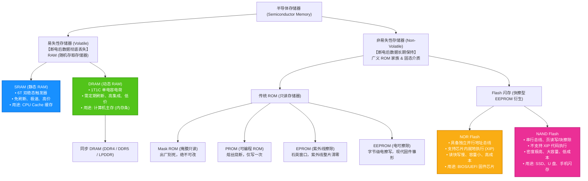
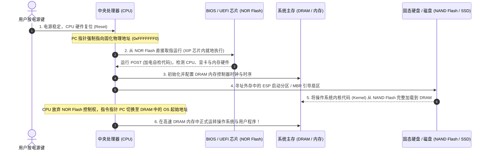

# 专题 17：ROM、RAM 与 Flash 存储体系演进与核心机理——底层透析

> **定位与使命**：存储体系是软考《计算机组成与体系结构》（上午场 1~2 分）的必考常客，也是极易因为概念混淆而丢分的重灾区。
> 很多考生对存储器的理解停留在“ROM 是只读、RAM 是随机读写、断电 RAM 丢数据而 ROM 不丢”的浅层口诀，但在面对微机底层架构、固件烧录、BIOS/UEFI 载体、SRAM/DRAM 物理特性以及现代固态存储 Flash 时，频繁掉入命题陷阱：
> * 为什么计算机主板上的 BIOS 芯片明明可以“刷固件”重新写入，软考大纲依然将其严格定性为 **ROM**？
> * 为什么手机宣传的“12GB 运行内存”是 RAM，而“512GB 机身存储”在商业口语中常被称为“ROM”，底层却属于 Flash 闪存？
> * 为什么 CPU 二级缓存（Cache）必须用 **SRAM**，而电脑内存条必须用 **DRAM**？DRAM 的“动态刷新”到底在刷什么？
> * Flash 闪存到底是 ROM 还是 RAM？NOR Flash 与 NAND Flash 的本质区别和考场选型是什么？
>
> 本专题立足**第一性原理**，从物理介质的微观构造讲起，纵贯半导体存储半个世纪的演进脉络，全面穿透 ROM、RAM 与 Flash 的物理本质、运行机理、存储金字塔层次以及考场绝杀口诀。

---

## 1. 终极一览：存储器大家族分类谱系图 (The Big Picture)

在现代计算机体系中，所有半导体存储器根据**断电后数据是否保留**，被严格切分为两大根本阵营：



---

## 2. 第一性原理：解构 RAM 的本质与双雄决斗 (SRAM vs DRAM)

### 2.1 什么是 RAM？“随机存取”的真实含义
* **英文全称**：Random Access Memory（随机存取存储器）。
* **核心哲学**：**“存取时间与物理存储单元的物理位置完全无关”**！
  * 对比磁带（顺序存取 Sequential Access）：想读磁带第 100 分钟的内容，必须从第 1 分钟快进过去，耗时随位置后移线性激增；
  * 而 RAM 拥有完整的行/列地址译码器，无论访问地址 `0x00000000` 还是 `0xFFFFFFFF`，时序延迟**严格恒定**。
* **物理特征**：基于半导体开关电路维持状态，**只要断电，电荷或稳态瞬间归零，数据全部化为乌有（易失性）**。

---

### 2.2 SRAM（静态 RAM）：超跑级极速 Cache 核心
* **微观物理机制**：
  * 每个位元由 **4~6 个晶体管（通常为 6T）** 构成**双稳态触发器（Flip-Flop）**；
  * 利用反相器交叉耦合的正反馈特性，形成“0态”与“1态”两个自锁稳定状态。
* **核心运行特征**：
  * **免刷新（Static 静态的真谛）**：只要电源供应不中断，触发器的自锁状态就能永久维持，**不需要任何周期性刷新电路**；
  * **极限速度**：读写仅需几纳秒（ns），能直接跟上 CPU 几 GHz 的主频脉冲；
  * **致命弱点**：一个 bit 需要 6 个晶体管，占用硅片面积巨大，导致**集成度极低、发热大、功耗高、价格昂贵**。
* **系统物理宿命**：做不大容量，只能作为 CPU 内部的 **L1 / L2 / L3 高速缓冲存储器（Cache）** 及寄存器。

---

### 2.3 DRAM（动态 RAM）：大巴级海量主存基石
* **微观物理机制**：
  * 每个位元极其精简，仅由 **1 个晶体管 + 1 个微型电容（1T1C 结构）** 构成；
  * 电容有电荷代表二进制 `1`，无电荷代表二进制 `0`。
* **核心运行特征**：
  * **极限集成度与低成本**：1 个位元只要 1 个电容，硅片利用率极高，能在小体积内轻松堆出几十 GB 的容量，成本极低；
  * **痛点根源——电荷泄露与动态刷新（Dynamic 动态的真谛）**：
    * 微型电容容量仅有飞法级（fF），绝缘层存在物理漏电流；
    * 写入的电荷在几毫秒到几十毫秒内就会漏光丢失！
    * **因此系统必须专门配备刷新电路，定期将电容里的电荷读出并重新充满（动态刷新 Refresh）**。
* **DRAM 刷新的三大考点常识**：
  1. **集中刷新**：在一个刷新周期内，专门拿出一段固定时间对所有行集中连续刷新，此时主存无法响应 CPU 访存，称为**“访存死区（Dead Zone）”**；
  2. **分散刷新**：将每个存储周期拉长（前半段读写、后半段刷新），无死区但系统工作节奏变慢；
  3. **异步刷新**：将刷新周期均分给每一行，既缩短了死区，又保证了芯片利用率（最常用工程方案）。
* **破坏性读出（Destructive Readout）**：
  * DRAM 在读取电容电荷时，电荷会流入位线被中和，导致原电容电荷丢失；
  * 因此 DRAM 的**存储周期（Memory Cycle）必须包含“读出时间 + 预充电/恢复时间（Precharge）”**，这也是 DRAM 存取速度远慢于 SRAM 的物理根因。
* **系统物理宿命**：**主存储器（系统内存条，如 DDR4/DDR5/LPDDR）**。

---

### 2.4 SRAM vs DRAM 考场横向决斗对照矩阵

| 比较维度 | SRAM (静态随机存储器) | DRAM (动态随机存储器) | 考场陷阱与秒杀特征 |
| :--- | :--- | :--- | :--- |
| **微观存储元** | **双稳态触发器 (6T 晶体管)** | **电容电荷 (1T1C)** | 触发器不漏电，电容必漏电 |
| **定期刷新需求** | **完全不需要** | **必须定期刷新** (几毫秒一次) | 题干出现“需动态刷新/刷新周期” $\to$ 必选 DRAM |
| **存取速度** | **极快** (1 ~ 5 ns) | **相对较慢** (数十 ns) | SRAM 能跟上 CPU 时钟节拍 |
| **读出方式** | 非破坏性读出 | **破坏性读出** (需预充电恢复) | DRAM 读完后内部必须重新写回充电 |
| **集成度 (单芯片容量)**| **极低** (做大面积暴增) | **极高** (结构紧凑密度极大) | 内存条数十 GB 用 DRAM，Cache 几 MB 用 SRAM |
| **功耗与发热** | 较大 (静态漏电与高频开关) | 较低 (电容静态耗电极小) | 大容量若用 SRAM 发热会烧穿芯片 |
| **制造成本** | **昂贵** | **低廉** | 成本差距达数十倍 |
| **系统架构应用** | **Cache (一级/二级/三级缓存)** | **主存储器 (Main Memory / 内存条)** | 核心考点：硬件选型张冠李戴（常考） |

> 🎯 **秒杀助记**：  
> **SRAM 是豪华超跑：快、贵、费油（功耗大）、车厢小（容量低集成度低）、免保养（不刷新） $\to$ 跑在 Cache 赛道；**  
> **DRAM 是公共大巴：慢、便宜、装得多（容量大集成度高）、经常要进站加油保养（必须动态刷新） $\to$ 跑在内存主存赛道！**

---

## 3. 历史演进：ROM 家族的代际变迁与“只读”名义的蜕变

### 3.1 什么是 ROM？
* **英文全称**：Read-Only Memory（只读存储器）。
* **核心哲学**：**“非易失性（Non-Volatile）——断电后存储的内容长久保留、不发生丢失”**。
* **为什么叫“只读”？**：
  * 在计算机诞生的早期，硬件技术限制使得向非易失介质写入数据需要高电压或物理刻录，平时计算机在正常工作电平下只能对其执行**读操作**，因而定名为“只读存储器”；
  * 随着技术发展，现代 ROM 已经能够通过电信号擦除和写入，但由于其主要承载**出厂配置、启动代码、底层固件**等“以读为主、极少改写、掉电保真”的数据，在体系结构分类中依然统称为 **ROM 家族**。

---

### 3.2 ROM 演进四代族谱

```
  【第一代: Mask ROM (掩膜 ROM)】
     └─ 芯片制造厂光刻铜线，数据熔死在芯片里，出厂即定型，一次也不能修改（成本极低但废品率高）。
           ▼
  【第二代: PROM (可编程 ROM)】
     └─ 采用“熔丝（Fuse）”工艺。出厂全为 1，用户买回后用专用编程器输入高电压打断熔丝变成 0。
        【特点】：只能写一次（OTP - One Time Programmable），写错芯片直接报废！
           ▼
  【第三代: EPROM (紫外线擦除可编程 ROM)】
     └─ 芯片表面开有一个透明的“石英玻璃小窗口”。
        【特点】：需要修改时，揭开遮光贴纸，用【紫外线高能光束】照射 15~20 分钟，将内部电荷中和全部复原为 1；
        然后重新用电烧录。必须整片全部擦除，无法局部修改，且需要从电路板上拔下来操作。
           ▼
  【第四代: EEPROM / E²PROM (电可擦除可编程 ROM)】
     └─ 利用量子力学“Fowler-Nordheim 隧道效应”通过高电平注放电荷。
        【特点】：彻底告别紫外线！在电路板上直接通过【加电脉冲】即可按【字节（Byte）】为单位擦除和改写。
        改写极为方便，寿命通常在数万次至百万次，成为了现代微控制器小容量参数存储和早期 BIOS 的标准载体！
```

---

## 4. 革命跃迁：Flash 闪存的崛起与底层机制

### 4.1 Flash 闪存是什么？
* **定义**：Flash 存储器（闪存）是 1980 年代由东芝工程师发明、基于 **EEPROM 深度改进** 的非易失性半导体存储器。
* **对 EEPROM 的革命性颠覆**：
  * 传统 EEPROM 采用按“字节（Byte）”擦除，每个存储单元需要配置额外的选通晶体管，导致集成度做不高、大容量极贵；
  * Flash 引入了**“块（Block）擦除”**机制，极大简化了内部晶体管拓扑，实现了与 DRAM 媲美的高集成度，兼具了 **非易失性（掉电不丢） + 大容量 + 电可擦除** 的全部优点！

---

### 4.2 闪存核心物理法则与三大铁律（软考高频命题靶点）

1. 🚨 **铁律 1：写前必须先擦除（Erase before Write）**
   * 闪存的物理单元未写入时全部处于逻辑 `1` 状态；
   * 写入数据只能将 `1` 翻转改写为 `0`，**绝不能直接把 `0` 覆盖写回 `1`**！
   * 如果某个物理单元已经是 `0`，要写入新数据，必须**先执行擦除操作将整片区域重新恢复为 `1`**，然后再执行写入。
2. 🚨 **铁律 2：读写与擦除的非对称粒度（按页写、按块擦）**
   * **读 / 写基本单位**：以**页（Page，通常 4KB ~ 16KB）**为最小单位操作；
   * **擦除基本单位**：以**块（Block，通常由 128 ~ 512 个 Page 组成，数 MB 规模）**为最小单位整体擦除！
   * 这也是固态硬盘 SSD 会产生“写入放大（Write Amplification）”和需要垃圾回收（GC / TRIM）的底层根因。
3. 🚨 **铁律 3：磨损与 P/E 周期上限（寿命约束）**
   * 每次擦除都需要强电场注入/拔出浮栅氧化层，氧化绝缘层会逐步老化破损；
   * 因此 Flash 存在固定的 **P/E（Program/Erase）擦写寿命上限**（SLC 约 10 万次，MLC 约数千次，TLC 约数百至上千次，QLC 仅数百次）；
   * 系统底层必须配备**磨损均衡算法（Wear Leveling）**，让全盘各个块平均消耗寿命。

---

### 4.3 NOR Flash vs NAND Flash 考场绝杀大决斗

Flash 闪存在物理拓扑上分化为两条截然不同的演进路线：**NOR（或非门结构）** 与 **NAND（与非门结构）**。软考对此的辨析考查极为刁钻：

| 决斗维度 | NOR Flash (或非门闪存) | NAND Flash (与非门闪存) | 底层机理与命题陷阱 |
| :--- | :--- | :--- | :--- |
| **总线接口** | **带完整独立的并行地址线与数据线** | 仅有复用的 I/O 总线 (串行/分时传输) | NOR 像 SRAM 一样挂在系统总线上 |
| **芯片内就地执行 (XIP)** | **支持 (XIP - eXecute In Place)** | **绝不支持 XIP** | **🔥 核心考点：CPU 指令指针可直接跳入 NOR 内部逐条取指运行！** |
| **随机读取速度** | **极快** (几十纳秒级，支持按字节随机读) | 较慢 (必须整页预读入缓存，微秒级) | NOR 适合放启动指令，NAND 适合大吞吐 |
| **写入与擦除速度** | **极慢** (擦除需数秒) | **极快** (毫秒级整块清零) | NOR 写数据极其痛苦，NAND 专为高速写设计 |
| **存储密度与容量** | **低** (单芯片多为几 MB ~ 64 MB) | **极高** (单芯片达数十 GB ~ 数 TB) | NAND 每个单元占地仅为 NOR 的几分之一 |
| **制造成本** | **昂贵** (单位容量成本高) | **极其低廉** | NAND 具备颠覆机械硬盘的成本优势 |
| **坏块率 (Bad Blocks)** | 极低，出厂几乎无坏块 | 出厂即存在坏块，生命周期中会新增 | NAND 必须依赖 ECC 校验与主控管理 |
| **经典硬件载体与应用** | **主板 BIOS / UEFI 芯片、路由器 Bootloader、嵌入式系统启动代码** | **SSD 固态硬盘、U 盘、手机机身存储 (eMMC/UFS)、SD 卡** | **软考定性：主板 BIOS 芯片硬件本质就是 NOR Flash！** |

---

## 5. 迷雾拨清：微机系统中的“四大常识误区”深度透析

### 5.1 误区 1：BIOS 芯片明明可以刷固件，为什么大纲还称其为“ROM”？
* **真实底层**：
  * 早期 IBM PC 的 BIOS 确实烧录在不可修改的 Mask ROM 或 EPROM 中；
  * 现代微机主板上的 BIOS / UEFI 芯片，**物理芯片 100% 都是 NOR Flash 芯片**（支持通过专用刷机程序在系统内重新烧写）；
* **学术定性根因**：
  * 在计算机体系结构规范中，它承载的是最底层的自检程序（POST）和硬件引导代码；
  * 在计算机常规开机运转中，它**绝对不允许普通应用程序写入**，CPU 仅对其执行只读指令提取；
  * 且它具有**非易失性（掉电后 BIOS 配置与代码不丢）**，因此在考纲与学术体系中，它依然被称为 **ROM（系统只读存储器）**。

---

### 5.2 误区 2：手机厂商标称“12G + 512G（RAM + ROM）”，这 512G 是真的 ROM 吗？
* **真实底层**：
  * 手机参数里的“12G RAM”是指高速的 **LPDDR 运行内存**；
  * 手机参数里的“512G ROM”**根本不是传统意义的 ROM**！它的硬件本质是基于 **NAND Flash 颗粒的集成闪存芯片（如 UFS 4.0 或 eMMC）**，在体系结构中属于**辅存 / 外存**（类似于电脑的 SSD 固态硬盘）；
* **商业叫法根因**：
  * 厂商借用了“ROM 掉电不丢数据”的通俗心智，将机身永久存储包装为“ROM”，属于**工程商业口语的借词**，绝非计算机科学的规范定义！

---

### 5.3 误区 3：Cache 为什么不用 DRAM 降成本？内存为什么不用 SRAM 提速？
* **底层博弈铁律**：
  * 如果 Cache 用 DRAM：DRAM 读一次要几十纳秒，还要定期停工刷新，根本跑不赢几 GHz 的 CPU，完全起不到“平抑 CPU 与主存速度鸿沟”的缓冲目的；
  * 如果内存用 SRAM：16GB 的 SRAM 芯片需要几百亿个晶体管，芯片面积将大如桌面，功耗发热能把主板融化，且造价高达数万元，在工程物理上根本不成立！
  * **结论：SRAM 做 Cache、DRAM 做内存，是物理定律、晶体管特性与商业成本三方妥协的最佳帕累托最优解。**

---

### 5.4 误区 4：闪存（Flash）能否直接取代内存（DRAM）实现“不断电内存”？
* **底层瓶颈**：
  1. **寿命瓶颈**：DRAM 内存每秒被 CPU 读写数百万次，无寿命限制；Flash 只要写入几十万次氧化层就会击穿报废；
  2. **读写机制瓶颈**：DRAM 支持任意字节随时覆盖写入；Flash 必须“整块擦除、整页写入”，写入延迟以微秒/毫秒计，比 DRAM 慢上千倍；
  3. **XIP 瓶颈**：主流海量存储是 NAND Flash，CPU 根本无法在其上直接执行代码。

---

## 6. 现代计算机存储体系全景金字塔与冷启动生命周期

### 6.1 计算机存储金字塔拓扑（层次越往上速度越快/成本越高/容量越小）

```
                     ▲
                    / \
                   /   \
                  / CPU \       [寄存器组 Register]  ~0.5 ns
                 / 寄存器\
                /─────────\
               /  CPU 缓存 \     [Cache: SRAM]  ~1-5 ns  (几 MB)
              /  (SRAM)    \
             /───────────────\
            /    主存储器     \   [主存: DRAM / DDR]  ~50-100 ns  (几十 GB)
           /     (DRAM)        \
          /─────────────────────\
         /       辅存储器        \ [固态硬盘 SSD / U盘: NAND Flash] ~微秒级 (几百 GB ~ 数 TB)
        /     (NAND Flash)       \
       /───────────────────────────\
      /          海量外存           \ [机械硬盘 HDD / 磁带 Tape / 蓝光] ~毫秒级 (数十 TB)
     /───────────────────────────────\
```

---

### 6.2 计算机冷启动（Power-On）全流程中各类存储器的接力协同



---

## 7. 软考考场真题秒杀口诀军火库

> 🚀 **【易失性定性】**：**RAM 掉电全蒸发（易失性），ROM 掉电稳如山（非易失）；断电丢不丢，全看 R 后面跟 A 还是跟 O！**  
> 🚀 **【SRAM vs DRAM 决斗】**：**SRAM 是超跑（Cache）：快、贵、免刷新；DRAM 是大巴（内存）：慢、挤（集成高）、电容漏电必须刷！**  
> 🚀 **【微机 BIOS 定性】**：**BIOS 芯片归 ROM，掉电不丢存启动；物理原形 NOR 闪存，支持 XIP 芯片跑！**  
> 🚀 **【Flash 物理铁律】**：**写前必先整块擦，整页读写寿命限；NOR 带总线可就地（XIP），NAND 没总线装固态（SSD）！**  
> 🚀 **【破坏性读出】**：**DRAM 电容读出即中和，存储周期必带预充电；SRAM 触发器无所谓，读写随心不用防！**  
