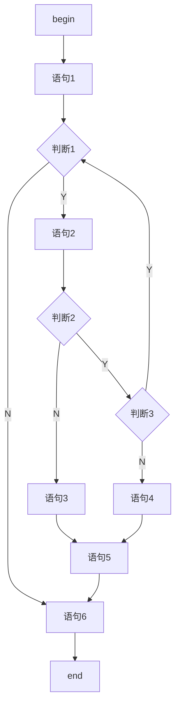

# 19. McCabe 环路复杂度计算法则与实战：底层透析

## 一、什么是 McCabe 环路复杂度？
在软件测试（尤其是白盒测试）中，**McCabe 环路复杂度（Cyclomatic Complexity）** 是用来衡量一个程序模块“逻辑复杂程度”的定量指标。
用最通俗的话说，它代表了程序里**“基本独立路径”的数量**。复杂度越高，代码的控制流越分支错综复杂，出错的概率越大，需要的测试用例也就越多。

---

## 二、软考三大计算公式（必杀技）

在软考中，计算 McCabe 复杂度 $V(G)$ 有三个等效公式。掌握第三个“闭眼秒杀公式”，就能在考场上 3 秒出答案。

### 1. 经典图论公式：$V(G) = E - N + 2$
*   **$E$ (Edges)**：控制流图中的边数（箭头的数量）。
*   **$N$ (Nodes)**：控制流图中的节点数（框框的数量，包括起点和终点）。
*   **痛点**：在考场上，数线段和数节点极其容易眼花数错，一旦多画或少画一条线，整题崩溃。**【强烈不建议在实战中使用】**。

### 2. 区域计算公式：$V(G) = R$ 
*   **$R$ (Regions)**：控制流图将平面切割成的区域总数。
*   **计算法**：找到图中所有**封闭的闭环区域（包含边和节点包围的内部面积）**，然后**加上图外边那个无限大的外部区域**（通常记忆为 $封闭区域数 + 1$）。
*   **痛点**：遇到线条交叉复杂的图，很难一眼看清有几个封闭平面。

### 3. 终极秒杀公式（也就是口诀）：$V(G) = P + 1$
*   **$P$ (Predicate Nodes)**：**判定节点**的数量。
*   **什么是判定节点？** 
    *   在**流程图**中：只要是从一个节点**射出 2 条（或多条）箭头**的节点，就是判定节点（通常画成**菱形框**，代表 `Y/N` 或 `True/False` 分支）。
    *   在**代码**中：遇到 `if`、`while`、`for`、`case` 等关键字，就是一个判定节点。
*   **为什么是 P + 1？**
    *   **第一性原理**：一段没有任何分支的直线代码，它有一条主路径（复杂度为 1）。每当你在代码里增加一个条件判断（比如 `if`），程序就会在这个点“分叉”出一条新的支路，总路径数就会 $+1$。
    *   所以，不管图怎么画，不管循环怎么绕，**基本路径的总数永远等于分叉点的数量加上那条原始的主路（即 $P+1$）**。

---

## 三、实战演练：验证 "P + 1" 的绝对统治力

我们用你在 [错题 165] 中遇到的流程图来验证一下。



### 方法 1：用傻瓜式 $E - N + 2$（极易出错）
*   **节点 $N$**：数一数，begin、语句1、判断1、语句2、判断2、判断3、语句3、语句4、语句5、语句6、end。总计 **11 个节点**。
*   **边数 $E$**：数箭头。总计 **13 条边**。
*   **计算**：$V(G) = 13 - 11 + 2 = \mathbf{4}$。
*   *评价：考场上心跳加速时，极容易把边数漏掉一条。*

### 方法 2：用终极秒杀公式 $V(G) = P + 1$（3 秒出结果）
1.  **扫描图中的“分叉点”**（即引出 $\ge 2$ 条线的节点）：
    *   分叉点 1：**判断1**（引出 N 和 Y）
    *   分叉点 2：**判断2**（引出 N 和 Y）
    *   分叉点 3：**判断3**（引出 N 和 Y）
2.  判定节点数 $P = 3$。
3.  **计算**：$V(G) = P + 1 = 3 + 1 = \mathbf{4}$。
*   *评价：根本不需要数乱七八糟的赋值语句框和交错的箭头，甚至图都可以不看完，直接数菱形（判断）数量加一，百分百正确！*

---

## 四、特别警告：P 的计数陷阱（复合条件表达式）

在软考下午的代码填空题或高级题型中，有时会给你一段代码而不是流程图。此时一定要注意**复合条件**！

**场景**：
```c
if (A > 0 && B < 5) {
    // do something
}
```

**陷阱**：很多人看到只有一个 `if`，就认为 $P = 1$。这是**错的**！
*   **底层逻辑**：在大多数编程语言中，`&&`（逻辑与）和 `||`（逻辑或）具有**短路计算（Short-circuit evaluation）**特性。
*   实际上，编译器会把它拆解成两个嵌套的判断：
    1.  先判断 `A > 0`。如果假，直接跳出。
    2.  如果真，再判断 `B < 5`。
*   **结论**：在复合条件表达式中，**每个逻辑运算符（`AND` / `OR`）都要额外提供一个判定节点（分叉）**！
*   因此，上述代码的 $P = 2$（一个给 `if`，一个给 `&&`），其 McCabe 复杂度 $V(G) = 2 + 1 = 3$。

---

## 五、总结与错题联动回归

回到你之前错的 [错题 165]（全路径覆盖 vs McCabe 复杂度陷阱）：

*   **McCabe 复杂度（基本路径数）**：不管图里有没有死循环、不管循环能不能走无数次，McCabe 只看**静态结构的分叉点**。图里有 3 个判断框，所以必定是 **3 + 1 = 4**。它衡量的是“你要想把所有独立的代码分支都至少测一次，最少需要 4 个用例”。
*   **覆盖所有路径**：要求把所有首尾相连的动态路线组合走遍。当存在循环时，必须考虑“循环不执行（0次）”带来的出口路径组合，加上“循环执行（1次）”带来的路径组合，所以得出 $3 + 3 = 6$ 条。

**只要记住第一性原理：一条马路（1），每多一个岔路口（P），终点就多一条基本分岔路线（P+1）。这就是 McCabe 永远 P+1 的底牌。**
