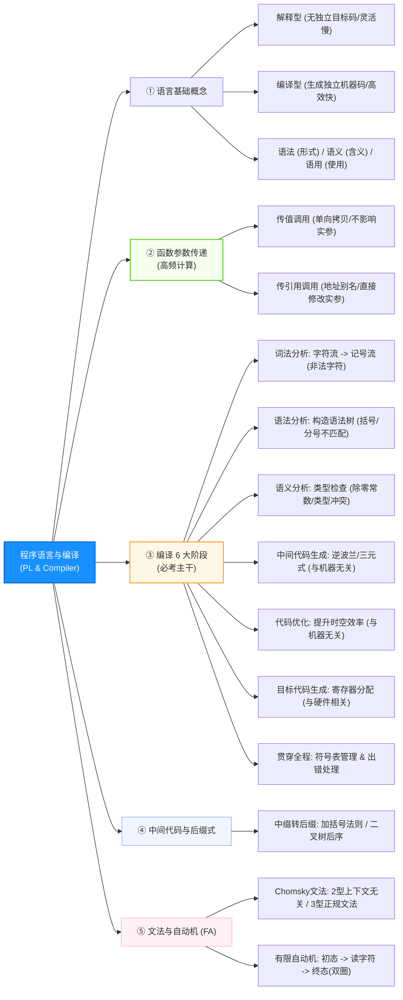

# 软件设计师通关速记文档：程序设计语言与编译原理篇

> **所属模块**：软考中级《软件设计师》—— 程序设计语言与编译程序基本原理（文老师教育讲义核心提炼）  
> **提炼规范**：`ruankao-fast-pass` 体系化通关标准（从左到右思维导图 + 80/20 剪枝）

---

## 维度 1：【分值画像与战略定级】

| 考核维度 | 分值权重 | 考点分布与题型特点 |
| :--- | :--- | :--- |
| **上午场（综合知识）** | **3 ~ 5 分** | 必考单选（通常集中在第 48~52 题附近）。主要考查：**编译6阶段与对应错误类型、传值与传引用计算跟踪、后缀式（逆波兰）、有限自动机（DFA/NFA）识别**。 |
| **下午场（应用技术）** | **间接影响（0直接分值）** | 下午试题不直接考编译原理，但**“传值 vs 传引用”**是试题四/五/六读懂 C++/Java 代码并做对填空题的前提。 |
| **性价比评星** | **★★★★☆（四星高分定心丸）** | 考点极度收敛，**几乎无拔高题**。只要掌握几个固定套路（加括号求后缀式、带初态走到终态判自动机），3~5 分全拿。 |

> **通关战略建议**：  
> **不看复杂的文法产生式理论推导！** 重点背熟“编译阶段与错误对应表”，掌握“代入特殊串验证法”，编译原理是上午题送分专区。

---

## 维度 2：【知识脉络脑图与核心辨析矩阵】

### 1. 本章知识脉络全景 Mermaid 脑图（从左至右思维导图）



---

### 2. 核心辨析矩阵（上午题秒杀利器）

#### 矩阵 1：编译各阶段任务与“错误类型”精准定位表（必考！）

| 编译阶段 | 核心任务 | 输入 $\to$ 输出 | 检出的错误类型（考题题眼） |
| :--- | :--- | :--- | :--- |
| **词法分析** | 扫描源程序字符，识别出单个单词符号（Token） | 字符流 $\to$ **记号流（Token）** | **非法字符**、拼写错误的关键字/标识符 |
| **语法分析** | 根据语法规则，将单词符号组织成各类语法短语（语句/表达式） | 记号流 $\to$ **语法分析树** | **结构非法**、括号不匹配、缺少分号、`if-else` 不配对 |
| **语义分析** | 审查上下文相关性与逻辑合法性，进行**类型审查** | 语法树 $\to$ 属性语法树 | **类型不匹配**、运算符与操作数冲突、除数为常数 0 |
| **中间代码生成** | 生成与具体硬件机器无关的中间语言（后缀式、四元式、树） | 语法/语义结构 $\to$ **中间代码** | 便于跨平台移植与独立代码优化 |
| **代码优化** | 对中间代码进行等价变换，减少执行时间和空间占用 | 中间代码 $\to$ 优化后代码 | 公共子表达式提取、循环不变式外提（**与机器无关**） |
| **目标代码生成** | 将中间代码转为具体硬件平台的机器指令或汇编指令 | 优化代码 $\to$ **机器/汇编代码** | 寄存器分配、寻址方式选择（**与机器硬件强相关**） |

> **🔥 黄金考点**：**符号表管理** 和 **出错处理** 贯穿于编译程序的**所有阶段**！

---

#### 矩阵 2：解释程序 vs 编译程序

| 比较维度 | 编译程序（Compiler，如 C/C++） | 解释程序（Interpreter，如 Python/JS） |
| :--- | :--- | :--- |
| **是否生成独立目标程序** | **生成**（直接输出 `.exe` / 机器指令） | **不生成**（直接边逐条翻译边执行） |
| **执行速度** | **快**（脱离源程序和编译器直接跑） | **慢**（每次运行都需重新解释） |
| **跨平台性** | 弱（编译出的机器码绑定特定 CPU） | **强**（只要目标平台有对应解释器即可） |
| **调试与交互性** | 较复杂 | **友好**（逐条运行，易于断点交互调试） |

---

#### 矩阵 3：传值调用 vs 传引用调用（真题必有 1 题）

| 传递方式 | 概念本质 | 函数内修改形参后 | 题干辨析口诀 |
| :--- | :--- | :--- | :--- |
| **传值调用 (Call by Value)** | 将实参的**数值副本**传递给形参 | 形参发生改变，**原实参绝对不变** | **单向传递，各回各家** |
| **传引用调用 (Call by Reference)** | 将实参的**内存地址**传给形参，形参是实参的**别名** | 形参发生改变，**原实参同步改变** | **血脉相连，改一改全** |

---

## 维度 3：【核心计算题型与图表秒杀靶点】

### 1. 中缀表达式转后缀表达式（逆波兰式）——“加括号法”秒杀！
* **题型常考**：求表达式 `(a - b) * (c + d)` 的后缀表达式。
* **秒杀三步法则（绝不画栈，直接手工推）**：
  1. **完全加括号**：根据算术优先级，为所有运算符打上括号：
     $$\Big( (a - b) * (c + d) \Big)$$
  2. **运算符后移**：把每个括号内的运算符**挪到该括号的右外侧**：
     $$\Big( (a \; b)- \; (c \; d)+ \Big)*$$
  3. **抹去所有括号**：
     $$a \; b - c \; d + *$$
* *同理，前缀式则是将运算符挪到左外侧：`* - a b + c d`。*

---

### 2. 函数传值 vs 传引用跟踪计算套路
* **真题典型模型**：
  ```c
  void swap(int x, int &y) { // x 是传值，y 是传引用
      x = x + 1;
      y = y + 1;
  }
  int main() {
      int a = 2, b = 5;
      swap(a, b);
      printf("%d, %d", a, b); // a 依然是 2；b 变成 6！
  }
  ```
* **考场秘诀**：在草稿纸上圈出形参前带 `&` 或说明是“引用”的变量，唯有这些变量在函数调用结束后**把新值带回主函数**！

---

### 3. 有限自动机（DFA / NFA）识别串——“走迷宫带入法”
* **核心结构**：
  * 单圈圆圈：中间普通状态；
  * 带箭头的入口：初始状态（$S_0$）；
  * **双圈圆圈**：**终态 / 接受状态**（必须在此状态结束，串才算被识别！）。
* **考题解法（选项带入排除法）**：
  * 将 A、B、C、D 四个选项的字符串字符依次输入自动机；
  * 如果走到最后一个字符时，停在**双圈终态**，则该串合法；
  * 如果中途无路可走，或输入结束时停在单圈非终态，**立即排除**！

---

### 4. Chomsky 文法 4 大分类阶梯

| 文法类别 | 别名 | 典型约束特点 | 对应自动机 | 软考关联点 |
| :--- | :--- | :--- | :--- | :--- |
| **0 型文法** | 短语结构文法 | 无任何限制（产生式左边至少含一个非终结符） | 图灵机 | 最原始文法 |
| **1 型文法** | 上下文有关文法 | 产生式右部长度 $\ge$ 左部长度（不能产生更短串） | 线性有界自动机 | 很少涉及 |
| **2 型文法** | **上下文无关文法** | 产生式左部**只能是单个非终结符**（$A \to \alpha$） | 下推自动机 | **多数程序设计语言的语法结构** |
| **3 型文法** | **正规文法 / 正规式** | 左部单非终结符，右部最多一个非终结符且在最右（或最左） | **有限自动机 (DFA/NFA)** | **用于词法分析中的单词识别** |

---

## 维度 4：【极速小抄与记忆桩（Memory Pegs）】

### 1. 通关押韵口诀（考场条件反射）

> **【编译错误定位口诀】**  
> **“拼写非法看词法，括号分号查语法；类型除零看语义，死循环是动态错！”**  
> *解析：拼写错误是词法；结构性缺失是语法；类型不匹配与静态除以常数0是语义分析；动态死循环与除以变量0只能在运行时暴露。*

> **【解释与编译区别口诀】**  
> **“编译独立出目标，脱手飞奔效率高；解释逐条不生码，跨平台好调试妙！”**  
> *解析：编译生成目标程序；解释不生成目标代码。*

> **【后缀表达式口诀】**  
> **“先加全括号，符号右边靠，抹掉括号后，后缀秒出套！”**  

---

### 2. 考前避坑 3 戒律
1. **死循环不属于静态语义错误**：死循环是**动态语义错误（运行期）**，编译阶段绝对无法静态检测出来！
2. **符号表不是只在某个阶段存在**：符号表在词法阶段建立，在后续所有分析和代码生成中不断被查询和回填。
3. **正规式闭包符号的区别**：$a^*$ 表示 $0$ 个或多个 $a$（包括空串 $\epsilon$）；$a^+$ 表示至少 $1$ 个 $a$；$a|b$ 表示选其一。

---

## 维度 5：【经典真题闭环自测与 Anki 闪卡库】

### 1. 经典真题速杀演练

* **【真题 1（编译错误定位）】** 编译器在（ ）阶段进行类型检查，若程序中存在括号不匹配，则会在（ ）阶段报错。  
  * **10秒破题**：类型检查属于逻辑关系审查，属于**语义分析**；括号不配对属于句子结构问题，属于**语法分析**。

* **【真题 2（参数传递综合跟踪）】** 设函数 `f(x)` 执行 `x = x * 2; return x;`，变量 `a = 3; b = f(a) + a;`。若采用传值调用，则 `b` 的值为（ ）；若采用引用调用，则 `b` 的值为（ ）。  
  * **10秒破题**：
    * **传值调用**：`f(a)` 内部 `x` 变为 6 并返回 6，原 `a` 保持 3 不变，`b = 6 + 3 = 9`。
    * **引用调用**：`f(a)` 内部修改使得 `a` 自身变成了 6，返回 6，此时原表达式后半部分的 `a` 已经变成 6，`b = 6 + 6 = 12`。

---

### 2. 📇 Anki 闪卡库（可直接复制导入）

| 正面（Front: 核心考点提问） | 反面（Back: 核心答案与记忆桩） | 标签（Tags） |
| :--- | :--- | :--- |
| 解释程序和编译程序最本质的区别是什么？ | 是否**生成独立的目标代码文件**。<br>（编译生成，解释不生成） | 软考::编译原理::程序语言 |
| 编译过程中，符号表管理和出错处理在哪些阶段运行？ | **贯穿于编译的所有阶段**（从词法到目标代码全程参与）。 | 软考::编译原理::编译阶段 |
| 括号不配对、缺少分号属于编译的什么错误？ | **语法错误**（语法分析阶段检出）。 | 软考::编译原理::错误定位 |
| 变量类型不兼容、除数为常数0属于编译的什么错误？ | **静态语义错误**（语义分析阶段检出）。 | 软考::编译原理::错误定位 |
| 传值调用与引用调用对原实参影响的核心区别是？ | 传值调用**不改变**原实参；引用调用直接**改变**原实参。 | 软考::编译原理::参数传递 |
| 多数高级程序设计语言的语法结构属于哪一类 Chomsky 文法？ | **2 型文法（上下文无关文法）**。 | 软考::编译原理::文法分类 |
| 词法分析识别单词所依赖的理论工具是？ | **3 型文法（正规文法）** 与 **有限自动机（DFA/NFA）**。 | 软考::编译原理::自动机 |
| 表达式 `a*(b+c)-d` 的后缀表达式（逆波兰式）是？ | **`abc+*d-`**<br>（括号法：`((a*(b+c))-d) -> abc+*d-`） | 软考::编译原理::逆波兰式 |
