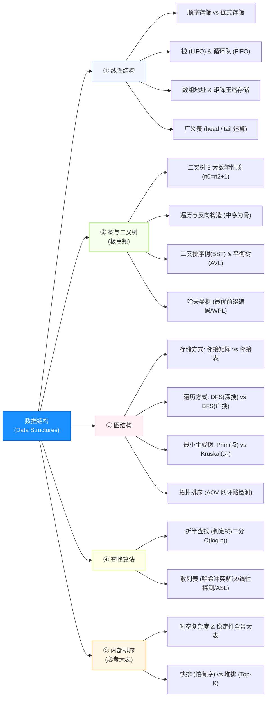

# 软件设计师通关速记文档：数据结构篇

> **所属模块**：软考中级《软件设计师》—— 数据结构（文老师教育讲义核心提炼）  
> **提炼规范**：`ruankao-fast-pass` 体系化通关标准

---

## 维度 1：【分值画像与战略定级】

| 考核维度 | 分值权重 | 考点分布与题型特点 |
| :--- | :--- | :--- |
| **上午场（综合知识）** | **6 ~ 10 分** | 单选题黄金大户（通常集中在第 55~65 题）。重在考察：**性质计算、概念辨析、图与树遍历、排序稳定性与复杂度**。 |
| **下午场（应用技术）** | **隐形支撑 / 贯穿大题** | 作为**试题四（算法设计）**的底层依托（如树与图遍历、二叉排序树、堆调整、KMP、拓扑排序），若数据结构不扎实，算法题将彻底断层。 |
| **性价比评星** | **★★★★★（五星必杀）** | 软考性价比最高的模块之一：题目重复率高、公式极度确定、毫无主观歧义。 |

> **通关战略建议**：  
> **抓死结论与公式，不纠结底层代码实现！** 软考不考手写复杂的 AVL 旋转或红黑树代码，考的是“性质代入法”、“特值验证法”与“大表背诵记忆”。

---

## 维度 2：【知识脉络脑图与核心辨析矩阵】

### 1. 本章知识脉络全景 Mermaid 脑图

---

### 2. 四大核心辨析矩阵（针对上午单选题）

#### 矩阵 1：顺序存储 vs 链式存储

| 比较维度 | 顺序存储（如数组） | 链式存储（如链表） | 考题辨析题眼 |
| :--- | :--- | :--- | :--- |
| **存储密度** | **= 1（更优）**，只存数据本身 | **< 1**，因需存储指针域导致空间开销 | 问“空间利用率高”选顺序 |
| **读/取操作** | **$O(1)$**（支持随机存取） | **$O(n)$**（顺序存取，需从头遍历） | 问“按索引号频繁查找”选顺序 |
| **插入/删除** | **$O(n)$**（需平移后续大量元素） | **$O(1)$**（仅需修改指针指向） | 问“频繁进行破坏性修改”选链式 |
| **容量扩充** | 事先确定，扩容代价大 | 动态分配，随用随申请 | 问“数据长度不可预测”选链式 |

#### 矩阵 2：最小生成树算法（Prim vs Kruskal）

| 比较维度 | 普里姆算法（Prim） | 克鲁斯卡尔算法（Kruskal） |
| :--- | :--- | :--- |
| **出发核心** | **从顶点出发**（顶点归并） | **从边出发**（边权从小到大排序、防成环） |
| **算法复杂度** | **$O(n^2)$**（与边数无关） | **$O(e \log e)$**（与边数强相关） |
| **最佳适用场景** | **稠密图**（边较多） | **稀疏图**（边较少） |
| **设计策略** | 贪心法（局部挑当前连通子树权值最小的边） | 贪心法（全局按边权升序挑选） |

#### 矩阵 3：两类经典高级树结构（BST vs AVL）

| 结构名称 | 核心性质 | 查找效率 | 软考高频考法 |
| :--- | :--- | :--- | :--- |
| **二叉排序树 (BST)** | 左子树所有值 < 根 < 右子树所有值 | 最优 $O(\log n)$，最差退化成单链表 $O(n)$ | **中序遍历序列严格递增** |
| **平衡二叉树 (AVL)** | 任一节点的左右子树**高度之差绝对值 $\le 1$** | 严格稳定在 **$O(\log n)$** | 平衡因子只能是 **-1, 0, 1** |

---

### 3. 内部排序算法时空复杂度与稳定性超级全景表（上午必考 1~2 题）

| 排序类别 | 排序算法 | 平均时间 | 最好情况 | 最坏情况 | 辅助空间 | 稳定性 | 核心特征 / 考场一句话 |
| :--- | :--- | :--- | :--- | :--- | :--- | :--- | :--- |
| **插入类** | **直接插入** | $O(n^2)$ | $O(n)$ | $O(n^2)$ | $O(1)$ | **稳定** | 大部分基本有序时效率极高 |
| | **希尔排序** | $O(n^{1.3})$ | $O(n)$ | $O(n^2)$ | $O(1)$ | 不稳定 | 缩小增量步长排序 |
| **交换类** | **冒泡排序** | $O(n^2)$ | $O(n)$ | $O(n^2)$ | $O(1)$ | **稳定** | 每次把最重元素沉底 |
| | **快速排序** | $\mathbf{O(n \log n)}$ | $O(n \log n)$ | $\mathbf{O(n^2)}$ | $\mathbf{O(\log n)}$ | 不稳定 | 基准元素位置固定，最坏情况：基本有序 |
| **选择类** | **简单选择** | $O(n^2)$ | $O(n^2)$ | $O(n^2)$ | $O(1)$ | 不稳定 | 无论如何比较次数恒定为 $\frac{n(n-1)}{2}$ |
| | **堆排序** | $\mathbf{O(n \log n)}$ | $O(n \log n)$ | $O(n \log n)$ | $O(1)$ | 不稳定 | **最坏依然稳如老狗**，最适合求 Top-K |
| **归并类** | **归并排序** | $\mathbf{O(n \log n)}$ | $O(n \log n)$ | $O(n \log n)$ | $\mathbf{O(n)}$ | **稳定** | 需要最大额外辅助空间 $O(n)$ |
| **分布类** | **基数排序** | $O(d(n+r))$ | $O(d(n+r))$ | $O(d(n+r))$ | $O(r)$ | **稳定** | 基于多关键字，不依赖键值直接大小比较 |

---

## 维度 3：【六大计算公式与命题挖空靶点】

### 1. 二维数组与特殊矩阵压缩地址推导（特值法秒杀！）
* **行优先地址公式**：$A[i][j]$ 地址 $= \text{Base} + (i \cdot n + j) \times \text{len}$（设下标从 0 开始，每行 $n$ 列）。
* **列优先地址公式**：$A[i][j]$ 地址 $= \text{Base} + (j \cdot m + i) \times \text{len}$。
* **对称矩阵/三角矩阵下三角压缩**：
  $$k = \frac{i(i+1)}{2} + j \quad (\text{下标从 0 起算且 } i \ge j)$$
> **💡 秒杀大招**：考场上千万不要去死记带有几加几减几的公式！直接将首个元素 $(0,0)$ 和 $(1,0)$ 或 $(1,1)$ 带入选项，**10 秒排除 3 个错项**。

### 2. 广义表运算（Head 与 Tail 剥洋葱法则）
* `Head(LS)`：取广义表**第一个元素**（可以是原子或子表）。
* `Tail(LS)`：取除第一个元素外**剩余所有元素构成的广义表**（**必带外层括号 `(...)`**）。
  * 例：$LS = (a, (b, c))$，则 $\text{Head}(LS) = a$，$\text{Tail}(LS) = ((b, c))$。
  * 若求 $\text{Head}(\text{Tail}(LS)) = (b, c)$。

### 3. 二叉树必背 5 大数学性质
1. **叶子节点与双度节点方程（必考！）**：
   $$n_0 = n_2 + 1 \quad (\text{叶子节点数比双分支节点数多 1})$$
2. **总节点数方程**：$n = n_0 + n_1 + n_2$，结合分支数：$n = 1 + n_1 + 2n_2$。
3. **完全二叉树深度**：$\lfloor \log_2 n \rfloor + 1$。
4. **完全二叉树编号关系**（根节点编号为 1）：
   * 节点 $i$ 的双亲为 $\lfloor i / 2 \rfloor$；左孩子为 $2i$；右孩子为 $2i + 1$。
5. **空指针域统计（线索二叉树必考）**：
   * 含有 $n$ 个节点的二叉链表中，空指针域个数恒为 **$n + 1$**（总指针 $2n$ 个，用掉 $n-1$ 个）。

### 4. 二叉树反向构造（中序为定海神针）
* 仅知“前序 + 后序”**无法唯一确定**一棵二叉树！
* 必须满足：**【前序 + 中序】** 或 **【后序 + 中序】**：
  * 前序的第一个元素（或后序的最后一个元素）必为**根节点**；
  * 在中序序列中找到该根节点，其**左边全为左子树，右边全为右子树**；
  * 递归切分即可画出完整二叉树。

### 5. 哈夫曼树（最优二叉树）构建与 WPL
* **构建原则**：每次在森林中选两个**权值最小**的树合并为一个新树，合并后的权值为两树之和。
* **特性**：哈夫曼树**没有度为 1 的节点**（只有 $n_0$ 和 $n_2$），若叶子数为 $n$，则总结点数为 **$2n - 1$**。
* **带权路径长度（WPL）**：
  $$\text{WPL} = \sum (\text{叶子权值} \times \text{该叶子到根节点的路径长度/层数})$$

### 6. 循环队列的判满与判空（牺牲一个存储单元）
设容量为 `MAXSIZE`，头指针 `front`，尾指针 `rear`：
* **队空条件**：`Q.front == Q.rear`
* **队满条件**：`(Q.rear + 1) % MAXSIZE == Q.front`
* **当前队列元素个数**：`(Q.rear - Q.front + MAXSIZE) % MAXSIZE`

---

## 维度 4：【极速小抄与记忆桩（Memory Pegs）】

### 1. 通关押韵口诀（考场条件反射）

> **【排序稳定性速记口诀】**  
> **“考研插帽龟（插冒归），心情很稳定！”**  
> *解析：直接**插**入、**冒**泡、**归**并（外加基数排序）是**稳定**的；其余希尔、快排、简单选择、堆排序皆为**不稳定**。*

> **【快排与堆排对比口诀】**  
> **“快排怕有序，堆排稳如狗，海量找前K，大顶小顶堆！”**  
> *解析：快速排序最怕输入序列已经基本有序（退化为 $O(n^2)$）；堆排序无论最好、最坏皆为 $O(n \log n)$，最擅长在海量数据中选前 $k$ 个最大/最小值。*

> **【广义表表尾口诀】**  
> **“头单尾必包，剥皮剩下一大包！”**  
> *解析：`Head` 取出来可能是单个原子；`Tail` 取出来无论里面剩什么，外层必须打一层小括号包装成广义表。*

---

### 2. 考前避坑 3 戒律（老考生血泪丢分点）
1. **下标起点陷阱**：看清题目数组/矩阵起始下标是 $0$ 还是 $1$。如果从 0 开始，偏移量不用减 1；如果从 1 开始，需加减 1。
2. **KMP 的 next 数组定义差异**：有些题目 next 从 0 起算（$next[1] = 0$），有些从 -1 起算。考场上直接看题目给的选项是 0 开头还是 -1 开头再推导。
3. **拓扑排序环路判断**：若有向图中存在环路（回路），则拓扑排序输出的顶点数必然**小于**图的总顶点数，无法完成拓扑排序。

---

## 维度 5：【经典真题闭环自测与 Anki 闪卡库】

### 1. 经典真题速杀演练

* **【真题 1（树性质）】** 某二叉树中有 30 个叶子节点，则度为 2 的节点个数为（ ）。  
  * **10秒破题**：直接套用 $n_0 = n_2 + 1 \implies n_2 = n_0 - 1 = 30 - 1 = \mathbf{29}$。

* **【真题 2（排序特性）】** 在包含 $N$ 个元素的数组中寻找前 $K$ 个最大的元素（$K \ll N$），时间复杂度最优的排序算法是（ ）。  
  * **10秒破题**：看到 Top-K 且 $K$ 远小于 $N$，直接选**堆排序（建大小为 $K$ 的小顶堆）**，复杂度为 $O(N \log K)$。

* **【真题 3（二叉树反向构造）】** 某二叉树先序遍历为 `cabfedg`，中序遍历为 `abcdefg`，则该二叉树是（ ）。  
  * **10秒破题**：先序第一个为 `c`（根），中序中 `c` 左边为 `ab`（左子树），右边为 `defg`（右子树）。再结合子树根节点画出二叉树，判断其左右子树高度差皆不超过 1，判定为**平衡二叉树（AVL）**。

---

### 2. 📇 Anki 闪卡库（可直接导入复习）

| 正面（Front: 核心考点提问） | 反面（Back: 核心答案与记忆桩） | 标签（Tags） |
| :--- | :--- | :--- |
| 二叉树中，叶子节点数 $n_0$ 与度为 2 的节点数 $n_2$ 的关系是？ | **$n_0 = n_2 + 1$** （叶子永远比双度节点多 1 个） | 软考::数据结构::二叉树 |
| 具有 $n$ 个结点的二叉链表中，空指针域的总数是多少？ | **$n + 1$ 个**。 （总指针 $2n$ 个，非空指针消耗 $n-1$ 个） | 软考::数据结构::树存储 |
| 内部排序算法中，哪三种（加基数）是绝对**稳定**的？ | **直接插入排序、冒泡排序、归并排序**（+基数排序）。 口诀：考研插帽龟，心情很稳定。 | 软考::数据结构::排序 |
| 循环队列（容量为 $M$）中，判定队满的标准表达式是？ | **`(Q.rear + 1) % M == Q.front`** （牺牲一个单元法） | 软考::数据结构::队列 |
| 广义表 $LS = (a, b, (c, d))$，求 $Tail(LS)$ 的结果是？ | **`((b, (c, d)))`** 口诀：头单尾必包，表尾必须是一整个表。 | 软考::数据结构::广义表 |
| 快速排序在什么输入情况下会退化为最坏时间复杂度 $O(n^2)$？ | 当待排序序列**基本有序（正序或逆序）**时。 | 软考::数据结构::快排 |
| 最小生成树算法中，Prim 和 Kruskal 分别适用于什么图？ | **Prim 适于稠密图**（从顶点出发，$O(n^2)$）； **Kruskal 适于稀疏图**（从边出发，$O(e \log e)$）。 | 软考::数据结构::图 |
| 仅凭二叉树的“前序遍历”和“后序遍历”，能否唯一确定这棵树？ | **不能**！反向构造二叉树**必须要有中序遍历**参与。 | 软考::数据结构::二叉树 |
