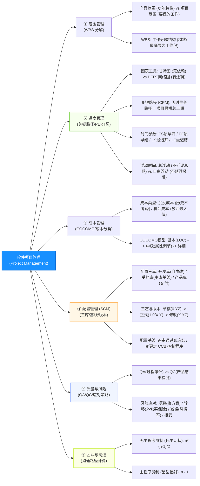

# 软件设计师通关速记文档：项目管理篇

> **所属模块**：软考中级《软件设计师》—— 软件项目管理知识（文老师教育讲义核心提炼）  
> **提炼规范**：`ruankao-fast-pass` 体系化通关标准（从左到右思维导图 + 80/20 剪枝 + 关键路径秒杀法）

---

## 维度 1：【分值画像与战略定级】

| 考核维度 | 分值权重 | 考点分布与题型特点 |
| :--- | :--- | :--- |
| **上午场（综合知识）** | **3 ~ 5 分** | 必考单选（通常集中在第 30~35 题附近）。高频考点包括：**关键路径法（CPM/PERT）工期与浮动时间计算、配置管理“三库”与版本号状态、成本分类（机会/沉没成本）、风险应对策略、沟通路径计算公式**。 |
| **下午场（应用技术）** | **0 分** | 软件设计师下午大题不直接考项目管理（概念偶在软工大题中渗透）。 |
| **性价比评星** | **★★★★☆（四星高分定心丸）** | **纯套路计算与管理常识**。只要掌握“关键路径减法法则”和“沟通路径 $n(n-1)/2$”，计算题 10 秒拿分，概念题常识排除，投入极少、得分率极高。 |

> **通关战略建议**：  
> **拒绝死记长篇管理学教条！** 项目管理考的是工程常识与两个纯数学公式（关键路径总浮动时间、网状沟通路径）。背熟配置三库和版本号三态，3~5 分手到擒来。

---

## 维度 2：【知识脉络脑图与核心辨析矩阵】

### 1. 本章知识脉络全景 Mermaid 脑图（从左至右思维导图）

---

### 2. 核心辨析矩阵（上午单选考眼大表）

#### 矩阵 1：软件配置管理核心“三库”大辨析（必考 1 题）

| 配置库类型 | 别名 | 存放内容与状态 | 访问与修改权限 | 变更高峰期 |
| :--- | :--- | :--- | :--- | :--- |
| **开发库** | 动态库、工作库、程序员库 | 正在开发/修改的草稿代码与文档 | **开发人员专有**，可随意读写修改，无需走严格审批 | 日常编码开发期 |
| **受控库** | **主库**、管理库 | 通过阶段评审的**各类基线（Baseline）配置项** | **严格受控**，开发人员只读，修改必须走 **CCB 变更流程** | 里程碑阶段交接期 |
| **产品库** | 静态库、发行库、软件仓库 | 已最终测试完成、**已向客户发布的正式版本** | **最高级别锁定**，任何人都不能随意改动，只供交付安装 | 交付投产上线期 |

---

#### 矩阵 2：配置项版本号与状态变迁规则表

| 配置项状态 | 版本号格式 | 格式说明与取值 | 升级流转规则 |
| :--- | :--- | :--- | :--- |
| **草稿 (Draft)** | **`0.YZ`** | $YZ$ 取值 $01 \sim 99$（如 `0.10`） | 随着草稿不断完善，$YZ$ 递增；通过评审后**一跃变成 `1.0`** |
| **正式 (Formal)** | **`X.Y`** | $X$ 为主版本号，$Y$ 为次版本号（如 `1.0`, `2.1`） | 小升级累加 $Y$；重大重构直接累加主版本号 $X$（如 `2.0`） |
| **修改 (Modifying)**| **`X.YZ`** | 临时借用 $Z$ 位暂存修改状态 | 正在修改时变为 `1.01`；修改完成重新评审通过后，**变回正式格式 `X.Y`（如 `1.1`）** |

---

#### 矩阵 3：负面风险应对 4 大策略对比矩阵（必考 1 题）

| 应对策略 | 核心手段 | 典型考题情景（选它时的题眼） |
| :--- | :--- | :--- |
| **规避 (Avoid)** | **彻底改变项目计划以消除威胁** | 团队不熟悉新框架，**果断改用成熟框架**；直接砍掉高风险业务模块 |
| **转移 (Transfer)** | **将风险责任和后果转嫁给第三方** | **购买商业保险**；将不擅长的非核心模块**外包出去**；签固定总价合同 |
| **减轻 (Mitigate)** | **采取行动降低风险发生概率或减少冲击** | 担心需求变动，**提前做原型演示**；增加单元测试；为关键服务器加双电源冗余 |
| **接受 (Accept)** | 不改变计划，主动或被动承担后果 | 预留专项**应急储备金/工期缓冲**（主动）；等出事后再解决（被动） |

---

#### 矩阵 4：工程成本核心概念辨析大表

| 成本类型 | 定义与本质 | 考题辨析与生活实例 | 决策参与原则 |
| :--- | :--- | :--- | :--- |
| **沉没成本** | **过去已经发生的支出**，任何当前/未来决策都无法挽回 | 已经为失败项目投入了 50 万研发费 | **在后续决策时坚决排除！切勿追加投入！** |
| **机会成本** | 做出某项选择后，**所放弃的其他替代方案中的最大收益** | 拿 2 万元炒股亏了 500 元，若存银行可赚 360 元 $\implies$ 机会成本为 **360 元** | **衡量决策代价的核心指标** |
| **直接成本** | **能够直接归属于单一项目**的支出 | 项目组成员工资、出差差旅费、专用开发板 | 直接计入该项目成本 |
| **间接成本** | **由多个项目共同分摊**的公共开销 | 公司房租水电、公用保洁安保费、公司管理层工资 | 按比例分摊到各项目 |

---

## 维度 3：【核心计算题型与网络图秒杀靶点】

### 1. 关键路径（CPM）与工期计算
* **关键路径定义**：从网络图源点到汇点**耗时最长的一条路径**，其长度等于**项目的最短总工期**。
* **特性**：
  * 网络图中关键路径可能**不止一条**；
  * 位于关键路径上的所有活动称为**关键活动**；
  * 关键活动的**总浮动时间恒等于 0**！

---

### 2. 总浮动时间极速“差额减法秒杀大招”（考场 10 秒解法）
软考最爱考：“活动 C 的总浮动时间是多少天？”：

$$\text{活动 } A \text{ 的总浮动时间} = \text{项目关键路径总长度} - \text{包含活动 } A \text{ 的所有路径中最长的那条}$$

* *秒杀实例演练（课件第 7 页真题）：*
  * 项目中包含三条路径：
    * 路径 1（$ABEG$）：$2 + 4 + 4 + 3 = 13$ 天；
    * 路径 2（$ACEG$）：$2 + 5 + 4 + 3 = 14$ 天；
    * 路径 3（$ADFG$）：$2 + 6 + 6 + 3 = \mathbf{17}$ 天（最长，为**关键路径，工期 17 天**）。
  * **求活动 C 的总浮动时间**：
    * 包含活动 C 的路径是路径 2（长度 14 天）；
    * 直接秒杀：$\text{总浮动时间} = 17 - 14 = \mathbf{3}$ 天！

---

### 3. 沟通路径计算公式（必考数字秒杀）

| 研发小组模式 | 沟通拓扑特征 | 沟通路径数量计算公式 |
| :--- | :--- | :--- |
| **无主程序员小组（民主制）** | 成员地位平等，**全互联完全图** | $$C = \frac{n(n - 1)}{2}$$ |
| **主程序员制（主盟制）** | 主程序员集中领导，**星型放射状** | $$C = n - 1$$ |

* *秒杀例题：某 8 名开发人员组成的小组，在“民主制”和“主程序员制”下的沟通路径分别是多少？*
  * 民主制：$C = \frac{8 \times (8 - 1)}{2} = \frac{56}{2} = \mathbf{28}$ 条；
  * 主程制：$C = 8 - 1 = \mathbf{7}$ 条！

---

## 维度 4：【极速小抄与记忆桩（Memory Pegs）】

### 1. 通关押韵口诀（考场条件反射）

> **【关键路径口诀】**  
> **“最长路径是工期，关键活动浮动零；要想求出总浮动，大路减去自身路！”**  

> **【配置三库口诀】**  
> **“动库开发随心改，受控基线走流程；产品静态装箱好，交付用户不许动！”**  

> **【沟通路径口诀】**  
> **“民主网状两两连，除以二算交叉线；主程辐射众星捧，减一直接出答案！”**  

---

### 2. 考前避坑 3 戒律
1. **甘特图不能表达任务依赖**：甘特图（Gantt）长于直观展现任务起止时间与进度百分比，但**无法反映活动之间的复杂逻辑依赖关系**（反映依赖必须用 PERT 网络图）。
2. **沉没成本绝对不参与决策**：无论题目描述过去亏了多少钱，只要是“过去已发生的成本”，对当前决策的影响一律视为 0。
3. **关键路径会动态变化**：如果关键路径上的任务被压缩，或者非关键路径上的任务严重延期超过其总浮动时间，**关键路径会发生转移**！

---

## 维度 5：【机考防冷箭盲盒与即时测验】

### 1. 🛡️ 机考防冷箭盲盒清单（Edge Cases，只记中文混眼熟）
* **CCB（配置控制委员会）**：只负责**审批与裁决变更**，本身**不亲自动手修改代码**（具体修改由开发人员在开发库中进行）。
* **QA（质量保证）vs QC（质量控制）**：**QA 管过程**（看流程规不规范，重在防范）；**QC 管结果**（看代码/产品有没有 Bug，重在检验测试）。
* **CMMI 5 个成熟度级别（必记阶梯）**：
  1. 初始级（混乱无序） $\to$ 2. 已管理级（项目级管理） $\to$ 3. 已定义级（组织级标准化） $\to$ 4. 已量化管理级（定量数据控制） $\to$ 5. 优化级（持续改进）。
* **三点估算法（PERT 历时估算）**：
  $$T_e = \frac{O + 4M + P}{6}$$
  *（$O$ 为最乐观时间，$M$ 为最可能时间，$P$ 为最悲观时间）*

---

### 2. 📇 Anki 闪卡库（可直接复制导入）

| 正面（Front: 核心考点提问） | 反面（Back: 核心答案与记忆桩） | 标签（Tags） |
| :--- | :--- | :--- |
| 项目网络图中，决定整个项目最短总工期的是哪条路径？ | **关键路径（从起点到终点历时最长的路径）**。 | 软考::软件设计师::项目管理 |
| 关键路径上的所有关键活动，其总浮动时间（Total Float）等于多少？ | **恒等于 0**。 | 软考::软件设计师::项目管理 |
| 软件配置管理中，用于存放已通过正式评审的基线配置项的配置库是？ | **受控库（主库）**。 （开发库放草稿，产品库放最终交付品） | 软考::软件设计师::项目管理 |
| 配置项处于“草稿”状态时，其标准版本号格式是什么？ | **`0.YZ`**（$YZ$ 取值 $01 \sim 99$）。 | 软考::软件设计师::项目管理 |
| 团队因不熟悉某项新技术而决定改用成熟的旧技术开发，属于什么风险应对策略？ | **风险规避（Avoid）**。 | 软考::软件设计师::项目管理 |
| 一个由 10 名开发人员组成的无主程序员团队，共有多少条沟通路径？ | **45 条**。 公式：$\frac{10 \times (10 - 1)}{2} = \frac{90}{2} = 45$。 | 软考::软件设计师::项目管理 |
| 能够清晰表达各项任务的先后逻辑制约依赖关系的图表工具是甘特图还是 PERT 图？ | **PERT 网络图**（甘特图无法清晰反映依赖关系）。 | 软考::软件设计师::项目管理 |
| 投资 10 万元开发软件，中途已支出 6 万元但发现方向错误，这 6 万元在经济学上称为什么成本？ | **沉没成本（Sunk Cost）**。 （历史支出，决策时应彻底忽略） | 软考::软件设计师::项目管理 |

---

### 3. 🎯 现场即时随堂互动测验（检验吸收闭环）

请你在考场思维下，直接秒答这道历年极具代表性的高频真题：

> **【随堂测验】**  
> 某软件项目包含活动 A、B、C、D、E、F、G。项目网络图分析得出有三条路径：  
> 路径 1（$A \to B \to E \to G$）耗时 12 周；  
> 路径 2（$A \to C \to E \to G$）耗时 15 周；  
> 路径 3（$A \to D \to F \to G$）耗时 18 周。  
> 问：该项目的关键路径耗时为（ ）周；活动 B 的总浮动时间为（ ）周。  
> A. 18 周，3 周 &emsp;&emsp; B. 15 周，3 周  
> C. 18 周，6 周 &emsp;&emsp; D. 18 周，0 周  
>
> 💡 **请直接在对话框回复你的选项：`A`、`B`、`C` 或 `D`！**
