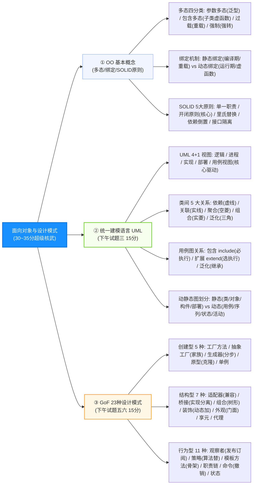

# 软件设计师通关速记文档：面向对象与设计模式篇

> **所属模块**：软考中级《软件设计师》—— 面向对象技术、UML 建模与设计模式（文老师教育讲义第 14 章核心提炼）  
> **提炼规范**：`ruankao-fast-pass` 体系化通关标准（从左到右思维导图 + 80/20 剪枝 + 下午大题整整 30 分必杀）

---

## 维度 1：【分值画像与战略定级】

| 考核维度 | 分值权重 | 考点分布与题型特点 |
| :--- | :--- | :--- |
| **上午场（综合知识）** | **6 ~ 10 分** | 集中在第 38~48 题。考查：**多态分类（参数/包含/过载/强制）、静态绑定 vs 动态绑定、面向对象五大设计原则（SOLID）、UML 9种图动静态归属、类间 5 大关系判断、23 种设计模式分类与定义匹配**。 |
| **下午场（应用技术）** | **整整 30 分！ （全卷半壁江山）** | **两个必考 15 分大题的绝对主战场**： 1. **试题三（UML 建模，15分）**：用例图（包含/扩展/泛化）、类图填空（类名/属性/方法/重数关系）、状态图/时序图； 2. **试题五 / 试题六（C++ / Java 程序设计，15分）**：**100% 考查 23 种设计模式的代码实现填空！** |
| **性价比评星** | **★★★★★（全卷最大核武库：上午+下午共 36~40分！）** | **决定通关命运的终极板块！** 只要拿下下午试题三和试题五/六的 24~28 分，全卷及格（45分）已胜券在握。掌握类图画法与设计模式关键字，得分效率极高。 |

> **通关战略建议**：  
> **下午 30 分志在必得！** 牢记类图中的“菱形（聚合/组合）”与“三角（泛化/实现）”，设计模式抓死“每个模式的一句话意图”，代码填空遵循“多态父类指针调子类方法”的万能模板。

---

## 维度 2：【知识脉络脑图与核心辨析矩阵】

### 1. 本章知识脉络全景 Mermaid 脑图（从左至右思维导图）

---

### 2. 核心辨析矩阵（上午单选直接秒杀大表）

#### 矩阵 1：面向对象 5 大核心设计原则（SOLID 原则）大表（必考 1 题）

| 设计原则名称 | 英文缩写 | 核心白话要求 | 考题辨析题眼 / 实例 |
| :--- | :---: | :--- | :--- |
| **单一职责原则** | **SRP** | 一个类应该仅有一个引起它变化的原因（只做好一件事） | 避免把数据库读写、业务逻辑和 UI 显示写在一个类中 |
| **开放-封闭原则** | **OCP** | **对扩展开放，对修改关闭**（设计模式的最高终极目标） | 增加新功能时，新增子类即可，而无需修改原有源码 |
| **里氏替换原则** | **LSP** | **子类必须能够随时替换掉它们的父类** | 所有使用基类的地方，传入子类对象后程序逻辑依然正确 |
| **依赖倒置原则** | **DIP** | **高层模块和底层模块都应该依赖抽象（接口），而非依赖具体** | **面向接口编程**，不要针对具体的实现类编程 |
| **接口隔离原则** | **ISP** | 客户端不应该被迫依赖它用不上的方法（细化小接口） | 不要设计臃肿的胖接口，拆成多个专用的细小接口 |
| *最少知识原则* | *LoD* | 迪米特法则：只与直接朋友通信，减少对象之间的相互了解 | 降低模块间耦合，通过中介者或门面进行解耦 |

---

#### 矩阵 2：类与类之间的 5 大关系判定与符号大表（下午试题三必考！）

| 关系名称 | 符号表示 | 关系本质与耦合强弱 | 真实工程实例（考题题眼） |
| :--- | :---: | :--- | :--- |
| **依赖 (Dependency)** | **带箭头的虚线** $\dashrightarrow$ | “用到了”：一个类的实现用到了另一个类的对象（方法局部变量/形参） | 司机开车：`Driver` 的 `drive(Car c)` 方法中传入了 `Car` |
| **关联 (Association)** | **带箭头的实线** $\longrightarrow$ | “拥有”：类之间长期的结构化引用（作为类的成员变量），可带多重度 | 老师拥有学生：`Teacher` 类包含 `Student` 数组 |
| **聚合 (Aggregation)** | **空心菱形 + 实线** $\diamondsuit\text{—}$ | **“部分-整体”（弱拥有）**：部分可以脱离整体独立存在 | **公司与员工、汽车与车轮**（公司倒闭，员工依然存在） |
| **组合 (Composition)** | **实心菱形 + 实线** $\blacklozenge\text{—}$ | **“部分-整体”（强拥有）**：部分与整体同生共死，不可分割 | **汽车与发动机、窗体与按键、公司与内部部门** |
| **泛化 (Generalization)**| **空心三角形 + 实线** $\triangle\text{—}$ | **继承关系（is-a）**：子类指向父类 | 小轿车继承自机动车、圆形继承自图形 |
| **实现 (Realization)** | **空心三角形 + 虚线** $\triangle\text{- -}$ | **接口实现**：类指向接口 | `ArrayList` 实现了 `List` 接口 |

> **🔥 试题三连线大招**：实心菱形代表生生死死在一起（组合）；空心菱形代表合则聚不合则散（聚合）；带三角一律看作继承（泛化/实现）。

---

#### 矩阵 3：UML 动静态图分类全景表（上午必考 1 题）

| 图谱大类 | 图形名称 | 核心表达内容与考场题眼 | 动静态属性 |
| :--- | :--- | :--- | :---: |
| **结构图** | **类图 (Class Diagram)** | 展现类、接口及它们之间的静态静态协作关系（系统的静态设计视图） | **静态图** |
| | **对象图 (Object Diagram)** | 展现**某一时刻**一组对象及其关系的“快照” | **静态图** |
| | **构件图 (Component Diagram)**| 展现一组构件（如 `.dll`, `.jar`）之间的组织和依赖关系 | **静态图** |
| | **部署图 (Deployment Diagram)**| 展现软硬件物理拓扑架构（将软件构件部署到**硬件节点/服务器**上） | **静态图** |
| **行为图** | **用例图 (Use Case Diagram)** | 展现执行者（Actor）与系统用例之间的交互，**最基本的需求模型** | **动态图** |
| | **序列图 / 时序图** | **强调按“时间顺序”组织的对象交互**（垂直是生命线，水平是消息） | **动态图** |
| | **通信图 / 协作图** | **强调参加交互的“对象组织结构”**（使用数字序号 1.1, 1.2 表达次序） | **动态图** |
| | **状态图 (Statechart Diagram)**| 描述**单个对象在其生命周期内**因事件触发而发生的状态迁移 | **动态图** |
| | **活动图 (Activity Diagram)** | 描述业务流程或操作的执行流（**粗水平线表示并发分叉与汇合**） | **动态图** |

---

## 维度 3：【GoF 23 种设计模式全景大表与代码靶点（全卷拉分大户）】

23 种设计模式分为 **创建型（5种）**、**结构型（7种）** 和 **行为型（11种）**。

### 1. 23 种设计模式一句话秒杀大表（必背神表！）

| 模式类别 | 模式名称 | 核心定义与一句话意图 | 考场标志性题眼（选它的特征词） |
| :--- | :--- | :--- | :--- |
| **创建型** (5 种) | **工厂方法 (Factory Method)** | 定义创建对象的接口，由**子类决定实例化哪一个类** | 延迟到子类实例化、单一产品等级 |
| | **抽象工厂 (Abstract Factory)** | 创建**一系列相关或相互依赖的对象家族**，无需指定具体类 | **产品族**、多个产品等级结构 |
| | **生成器 / 构建器 (Builder)** | 将复杂对象的**构建与表示分离**，同样的构建过程创建不同表示 | **分步骤构建**复杂大对象 |
| | **原型模式 (Prototype)** | 用**原型实例指定创建对象的种类**，通过**拷贝/克隆**创建新对象 | **Clone 克隆**、复制自身、创建开销大 |
| | **单例模式 (Singleton)** | 保证一个类**仅有一个全局唯一实例**，并提供全局访问点 | 计数器、配置读取器、唯一实例 |
| **结构型** (7 种) | **适配器模式 (Adapter)** | 将一个类的接口转换成客户希望的另一个接口，**解决接口不兼容** | **转换接口**、旧接口复用、包装器 |
| | **桥接模式 (Bridge)** | **将抽象部分与实现部分分离，使它们都可以独立地变化** | **两个独立变化的维度**（如操作系统与图形） |
| | **组合模式 (Composite)** | 将对象组合成**树形结构**以表示“部分-整体”层次，统一对待单个与组合 | **树形结构**、整体与部分一致对待（如文件目录） |
| | **装饰模式 (Decorator)** | **动态地给一个对象添加额外的职责**（比生成子类更灵活） | **动态附加功能**、避免子类膨胀、包装透明 |
| | **外观模式 (Facade)** | 为子系统中的一组接口提供一个**一致的高层统一门面接口** | **对外统一入口**、降低子系统客户端耦合度 |
| | **享元模式 (Flyweight)** | 运用共享技术有效地支持**大量细粒度对象的复用** | **共享细粒度对象**（围棋黑白子、文字字体） |
| | **代理模式 (Proxy)** | 为其他对象提供一种代理以**控制对这个对象的访问** | **间接控制访问**（远程代理/虚代理/权限防卫） |
| **行为型** (11 种) | **职责链模式 (Chain of Resp.)** | 多个对象都有机会处理请求，避免发送者与接收者耦合，**链式传递** | **沿链传递请求**、审批流、请假审批 |
| | **命令模式 (Command)** | 将请求封装为一个对象，支持**排队、记录日志、撤销（Undo/Redo）** | **撤销/重做**、请求排队、将请求对象化 |
| | **解释器模式 (Interpreter)** | 给定一种语言，定义它的文法表示和解释器 | 语法解析、自定义简单脚本与表达式求值 |
| | **迭代器模式 (Iterator)** | 提供一种方法顺序访问一个聚合对象中的各元素，**而不暴露内部表示** | **顺序遍历聚合对象**、屏蔽底层链表/数组细节 |
| | **中介者模式 (Mediator)** | 用一个中介对象来封装一系列对象交互，**使各对象松散耦合无需显式引用** | **星型解耦网状通信**、机场塔台调度 |
| | **备忘录模式 (Memento)** | 在不破坏封装性的前提下，捕获对象内部状态并在外部保存，用于**恢复状态** | **快照保存、保存并恢复历史状态** |
| | **观察者模式 (Observer)** | 定义对象间**一对多的依赖**，状态改变时通知所有依赖对象自动更新 | **发布-订阅（Publish-Subscribe）**、事件驱动联动 |
| | **状态模式 (State)** | 允许一个对象在其**内部状态改变时改变它的行为**（对象看起来像换了类） | **消除大量 if-else 分支**、状态驱动行为 |
| | **策略模式 (Strategy)** | 定义一系列算法，把它们一个个封装起来，使它们**可以相互替换** | **算法族独立替换**、打折策略/排序算法动态切换 |
| | **模板方法 (Template Method)** | 父类中**定义一个操作的算法骨架**，将某些具体步骤延迟到子类实现 | **骨架固定**、子类重写特定步骤、钩子函数 |
| | **访问者模式 (Visitor)** | 作用于某对象结构中各元素的操作，在**不改变元素类的前提下定义新操作** | **数据结构与数据操作分离**、编译器语法树检查 |

---

### 2. 下午试题五/六（15分代码填空）三大通杀模板

软考下午最后一道大题，本质是**“设计模式的 Java / C++ 填空实现”**，牢记以下三条通用语法规则：

1. **多态声明与赋值**：
   * 父类引用指向子类对象：`Shape s = new Circle();`（Java）或 `Shape* s = new Circle();`（C++）。
2. **抽象接口的覆写调用**：
   * 凡是在抽象类/接口中声明的方法（如 `accept(Visitor v)`、`update()`、`algorithmInterface()`），在具体实现类中必然有一处完全同名的实现与调用。
3. **委托调用模式**：
   * 装饰模式、代理模式、适配器模式中，包装类内部都含有一个被包装对象的引用，核心方法内必然是：`wrappedObj.operation();`。

---

## 维度 4：【极速小抄与记忆桩（Memory Pegs）】

### 1. 通关押韵口诀（考场条件反射）

> **【类图关系判别口诀】**  
> **“实线关联虚依赖，空菱聚合实菱组；实心死活绑一起，三角指向父辈祖！”**  
> *（实心菱形组合生死与共；空心菱形聚合聚散自如；三角代表继承或实现接口）*

> **【用例关系口诀】**  
> **“无条件必执行叫包含（include），有条件选执行叫扩展（extend），父子同类叫泛化！”**  

> **【高频设计模式特征口诀】**  
> **“族系对象选抽象，分步建造找生成；兼容接口用适配，两个维度桥接行；部分整体树组合，动态增加装饰灵；发布订阅观察者，算法替换策略明；骨架留给子类做，模板方法定乾坤！”**  

---

### 2. 考前避坑 3 戒律
1. **聚合与组合的生命周期**：考题出现“部分随着整体的消亡而消亡（如窗口与按钮）”**必选组合（实心菱形）**；若“部分离开整体仍有意义（如汽车与轮胎）”**必选聚合（空心菱形）**。
2. **桥接模式的题眼是“两个维度”**：题目中只要提到“系统需要从两个不同的角度（如操作系统和数据库、屏幕与图形）独立变化”，**100% 是桥接模式（Bridge）**！
3. **策略模式 vs 状态模式**：策略模式由客户端主动选择具体算法；状态模式是由状态流转驱动对象自动改变行为，客户端不直接指定。

---

## 维度 5：【机考防冷箭盲盒与即时测验】

### 1. 🛡️ 机考防冷箭盲盒清单（Edge Cases，只记中文混眼熟）
* **多态的四种形式**：
  * **参数多态（Parametric）**：最纯粹的多态，Java 泛型、C++ 模板类；
  * **包含多态（Inclusion）**：面向对象核心多态，子类型多态，虚函数动态绑定；
  * **过载多态（Overloading）**：方法重载，同名不同参；
  * **强制多态（Coercion）**：类型强制转换（如将 `int` 强转为 `float`）。
* **UML 注释事物与分组事物**：注释事物是给模型元素的注解（便签纸带折角图标）；分组事物是组织模型的结构（文件夹形状的**包 Package**）。
* **惯用法（Idiom）**：设计模式层级中最低的一层，与特定编程语言紧密相关（如 C++ 中的引用计数智能指针）。

---

### 2. 📇 Anki 闪卡库（可直接复制导入）

| 正面（Front: 核心考点提问） | 反面（Back: 核心答案与记忆桩） | 标签（Tags） |
| :--- | :--- | :--- |
| 面向对象五大设计原则中，被称为核心基石的“对扩展开放，对修改关闭”是？ | **开闭原则（OCP）**。 | 软考::软件设计师::面向对象 |
| 将对象组合成“树形结构”以表示“部分-整体”层次，使用户对单个和组合对象一致对待的模式是？ | **组合模式（Composite）**。 | 软考::软件设计师::设计模式 |
| 抽象部分与实现部分分离，使它们可以独立地在两个维度变化的结构型设计模式是？ | **桥接模式（Bridge）**。 | 软考::软件设计师::设计模式 |
| 定义对象间一种一对多的依赖关系，当一个对象状态改变所有依赖者自动更新的模式是？ | **观察者模式（Observer / 发布-订阅）**。 | 软考::软件设计师::设计模式 |
| 汽车与发动机之间，发动机的生命周期依附于汽车，在 UML 类图中体现为什么关系？ | **组合关系（Composition，实心菱形+实线）**。 | 软考::软件设计师::UML |
| 动态地给一个对象添加一些额外的职责，避免生成大量子类进行功能扩充的设计模式是？ | **装饰模式（Decorator）**。 | 软考::软件设计师::设计模式 |
| 用例图中，在某种特定条件触发下才执行的可选附加功能，与基础用例之间属于什么关系？ | **扩展关系（`<<extend>>`）**。 | 软考::软件设计师::UML |
| 在父类中定义一个算法的执行骨架，而将某些具体步骤延迟到子类中实现的设计模式是？ | **模板方法模式（Template Method）**。 | 软考::软件设计师::设计模式 |

---

### 3. 🎯 现场即时随堂互动测验（检验吸收闭环）

请你在考场思维下，直接秒答这道下午试题五/六和上午单选都极高频的经典真题：

> **【随堂测验】**  
> 某绘图软件要求能够使用不同的绘图程序绘制不同的图形（例如用绘图程序 V1 和 V2 分别绘制矩形和圆形）。为使该绘图软件的扩展性更好，要求将“绘制的图形（抽象）”与“具体的绘图程序（实现）”分离，使它们都可以独立地扩充和修改。  
> 问：针对该设计需求，最适合采用的设计模式是（ ）。  
> A. 适配器模式（Adapter） &emsp;&emsp; B. 装饰模式（Decorator）  
> C. 桥接模式（Bridge） &emsp;&emsp;&emsp; D. 组合模式（Composite）  
>
> 💡 **请直接在对话框回复你的选项：`A`、`B`、`C` 或 `D`！**
