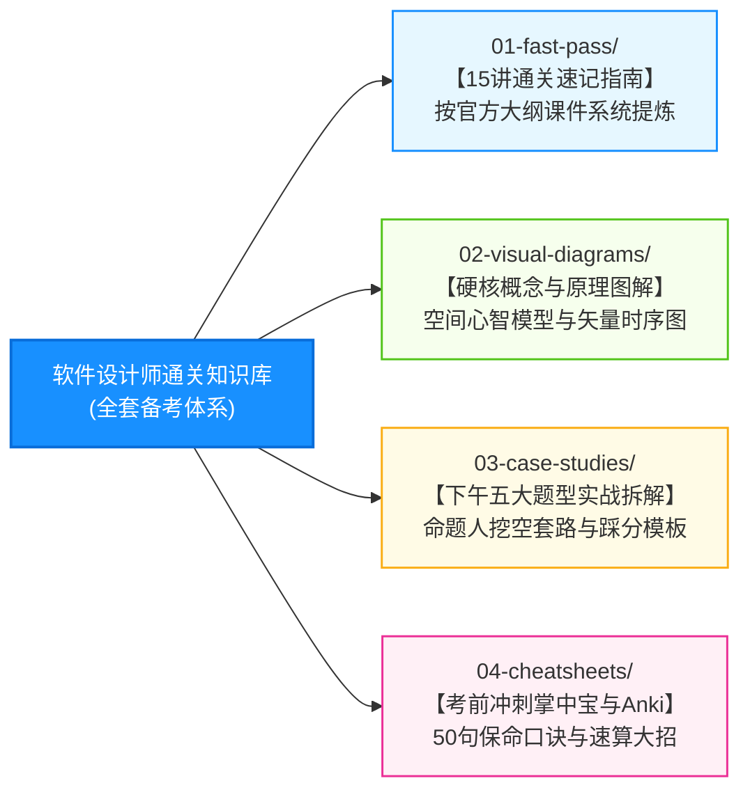

# 软件设计师通关速记指南与全景视觉知识库 (Software Designer Fast Pass)

> **版本**：v2.0 (2026 最新架构版)  
> **定位**：面向计算机技术与软件专业技术资格考试（中级·软件设计师）的**模块化、全景图解、应试提炼利器**。  
> **核心哲学**：拒绝抄书与散文罗列，坚持“自顶向下、80/20 剪枝、双层 Mermaid 图解、直击命题靶点”的极速通关体验。

---

## 🧭 四大核心模块导航架构

---

## 📚 模块一：[01-fast-pass/ 15讲通关速记指南](./01-fast-pass/)

紧扣文老师软考教育 15 套完整课件，提炼出的完整 Markdown 复习指南（包含宏观全景导图、微观机制图、核心辨析表、防冷箭盲盒、Anki 闪卡与即时自测题）：

| 序号 | 章节速记文档 | 重点考核形式与分值 | 考场核心突破点 |
| :---: | :--- | :--- | :--- |
| **01** | [01.考试大纲与作战战略.md](./01-fast-pass/01.考试大纲与作战战略.md) | 全科总纲 (240分钟机考) | 时间科学切割、上午75分雷达、下午送分铁三角战术 |
| **02** | [02.计算机组成与结构速记指南.md](./01-fast-pass/02.计算机组成与结构速记指南.md) | 上午单选 (6~8分) | 指令流水线时空图、Cache组相联映射、海明码校验不等式 |
| **03** | [03.操作系统知识速记指南.md](./01-fast-pass/03.操作系统知识速记指南.md) | 上午单选 (6~8分) | 进程五态及挂起转换图、页式地址变换查表拼装、入P出V法则 |
| **04** | [04.数据库技术基础速记指南.md](./01-fast-pass/04.数据库技术基础速记指南.md) | 上午单选 (6分) + 下午试题二 (15分) | 三级模式两级独立性、E-R转关系模式三大规则、三级封锁协议 |
| **05** | [05.计算机网络速记指南.md](./01-fast-pass/05.计算机网络速记指南.md) | 上午单选 (3~5分) | TCP三次握手与四次挥手时序图、DNS递归迭代查询、CIDR主机数-2 |
| **06** | [06.安全性知识速记指南.md](./01-fast-pass/06.安全性知识速记指南.md) | 上午单选 (3~5分) | 混合加密数字信封工作机制、CA数字证书防伪验证、协议分层 |
| **07** | [07.知识产权与标准化速记指南.md](./01-fast-pass/07.知识产权与标准化速记指南.md) | 上午单选 (2~3分) | 保护期限大表、职务/委托作品归属口诀、商业秘密与著作权 |
| **08** | [08.程序设计语言基础知识速记指南.md](./01-fast-pass/08.程序设计语言基础知识速记指南.md) | 上午单选 (4~6分) | 编译6阶段错误拦截机制、有限自动机DFA识别、后缀表达式 |
| **09** | [09.数据结构速记指南.md](./01-fast-pass/09.数据结构速记指南.md) | 上午单选 (6~8分) | 哈夫曼树最优前缀编码、二叉树逆向还原机制、排序稳定性大表 |
| **10** | [10.算法分析与设计速记指南.md](./01-fast-pass/10.算法分析与设计速记指南.md) | 上午单选 (2~4分) + 下午试题四 (15分) | 主定理公式秒杀、0-1背包DP方程、时空复杂度肉眼秒判 |
| **11** | [11.软件工程速记指南.md](./01-fast-pass/11.软件工程速记指南.md) | 上午单选 (7~9分) | 瀑布/原型/螺旋/敏捷对比、软件测试V模型映射、McCabe判定+1 |
| **12** | [12.项目管理速记指南.md](./01-fast-pass/12.项目管理速记指南.md) | 上午单选 (3~4分) | PERT/CPM关键路径与六标时差推演、挣值管理EVM状态诊断 |
| **13** | [13.结构化开发方法速记指南.md](./01-fast-pass/13.结构化开发方法速记指南.md) | 上午单选 (3分) + 下午试题一 (15分) | 内聚与耦合7级强度阶梯图、变换型vs事务型结构图、DFD平衡 |
| **14** | [14.面向对象技术速记指南.md](./01-fast-pass/14.面向对象技术速记指南.md) | 上午单选 (8~10分) + 下午试题三/六 | UML 9大图动静态分类、23种设计模式三大家族、类间6大关系 |
| **15** | [15.下午案例分析专题指南.md](./01-fast-pass/15.下午案例分析专题指南.md) | 下午案例 (整整75分决胜盘) | 试题一DFD消消乐、试题二ER两步法、试题三BCE模式、试题六Java |

---

## 🎨 模块二：[02-visual-diagrams/ 核心概念与原理图解](./02-visual-diagrams/)

专治“抽象概念看字犯困”，全量使用纯 Mermaid 矢量代码绘制心智模型，100% 离线跨平台兼容：
* 🌲 **[01-算法核心设计原理全景图解.md](./02-visual-diagrams/01-算法核心设计原理全景图解.md)**：分治法“分-治-合”倒树模型、动态规划 0-1 背包填表决策流、贪心 vs 动规抉择分歧、回溯法解空间树 DFS 剪枝全景图。
* 🚀 *持续补充中：操作系统存储变换、网络协议时序、数据库三级封锁等独立深度视觉专题...*

---

## 📝 模块三：[03-case-studies/ 下午五大题型实战拆解](./03-case-studies/)

聚焦下午 75 分决战盘（试题一 DFD、试题二 数据库、试题三 UML、试题四 算法、试题六 Java）：
* 提供题干材料 30 秒“长材料消消乐比对法”与答题填空标准模板。

---

## ⚡ 模块四：[04-cheatsheets/ 考前冲刺掌中宝与 Anki 闪卡](./04-cheatsheets/)

* **软件设计师考前 50 句押韵保命口诀**（考前 30 分钟极速翻阅）；
* **核心速算公式与特值代入秒杀表**；
* **Anki 闪卡全量一键导入包**（支持移动端随时背诵刷题）。
